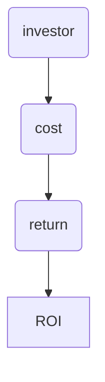
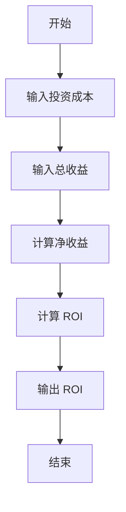
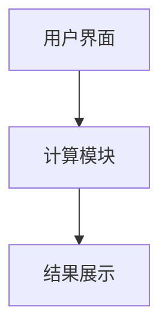
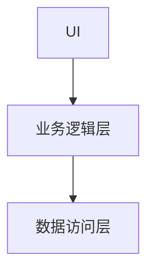
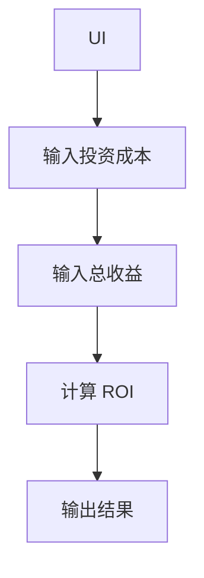

                 


# 投资回报率分析工具

**关键词：投资回报率、ROI分析、财务分析、投资决策、数据分析工具、项目评估**

**摘要：**  
投资回报率（ROI）是衡量投资项目效益的重要指标，广泛应用于金融、投资和企业决策等领域。本文将深入探讨ROI的核心概念、计算方法、算法原理、系统架构及实际应用案例。通过理论分析与实践结合，帮助读者全面理解并掌握ROI分析工具的设计与实现。

---

# 第1章: 投资回报率分析工具概述

## 1.1 投资回报率的基本概念

### 1.1.1 ROI的定义

投资回报率（ROI）是衡量投资项目或投资行为收益与成本之间关系的重要指标，通常以百分比形式表示。ROI反映了每单位投资所获得的净收益，是评估投资效益的核心工具之一。

### 1.1.2 ROI的计算公式

ROI的计算公式如下：

$$ ROI = \frac{净收益}{投资成本} \times 100\% $$

其中：
- 净收益 = 总收益 - 投资成本
- 投资成本 = 初始投入资金

### 1.1.3 ROI的适用场景

ROI广泛应用于以下场景：
- 企业项目投资决策
- 金融资产配置
- 创业项目评估
- 投资组合优化

### 1.1.4 ROI与其他指标的区别

与净现值（NPV）和内部收益率（IRR）相比，ROI的优势在于计算简便，直观反映投资回报比例。但其缺点在于未考虑资金的时间价值和项目周期差异。

---

## 1.2 投资回报率分析工具的背景

### 1.2.1 投资回报率分析的重要性

在商业决策中，ROI是评估投资项目可行性的重要依据。通过ROI分析，企业可以快速判断投资行为的盈利能力，优化资源配置。

### 1.2.2 投资回报率分析工具的起源

随着计算机技术的发展，ROI分析工具逐渐从手工计算转向自动化。现代分析工具结合了数据分析、可视化和机器学习算法，提升了 ROI 计算的效率和准确性。

### 1.2.3 投资回报率分析工具的发展现状

当前，ROI分析工具主要分为桌面软件和在线SaaS工具两类。主流工具支持多维度数据输入、实时计算和可视化展示，满足不同用户的需求。

---

## 1.3 本章小结

本章介绍了ROI的基本概念、计算公式及适用场景，并分析了ROI分析工具的发展背景和现状。通过本章学习，读者可以理解ROI的核心意义及其在实际应用中的重要性。

---

# 第2章: 投资回报率的核心概念与联系

## 2.1 投资回报率的数学模型

### 2.1.1 ROI的公式推导

基于净收益和投资成本的定义，ROI的公式可以推导如下：

$$ ROI = \frac{(总收益 - 投资成本)}{投资成本} \times 100\% $$

### 2.1.2 ROI的属性特征对比表格

| 属性       | 描述                                         |
|------------|----------------------------------------------|
| 净收益      | 投资后的收益减去初始投资                   |
| 投资成本    | 初始投入的资金                             |
| 时间范围    | 计算的周期长度                             |
| 风险因素    | 可能影响收益的因素                         |

### 2.1.3 ROI的ER实体关系图



---

## 2.2 ROI的核心要素与联系

### 2.2.1 ROI的核心要素

- **投资成本**：初始投入的资金。
- **总收益**：投资到期后的本金加利息或收益。
- **时间周期**：计算ROI的时间范围，如年、季度等。

### 2.2.2 ROI与其他财务指标的联系

- **净现值（NPV）**：考虑了资金的时间价值，是ROI的补充指标。
- **内部收益率（IRR）**：衡量投资项目本身的收益率，与ROI有密切联系。

---

## 2.3 本章小结

本章详细探讨了ROI的数学模型及其核心要素，并分析了ROI与其他财务指标的关系。通过本章学习，读者可以理解ROI在财务管理中的位置及其与其他指标的联系。

---

# 第3章: 投资回报率分析工具的算法原理

## 3.1 ROI计算算法的流程

### 3.1.1 ROI计算的步骤

1. **输入参数**：投资成本和总收益。
2. **计算净收益**：总收益减去投资成本。
3. **计算ROI**：净收益除以投资成本，乘以100%。
4. **输出结果**：显示ROI百分比。

### 3.1.2 ROI计算的流程图



---

## 3.2 ROI算法的数学模型

### 3.2.1 ROI的数学公式

$$ ROI = \frac{(总收益 - 投资成本)}{投资成本} \times 100\% $$

### 3.2.2 ROI算法的实现代码

```python
def calculate_roi(net_profit, investment_cost):
    roi = (net_profit / investment_cost) * 100
    return roi
```

---

## 3.3 ROI算法的实现细节

### 3.3.1 输入参数的处理

- **数据类型**：投资成本和总收益必须为数值类型。
- **异常处理**：投资成本不能为零，否则会导致除零错误。

### 3.3.2 计算结果的解读

- **正ROI**：表示投资 profitable。
- **负ROI**：表示投资 unprofitable。

---

## 3.4 本章小结

本章详细讲解了ROI计算算法的流程、数学模型及实现代码。通过本章学习，读者可以掌握ROI的计算方法及其实现细节。

---

# 第4章: 投资回报率分析工具的系统架构设计

## 4.1 系统功能设计

### 4.1.1 系统功能模块

- **用户界面**：输入投资成本和总收益。
- **计算模块**：执行ROI计算。
- **结果展示**：显示计算结果。

### 4.1.2 系统功能流程图



---

## 4.2 系统架构设计

### 4.2.1 分层架构

- **表现层**：用户界面。
- **业务逻辑层**：计算模块。
- **数据访问层**：读取输入数据。

### 4.2.2 系统架构图



---

## 4.3 系统接口设计

### 4.3.1 接口描述

- **输入接口**：接收投资成本和总收益。
- **输出接口**：显示ROI计算结果。

### 4.3.2 接口交互流程图



---

## 4.4 本章小结

本章详细设计了ROI分析工具的系统架构，包括功能模块、架构设计和接口交互流程。通过本章学习，读者可以理解如何将ROI计算算法整合到实际系统中。

---

# 第5章: 投资回报率分析工具的项目实战

## 5.1 环境安装

### 5.1.1 安装Python

- 下载并安装Python 3.x。
- 配置环境变量。

### 5.1.2 安装开发工具

- 安装IDE（如PyCharm、VS Code）。
- 安装必要的库（如numpy、pandas）。

---

## 5.2 核心代码实现

### 5.2.1 ROI计算函数

```python
def calculate_roi(net_profit, investment_cost):
    if investment_cost == 0:
        raise ValueError("投资成本不能为零")
    roi = (net_profit / investment_cost) * 100
    return roi
```

### 5.2.2 用户界面设计

```python
investment_cost = float(input("请输入投资成本："))
net_profit = float(input("请输入净收益："))
try:
    roi = calculate_roi(net_profit, investment_cost)
    print(f"投资回报率为：{roi}%")
except ValueError as e:
    print(e)
```

---

## 5.3 项目实战案例

### 5.3.1 案例背景

某企业投资100万元开发新产品，预计两年后收益为120万元。

### 5.3.2 计算过程

```python
investment_cost = 1000000
net_profit = 1200000 - 1000000 = 200000
roi = (200000 / 1000000) * 100 = 20%
```

### 5.3.3 结果解读

ROI为20%，表示该项目的投资回报率良好，值得继续投资。

---

## 5.4 本章小结

本章通过实际案例展示了如何使用Python实现ROI计算工具，包括环境安装、代码实现和案例分析。通过本章学习，读者可以掌握ROI分析工具的实际应用方法。

---

# 第6章: 总结与展望

## 6.1 最佳实践 tips

- 在实际应用中，建议结合其他财务指标（如NPV、IRR）进行综合评估。
- 注意投资成本不能为零，避免计算错误。

## 6.2 本章小结

本章总结了全文的主要内容，并展望了ROI分析工具的发展方向。通过本章学习，读者可以全面理解ROI分析工具的核心价值及其未来发展趋势。

---

**作者：AI天才研究院/AI Genius Institute & 禅与计算机程序设计艺术 /Zen And The Art of Computer Programming**

---

**摘要：**  
投资回报率（ROI）是衡量投资项目效益的重要指标，广泛应用于金融、投资和企业决策等领域。本文将深入探讨ROI的核心概念、计算方法、算法原理、系统架构及实际应用案例。通过理论分析与实践结合，帮助读者全面理解并掌握ROI分析工具的设计与实现。

