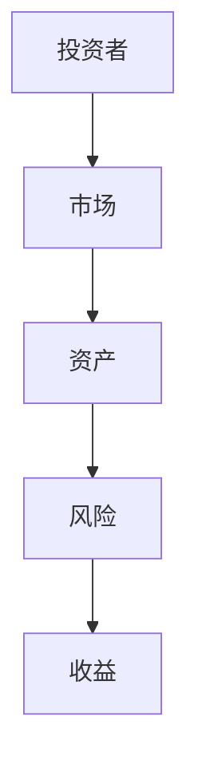

                 

# 投资理财市场分析

> 关键词：投资理财、市场分析、风险管理、资产配置、投资策略

> 摘要：本文系统地分析投资理财市场的核心概念、市场趋势、投资策略及风险管理，结合数学模型和实际案例，为投资者提供科学的投资决策依据。

---

## 第一部分：投资理财市场分析概述

## 第1章：投资理财的基本概念

### 1.1 投资与理财的定义
- 投资：将资金投入特定资产以获取收益的行为。
- 理财：通过规划和管理财务资源实现财务目标的过程。

### 1.2 投资理财的重要性
- 资产保值与增值。
- 优化财务结构，降低风险。

### 1.3 投资理财的分类
- 按期限：短期、中期、长期。
- 按风险：低风险、中风险、高风险。

---

## 第2章：投资市场的基本概念与核心要素

### 2.1 投资市场的定义与分类
- 证券市场：股票、债券、基金等。
- 债券市场：政府债券、公司债券。
- 股票市场：上市公司股票交易。

### 2.2 投资理财的核心要素
- 资产配置：分散投资降低风险。
- 风险评估：量化潜在损失。
- 投资目标：明确收益和风险偏好。
- 投资期限：影响资产选择。

---

## 第3章：投资理财市场分析的核心概念与联系

### 3.1 核心概念原理
- 投资组合理论：通过多样化降低风险。
- 风险与收益：高风险不一定高收益。

### 3.2 核心概念属性对比
| 概念       | 特性1 | 特性2 | 特性3 |
|------------|-------|-------|-------|
| 资产配置   | 多样性 | 风险分散 | 收益最大化 |
| 风险评估   | 客观性 | 可测量性 | 可控性 |
| 投资目标   | 明确性 | 可实现性 | 时间性 |

### 3.3 实体关系图（Mermaid）

---

## 第4章：投资理财市场分析的算法原理

### 4.1 投资组合优化算法
- 均值-方差模型：最小化波动率，给定期望收益。
  $$\text{目标函数：} \min \sigma^2 \text{，在给定 } \mu \text{ 下}$$

- 马科维茨优化模型：优化权重，平衡风险和收益。
  $$\text{数学表达式：} \min_w w^T \Sigma w \text{，在 } w^T \mu = r \text{ 下}$$

### 4.2 风险管理算法
- VaR模型：计算潜在损失。
  $$\text{公式：} \text{VaR}(\alpha) = \inf\{x | P(L \leq x) \geq \alpha\}$$
- 压力测试：模拟极端市场情况下的表现。

---

## 第5章：投资理财市场的技术分析与基本面分析

### 5.1 技术分析
- K线图：显示价格走势。
- 均线：趋势判断。
- MACD：动量指标。

### 5.2 基本面分析
- 公司财务报表：收入、利润、资产负债。
- 行业分析：竞争地位、成长性。

---

## 第6章：投资组合优化与风险管理

### 6.1 投资组合优化策略
- 现金管理：流动性优先。
- 债券投资：稳定收益。
- 股票投资：长期增长。

### 6.2 风险管理工具
- 保险：对冲特定风险。
- 期权：灵活对冲策略。

---

## 第7章：实际操作与案例分析

### 7.1 投资策略制定流程
1. 设定目标：收益、风险、期限。
2. 资产配置：比例分配。
3. 监测与调整：定期评估。

### 7.2 案例分析
- 投资者A：保守型，配置债券和货币市场。
- 投资者B：激进型，配置股票和高风险基金。

---

## 第8章：总结与展望

### 8.1 总结
- 核心概念：资产配置、风险管理。
- 实用工具：技术分析、数学模型。

### 8.2 展望
- 金融科技：大数据、人工智能的应用。
- 可持续投资：ESG因素的重要性。

---

## 附录

### 附录A：常用投资术语表
- 股票：所有权凭证。
- 债券：债务凭证。

### 附录B：投资工具选择指南

### 附录C：案例数据与代码

---

## 作者

作者：AI天才研究院/AI Genius Institute & 禅与计算机程序设计艺术 /Zen And The Art of Computer Programming

---

通过这样的结构，文章内容将全面覆盖投资理财市场的各个方面，结合理论与实践，帮助读者系统地理解和应用投资理财的知识。

