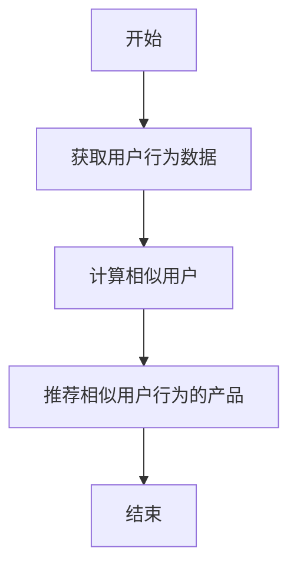
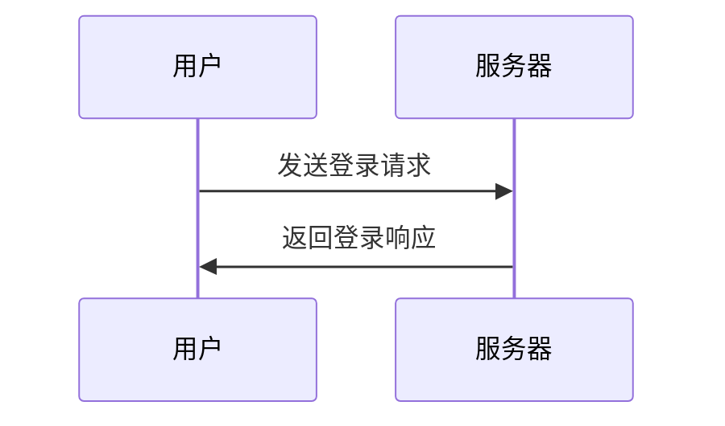

                 


# 《投资理财教育平台的集成》

> **关键词**: 投资理财教育、平台集成、算法推荐、系统架构、项目实战

> **摘要**: 本文详细探讨了投资理财教育平台的集成，从背景介绍到系统架构设计，再到项目实战，结合具体案例和代码实现，全面分析了平台的构建过程和关键点。通过本文的学习，读者可以掌握投资理财教育平台的核心概念、算法模型、系统架构设计以及实际项目的实现方法。

---

## 引言

随着金融市场的快速发展，投资理财教育的重要性日益凸显。然而，传统投资理财教育模式存在信息分散、缺乏个性化指导等问题，难以满足投资者的需求。本文将探讨如何通过技术手段构建一个集成的投资理财教育平台，解决这些问题。

---

## 第一部分: 投资理财教育平台的背景与核心概念

### 第1章: 投资理财教育平台的背景与问题描述

#### 1.1 投资理财教育的现状与挑战

- **问题背景**: 当前投资者教育信息分散，缺乏系统性，投资者难以获取个性化指导。
- **问题描述**: 投资者在选择理财产品时，缺乏专业指导，容易做出错误决策。
- **问题解决**: 构建一个集成的投资理财教育平台，提供个性化、系统化的教育服务。

#### 1.2 投资理财教育平台的定义与目标

- **定义**: 一个结合金融知识教育、投资工具模拟和个性化推荐的综合性平台。
- **目标**: 提供个性化的投资教育方案，帮助投资者提升投资能力。

#### 1.3 投资理财教育平台的用户需求分析

- **用户群体**: 初级投资者、资深投资者、金融机构等。
- **核心需求**: 个性化教育、实时市场数据、投资工具模拟。

---

### 第2章: 投资理财教育平台的核心概念与联系

#### 2.1 核心概念的定义与属性

| 核心概念 | 定义 | 属性 |
|----------|------|------|
| 投资者教育 | 提供投资知识和技能培训 | 个性化、系统化、互动性 |
| 投资工具模拟 | 提供虚拟投资工具 | 实时性、交互性、可定制性 |
| 个性化推荐 | 根据用户行为推荐内容 | 智能性、动态性、精准性 |

#### 2.2 实体关系图（ER图）

```mermaid
erd
    title 实体关系图
    User {
        id: integer
        name: string
        email: string
    }
    InvestmentProduct {
        id: integer
        name: string
        type: string
        risk_level: integer
    }
    Transaction {
        id: integer
        user_id: integer
        product_id: integer
        amount: integer
        timestamp: datetime
    }
    User --> Transaction: 进行交易
    InvestmentProduct --> Transaction: 被选择进行交易
```

---

## 第二部分: 投资理财教育平台的算法与数学模型

### 第3章: 投资理财教育平台的算法与数学模型

#### 3.1 算法原理

- **协同过滤推荐算法**: 基于用户行为和偏好推荐投资产品。
- **流程图**: 使用mermaid展示推荐算法的流程。



#### 3.2 数学模型与公式

- **协同过滤算法公式**:

$$
similarity(u, v) = \frac{\sum_{i=1}^{n} (r_{u,i} - \bar{r}_u)(r_{v,i} - \bar{r}_v)}{\sqrt{\sum_{i=1}^{n} (r_{u,i} - \bar{r}_u)^2} \sqrt{\sum_{i=1}^{n} (r_{v,i} - \bar{r}_v)^2}}
$$

其中，$\bar{r}_u$ 表示用户u的平均评分，$\bar{r}_v$ 表示用户v的平均评分。

#### 3.3 算法实现

- **Python代码实现**:

```python
def calculate_similarity(user_matrix):
    similarity_matrix = {}
    for u in user_matrix:
        for v in user_matrix:
            if u == v:
                continue
            numerator = sum((user_matrix[u][i] - user_matrix[u].mean()) * (user_matrix[v][i] - user_matrix[v].mean()) for i in range(len(user_matrix[u])))
            denominator = (sum((user_matrix[u][i] - user_matrix[u].mean())**2 for i in range(len(user_matrix[u]))) ** 0.5) * (sum((user_matrix[v][i] - user_matrix[v].mean())**2 for i in range(len(user_matrix[v]))) ** 0.5)
            similarity_matrix[(u, v)] = numerator / denominator
    return similarity_matrix
```

---

### 第4章: 投资理财教育平台的系统分析与架构设计

#### 4.1 系统分析

- **问题场景**: 投资者在平台上进行注册、登录、学习、模拟交易等操作。

#### 4.2 系统架构设计

- **系统架构图**:

```mermaid
graph LR
    Client --> Server: 发送请求
    Server --> Database: 查询数据
    Database --> Server: 返回数据
    Server --> Client: 返回响应
```

#### 4.3 接口与交互设计

- **接口设计**: RESTful API，如`GET /users`，`POST /transactions`。
- **交互设计**: 使用序列图展示用户登录流程。



---

## 第三部分: 投资理财教育平台的项目实战

### 第5章: 投资理财教育平台的项目实战

#### 5.1 环境安装

- 安装Python、虚拟环境、依赖库（如Flask、Pandas）。

#### 5.2 核心代码实现

- **推荐算法实现**:

```python
def recommend(user_id):
    # 获取用户行为数据
    user_data = get_user_behavior(user_id)
    # 计算相似用户
    similar_users = get_similar_users(user_data)
    # 推荐产品
    recommended_products = get_recommended_products(similar_users)
    return recommended_products
```

#### 5.3 案例分析

- 模拟用户交易，展示推荐结果和交易记录。

#### 5.4 项目小结

- 通过实际案例分析，验证平台功能的可行性和有效性。

---

## 第四部分: 总结与展望

### 第6章: 总结与展望

- **总结**: 本文详细探讨了投资理财教育平台的构建过程，从背景分析到系统设计，再到项目实现，提供了全面的技术指导。
- **展望**: 未来可以进一步优化推荐算法，增加更多交互功能，提升用户体验。

---

## 作者信息

作者：AI天才研究院/AI Genius Institute & 禅与计算机程序设计艺术 /Zen And The Art of Computer Programming

---

通过本文的系统分析和详细讲解，读者可以全面了解投资理财教育平台的构建过程，掌握相关技术的核心要点，为实际项目提供参考。

