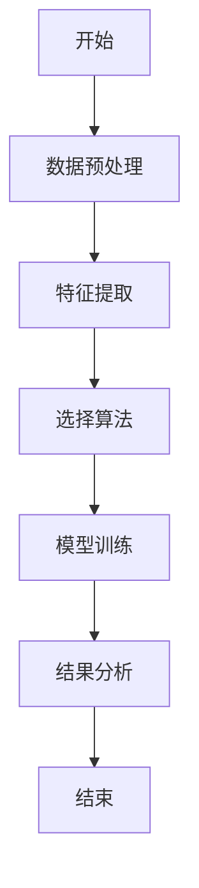
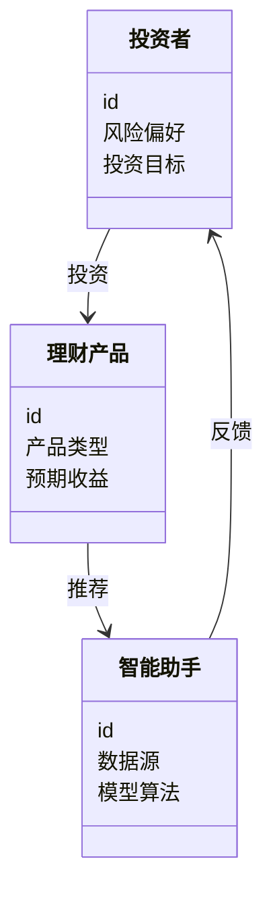
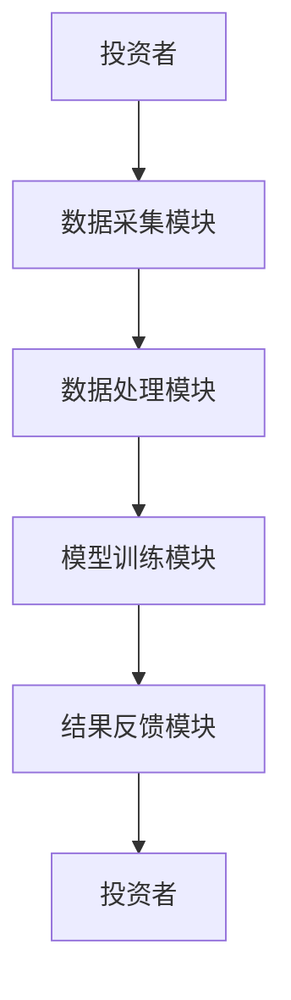

                 


# 投资理财智能助手的性能调优技巧

---

## 关键词：投资理财，智能助手，性能调优，机器学习，系统架构，数学模型

---

## 摘要：  
本文详细探讨投资理财智能助手的性能调优技巧，涵盖核心概念、算法原理、系统架构设计及项目实战，帮助读者掌握优化智能助手性能的方法，提升投资理财效率与准确性。

---

## 第一部分：投资理财智能助手的背景与核心概念

### 第1章：投资理财智能助手的背景介绍

#### 1.1 问题背景与问题描述  
投资理财领域复杂多变，涉及海量数据和多元化的用户需求。智能助手通过数据处理、算法分析和交互反馈，帮助用户优化投资决策。然而，性能问题如响应速度慢、准确性低、资源消耗大，严重影响用户体验。  

**问题解决**：通过性能调优，提升智能助手的数据处理效率、算法优化和资源利用率。  

**边界与外延**：限定于智能助手的技术层面，涵盖数据源选择、模型算法优化、系统架构设计等，不涉及具体投资策略。

#### 1.2 核心概念与联系  
- **定义**：智能助手利用AI和大数据技术，为用户提供个性化投资建议。  
- **性能指标**：响应时间、准确性、资源消耗、用户体验。  
- **技术对比**：与传统投资工具相比，智能助手具备高效性、实时性和个性化优势。  

---

## 第二部分：核心概念与联系

### 第2章：核心概念与联系

#### 2.1 核心概念原理  
- **数据源**：金融市场数据、用户行为数据、宏观经济指标。  
- **算法模型**：回归分析、分类算法、聚类分析。  
- **系统架构**：数据采集、模型训练、用户交互模块。

#### 2.2 概念属性特征对比  
| 概念 | 属性 | 特征 |  
|------|------|------|  
| 数据源 | 类型 | 市场数据、用户数据 |  
| 算法模型 | 常见类型 | 回归、分类、聚类 |  
| 系统架构 | 组件 | 数据采集、模型训练、交互模块 |

#### 2.3 ER实体关系图  
```mermaid
er
    entity 投资者 {
        id
        风险偏好
        投资目标
    }
    entity 理财产品 {
        id
        产品类型
        预期收益
    }
    entity 智能助手 {
        id
        数据源
        模型算法
    }
    relation 投资者 -- 理财产品: 投资
    relation 理财产品 -- 智能助手: 推荐
```

---

## 第三部分：算法原理讲解

### 第3章：算法原理

#### 3.1 常用算法分析  
- **回归分析**：预测资产价格趋势。  
- **分类算法**：识别市场状态（牛市、熊市）。  
- **聚类分析**：用户分群，定制化推荐。  

#### 3.2 算法步骤展示  


#### 3.3 代码实现与模型解读  
```python
import pandas as pd
from sklearn.linear_model import LinearRegression

# 示例数据
data = {
    'price': [100, 105, 110, 115, 120],
    'volume': [1000, 900, 800, 700, 600]
}
df = pd.DataFrame(data)

# 训练模型
model = LinearRegression()
model.fit(df[['volume']], df['price'])

# 预测
new_volume = 500
predicted_price = model.predict([[new_volume]])
print(predicted_price)
```

#### 3.4 数学模型与公式  
- **回归模型公式**：  
  $$ y = \beta_0 + \beta_1 x + \epsilon $$  
  其中，$y$ 是目标变量，$x$ 是自变量，$\beta_0$ 和 $\beta_1$ 是系数，$\epsilon$ 是误差项。  
- **分类模型公式**：  
  $$ P(Y=1|X) = \sigma(w \cdot X + b) $$  
  其中，$\sigma$ 是sigmoid函数，$w$ 是权重，$b$ 是偏置。

---

## 第四部分：系统分析与架构设计

### 第4章：系统架构设计

#### 4.1 问题场景  
智能助手需处理大量数据，提供实时反馈，支持多用户并发请求。  

#### 4.2 系统功能设计  


#### 4.3 系统架构设计  


#### 4.4 接口设计与交互设计  
- **接口设计**：RESTful API，如`GET /recommend`。  
- **交互设计**：用户输入需求，助手返回推荐和解释。

---

## 第五部分：项目实战

### 第5章：项目实战

#### 5.1 环境安装  
- 安装Python、Pandas、Scikit-learn。  

#### 5.2 核心代码实现  
```python
import pandas as pd
from sklearn.linear_model import LinearRegression

# 数据加载
data = pd.read_csv('investment_data.csv')

# 数据预处理
X = data[['volume', 'market_cap']]
y = data['price']

# 模型训练
model = LinearRegression()
model.fit(X, y)

# 接口定义
from flask import Flask, request, jsonify

app = Flask(__name__)

@app.route('/predict', methods=['POST'])
def predict():
    data = request.json
    predicted_price = model.predict([[data['volume'], data['market_cap']]])
    return jsonify({'predicted_price': float(predicted_price[0])})

if __name__ == '__main__':
    app.run(debug=True)
```

#### 5.3 代码解读与案例分析  
- **代码解读**：构建一个简单的预测接口，接收用户输入，返回预测价格。  
- **案例分析**：输入市场数据，输出预测结果，并解释模型推理过程。

---

## 第六部分：最佳实践与总结

### 第6章：总结与展望

#### 6.1 最佳实践技巧  
- 定期优化模型，更新数据源。  
- 采用分布式架构，提升处理能力。  

#### 6.2 小结  
投资理财智能助手的性能调优是一个复杂而重要的任务，涉及多方面的优化策略。通过合理的算法选择、高效的系统架构和持续的性能监控，可以显著提升智能助手的效率和准确性。  

#### 6.3 注意事项  
- 确保数据安全，保护用户隐私。  
- 定期进行压力测试，确保系统稳定性。  

#### 6.4 拓展阅读  
- 推荐书籍：《机器学习实战》、《Python金融大数据分析》。  
- 在线资源：Kaggle投资数据集，GitHub上的智能投资项目。

---

## 作者：AI天才研究院 & 禅与计算机程序设计艺术

---

通过以上结构，文章详细讲解了投资理财智能助手的性能调优技巧，从理论到实践，帮助读者系统掌握优化方法，提升投资理财效率。

