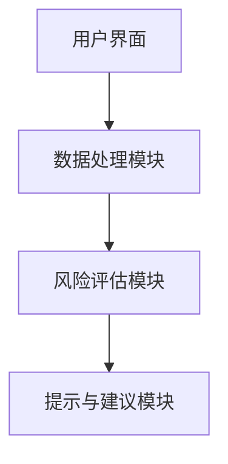
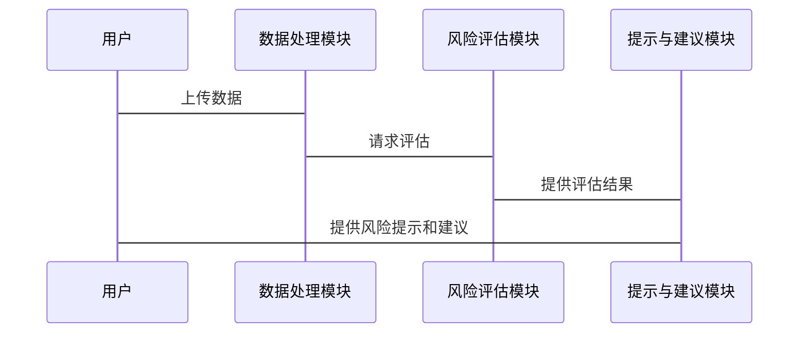

                 


---

# 投资风险提示系统

> 关键词：投资风险、风险管理、系统架构、算法、数据处理

> 摘要：  
投资风险是投资者在金融市场中不可避免的挑战，如何有效识别和管理这些风险是投资者和金融机构的核心需求。本文通过分析投资风险的特征、分类和建模方法，结合数据采集与处理、风险评估算法以及系统架构设计，提出了一套完整的投资风险提示系统解决方案。本文深入探讨了系统的核心概念、算法原理、系统架构，并通过实际案例展示了系统的实现与应用，为投资者和金融机构提供了有效的风险管理工具。

---

## 第1章: 投资风险提示系统概述

### 1.1 投资风险的重要性

#### 1.1.1 投资风险的定义与特征
投资风险是指在投资过程中，由于市场波动、经济变化或其他不确定因素，导致投资收益低于预期或发生损失的可能性。投资风险具有以下特征：
- **不确定性**：风险的发生时间和规模难以预测。
- **可测性**：通过数据分析和模型构建，可以量化和评估风险。
- **可控性**：通过合理的投资组合和风险管理策略，可以降低风险的影响。

#### 1.1.2 投资风险对投资者的影响
投资风险直接影响投资者的收益和财富安全。高风险可能带来高回报，但也可能导致重大损失。因此，投资者需要在风险与收益之间找到平衡点。

#### 1.1.3 投资风险提示系统的必要性
投资风险提示系统通过实时监测市场动态和数据分析，帮助投资者识别潜在风险，并提供预警和建议。这不仅提高了投资决策的科学性，还能有效降低损失。

### 1.2 投资风险提示系统的定义与构成

#### 1.2.1 系统的定义
投资风险提示系统是一种基于数据分析和算法的智能化系统，旨在通过实时监测市场数据、分析投资组合的风险特征，并向投资者提供风险预警和优化建议。

#### 1.2.2 系统的核心构成要素
- **数据采集模块**：负责采集市场数据、公司基本面数据和金融新闻等。
- **数据处理模块**：对采集的数据进行清洗、标准化和特征提取。
- **风险评估模块**：基于算法对投资组合进行风险评估和分类。
- **提示与建议模块**：根据评估结果生成风险提示和优化建议。

#### 1.2.3 系统的功能模块划分
- **用户界面**：提供直观的操作界面，展示风险评估结果和提示信息。
- **数据处理**：对数据进行清洗、转换和存储。
- **风险评估**：通过算法对投资组合进行风险分析。
- **提示与建议**：生成风险提示和投资建议。

### 1.3 投资风险提示系统的应用场景

#### 1.3.1 个人投资者的应用
个人投资者可以通过系统实时了解其投资组合的风险状况，并根据提示进行调整。

#### 1.3.2 机构投资者的应用
机构投资者可以利用系统进行大规模数据处理和风险评估，优化投资组合配置。

#### 1.3.3 金融监管机构的应用
金融监管机构可以通过系统监控市场风险，及时发现和应对潜在的系统性风险。

### 1.4 本章小结
本章介绍了投资风险的重要性、投资风险提示系统的定义与构成，以及其在不同场景下的应用。通过系统的建设，投资者和金融机构可以更有效地管理投资风险。

---

## 第2章: 投资风险的特征与分类

### 2.1 投资风险的特征分析

#### 2.1.1 风险的不确定性
投资风险的不确定性主要来源于市场的不可预测性和投资者行为的多样性。

#### 2.1.2 风险的可测性
通过数据分析和模型构建，投资风险可以量化和评估。

#### 2.1.3 风险的可控性
通过合理的投资策略和风险管理，可以有效降低投资风险的影响。

### 2.2 投资风险的分类

#### 2.2.1 系统性风险
系统性风险是由于市场整体波动引起的，例如经济衰退、政策变化等。

#### 2.2.2 非系统性风险
非系统性风险是由于个别资产或公司的特定因素引起的，例如公司财务状况恶化。

#### 2.2.3 市场风险
市场风险是指由于市场价格波动导致的投资损失。

#### 2.2.4 利率风险
利率风险是指由于利率变动导致债券价格波动的风险。

#### 2.2.5 流动性风险
流动性风险是指资产难以快速变现而不影响其价值的风险。

### 2.3 投资风险的建模方法

#### 2.3.1 风险评估模型的构建
常见的风险评估模型包括VaR（Value at Risk）模型和CVaR（Conditional Value at Risk）模型。

#### 2.3.2 风险指标的选择
常用的指标包括波动率、VaR、CVaR等。

#### 2.3.3 风险评估的数学模型
例如，VaR模型可以表示为：
$$ \text{VaR}(\alpha) = \text{最小损失值使得损失概率} \geq \alpha $$

### 2.4 本章小结
本章分析了投资风险的特征，并对其进行了分类。同时，介绍了常见的风险评估模型和数学公式，为后续的系统设计奠定了基础。

---

## 第3章: 投资风险数据的采集与预处理

### 3.1 数据来源与采集方法

#### 3.1.1 市场数据的采集
市场数据包括股票价格、指数走势等，可以通过API接口从金融数据提供商获取。

#### 3.1.2 公司基本面数据的采集
基本面数据包括公司财务报表、盈利能力等，可以通过爬虫或API获取。

#### 3.1.3 金融新闻数据的采集
金融新闻数据可以通过新闻网站的API或爬虫获取，并进行情感分析提取关键词。

### 3.2 数据清洗与预处理

#### 3.2.1 数据清洗方法
包括去除重复数据、处理缺失值和异常值。

#### 3.2.2 数据标准化与归一化
数据标准化可以通过Z-score方法实现：
$$ z = \frac{x - \mu}{\sigma} $$
其中，$\mu$是均值，$\sigma$是标准差。

#### 3.2.3 数据特征提取
通过主成分分析（PCA）提取关键特征。

### 3.3 数据存储与管理

#### 3.3.1 数据库设计
使用关系型数据库存储结构化数据，非结构化数据存储在NoSQL数据库中。

#### 3.3.2 数据仓库的构建
构建数据仓库用于存储和分析大规模数据。

#### 3.3.3 数据安全与隐私保护
通过加密技术和访问控制保护数据安全。

### 3.4 本章小结
本章详细介绍了投资风险数据的采集与预处理方法，为后续的风险评估提供了高质量的数据支持。

---

## 第4章: 投资风险评估的关键算法

### 4.1 常见的风险评估算法

#### 4.1.1 聚类算法
聚类算法用于将相似的投资组合分组，识别风险类型。

#### 4.1.2 分类算法
分类算法用于预测投资组合的风险等级。

#### 4.1.3 回归算法
回归算法用于预测投资组合的收益与风险的关系。

#### 4.1.4 时间序列分析
时间序列分析用于分析历史数据，预测未来的风险趋势。

### 4.2 算法原理与流程

#### 4.2.1 聚类算法的原理
聚类算法通过距离度量和优化目标函数将数据点分组。

#### 4.2.2 分类算法的原理
分类算法通过训练数据构建分类模型，预测新数据的类别。

#### 4.2.3 回归算法的原理
回归算法通过最小化预测误差构建回归模型。

#### 4.2.4 时间序列分析的原理
时间序列分析通过ARIMA模型或GARCH模型预测未来的趋势。

### 4.3 算法实现与优化

#### 4.3.1 算法实现步骤
以聚类算法为例，实现步骤包括数据预处理、选择聚类方法、计算聚类中心等。

#### 4.3.2 算法优化方法
通过参数调优和交叉验证提高算法性能。

#### 4.3.3 算法性能评估
通过准确率、召回率和F1分数评估算法性能。

### 4.4 本章小结
本章介绍了常见风险评估算法的原理与实现方法，为系统的风险评估模块提供了技术支持。

---

## 第5章: 投资风险提示系统的架构设计

### 5.1 系统架构概述

#### 5.1.1 分层架构设计
系统分为数据层、业务逻辑层和用户界面层。

#### 5.1.2 微服务架构设计
系统采用微服务架构，各个功能模块独立开发和部署。

#### 5.1.3 组件化架构设计
系统通过组件化设计，提高模块的复用性和可扩展性。

### 5.2 系统功能设计

#### 5.2.1 用户界面设计
用户界面包括数据输入、风险评估结果展示和投资建议等功能。

#### 5.2.2 数据处理模块设计
数据处理模块包括数据清洗、特征提取和数据存储功能。

#### 5.2.3 风险评估模块设计
风险评估模块包括算法选择、模型训练和风险评估结果输出。

#### 5.2.4 提示与建议模块设计
提示与建议模块根据评估结果生成风险提示和优化建议。

### 5.3 系统架构设计图



### 5.4 系统接口设计
系统通过RESTful API接口实现模块之间的通信。

### 5.5 系统交互序列图



### 5.6 本章小结
本章详细设计了投资风险提示系统的架构，包括分层架构、微服务架构和组件化架构，并通过图表展示了系统的交互流程。

---

## 第6章: 项目实战

### 6.1 环境安装

#### 6.1.1 安装Python
安装Python 3.x版本，确保环境满足项目需求。

#### 6.1.2 安装依赖库
安装Pandas、NumPy、Scikit-learn等依赖库：
```bash
pip install pandas numpy scikit-learn
```

### 6.2 系统核心实现源代码

#### 6.2.1 数据采集与预处理
```python
import pandas as pd

# 数据采集
data = pd.read_csv('data.csv')

# 数据清洗
data.dropna(inplace=True)
data = data[~data['value'].duplicated()]
```

#### 6.2.2 风险评估算法实现
```python
from sklearn.cluster import KMeans

# 聚类算法实现
def risk_assessment(X, n_clusters):
    kmeans = KMeans(n_clusters=n_clusters, random_state=0)
    kmeans.fit(X)
    return kmeans.labels_
```

#### 6.2.3 提示与建议生成
```python
def generate_recommendation(risk_level):
    if risk_level == 'high':
        return "建议调整投资组合，减少高风险资产配置。"
    elif risk_level == 'medium':
        return "建议保持当前投资策略，定期监控风险。"
    else:
        return "建议增加高风险资产配置，以追求更高收益。"
```

### 6.3 代码应用解读与分析
通过上述代码，我们可以实现投资风险的评估和提示功能。数据采集与预处理模块确保了数据的质量，风险评估算法模块提供了风险分类，提示与建议模块为投资者提供了具体的优化建议。

### 6.4 实际案例分析
以某股票投资组合为例，通过系统评估其风险等级为“high”，系统提示建议减少高风险资产配置。

### 6.5 本章小结
本章通过实际案例展示了投资风险提示系统的实现过程，验证了系统的可行性和有效性。

---

## 第7章: 总结与展望

### 7.1 本章总结
本文详细介绍了投资风险提示系统的构建过程，包括系统概述、数据采集与处理、风险评估算法、系统架构设计和项目实战。通过系统的建设，投资者和金融机构可以更有效地管理投资风险。

### 7.2 未来展望
未来，随着人工智能和大数据技术的发展，投资风险提示系统将更加智能化和个性化。可能的研究方向包括：
- 更加复杂的风险评估模型
- 高频交易的风险提示系统
- 基于机器学习的实时风险预警

---

## 作者：AI天才研究院/AI Genius Institute & 禅与计算机程序设计艺术 /Zen And The Art of Computer Programming

---

以上是《投资风险提示系统》的技术博客文章的完整内容。文章详细介绍了投资风险提示系统的各个方面，包括系统概述、数据处理、算法实现和系统架构设计，并通过实际案例展示了系统的实现过程。希望对您有所帮助！

