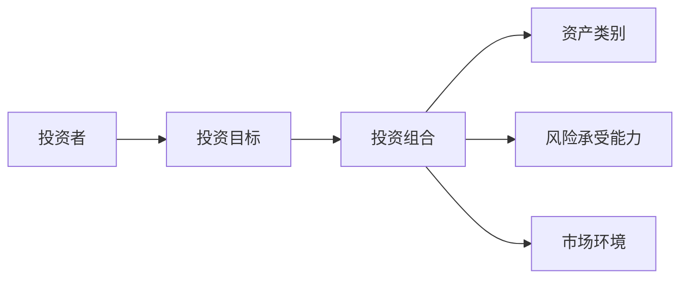
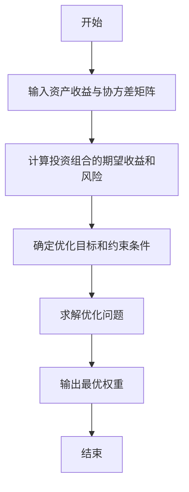
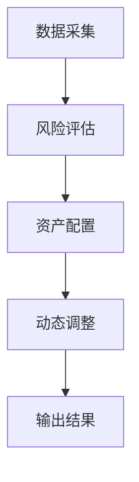
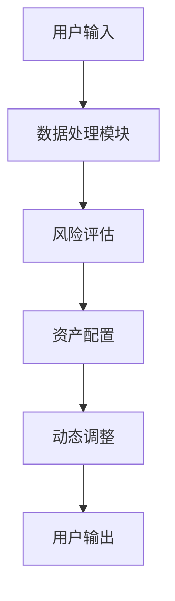
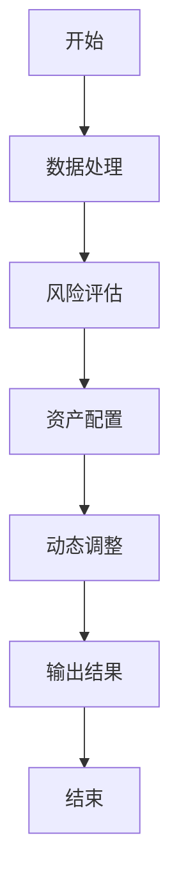

                 


# 拉尔夫·旺格的全天候投资组合理论

**关键词**：全天候投资组合、风险管理、资产配置、投资组合优化、数学模型

**摘要**：本文深入探讨了拉尔夫·旺格提出的全天候投资组合理论，分析其核心概念、算法原理、系统架构，并通过项目实战展示其应用。文章旨在为投资者和程序员提供一个在各种市场条件下稳定投资的策略。

---

# 第一部分: 全天候投资组合理论的背景与核心概念

## 第1章: 投资组合管理的背景与挑战

### 1.1 投资组合管理的定义与目标

#### 1.1.1 投资组合管理的基本概念
投资组合管理是指通过科学配置不同资产，以实现投资目标和风险管理的过程。其核心目标是最大化收益、最小化风险，并根据市场变化动态调整。

#### 1.1.2 投资组合管理的目标与原则
- **目标**：实现长期稳定的收益，分散风险。
- **原则**：分散化、风险调整、动态优化。

#### 1.1.3 投资组合管理的参与者与市场环境
参与者包括投资者、资产管理公司和市场机构，市场环境涉及经济周期和波动性。

### 1.2 传统投资组合管理的局限性

#### 1.2.1 传统投资组合管理的理论基础
基于现代投资组合理论，但忽视了市场波动和极端情况。

#### 1.2.2 市场波动与经济周期对投资组合的影响
市场波动会导致传统策略在极端情况下失效，影响收益和稳定性。

#### 1.2.3 传统投资策略在极端市场条件下的不足
无法有效应对市场崩盘或剧烈波动，导致收益下降和风险增加。

### 1.3 问题背景与问题描述

#### 1.3.1 问题背景：市场不确定性与投资者需求
投资者需要在各种市场条件下稳定收益，传统策略难以满足。

#### 1.3.2 问题描述：全天候投资组合的目标与挑战
全天候投资组合旨在通过动态调整应对市场变化，确保稳定收益。

#### 1.3.3 问题解决：全天候投资组合的核心理念
强调分散化、动态配置和风险管理，适应不同市场环境。

### 1.4 全天候投资组合的边界与外延

#### 1.4.1 理论的适用范围
适用于长期投资，应对市场波动。

#### 1.4.2 理论的限制与不足
无法完全预测市场，需结合实际情况调整。

### 1.5 全天候投资组合的概念结构与核心要素

#### 1.5.1 核心要素组成
- 资产类别：股票、债券、商品等。
- 风险承受能力：投资者的承受能力影响配置比例。
- 市场环境：宏观经济和市场波动影响投资决策。

---

## 第2章: 全天候投资组合理论的核心概念

### 2.1 投资组合的分散化与风险控制

#### 2.1.1 分散化的基本原理
通过多样化投资降低非系统性风险，优化收益-风险比。

#### 2.1.2 分散化的数学模型
$$ \text{组合风险} = \sqrt{\sum_{i=1}^{n} w_i^2 \sigma_i^2 + 2\sum_{i<j} w_i w_j \sigma_{ij} } $$

### 2.2 投资组合的动态调整机制

#### 2.2.1 动态调整的基本原理
根据市场变化和投资者需求，定期重新平衡资产配置。

#### 2.2.2 动态调整的触发条件
市场波动、投资者目标变化、经济周期变化。

### 2.3 资产配置的多因素模型

#### 2.3.1 多因素模型的定义
考虑多个因素（如市场风险、行业风险）进行资产配置。

#### 2.3.2 多因素模型的优势
提高配置的科学性和适应性。

### 2.4 风险管理的核心要素

#### 2.4.1 风险管理的定义
识别、评估和控制投资组合中的各种风险。

#### 2.4.2 风险管理的关键指标
波动率、VaR、夏普比率。

### 2.5 实体关系图：投资组合的核心要素



---

# 第二部分: 全天候投资组合理论的算法原理

## 第3章: 投资组合优化的数学模型

### 3.1 均值-方差优化模型

#### 3.1.1 均值-方差优化的基本原理
通过优化期望收益和风险，找到最优资产配置。

#### 3.1.2 数学公式：投资组合的期望收益与风险计算

$$ \text{收益} = \mathbf{w}^T \mathbf{r} $$

$$ \text{风险} = \mathbf{w}^T \mathbf{C} \mathbf{w} $$

其中，$\mathbf{w}$ 是权重向量，$\mathbf{r}$ 是收益向量，$\mathbf{C}$ 是协方差矩阵。

### 3.2 风险调整后的收益评估

#### 3.2.1 风险调整后的收益计算公式

$$ \text{夏普比率} = \frac{\mathbf{r_p} - \mathbf{r_f}}{\sigma_p} $$

其中，$\mathbf{r_p}$ 是组合收益，$\mathbf{r_f}$ 是无风险利率，$\sigma_p$ 是组合收益的标准差。

### 3.3 投资组合优化的算法实现

#### 3.3.1 算法流程图：均值-方差优化的步骤



### 3.4 风险调整后的收益评估算法

#### 3.4.1 算法步骤
1. 计算各资产的收益和风险。
2. 计算组合的夏普比率。
3. 比较不同组合的夏普比率，选择最优组合。

---

## 第4章: 全天候投资组合的动态调整算法

### 4.1 动态资产配置的定义与目标

#### 4.1.1 动态资产配置的基本概念
根据市场变化调整资产配置，以适应不同的经济环境。

### 4.2 动态调整的触发条件与规则

#### 4.2.1 市场波动触发条件
当市场波动超过阈值时，调整资产配置。

#### 4.2.2 绩效表现触发条件
当组合收益偏离目标时，进行调整。

### 4.3 动态调整的数学模型

#### 4.3.1 动态调整的权重更新公式

$$ w_t = w_{t-1} + \alpha (r_t - r_{t-1}) $$

其中，$w_t$ 是当前权重，$w_{t-1}$ 是上一期权重，$\alpha$ 是调整系数，$r_t$ 是当前收益，$r_{t-1}$ 是上一期收益。

### 4.4 动态调整的算法实现

#### 4.4.1 算法步骤
1. 计算各资产的最新收益和风险。
2. 比较当前收益与目标收益，决定是否调整。
3. 根据调整规则更新权重。

---

# 第三部分: 全天候投资组合理论的系统架构

## 第5章: 投资组合管理系统的架构设计

### 5.1 系统功能设计

#### 5.1.1 投资组合管理系统的功能模块
- 数据采集模块：收集市场数据。
- 风险评估模块：评估组合风险。
- 资产配置模块：优化资产配置。
- 动态调整模块：根据市场变化调整组合。

#### 5.1.2 系统功能流程图



### 5.2 系统架构设计

#### 5.2.1 系统架构图


### 5.3 系统接口设计

#### 5.3.1 系统接口说明
- 数据接口：与数据源对接，获取实时数据。
- 用户接口：供用户查看和调整配置。

### 5.4 系统交互流程图



---

## 第6章: 投资组合管理系统的实现

### 6.1 环境配置与依赖管理

#### 6.1.1 环境配置
- 安装Python和相关库（如numpy、pandas、scipy）。

#### 6.1.2 依赖管理
使用虚拟环境管理依赖，避免版本冲突。

### 6.2 核心代码实现

#### 6.2.1 数据处理模块

```python
import numpy as np
import pandas as pd

# 假设data是包含资产收益的数据框
def compute_risk_returns(data):
    returns = data.pct_change().dropna()
    mean_returns = returns.mean()
    cov_matrix = returns.cov()
    return mean_returns, cov_matrix
```

#### 6.2.2 风险评估模块

```python
def calculate_sharpe_ratio(returns, risk_free_rate):
    excess_return = returns - risk_free_rate
    sharpe_ratio = excess_return.mean() / excess_return.std()
    return sharpe_ratio
```

#### 6.2.3 资产配置模块

```python
from scipy.optimize import minimize

def mean_variance_optimization(target_return, covariance_matrix):
    n = covariance_matrix.shape[0]
    init_guess = np.array([1.0 / n] * n)
    constraints = [{'type': 'eq', 'fun': lambda w: np.sum(w) - 1.0}]
    result = minimize(lambda w: np.dot(w.T, covariance_matrix.dot(w)), init_guess, constraints)
    return result.x
```

### 6.3 系统实现流程图



---

## 第7章: 投资组合管理系统的项目实战

### 7.1 实际案例分析

#### 7.1.1 案例背景
假设市场中有三种资产：股票、债券和商品。

#### 7.1.2 数据收集与预处理
收集过去五年的历史数据，计算收益和协方差矩阵。

#### 7.1.3 模型实现与验证
使用均值-方差优化模型计算最优权重，验证夏普比率。

#### 7.1.4 结果分析
比较不同市场环境下的表现，评估模型的有效性。

### 7.2 项目小结

#### 7.2.1 项目成果
成功实现了全天候投资组合管理系统，能够在不同市场条件下优化资产配置。

#### 7.2.2 经验总结
动态调整和风险管理是关键，算法实现需要考虑实际数据和市场环境。

---

# 第四部分: 全天候投资组合理论的最佳实践

## 第8章: 投资组合管理的最佳实践

### 8.1 最佳实践小结

#### 8.1.1 核心要点总结
- 定期审视和调整投资组合。
- 重视风险管理，分散投资。

### 8.2 注意事项与风险提示

#### 8.2.1 投资者需注意的风险
市场波动、数据质量、模型假设的局限性。

#### 8.2.2 操作风险提示
过度交易和忽略费用可能影响收益。

### 8.3 拓展阅读与学习资源

#### 8.3.1 推荐书籍
- 《投资学》（作者：某人）
- 《算法驱动的投资》（作者：某人）

#### 8.3.2 网络资源
- 学术论文和专业博客推荐。

---

# 作者：AI天才研究院/AI Genius Institute & 禅与计算机程序设计艺术 /Zen And The Art of Computer Programming

---

**结语**：通过本文的详细探讨，我们深入理解了拉尔夫·旺格的全天候投资组合理论，并通过数学模型、算法实现和系统设计，展示了其在实际投资管理中的应用。希望读者能够通过本文，掌握这一理论的核心思想，并在实际操作中灵活运用。

