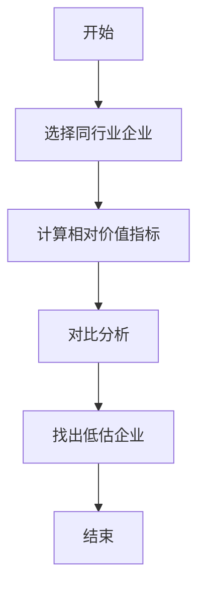
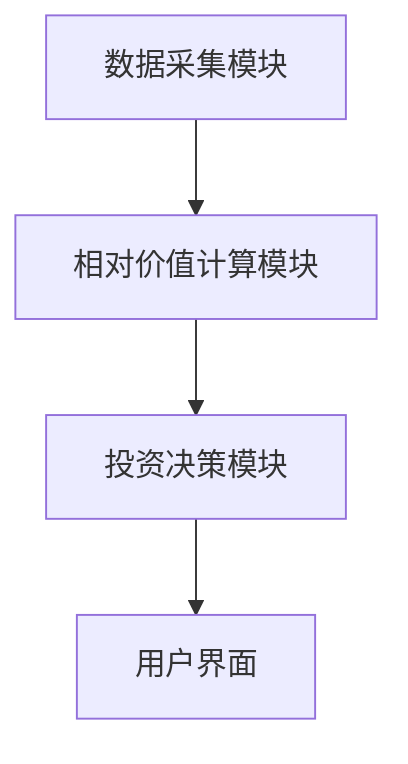

                 


# 拉尔夫·旺格的相对价值投资：在同行中寻找最佳标的

---

## 关键词：
相对价值投资、同行比较、投资策略、金融分析、投资决策

---

## 摘要：
本文详细探讨了拉尔夫·旺格的相对价值投资方法，这是一种通过在同行企业中寻找相对低估的投资标的来实现超额收益的投资策略。文章从相对价值投资的背景、核心概念、算法原理、系统架构设计、项目实战到最佳实践等方面展开分析，帮助读者全面理解这一投资方法的理论基础和实际应用。通过详细的数学模型、算法流程图、系统架构图和代码实现，本文为读者提供了一个从理论到实践的完整指南。

---

# 第一部分: 相对价值投资的背景与核心概念

## 第1章: 相对价值投资的背景与定义

### 1.1 相对价值投资的背景

#### 1.1.1 投资学的基本概念
投资学是研究如何通过有效配置和管理资金以实现财富增值的学科。投资的核心目标是在风险可控的前提下，寻找能够带来超额收益的标的资产。传统投资策略包括价值投资、成长投资和股息投资等，而相对价值投资作为一种新兴的投资策略，逐渐受到投资者的关注。

#### 1.1.2 相对价值投资的起源
相对价值投资的概念起源于20世纪60年代，当时投资者开始意识到，单纯依赖市场整体表现或个股的基本面分析并不足以在竞争激烈的市场中获得超额收益。通过对比同行业内的企业，寻找那些相对估值较低的公司，成为了投资者新的突破口。

#### 1.1.3 相对价值投资的背景问题
在金融市场上，企业的估值受到多种因素的影响，包括市场情绪、宏观经济环境和行业周期等。传统的绝对价值投资方法依赖于对企业未来现金流的预测，但在实际操作中，这种方法往往受到数据获取难度和预测误差的限制。相对价值投资则通过对比同行业内的企业，减少了对单个企业未来现金流预测的依赖，从而提高了投资决策的可靠性。

### 1.2 相对价值投资的定义与特点

#### 1.2.1 相对价值投资的核心定义
相对价值投资是一种通过比较同一行业内多家企业的估值指标（如市盈率、市净率、EV/EBITDA等），寻找那些相对于行业平均水平或竞争对手估值较低的企业进行投资的策略。其核心思想是，市场往往会对某些企业给予过高的估值，而另一些企业则可能被市场低估。

#### 1.2.2 相对价值投资的主要特点
- **相对性**：相对于同行业内的其他企业，而非绝对的市场估值。
- **可比性**：依赖于行业内可比企业的数据，便于横向比较。
- **动态性**：估值指标会随着市场环境的变化而变化，需要持续跟踪和调整。
- **防御性**：相对于绝对价值投资，风险较低，收益更加稳定。

#### 1.2.3 相对价值投资的适用场景
相对价值投资适用于那些行业内企业具有可比性的市场环境，例如同行业内的企业规模相近、业务模式相似、市场地位明确等情况。这种策略特别适合在行业周期性波动较大的市场中使用，可以帮助投资者在市场低估时寻找潜在的收益机会。

### 1.3 相对价值投资的理论基础

#### 1.3.1 基本的金融学理论
相对价值投资的理论基础主要包括资产定价理论、投资组合理论和市场有效性假说。资产定价理论为相对价值投资提供了企业估值的基本框架，而投资组合理论则为投资者提供了分散风险的策略。市场有效性假说则表明，市场价格通常反映的是市场的集体判断，但在某些情况下，市场可能会出现短期的估值偏差，为相对价值投资者提供了套利机会。

#### 1.3.2 投资组合理论
投资组合理论强调通过分散投资来降低风险。相对价值投资通过在同行业内寻找低估的企业，实际上也是一种分散投资策略，因为它将资金分配到同一行业内的多个企业中，从而降低了单一企业风险对整体投资组合的影响。

#### 1.3.3 相对价值投资的理论框架
相对价值投资的理论框架主要包括以下几个部分：
- 企业估值指标的选择。
- 同行业可比企业的筛选标准。
- 相对估值指标的计算与比较。
- 投资组合的构建与调整。

---

## 第2章: 相对价值投资的核心概念与联系

### 2.1 相对价值投资的核心概念

#### 2.1.1 相对价值的计算方法
相对价值的计算通常基于以下几个关键指标：
- **市盈率（P/E）**：股价与每股收益的比率。
- **市净率（P/B）**：股价与每股净资产的比率。
- **EV/EBITDA**：企业价值与息税折旧及摊销前利润的比率。
- **股息率**：股息与股价的比率。

相对价值的计算方法是将同一行业内的企业按照上述指标进行排序，找出那些指标值低于行业平均水平的企业。

#### 2.1.2 相对价值与市场估值的关系
相对价值与市场估值密切相关。当市场整体估值偏高时，相对价值投资策略可以帮助投资者发现那些被市场低估的企业。反之，当市场估值较低时，相对价值投资策略可以帮助投资者规避那些被市场过度估值的企业。

#### 2.1.3 相对价值与投资决策的关系
相对价值是投资决策的重要参考依据。通过比较同行业内的企业相对价值，投资者可以更好地判断哪些企业具有投资潜力，从而做出更明智的投资决策。

### 2.2 相对价值投资的核心原理

#### 2.2.1 相对价值投资的基本原理
相对价值投资的基本原理是通过比较同行业内的企业，寻找那些相对估值较低的企业进行投资。这种方法的核心在于，同一行业内的企业具有相似的业务模式和市场环境，因此，通过比较它们的估值指标，可以更好地发现市场中的估值偏差。

#### 2.2.2 相对价值投资的核心要素
- **可比性**：企业之间的业务模式和市场地位必须具有可比性。
- **估值指标**：选择合适的估值指标进行比较。
- **行业周期**：考虑行业周期对估值的影响。

#### 2.2.3 相对价值投资的数学模型
相对价值投资的核心数学模型可以表示为：
$$
\text{相对价值} = \frac{\text{企业价值}}{\text{行业平均价值}}
$$

---

## 第3章: 相对价值投资的算法原理

### 3.1 相对价值投资的评估指标

#### 3.1.1 常用的相对价值指标
- 市盈率（P/E）：用于衡量企业股价与盈利能力的匹配程度。
- 市净率（P/B）：用于衡量企业股价与资产质量的匹配程度。
- EV/EBITDA：用于衡量企业整体价值与盈利能力的匹配程度。

#### 3.1.2 相对价值指标的计算公式
市盈率（P/E）的计算公式为：
$$
\text{P/E} = \frac{\text{股价}}{\text{每股收益}}
$$

市净率（P/B）的计算公式为：
$$
\text{P/B} = \frac{\text{股价}}{\text{每股净资产}}
$$

EV/EBITDA的计算公式为：
$$
\text{EV/EBITDA} = \frac{\text{企业价值}}{\text{息税折旧及摊销前利润}}
$$

#### 3.1.3 相对价值指标的优缺点分析
- **优点**：相对价值指标能够帮助投资者发现市场中的估值偏差。
- **缺点**：相对价值指标可能会受到行业周期和市场情绪的影响。

### 3.2 相对价值投资的评估方法

#### 3.2.1 相对价值投资的基本评估方法
1. 选择同行业内的可比企业。
2. 计算这些企业的相对价值指标。
3. 对比这些企业的相对价值指标，找出那些相对估值较低的企业。

#### 3.2.2 相对价值投资的高级评估方法
1. 结合企业财务数据和市场数据进行综合评估。
2. 使用多元回归模型对相对价值进行预测。

#### 3.2.3 相对价值投资的算法流程图



---

## 第4章: 相对价值投资的系统架构设计

### 4.1 问题场景介绍
相对价值投资的系统架构设计需要考虑以下问题：
- 如何获取同行业内的企业数据？
- 如何计算企业的相对价值指标？
- 如何实现对企业相对价值的动态跟踪？

### 4.2 系统功能设计

#### 4.2.1 数据采集模块
- 数据来源：股票市场数据、财务数据、行业数据。
- 数据处理：清洗、转换和存储。

#### 4.2.2 相对价值计算模块
- 选择可比企业。
- 计算相对价值指标。

#### 4.2.3 投资决策模块
- 生成投资建议。
- 实现投资组合的动态调整。

#### 4.2.4 系统架构图



### 4.3 系统接口设计
- 数据接口：提供与数据源的接口。
- 用户接口：提供给投资者使用的界面。

### 4.4 系统交互序列图

```mermaid
graph TD
    A[用户] --> B[数据采集模块]: 请求数据
    B --> C[相对价值计算模块]: 传递数据
    C --> D[投资决策模块]: 计算相对价值
    D --> A[用户]: 提供投资建议
```

---

## 第5章: 相对价值投资的项目实战

### 5.1 环境安装
- 安装Python和相关库（如Pandas、NumPy、Matplotlib）。

### 5.2 核心代码实现

#### 5.2.1 数据获取
```python
import pandas as pd
import requests

url = "http://example.com/data"
data = pd.read_csv(url)
```

#### 5.2.2 相对价值计算
```python
def calculate_relative_value(data, industry):
    industry_data = data[data['行业'] == industry]
    industry_avg = industry_data['EV/EBITDA'].mean()
    return industry_data[industry_data['EV/EBITDA'] < industry_avg]
```

### 5.3 代码应用解读与分析
- 数据获取：从指定的URL获取数据。
- 相对价值计算：选择特定行业的企业，计算其EV/EBITDA的平均值，并找出低于平均值的企业。

### 5.4 实际案例分析
以某行业为例，假设我们选择5家同行业的企业，计算它们的EV/EBITDA值，并找出其中相对低估的企业。

### 5.5 项目小结
通过实际案例分析，我们可以看到相对价值投资在实际操作中的可行性和有效性。

---

## 第6章: 相对价值投资的最佳实践

### 6.1 小结
相对价值投资是一种有效的投资策略，通过在同行中寻找相对低估的企业，可以帮助投资者实现超额收益。

### 6.2 注意事项
- 确保数据的准确性和及时性。
- 定期调整投资组合。
- 风险控制。

### 6.3 拓展阅读
推荐阅读以下书籍：
- 《投资学》（作者：查理·芒格）
- 《相对价值投资实战》（作者：约翰·特雷恩）

---

## 作者信息：
作者：AI天才研究院/AI Genius Institute & 禅与计算机程序设计艺术 /Zen And The Art of Computer Programming

