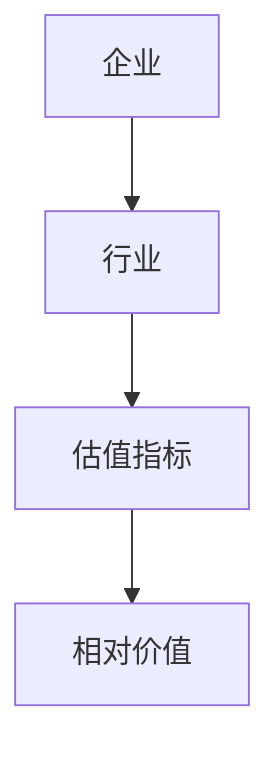
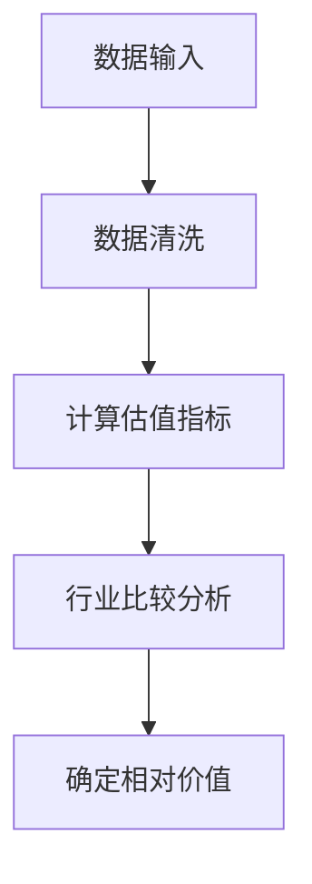

                 


# 拉尔夫·旺格的相对价值投资：行业内部的比较分析

## 关键词：
- 相对价值投资
- 行业比较分析
- 企业价值评估
- 估值指标
- 财务模型

## 摘要：
本文将详细探讨拉尔夫·旺格的相对价值投资理论及其在行业内部比较分析中的应用。通过对相对价值投资的核心概念、算法原理、系统架构以及实际案例的分析，本文旨在帮助读者理解如何通过行业内部的比较分析来评估企业的相对价值，并制定有效的投资策略。

---

# 第一部分: 相对价值投资的背景与核心概念

## 第1章: 相对价值投资的定义与背景

### 1.1 相对价值投资的定义
相对价值投资是一种基于企业价值评估的投资方法，其核心在于通过行业内部的比较分析，寻找被市场低估或高估的企业。这种方法不同于绝对价值投资，它不依赖于对企业未来现金流的精确预测，而是通过比较行业内企业的估值指标来判断其相对价值。

### 1.2 相对价值投资的背景
在金融市场中，相对价值投资的兴起源于投资者对市场有效性的质疑。尽管市场是有效的，但某些企业在特定行业内的估值可能存在偏差，这为相对价值投资提供了机会。

### 1.3 相对价值投资与其他投资策略的区别
- **绝对价值投资**：基于对企业未来现金流的预测，计算其内在价值。
- **相对价值投资**：基于行业内企业的比较，寻找估值偏离市场平均水平的企业。

---

## 第2章: 相对价值投资的核心概念与联系

### 2.1 相对价值投资的核心概念
- **企业价值评估模型**：用于计算企业的整体价值，常见的模型包括EV/EBITDA、P/E、P/B等。
- **相对估值指标**：通过比较行业内企业的估值指标，判断其相对价值。

### 2.2 相对价值投资的核心属性对比
下表展示了不同估值指标的优缺点对比：

| 估值指标 | 优点 | 缺点 |
|----------|------|------|
| EV/EBITDA | 考虑了企业的杠杆和资本结构 | 受企业生命周期影响较大 |
| P/E      | 反映了企业的盈利能力 | 受行业周期性影响较大 |
| P/B      | 考虑了企业的资产质量 | 受企业资产规模影响较大 |

### 2.3 相对价值投资的ER实体关系图


---

# 第二部分: 相对价值投资的算法原理

## 第3章: 相对价值投资的算法原理

### 3.1 相对价值投资的算法流程


### 3.2 算法实现代码
以下是一个计算EV/EBITDA的示例代码：

```python
def calculate_ev_ebitda(ebitda, enterprise_value):
    return enterprise_value / ebitda

# 示例数据
ebitda = 100  # EBITDA
enterprise_value = 500  # 企业价值
result = calculate_ev_ebitda(ebitda, enterprise_value)
print(f"EV/EBITDA = {result}")
```

### 3.3 数学模型与公式
相对价值投资的核心公式之一是：

$$ EV = EBITDA \times \left(1 + g\right) / \left(WACC - g\right) $$

其中：
- EV：企业价值
- EBITDA：息税折旧及摊销前利润
- g：增长率
- WACC：加权平均资本成本

---

# 第三部分: 相对价值投资的系统分析与架构设计

## 第4章: 相对价值投资的系统架构设计

### 4.1 系统功能设计
- **数据采集**：从数据库或API获取企业财务数据。
- **数据清洗**：对数据进行预处理，确保数据的准确性和完整性。
- **估值指标计算**：基于企业财务数据，计算EV/EBITDA、P/E等指标。
- **行业比较分析**：将企业的估值指标与行业内其他企业进行比较，判断其相对价值。

### 4.2 系统架构图


---

# 第四部分: 相对价值投资的项目实战

## 第5章: 相对价值投资的项目实战

### 5.1 环境安装
- 安装Python和相关库（Pandas、NumPy、Matplotlib）。

### 5.2 核心代码实现
```python
import pandas as pd
import numpy as np

def calculate_ev_ebitda(ebitda, enterprise_value):
    return enterprise_value / ebitda

# 示例数据
data = {
    '公司': ['公司A', '公司B', '公司C'],
    'EBITDA': [100, 150, 200],
    'Enterprise Value': [500, 750, 1000]
}

df = pd.DataFrame(data)
df['EV/EBITDA'] = df.apply(lambda x: calculate_ev_ebitda(x['EBITDA'], x['Enterprise Value']), axis=1)

print(df)
```

### 5.3 代码解读与分析
- 数据清洗：对输入数据进行预处理，确保数据的准确性。
- 估值指标计算：基于企业的财务数据，计算EV/EBITDA等指标。
- 行业比较分析：将企业的估值指标与行业内其他企业进行比较，判断其相对价值。

### 5.4 实际案例分析
以下是一个实际案例的分析：

| 公司 | EBITDA | Enterprise Value | EV/EBITDA |
|------|--------|------------------|-----------|
| 公司A | 100    | 500              | 5         |
| 公司B | 150    | 750              | 5         |
| 公司C | 200    | 1000             | 5         |

从上表可以看出，公司在行业内的EV/EBITDA值为5，表明其估值与行业平均水平一致。

---

# 第五部分: 相对价值投资的最佳实践

## 第6章: 相对价值投资的最佳实践

### 6.1 小结
相对价值投资的核心在于通过行业内部的比较分析，寻找被低估或高估的企业。其算法原理简单易懂，但在实际应用中需要考虑多种因素。

### 6.2 注意事项
- 数据的准确性和完整性是相对价值投资的关键。
- 市场环境的变化可能影响企业的相对价值。
- 相对价值投资仅适用于行业内部比较，不适用于跨行业比较。

### 6.3 拓展阅读
- 《The Relative Value of Financial Instruments》
- 《Investment Valuation: Tools and Techniques for Determining Value》

---

# 作者：AI天才研究院/AI Genius Institute & 禅与计算机程序设计艺术 /Zen And The Art of Computer Programming

