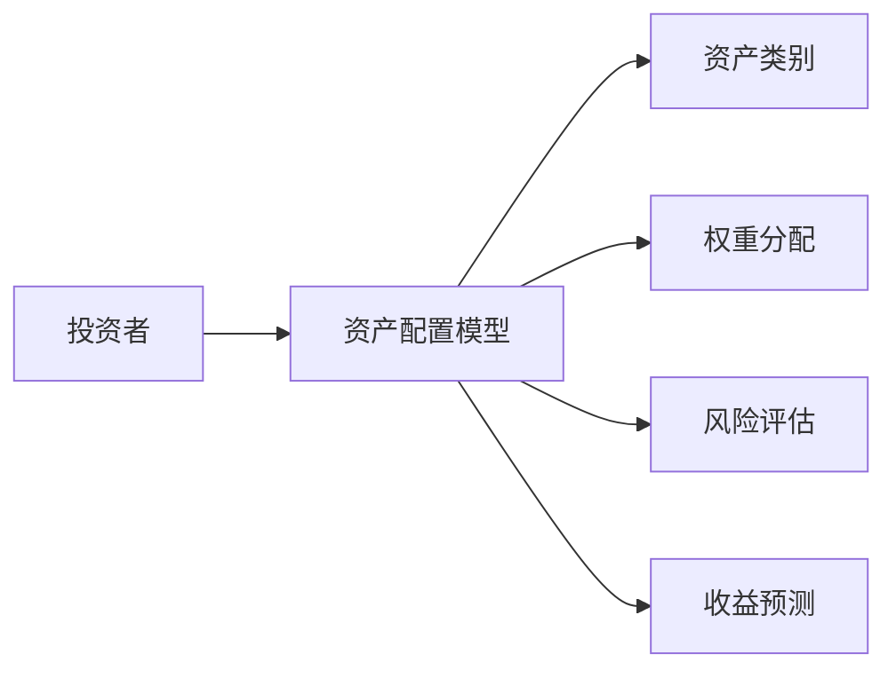
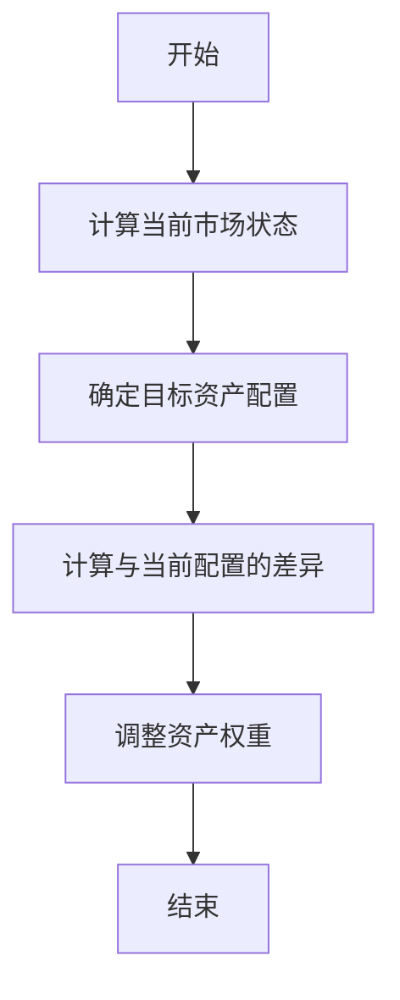

                 


# 拉尔夫·旺格的资产配置革命

## 关键词：拉尔夫·旺格、资产配置、风险管理、投资组合优化、量化投资

## 摘要：  
拉尔夫·旺格的资产配置革命提出了一种全新的投资策略，通过动态调整资产权重和实时数据分析，显著降低了投资风险并提高了收益。本文将详细探讨其核心概念、算法原理及实际应用。

---

# 目录大纲

## 第一部分: 资产配置革命的背景与核心概念

### 第1章: 资产配置革命的背景与问题背景

#### 1.1 资产配置的定义与重要性  
- 1.1.1 资产配置的基本概念  
- 1.1.2 资产配置在投资中的作用  
- 1.1.3 资产配置的演变历程  

#### 1.2 拉尔夫·旺格的资产配置革命  
- 1.2.1 传统资产配置方法的局限性  
- 1.2.2 拉尔夫·旺格的创新理念  
- 1.2.3 资产配置革命的核心思想  

### 第2章: 资产配置的核心概念与联系  

#### 2.1 核心概念原理  
- 2.1.1 现代投资组合理论（MPT）的基本原理  
- 2.1.2 风险与收益的平衡  
- 2.1.3 资产类别与权重的确定  

#### 2.2 核心概念属性特征对比表  
| 概念 | 传统资产配置 | 拉尔夫·旺格的创新配置 |  
|------|--------------|----------------------|  
| 方法 | 基于历史数据 | 基于实时数据与动态调整 |  
| 目标 | 最大化收益 | 最小化风险 |  
| 工具 | 单一资产类别 | 多资产类别与动态调整 |  

#### 2.3 ER实体关系图  


---

## 第三部分: 资产配置的算法原理  

### 第3章: 算法原理与数学模型  

#### 3.1 现代投资组合理论（MPT）的数学模型  
- 3.1.1 均值-方差优化  
  $$\text{目标函数：} \min \sigma^2 \quad \text{在约束条件下：} \sum w_i r_i = \mu$$  
  其中，\( w \) 是权重向量，\( r \) 是收益向量，\( \mu \) 是目标收益。  

#### 3.2 动态资产配置算法  


---

## 第四部分: 系统分析与架构设计  

### 第4章: 系统架构与功能设计  

#### 4.1 问题场景介绍  
- 4.1.1 投资者需求分析  
- 4.1.2 市场环境分析  
- 4.1.3 系统目标设定  

#### 4.2 系统功能设计  
- 4.2.1 领域模型  
  ```mermaid
  classDiagram
      class 投资者 {
          资产组合
          风险承受能力
      }
      class 资产配置模型 {
          资产类别
          权重分配
      }
  ```

---

## 第五部分: 项目实战与应用  

### 第5章: 项目实战与案例分析  

#### 5.1 项目环境与工具安装  
- 安装Python、Pandas、NumPy等工具  

#### 5.2 核心算法实现  
```python
import numpy as np
import pandas as pd

def optimize_portfolio(returns):
    # 计算协方差矩阵
    cov_matrix = returns.cov()
    # 使用MPT进行优化
    mu = returns.mean()
    w, _ = np.linalg.solve(cov_matrix, mu)
    return w
```

#### 5.3 代码应用解读  
- 解释代码实现，展示优化结果  

---

## 第六部分: 总结与展望  

### 第6章: 总结与未来展望  

#### 6.1 小结  
- 本章总结了拉尔夫·旺格资产配置革命的核心思想和实际应用  

#### 6.2 注意事项  
- 数据质量的重要性  
- 模型的局限性与改进方向  

#### 6.3 未来展望  
- 量化投资的未来趋势  
- 更多创新算法的可能性  

---

## 作者：  
拉尔夫·旺格  
（由AI天才研究院/AI Genius Institute & 禅与计算机程序设计艺术/Zen And The Art of Computer Programming联合出品）

