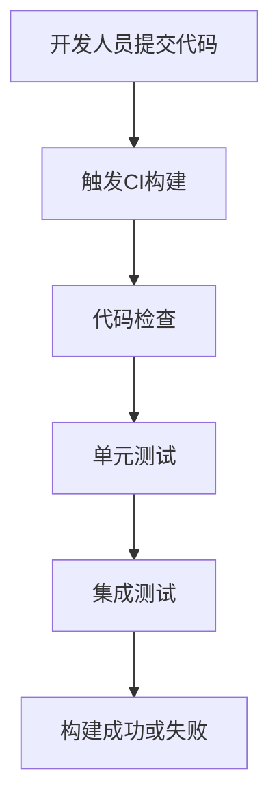
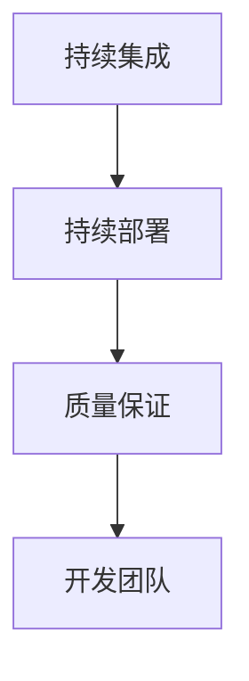
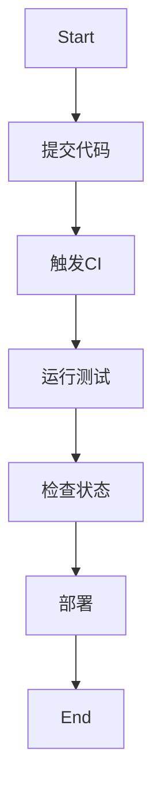
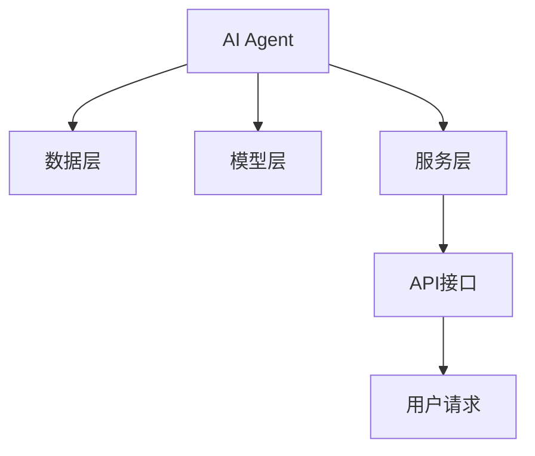
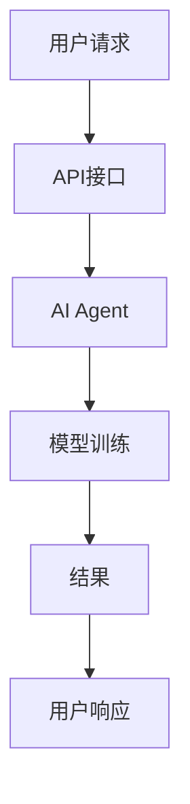

                 


# 持续集成/持续部署：自动化AI Agent的更新流程

> 关键词：持续集成, 持续部署, 自动化更新, AI Agent, CI/CD管道

> 摘要：本文将详细探讨如何利用持续集成和持续部署（CI/CD）技术实现AI Agent的自动化更新流程。通过系统化的背景介绍、核心概念分析、算法原理阐述、系统架构设计以及项目实战，本文将深入剖析CI/CD在AI Agent更新中的关键作用，并提供实际案例和代码实现，帮助读者全面掌握这一技术。

---

## 第一部分: 持续集成/持续部署基础

### 第1章: 持续集成/持续部署概述

#### 1.1 持续集成的核心概念

##### 1.1.1 持续集成的定义与背景
- 持续集成（Continuous Integration，CI）是一种软件开发实践，通过频繁地将代码合并到主分支，并自动化执行测试和构建，以确保代码质量。
- 背景：传统开发模式中，代码集成周期长，容易出现集成问题。CI通过频繁集成，提前发现和解决问题。

##### 1.1.2 持续集成的核心流程
1. 开发人员提交代码。
2. 触发CI构建。
3. 执行代码检查和测试。
4. 反馈结果给开发人员。

##### 1.1.3 持续集成与传统开发模式的区别
- **传统模式**：代码集成周期长，容易出现集成问题。
- **CI模式**：频繁集成，问题发现早，开发效率高。

#### 1.2 持续部署的核心概念

##### 1.2.1 持续部署的定义与特点
- 持续部署（Continuous Deployment，CD）是CI的延伸，将代码自动部署到生产环境。
- 特点：快速交付、自动化、可追溯。

##### 1.2.2 持续部署的实现方式
1. 手动触发：特定条件下手动部署。
2. 自动触发：通过CI/CD工具自动部署。

##### 1.2.3 持续部署与持续集成的关系
- CI关注代码质量，CD关注代码交付。
- CI是CD的基础，CD是CI的延伸。

---

### 第2章: 持续集成/持续部署的核心概念与联系

#### 2.1 持续集成/持续部署的流程图


#### 2.2 核心概念对比表
| 概念 | 持续集成 | 持续部署 |
|------|----------|----------|
| 定义 | 频繁合并代码到主分支并自动化测试 | 将代码自动部署到生产环境 |
| 目标 | 提早发现集成问题 | 快速交付价值 |
| 工具 | Jenkins, GitLab CI | Kubernetes, AWS CodePipeline |

#### 2.3 实体关系图


---

### 第3章: 持续集成/持续部署的算法原理

#### 3.1 CI/CD管道的数学模型
$$ \text{CI/CD管道} = \text{代码提交} \rightarrow \text{测试} \rightarrow \text{部署} $$

#### 3.2 算法流程图


#### 3.3 代码实现
```python
def ci_cd_pipeline():
    while True:
        code_submission()
        run_tests()
        if tests_passed():
            deploy()
        else:
            rollback()
```

---

## 第二部分: AI Agent的更新流程

### 第4章: AI Agent的自动化更新流程

#### 4.1 AI Agent的系统结构
- **AI Agent**：负责处理用户请求、执行任务。
- **数据层**：存储训练数据、用户反馈。
- **模型层**：训练模型、推理模型。
- **服务层**：API接口、任务调度。

#### 4.2 AI Agent的CI/CD管道设计
- **代码提交**：开发人员提交代码到版本控制系统。
- **代码检查**：代码扫描工具检查代码质量。
- **单元测试**：测试单个功能模块。
- **集成测试**：测试系统整体功能。
- **部署**：自动部署到测试环境和生产环境。

#### 4.3 AI Agent的CI/CD管道实现
```python
def ai_agent_pipeline():
    while True:
        code_submission()
        code_quality_check()
        unit_tests()
        integration_tests()
        if tests_passed():
            deploy_to_staging()
            deploy_to_production()
        else:
            notify_developer()
```

---

### 第5章: AI Agent的系统架构设计

#### 5.1 系统功能设计
- **领域模型**：AI Agent的功能模块包括数据处理、模型训练、任务调度。
- **系统架构**：模块化设计，支持扩展和维护。

#### 5.2 系统架构图


#### 5.3 系统接口设计
- **API接口**：提供RESTful API，供外部调用。
- **数据接口**：与数据源对接，获取训练数据。

#### 5.4 系统交互流程图


---

### 第6章: 项目实战

#### 6.1 环境搭建
1. 安装Python和依赖库。
2. 配置版本控制系统（如Git）。
3. 部署CI/CD工具（如Jenkins、GitHub Actions）。

#### 6.2 核心代码实现
```python
def main():
    while True:
        # 提交代码
        code_submission()
        # 触发CI
        trigger_ci()
        # 运行测试
        run_tests()
        if tests_passed():
            # 部署到生产环境
            deploy_to_production()
        else:
            # 通知开发人员
            notify_developer()
```

#### 6.3 案例分析
- **案例1**：AI Agent的单元测试失败，回滚代码。
- **案例2**：AI Agent的集成测试通过，部署到生产环境。

---

### 第7章: 最佳实践与小结

#### 7.1 最佳实践
1. 定期清理旧代码和测试用例。
2. 使用可靠的CI/CD工具。
3. 配置完善的监控和日志系统。

#### 7.2 小结
- 持续集成和持续部署是实现AI Agent自动化更新的关键技术。
- 通过系统化的流程设计和工具支持，可以显著提高开发效率和代码质量。

---

## 第三部分: 总结与扩展

### 第8章: 总结

#### 8.1 核心要点回顾
- CI/CD的定义与作用。
- AI Agent的更新流程。
- 系统架构设计与实现。

#### 8.2 注意事项
- 确保代码质量和测试覆盖率。
- 及时处理CI/CD管道中的问题。

### 第9章: 拓展阅读

#### 9.1 相关技术
- DevOps实践。
- 自动化测试框架。

#### 9.2 未来趋势
- AI与CI/CD的深度融合。
- 自动化运维（AIOps）。

---

## 作者信息

作者：AI天才研究院/AI Genius Institute & 禅与计算机程序设计艺术 /Zen And The Art of Computer Programming

---

希望这篇文章能够为读者提供清晰的思路和实用的技术指导！如果需要进一步的讨论或扩展，请随时联系！

