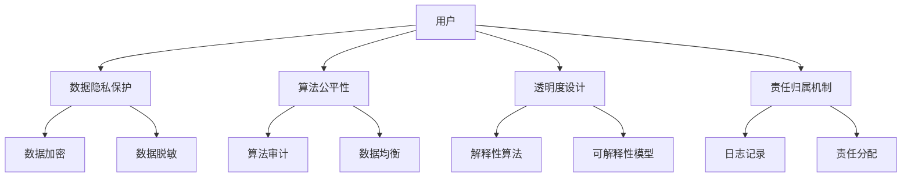

                 


# 探讨人工智能在金融领域的伦理考量

> 关键词：人工智能、金融伦理、数据隐私、算法偏见、金融系统、责任归属

> 摘要：人工智能在金融领域的应用日益广泛，然而其带来的伦理问题也逐渐凸显。本文将从背景介绍、核心概念、算法原理、系统架构设计、项目实战和最佳实践等多个方面，详细探讨人工智能在金融领域的伦理考量。通过分析数据隐私、算法偏见、透明度和责任归属等关键问题，结合实际案例和系统设计，为读者提供全面的见解。

---

## 第一部分: 人工智能在金融领域的伦理背景

### 第1章: 人工智能与金融领域的概述

#### 1.1 人工智能的发展历程

人工智能（Artificial Intelligence, AI）的发展可以追溯到20世纪50年代，但近年来随着计算能力的提升和数据量的爆炸式增长，AI技术取得了突破性进展。AI的核心技术包括机器学习（Machine Learning）、自然语言处理（NLP）、计算机视觉（Computer Vision）等，这些技术在金融领域的应用越来越广泛。

在金融行业，AI技术的应用主要集中在以下几个方面：

1. **信用评估**：通过机器学习算法分析客户的信用历史、消费行为等数据，评估其信用风险。
2. **欺诈检测**：利用异常检测算法识别交易中的欺诈行为。
3. **智能投顾**：通过算法推荐投资组合，帮助客户进行资产配置。
4. **高频交易**：利用算法快速执行交易，以捕捉市场中的微小价格波动。

#### 1.2 金融行业的特点与挑战

金融行业是一个高度依赖数据的行业，其核心业务模式包括信贷、投资、保险、支付等。金融行业具有以下特点：

1. **数据敏感性**：金融行业处理大量个人数据，如收入、资产、交易记录等，这些数据的泄露可能造成严重的经济损失。
2. **高风险性**：金融行业的决策往往涉及大量资金，任何错误的决策都可能带来巨大的风险。
3. **监管严格**：金融行业受到严格的监管，必须遵守相关法律法规，确保市场的公平性和透明度。

#### 1.3 人工智能在金融领域的伦理问题

随着AI技术在金融领域的广泛应用，一些伦理问题也逐渐浮现：

1. **数据隐私**：AI系统需要处理大量个人数据，如何保护这些数据的隐私成为一个重要问题。
2. **算法偏见**：AI算法可能会因为训练数据中的偏见而导致不公平的结果，例如在信用评估中对某些群体的歧视。
3. **透明度**：AI系统的决策过程往往难以解释，这可能导致用户对系统的信任不足。
4. **责任归属**：当AI系统出现问题时，责任归属是一个复杂的问题，涉及到开发者、用户和监管机构等多个方面。

---

## 第二部分: 人工智能在金融中的核心应用与伦理挑战

### 第2章: 人工智能在金融中的核心应用

#### 2.1 信用评估与风险控制

**信用评估**是金融行业中的重要业务，传统的信用评估主要依赖于人工审核和历史数据分析。而AI技术可以通过机器学习算法分析客户的信用历史、消费行为、社交网络等数据，从而更准确地评估客户的信用风险。

**伦理问题**：在信用评估中，AI算法可能会因为训练数据中的偏见而导致不公平的结果。例如，如果训练数据中某个群体的违约率较高，算法可能会对这个群体的客户进行歧视，导致他们在申请贷款时被拒绝。

#### 2.2 智能投顾与财富管理

智能投顾（Robo-Advisor）是一种通过算法推荐投资组合的服务。AI技术可以根据客户的风险承受能力、投资目标等信息，自动推荐适合的投资组合。

**伦理问题**：智能投顾的透明度问题。用户可能无法理解AI系统是如何推荐投资组合的，这可能导致用户对系统的信任不足。

#### 2.3 欺诈检测与交易监控

欺诈检测是金融行业中的一个重要任务，传统的欺诈检测方法主要依赖于规则和经验。而AI技术可以通过异常检测算法，实时监控交易行为，识别潜在的欺诈行为。

**伦理问题**：误判问题。AI算法可能会误判某些正常的交易行为为欺诈，导致用户受到不公正的待遇。

#### 2.4 高频交易

高频交易是指在极短的时间内进行大量交易的行为，其目的是通过捕捉市场中的微小价格波动来获利。AI技术在高频交易中的应用主要体现在算法交易和市场微观结构分析。

**伦理问题**：高频交易可能会导致市场波动，甚至引发市场崩盘。此外，高频交易可能会利用信息不对称的优势，操纵市场价格。

#### 2.5 本章小结

本章介绍了人工智能在金融领域中的核心应用，包括信用评估、智能投顾、欺诈检测和高频交易等。同时，也分析了这些应用中存在的伦理问题，如数据隐私、算法偏见和透明度问题。

---

## 第三部分: 人工智能在金融中的伦理问题分析

### 第3章: 人工智能的伦理问题与属性特征

#### 3.1 伦理问题的核心概念

1. **数据隐私**：数据隐私是指个人数据的私密性和安全性。在金融行业中，数据隐私问题尤为突出，因为金融数据涉及到个人的财务状况和交易行为。
2. **算法偏见**：算法偏见是指AI算法在决策过程中产生的不公平或歧视性结果。这种偏见可能来源于训练数据中的偏见，或者是算法设计中的不合理性。
3. **透明度**：透明度是指AI系统在决策过程中能够被用户理解和解释。透明度问题在金融行业中尤为重要，因为用户需要信任系统才能放心使用。
4. **责任归属**：责任归属是指当AI系统出现问题时，谁应该承担相应的责任。这个问题涉及到开发者、用户和监管机构等多个方面。

#### 3.2 核心概念的原理与特征

1. **数据隐私**：数据隐私的核心在于保护个人数据不被未经授权的第三方访问。在金融行业中，数据隐私的保护涉及到技术、法律和道德等多个方面。
2. **算法偏见**：算法偏见的产生主要是由于训练数据中的偏见。例如，如果训练数据中某个群体的违约率较高，算法可能会对这个群体的客户进行歧视。此外，算法偏见还可能来源于算法设计中的不合理性，例如在分类任务中使用不合适的评估指标。
3. **透明度**：透明度的实现需要通过解释性算法和可解释性模型。解释性算法能够向用户展示AI系统是如何做出决策的，从而增强用户的信任。
4. **责任归属**：责任归属的复杂性在于AI系统的决策过程往往涉及多个参与者。例如，当AI系统出现问题时，开发者需要对算法的设计负责，用户需要对输入的数据负责，而监管机构需要对整个系统的合规性负责。

#### 3.3 核心概念的ER实体关系图

以下是核心概念的ER实体关系图：

```mermaid
erDiagram
    actor 用户 {
        string 用户ID
        string 姓名
        string 身份证号
        string 银行卡号
    }
    actor 开发者 {
        string 开发者ID
        string 姓名
        string 职位
    }
    actor 监管机构 {
        string 监管机构ID
        string 名称
        string 联系方式
    }
    entity 数据 {
        string 数据ID
        string 数据类型
        string 数据内容
        string 数据隐私级别
    }
    entity 算法 {
        string 算法ID
        string 算法名称
        string 算法描述
        string 算法版本
    }
    entity 责任 {
        string 责任ID
        string 责任主体
        string 责任内容
        string 责任范围
    }
    user -- 数据 : 拥有
    user -- 算法 : 使用
    user -- 责任 : 承担
    开发者 -- 数据 : 生成
    开发者 -- 算法 : 设计
    开发者 -- 责任 : 承担
    监管机构 -- 数据 : 监管
    监管机构 -- 算法 : 监管
    监管机构 -- 责任 : 分配
```

---

## 第四部分: 人工智能在金融中的算法原理

### 第4章: 人工智能算法的原理与实现

#### 4.1 机器学习算法

机器学习算法是AI技术的核心，主要分为监督学习、无监督学习和强化学习三类。

1. **监督学习**：监督学习算法通过训练数据中的标签来学习模型，例如线性回归、支持向量机（SVM）等。
2. **无监督学习**：无监督学习算法通过分析数据的结构来发现隐藏的模式，例如聚类分析、主成分分析（PCA）等。
3. **强化学习**：强化学习算法通过与环境的交互来学习策略，例如Q-Learning、Deep Q-Networks（DQN）等。

#### 4.2 算法偏见的产生原因

算法偏见的产生主要来源于以下几个方面：

1. **训练数据中的偏见**：如果训练数据中某个群体的比例较低，算法可能会对这个群体产生偏见。
2. **算法设计中的不合理性**：例如，在分类任务中使用不合适的评估指标，可能导致算法对某些群体的歧视。
3. **数据预处理中的问题**：例如，数据清洗过程中删除了某些群体的数据，导致算法对这些群体产生偏见。

#### 4.3 透明度的实现方法

透明度的实现需要通过解释性算法和可解释性模型。例如：

1. **解释性算法**：通过LIME（Local Interpretable Model-agnostic Explanations）等算法，对AI系统的决策进行解释。
2. **可解释性模型**：使用线性回归模型等简单模型，确保模型的可解释性。

---

## 第五部分: 人工智能在金融中的系统架构设计

### 第5章: 伦理考量下的系统设计

#### 5.1 系统架构设计

在设计金融AI系统时，需要考虑以下几个方面：

1. **数据隐私保护**：通过加密技术、数据脱敏等手段，保护用户的隐私数据。
2. **算法公平性**：通过算法审计、数据均衡等方法，消除算法偏见。
3. **透明度设计**：通过解释性算法和可解释性模型，确保系统的透明度。
4. **责任归属机制**：通过日志记录、责任分配等手段，明确责任归属。

#### 5.2 系统架构图

以下是伦理考量下的系统架构设计：



---

## 第六部分: 人工智能在金融中的项目实战

### 第6章: 项目实战与案例分析

#### 6.1 项目介绍

以智能投顾系统为例，设计一个基于机器学习的智能投顾系统，实现用户画像、风险评估、投资策略生成等功能。

#### 6.2 系统实现

以下是系统实现的核心代码：

```python
import pandas as pd
from sklearn.model_selection import train_test_split
from sklearn.ensemble import RandomForestClassifier
from sklearn.metrics import accuracy_score

# 数据加载
data = pd.read_csv('user_data.csv')

# 数据预处理
X = data.drop(columns=['target', 'user_id'])
y = data['target']
X_train, X_test, y_train, y_test = train_test_split(X, y, test_size=0.2)

# 模型训练
model = RandomForestClassifier()
model.fit(X_train, y_train)

# 模型预测
y_pred = model.predict(X_test)
print("准确率:", accuracy_score(y_test, y_pred))
```

#### 6.3 伦理问题分析

在智能投顾系统中，需要考虑以下伦理问题：

1. **数据隐私**：确保用户的交易数据不被泄露。
2. **算法偏见**：确保投资策略不会对某些群体产生歧视。
3. **透明度**：向用户解释投资策略的生成过程。
4. **责任归属**：当投资亏损时，明确责任归属。

---

## 第七部分: 人工智能在金融中的最佳实践

### 第7章: 最佳实践与未来展望

#### 7.1 最佳实践

1. **数据隐私保护**：采用加密技术、数据脱敏等手段，保护用户隐私。
2. **算法公平性**：通过算法审计、数据均衡等方法，消除算法偏见。
3. **透明度设计**：使用解释性算法和可解释性模型，确保系统的透明度。
4. **责任归属机制**：通过日志记录、责任分配等手段，明确责任归属。

#### 7.2 未来展望

随着AI技术的不断发展，金融领域的伦理问题也将更加复杂。未来的研究方向包括：

1. **数据隐私保护**：研究更先进的加密技术，如同态加密、零知识证明等。
2. **算法公平性**：研究如何消除算法偏见，确保AI系统的公平性。
3. **透明度设计**：研究如何提高AI系统的透明度，增强用户信任。
4. **责任归属机制**：研究如何明确AI系统的责任归属，确保法律合规。

---

## 结语

人工智能在金融领域的应用前景广阔，但也伴随着诸多伦理挑战。通过本文的探讨，我们希望读者能够更好地理解人工智能在金融领域中的伦理问题，并在实际应用中采取相应的措施，确保技术的健康发展。

---

## 作者

作者：AI天才研究院/AI Genius Institute & 禅与计算机程序设计艺术 /Zen And The Art of Computer Programming

