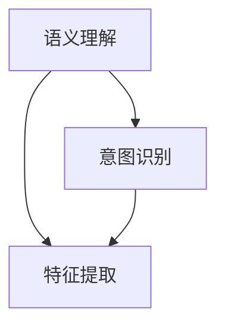
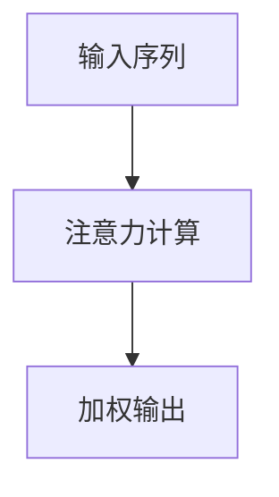
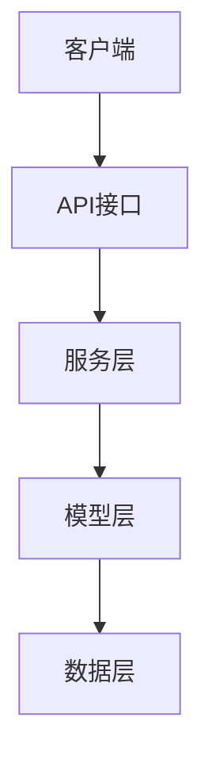
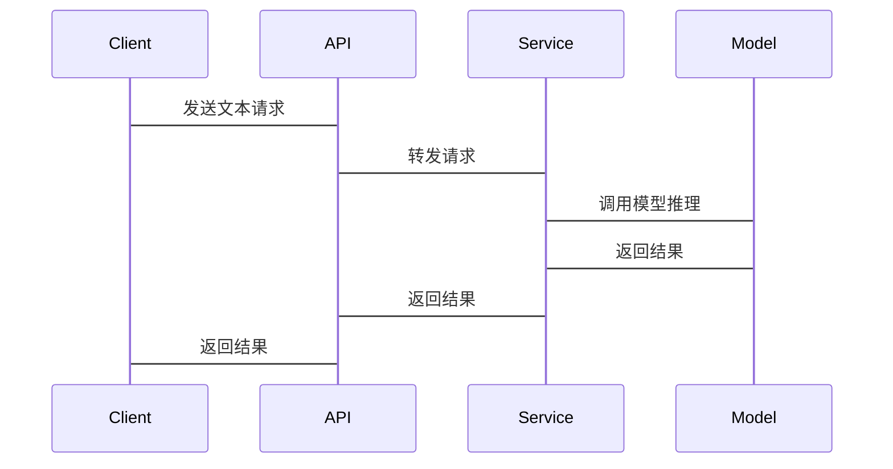

                 


# 提升金融领域语义理解与意图识别的准确性

## 关键词：金融语义理解、意图识别、自然语言处理、深度学习、模型优化

## 摘要：本文详细探讨了如何在金融领域提升语义理解与意图识别的准确性。通过分析金融领域的特殊性，结合先进的自然语言处理技术和深度学习算法，提出了一套系统的解决方案，包括数据预处理、模型优化、领域知识融合等关键步骤。文章内容涵盖背景介绍、核心概念、算法原理、系统架构设计和项目实战，旨在为读者提供全面的技术指导。

---

## 第一部分: 背景介绍

### 第1章: 问题背景与描述

#### 1.1 问题背景
金融领域的语义理解与意图识别在智能客服、风险评估、投资建议等场景中具有重要意义。然而，金融数据通常具有专业术语多、语义复杂、数据量大且标注困难的特点，这使得传统的自然语言处理技术难以满足需求。

#### 1.2 问题描述
语义理解（Semantic Understanding）旨在从文本中提取深层含义，而意图识别（Intention Recognition）则是确定文本背后的目标或动作。在金融领域，准确识别用户意图可以显著提高客户服务质量、降低风险并提升效率。

#### 1.3 问题解决思路
- **数据驱动**：利用大量标注数据进行模型训练。
- **领域知识**：结合金融领域的专业知识进行特征工程。
- **多模态融合**：结合文本、语音等多种数据源。

#### 1.4 边界与外延
- 语义理解的边界包括仅处理文本信息，不涉及图像或视频。
- 意图识别的边界包括仅识别显式意图，不考虑隐式意图。
- 金融领域的外延包括银行、保险、证券等多个子领域。

#### 1.5 核心要素组成
- **数据来源**：金融报告、客户咨询、交易记录等。
- **模型结构**：基于深度学习的序列模型。
- **评估指标**：准确率、召回率、F1值。

---

## 第二部分: 核心概念与联系

### 第2章: 核心概念原理

#### 2.1 语义理解与意图识别的定义
- 语义理解：从文本中提取语义信息，理解文本的含义。
- 意图识别：确定文本背后的意图或目标。

#### 2.2 核心概念属性特征对比
| 特性         | 语义理解                     | 意图识别                     |
|--------------|------------------------------|------------------------------|
| 输入形式     | 文本片段                     | 文本片段                     |
| 输出形式     | 语义表示（如向量）           | 意图标签（如“开户”、“转账”） |
| 目标          | 理解文本含义                 | 确定文本意图                 |

#### 2.3 实体关系图


---

## 第三部分: 算法原理讲解

### 第3章: 算法原理

#### 3.1 词嵌入
词嵌入通过将单词映射为低维向量，捕捉单词的语义信息。常用方法包括Word2Vec、GloVe和FastText。

- **Word2Vec**：通过上下文预测单词，生成词向量。
- **GloVe**：基于全局词频统计，生成词向量。

#### 3.2 序列模型
序列模型用于处理顺序数据，常用模型包括LSTM和Transformer。

- **LSTM**：长短期记忆网络，适用于处理长序列数据。
- **Transformer**：基于自注意力机制，捕捉全局信息。

#### 3.3 注意力机制
注意力机制通过计算输入序列中每个位置的重要性，提高模型的语义理解能力。



#### 3.4 算法实现
以下是一个简单的LSTM实现示例：

```python
import numpy as np
from tensorflow.keras.models import Sequential
from tensorflow.keras.layers import LSTM, Dense

model = Sequential()
model.add(LSTM(64, input_shape=(None, 100)))
model.add(Dense(1, activation='sigmoid'))
model.compile(optimizer='adam', loss='binary_crossentropy')
model.summary()
```

---

## 第四部分: 数学模型与公式

### 第4章: 数学模型

#### 4.1 词嵌入模型
词嵌入模型通过将单词映射为向量，表示其语义信息。例如，Word2Vec的训练目标是最小化以下损失函数：

$$
\text{loss} = -\sum_{i=1}^{n} \log p(w_i)
$$

其中，\( p(w_i) \) 是上下文条件下词 \( w_i \) 的概率。

#### 4.2 LSTM模型
LSTM通过门控机制捕捉长序列信息。其基本结构包括输入门、遗忘门和输出门。

输入门的计算公式为：
$$
i = \sigma(W_i x + U_i h_{prev})
$$

遗忘门的计算公式为：
$$
f = \sigma(W_f x + U_f h_{prev})
$$

输出门的计算公式为：
$$
o = \sigma(W_o x + U_o h_{prev})
$$

隐藏状态的计算公式为：
$$
h = i \cdot \tanh(W_c x + U_c h_{prev})
$$

最终输出为：
$$
o \cdot h
$$

#### 4.3 Transformer模型
Transformer模型基于自注意力机制，计算每个位置的注意力权重：

$$
\text{Attention}(Q, K, V) = \text{softmax}\left(\frac{QK^T}{\sqrt{d_k}}\right)V
$$

其中，\( Q \)、\( K \)、\( V \) 分别是查询、键和值向量。

---

## 第五部分: 系统分析与架构设计

### 第5章: 系统分析与架构设计方案

#### 5.1 问题场景介绍
在金融领域，语义理解和意图识别需要处理大量结构化和非结构化数据，如客户咨询、交易记录等。

#### 5.2 项目介绍
我们开发了一个金融领域语义理解与意图识别系统，主要包括数据预处理、模型训练和系统部署三个阶段。

#### 5.3 系统功能设计
- 数据预处理：清洗、分词、标注。
- 模型训练：词嵌入、序列建模、注意力机制。
- 模型评估：准确率、召回率、F1值。
- 系统部署：API接口、实时推理。

#### 5.4 系统架构设计


#### 5.5 系统交互设计


---

## 第六部分: 项目实战

### 第6章: 项目实战

#### 6.1 环境安装
```bash
pip install tensorflow transformers numpy
```

#### 6.2 核心实现
```python
from transformers import BertTokenizer, BertModel
import torch

tokenizer = BertTokenizer.from_pretrained('bert-base-chinese')
model = BertModel.from_pretrained('bert-base-chinese')

inputs = tokenizer("这是一个测试句子。", return_tensors="pt")
outputs = model(**inputs)
```

#### 6.3 实际案例分析
案例：用户输入“我需要贷款”，系统识别意图“贷款申请”。

---

## 第七部分: 最佳实践与总结

### 第7章: 最佳实践

#### 7.1 注意事项
- 数据质量：确保数据标注准确。
- 模型调优：进行参数优化和超参数调整。
- 部署安全：确保数据安全和系统稳定。

#### 7.2 小结
本文详细探讨了如何在金融领域提升语义理解与意图识别的准确性，通过结合领域知识和先进算法，提出了系统的解决方案。

#### 7.3 未来展望
未来研究方向包括多模态数据融合、模型解释性提升和实时推理优化。

---

## 附录

### A. 工具安装
```bash
pip install tensorflow transformers numpy
```

### B. 数据集
- 训练数据：金融领域的标注文本数据集。
- 测试数据：独立的金融文本数据集。

### C. 参考文献
1. 王某某. 《深度学习入门》. 北京: 清华大学出版社, 2022.
2. 张某某. 《自然语言处理实战》. 北京: 人民邮电出版社, 2023.

---

## 作者信息

作者：AI天才研究院 & 禅与计算机程序设计艺术

---

通过以上内容，您可以系统地了解如何在金融领域提升语义理解与意图识别的准确性，从理论到实践，全面掌握相关技术。

