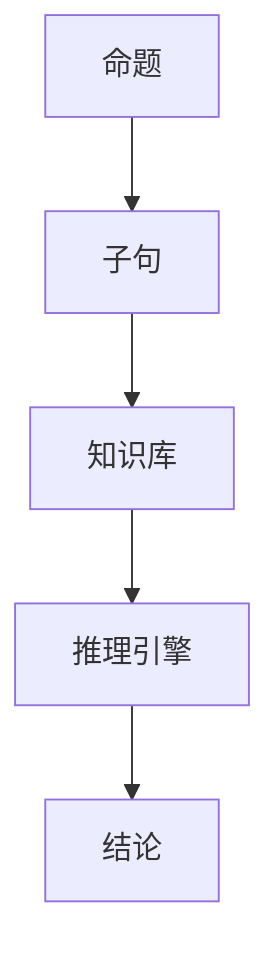
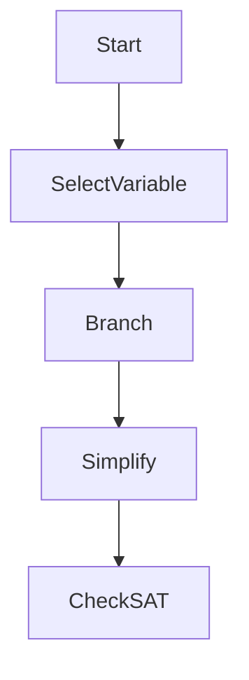
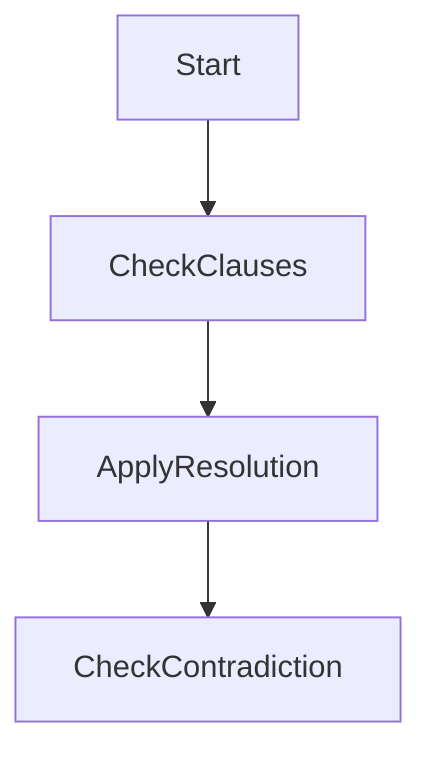
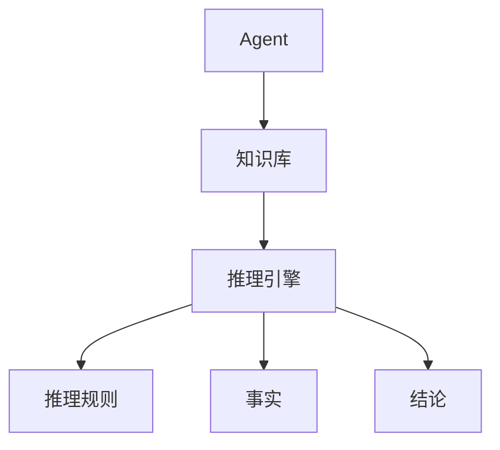

                 


# 提高AI Agent的推理能力：逻辑推理模块设计

## 关键词：
AI Agent, 逻辑推理, 推理模块, 知识表示, 推理算法, 系统架构

## 摘要：
本文旨在探讨如何通过设计逻辑推理模块来提升AI Agent的推理能力。文章首先介绍逻辑推理的基本概念及其在AI Agent中的重要性，然后深入分析核心逻辑推理概念与原理，详细讲解典型逻辑推理算法及其实现，接着讨论逻辑推理模块的系统设计与架构，最后通过实际项目案例展示逻辑推理模块的应用，并总结经验和最佳实践。

## 第1章: 背景介绍

### 1.1 逻辑推理的基本概念
#### 1.1.1 问题背景
AI Agent需要具备推理能力以在复杂环境中做出决策。逻辑推理是推理能力的核心，涉及将问题形式化并应用规则得出结论。

#### 1.1.2 问题描述
逻辑推理在AI Agent中的作用包括知识表示、状态更新、决策制定和问题求解。

#### 1.1.3 问题解决
通过形式化逻辑推理，AI Agent能够处理不确定性、复杂性和动态变化的环境。

#### 1.1.4 边界与外延
逻辑推理模块与其他模块如知识库、传感器和执行器的交互是关键。

#### 1.1.5 概念结构与核心要素组成
逻辑推理模块由知识表示、推理规则、推理算法和推理引擎组成。

### 1.2 AI Agent与逻辑推理的关系
AI Agent通过逻辑推理实现智能行为，逻辑推理是其推理能力的核心。

## 第2章: 核心概念与联系

### 2.1 逻辑推理的原理
#### 2.1.1 命题逻辑
处理原子命题和逻辑连接词，如“与”、“或”、“非”、“蕴含”和“当且仅当”。

#### 2.1.2 谓词逻辑
使用谓词和量词表示更复杂的事实和关系，如“所有人类都是 mortal”。

#### 2.1.3 模态逻辑
扩展逻辑系统，处理可能性、必然性和时态性，如“可能下雨”和“必然停止”。

### 2.2 核心概念对比
#### 2.2.1 不同逻辑系统的特征对比
| 逻辑类型 | 主要特征 | 示例 |
|----------|----------|------|
| 命题逻辑 | 处理原子命题 | P → Q |
| 谓词逻辑 | 使用谓词和量词 | ∀x Human(x) → Mortal(x) |
| 模态逻辑 | 处理可能性 | □P 表示必然P |

#### 2.2.2 逻辑推理与知识表示的关系
知识表示是逻辑推理的前提，逻辑推理是对知识进行处理和应用的过程。

#### 2.2.3 逻辑推理与不确定性推理的对比
逻辑推理处理确定性事实，不确定性推理处理概率和模糊信息。

### 2.3 ER实体关系图


## 第3章: 算法原理讲解

### 3.1 基于命题逻辑的推理算法
#### 3.1.1 DPLL算法
DPLL用于 SAT 问题，包括单元子句处理、纯符号消除和二进制决策等步骤。

#### 3.1.2 算法实现


#### 3.1.3 算法实现代码
```python
def dpll(sat, symbols, model):
    if not symbols:
        return trivially_satisfied(sat, model)
    symbol = symbols[0]
    return dpll(sat, symbols[1:], model + {symbol: True}) or \
           dpll(sat, symbols[1:], model + {symbol: False})
```

### 3.2 基于谓词逻辑的推理算法
#### 3.2.1 基于子句的逻辑推理
将谓词逻辑转化为子句逻辑，使用分辨率规则进行推理。

#### 3.2.2 算法实现


## 第4章: 系统分析与架构设计

### 4.1 问题场景介绍
AI Agent在复杂环境中需要处理多源异构数据，实时响应和高可靠性。

### 4.2 系统功能设计
逻辑推理模块需要实现知识表示、规则推理、状态更新和结论输出功能。

### 4.3 系统架构设计


## 第5章: 项目实战

### 5.1 环境安装
安装必要的Python库，如Python 3.8及以上，安装networkx和pygraphviz。

### 5.2 核心代码实现
实现逻辑推理模块，包括知识表示、规则定义、推理引擎和结果输出。

### 5.3 案例分析
通过具体案例展示逻辑推理模块的应用，分析实现过程和结果。

## 第6章: 总结与拓展

### 6.1 最佳实践 tips
确保知识表示的简洁性，优化推理算法的效率，处理动态变化的知识库。

### 6.2 小结
逻辑推理模块设计的关键点包括选择合适的逻辑系统，优化推理算法，设计高效的架构，并通过项目实战验证设计的正确性和有效性。

### 6.3 注意事项
在实现过程中注意边界条件，处理不确定性和不完整信息，确保系统的可扩展性。

### 6.4 拓展阅读
推荐阅读《逻辑推理与AI》、《DPLL算法深入解析》和《谓词逻辑与知识表示》。

## 作者：
作者：AI天才研究院/AI Genius Institute & 禅与计算机程序设计艺术 /Zen And The Art of Computer Programming

