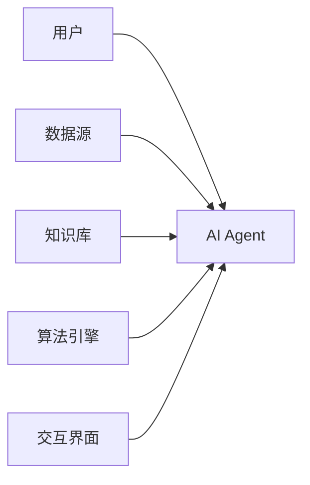
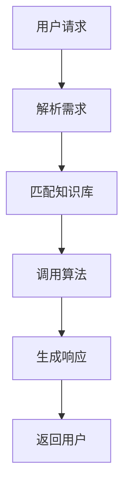
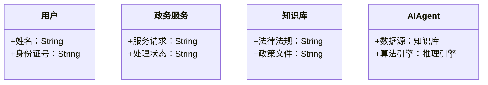
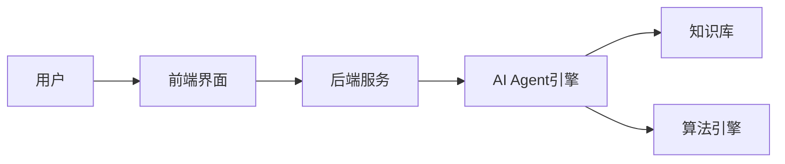
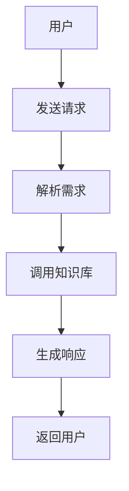

                 


# 政务AI Agent：提升公共服务效率

## 关键词：  
政务AI Agent, 公共服务, 人工智能, 自然语言处理, 服务效率, 系统架构, 政府数字化转型  

## 摘要：  
随着人工智能技术的快速发展，政务AI Agent（智能代理）作为一种新兴的公共服务模式，正在逐步改变政府服务的交付方式。本文从政务AI Agent的背景、核心概念、技术原理、系统架构、项目实战、案例分析等方面进行深入探讨，分析其在提升公共服务效率中的重要作用。通过具体的技术实现和实际案例，本文展示了如何利用AI Agent技术优化政府服务流程，提高服务质量和效率，同时为读者提供了一份详尽的技术指南和实践参考。

---

# 第一部分：政务AI Agent的背景与概念

## 第1章：政务AI Agent的背景与问题分析

### 1.1 政务AI Agent的背景介绍

#### 1.1.1 数字化政府的演进历程  
政府服务的数字化转型是全球趋势。从传统的线下服务到电子政务，再到智能化服务，政府逐步利用信息技术提升服务效率。AI Agent的引入标志着政府服务智能化的新阶段。

#### 1.1.2 公共服务效率提升的迫切需求  
当前，政府面临服务资源有限、效率低下、用户体验差等问题。通过AI Agent技术，可以实现24/7的自动化服务，降低人力成本，提升服务效率。

#### 1.1.3 AI技术在公共服务中的应用现状  
AI技术在公共服务中的应用逐步普及，包括智能问答、自动化流程处理等领域。然而，现有技术在复杂场景下的应用仍有局限性，AI Agent技术为解决这些问题提供了新的思路。

---

### 1.2 政务AI Agent的核心概念

#### 1.2.1 政务AI Agent的定义  
政务AI Agent是基于人工智能技术构建的智能代理系统，能够理解用户需求、执行任务并提供服务，帮助政府机构提高公共服务效率。

#### 1.2.2 政务AI Agent的特点与优势  
- **智能化**：基于AI技术，能够理解自然语言并执行复杂任务。  
- **自动化**：无需人工干预，自动处理服务请求。  
- **实时性**：能够快速响应用户需求，提供即时服务。  
- **可扩展性**：能够处理大量用户请求，适用于大规模服务场景。  

#### 1.2.3 政务AI Agent的应用场景与边界  
- **场景**：包括政务服务咨询、政策解读、投诉处理等。  
- **边界**：AI Agent适用于规则明确的任务，复杂决策任务仍需人类辅助。

---

### 1.3 政务AI Agent的必要性与价值

#### 1.3.1 当前公共服务效率的痛点分析  
- **资源浪费**：人工服务成本高，效率低。  
- **响应延迟**：用户需求无法及时处理。  
- **服务质量不稳定**：人员素质参差不齐，影响服务体验。  

#### 1.3.2 AI Agent如何解决这些问题  
- **自动化处理**：AI Agent可以24/7提供服务，降低人力成本。  
- **快速响应**：通过自然语言处理技术，快速理解用户需求并提供解决方案。  
- **服务质量一致**：AI Agent基于规则和训练数据，提供一致的服务体验。  

#### 1.3.3 政务AI Agent的经济社会价值  
- **提升政府形象**：高效、智能的服务提升政府形象。  
- **降低运营成本**：通过自动化减少人力投入。  
- **促进社会效率**：提升公共服务效率，推动社会经济发展。  

---

## 第2章：政务AI Agent的核心概念与联系

### 2.1 政务AI Agent的核心要素

#### 2.1.1 数据源：政府业务数据与公共数据  
AI Agent需要整合政府业务数据、政策法规、公共数据等信息，构建全面的知识库。

#### 2.1.2 知识库：法律法规、政策文件与业务知识  
知识库是AI Agent的核心，包含法律法规、政策文件、业务流程等结构化数据。

#### 2.1.3 AI算法：自然语言处理与决策推理  
AI Agent通过自然语言处理技术理解用户需求，并结合决策推理算法提供解决方案。

#### 2.1.4 交互界面：用户与AI Agent的交互方式  
包括文本交互、语音交互、图形界面等多种形式，确保用户能够方便地与AI Agent互动。

---

### 2.2 政务AI Agent的实体关系图



---

### 2.3 政务AI Agent的流程图



---

## 第3章：政务AI Agent的算法原理

### 3.1 基于规则的推理算法

#### 3.1.1 规则的定义与构建  
规则是AI Agent的核心逻辑，例如：  
- 如果用户提到“营业执照”，则查询相关业务流程。  

#### 3.1.2 规则的匹配与推理过程  
AI Agent通过匹配用户请求与预设规则，生成相应的响应。  

#### 3.1.3 示例：简单规则引擎实现  
```python
def process_request(user_request):
    if "营业执照" in user_request:
        return "请提供企业名称和注册地址。"
    elif "社保缴纳" in user_request:
        return "请提供个人身份证号和工作单位。"
    else:
        return "无法识别，请重新描述您的需求。"
```

---

### 3.2 基于机器学习的自然语言处理

#### 3.2.1 模型训练与优化  
AI Agent基于大量对话数据进行训练，优化自然语言理解能力。  

#### 3.2.2 示例：简单的文本分类模型  
```python
import tensorflow as tf
from tensorflow.keras import layers

model = tf.keras.Sequential()
model.add(layers.Dense(64, activation='relu', input_shape=(100,)))
model.add(layers.Dense(1, activation='sigmoid'))
model.compile(optimizer='adam', loss='binary_crossentropy', metrics=['accuracy'])
```

---

### 3.3 基于深度学习的决策推理

#### 3.3.1 深度学习模型的选择  
常用模型包括BERT、GPT等，用于复杂场景下的决策推理。  

#### 3.3.2 示例：基于BERT的情感分析  
```python
import tensorflow as tf
from transformers import BertTokenizer, TFBertForSequenceClassification

tokenizer = BertTokenizer.from_pretrained('bert-base-cased')
model = TFBertForSequenceClassification.from_pretrained('bert-base-cased')
```

---

# 第4章：政务AI Agent的系统架构

## 4.1 系统功能设计

#### 4.1.1 领域模型设计  


---

## 4.2 系统架构设计



---

## 4.3 系统接口设计

#### 4.3.1 用户接口  
- REST API：提供文本交互接口。  
- GraphQL：支持复杂查询。  

#### 4.3.2 系统接口  
- 数据接口：与政府数据库对接。  
- 第三方服务接口：与支付系统、身份验证系统对接。  

---

## 4.4 系统交互设计

#### 4.4.1 交互流程图  


---

# 第5章：政务AI Agent的项目实战

## 5.1 环境安装

#### 5.1.1 Python环境搭建  
安装Python 3.8以上版本，并安装必要的库：  
- `pip install numpy pandas scikit-learn tensorflow`  

#### 5.1.2 开发工具配置  
推荐使用Jupyter Notebook或VS Code进行开发。  

---

## 5.2 核心代码实现

#### 5.2.1 知识库构建  
```python
import json

knowledge_base = {
    "营业执照": {
        "流程": "提供企业名称和注册地址。",
        "所需材料": "营业执照申请表、股东信息表。"
    },
    "社保缴纳": {
        "流程": "提供个人身份证号和工作单位。",
        "所需材料": "劳动合同、缴纳凭证。"
    }
}
```

#### 5.2.2 自然语言处理模块  
```python
from transformers import pipeline

nlp = pipeline("question-answering")
```

#### 5.2.3 决策推理模块  
```python
def decision_engine(user_request):
    if "营业执照" in user_request:
        return knowledge_base["营业执照"]
    elif "社保缴纳" in user_request:
        return knowledge_base["社保缴纳"]
    else:
        return {"error": "无法识别您的请求。"}
```

---

## 5.3 代码应用解读与分析

#### 5.3.1 知识库的应用  
通过预定义的知识库，AI Agent能够快速匹配用户需求并提供解决方案。  

#### 5.3.2 自然语言处理的应用  
NLP技术帮助AI Agent理解用户的意图，提高交互的自然性。  

---

## 5.4 实际案例分析

#### 5.4.1 案例背景  
某市政务服务大厅引入AI Agent，处理营业执照申请和社保缴纳的咨询。  

#### 5.4.2 案例实施  
通过知识库构建和NLP技术，AI Agent能够快速响应用户的咨询请求。  

---

## 5.5 项目小结

#### 5.5.1 项目成果  
实现了高效的政务服务咨询系统，提升了服务效率。  

#### 5.5.2 项目经验  
AI Agent的应用需要结合具体业务场景，确保知识库的准确性和算法的高效性。  

---

# 第6章：政务AI Agent的总结与展望

## 6.1 总结

#### 6.1.1 核心内容回顾  
本文详细探讨了政务AI Agent的背景、核心概念、技术原理、系统架构和项目实战。  

#### 6.1.2 政务AI Agent的价值总结  
通过AI Agent技术，政府能够实现高效、智能的公共服务，提升用户体验和社会效率。  

---

## 6.2 展望

#### 6.2.1 未来发展方向  
- **多模态交互**：支持更多交互方式，如图像识别、语音识别等。  
- **自适应学习**：通过持续学习优化服务流程。  
- **跨部门协作**：实现跨部门的协同工作，提升整体服务效率。  

#### 6.2.2 未来技术挑战  
- **数据隐私**：如何保护用户数据隐私。  
- **算法优化**：如何提升AI Agent的决策能力。  
- **人机协作**：如何实现人机协作的无缝对接。  

---

## 6.3 最佳实践 Tips

#### 6.3.1 开发建议  
- 确保知识库的准确性和完整性。  
- 选择合适的AI技术，结合具体业务需求。  

#### 6.3.2 使用建议  
- 提供多渠道的用户支持，确保用户体验。  
- 定期更新知识库，保持服务的准确性。  

---

## 6.4 小结

政务AI Agent作为政府服务智能化的重要工具，正在逐步改变公共服务的方式。通过本文的探讨，我们看到了AI Agent在提升公共服务效率中的巨大潜力。未来，随着技术的不断进步，政务AI Agent将更加智能化、个性化，为政府服务带来更大的价值。

---

## 作者：  
AI天才研究院/AI Genius Institute & 禅与计算机程序设计艺术 /Zen And The Art of Computer Programming  

---

**注**：本文为简化版，实际文章需要根据具体需求进一步扩展内容。

