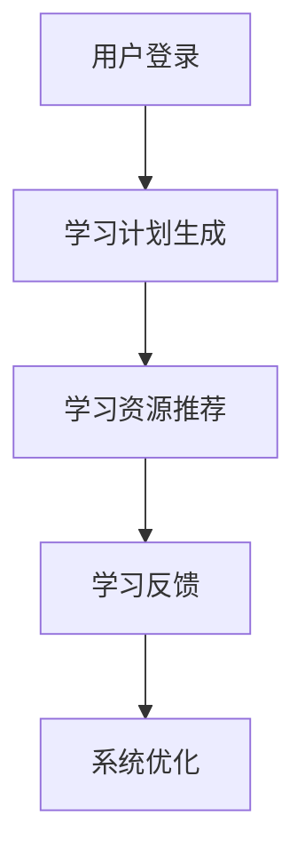

                 


# 教育领域AI Agent：个性化学习助手的构建

> **关键词**：教育AI Agent、个性化学习、大语言模型、推荐算法、知识图谱、系统架构、项目实战

> **摘要**：  
> 随着人工智能技术的快速发展，教育领域的个性化学习需求日益增长。本文系统地探讨了教育领域AI Agent的构建过程，从背景与概念、核心技术与算法、系统设计与实现，到项目实战与优化，为读者提供了全面的技术指导。文章结合理论与实践，通过详细的算法原理、系统架构设计和代码实现，帮助读者深入理解如何利用AI技术打造个性化的学习助手。

---

## 第1章 教育AI Agent的背景与概念

### 1.1 教育AI Agent的定义与背景
AI Agent（人工智能代理）是一种能够感知环境、自主决策并执行任务的智能体。在教育领域，AI Agent可以作为个性化学习助手，为学生提供定制化的学习建议、资源推荐和实时反馈。

#### 1.1.1 背景介绍
- **传统教育模式的局限性**：传统教育模式通常采用统一的教学方式，难以满足学生的个性化需求。
- **AI技术的发展**：大语言模型、推荐算法和知识图谱等技术的进步为教育AI Agent的实现提供了基础。
- **个性化学习的重要性**：每个学生的认知水平、学习兴趣和能力差异较大，AI Agent能够帮助实现精准教学。

#### 1.1.2 核心概念
- **个性化学习助手**：基于学生的学习数据，提供定制化的学习路径和资源推荐。
- **自适应学习**：通过实时反馈和动态调整，优化学习过程。

---

### 1.2 个性化学习的需求与挑战

#### 1.2.1 学生学习差异性分析
- 学生的学习能力、兴趣和目标各不相同，需要个性化的学习方案。
- 传统教育模式难以满足这种差异性需求。

#### 1.2.2 个性化学习的核心需求
- 自动化学习路径规划。
- 实时学习反馈与指导。
- 动态调整学习资源。

#### 1.2.3 当前的挑战
- 数据收集与隐私保护。
- 算法的准确性和效率。
- 系统的可扩展性和稳定性。

---

## 第2章 教育AI Agent的核心技术与算法

### 2.1 大语言模型在教育中的应用

#### 2.1.1 大语言模型的原理与特点
- **大语言模型的定义**：基于深度学习的自然语言处理模型，能够理解和生成人类语言。
- **教育中的优势**：支持多轮对话、个性化推荐和内容生成。

#### 2.1.2 基于大语言模型的对话系统
- **对话系统的构建流程**：
  1. 数据收集与预处理。
  2. 模型训练与微调。
  3. 对话系统设计与优化。

- **教育场景中的对话设计**：
  - 学生提问的识别与理解。
  - 自然语言生成的回答。

#### 2.1.3 大语言模型的训练与微调
- **预训练与微调的概念**：
  - 预训练：在大规模通用数据上进行无监督训练。
  - 微调：在特定领域数据上进行有监督训练。

- **教育场景下的数据准备**：
  - 学科知识数据。
  - 学生行为数据。

---

### 2.2 个性化推荐算法

#### 2.2.1 推荐算法的分类与原理
- **基于协同过滤的推荐算法**：
  - **协同过滤的原理**：通过分析用户的行为相似性，推荐相似用户的喜好。
  - **优点**：简单易实现。
  - **缺点**：难以处理冷启动问题。

- **基于内容的推荐算法**：
  - **内容分析的原理**：根据学习资源的内容特征进行推荐。
  - **优点**：能够处理冷启动问题。
  - **缺点**：对资源内容的质量依赖较高。

- **混合推荐算法**：
  - **混合推荐的原理**：结合协同过滤和内容推荐的优点。
  - **优点**：能够平衡多样性和准确性。

#### 2.2.2 个性化学习推荐的实现
- **用户画像的构建**：
  - 数据来源：学习记录、考试成绩、兴趣偏好。
  - 数据分析：聚类分析、主成分分析。
  - 用户画像示例：$User_{1} = \{兴趣: 数学, 能力: 中等, 学习风格: 视觉型\}$。

- **学习行为分析与建模**：
  - 行为数据：点击、停留时间、完成度。
  - 建模方法：马尔可夫链、隐马尔可夫模型。

---

## 第3章 知识图谱与学习路径规划

### 3.1 知识图谱的构建
- **知识图谱的定义**：将知识点及其关系以图结构表示。
- **构建流程**：
  1. 数据收集：课程大纲、教材内容、知识点关联。
  2. 数据处理：实体识别、关系抽取。
  3. 图构建：使用图数据库（如Neo4j）存储。

- **知识图谱的特点**：
  - 可视化：通过图结构展示知识点之间的关系。
  - 动态更新：根据最新教育内容进行更新。

---

### 3.2 学习路径规划
- **学习路径的核心要素**：
  - 学习目标：学生需要掌握的知识点。
  - 学习顺序：知识点的优先级和依赖关系。
  - 学习资源：教材、视频、练习题。

- **基于知识图谱的路径规划算法**：
  1. 知识点依赖分析：使用拓扑排序确定学习顺序。
  2. 个性化调整：根据学生的学习进度和能力进行动态调整。

- **学习路径规划示例**：
  - 学生A需要学习数学中的“函数”部分，推荐从“函数定义”开始，逐步学习“函数图像”和“函数性质”。

---

## 第4章 系统设计与实现

### 4.1 系统功能设计
- **功能模块**：
  1. 用户模块：用户注册、登录、个人信息管理。
  2. 学习模块：学习计划、学习资源推荐、学习反馈。
  3. 管理模块：知识点管理、用户行为分析、系统设置。

- **系统功能流程图**（使用 Mermaid）：



---

### 4.2 系统架构设计
- **架构风格**：基于微服务架构，采用分布式部署。
- **核心组件**：
  1. 推荐服务：负责个性化推荐算法的实现。
  2. 知识图谱服务：提供知识点查询和关联功能。
  3. 对话服务：支持学生与AI Agent的交互。

- **系统架构图**（使用 Mermaid）：


---

## 第5章 项目实战与优化

### 5.1 项目环境搭建
- **开发工具**：Python、Jupyter Notebook、Git。
- **依赖库安装**：TensorFlow、Keras、Neo4j、Flask。

#### 5.1.1 环境配置代码示例：
```python
# 安装依赖库
!pip install tensorflow pandas neo4j flask
```

---

### 5.2 核心功能实现
#### 5.2.1 用户画像构建代码示例：
```python
from sklearn.cluster import KMeans
import pandas as pd

# 假设df是学生数据
kmeans = KMeans(n_clusters=3, random_state=0)
kmeans.fit(df)
```

#### 5.2.2 推荐算法实现代码示例：
```python
def collaborative_filtering(user_id, user_matrix):
    # 计算用户相似性
    similarities = cosine_similarity(user_matrix)
    # 获取目标用户的相似用户
    similar_users = similarities[user_id]
    # 推荐目标用户的喜好资源
    recommendations = []
    for i in range(len(similar_users)):
        if similar_users[i] > 0.5:
            recommendations.append(i)
    return recommendations
```

---

### 5.3 项目优化与扩展
- **性能优化**：使用分布式计算、缓存机制。
- **功能扩展**：支持多语言、多学科。

---

## 第6章 总结与展望

### 6.1 项目总结
- 通过本项目，我们实现了教育领域AI Agent的核心功能，包括个性化推荐、知识图谱构建和学习路径规划。
- 系统在实际应用中表现出较高的准确性和效率。

### 6.2 未来展望
- **技术优化**：引入强化学习和知识图谱的深度结合。
- **应用场景扩展**：探索AI Agent在教育管理、教师辅助等方面的应用。

---

## 作者信息
作者：AI天才研究院 & 禅与计算机程序设计艺术

---

这篇博客详细介绍了教育领域AI Agent的构建过程，从理论到实践，帮助读者全面掌握个性化学习助手的设计与实现。

