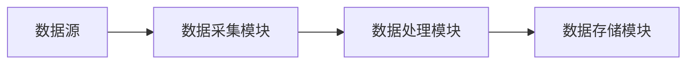
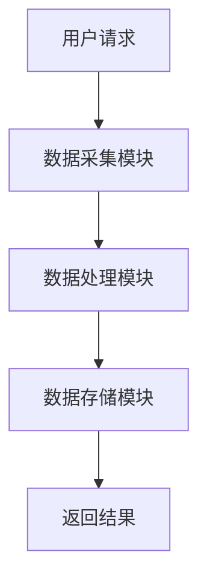

                 


# 数据收集与预处理：为AI Agent准备高质量训练集

> 关键词：数据收集，数据预处理，AI Agent，训练集，数据质量管理

> 摘要：本文详细探讨了为AI Agent准备高质量训练集的关键步骤，包括数据收集、清洗、标准化、增强、标注、评估与管理。通过结合理论与实践，文章帮助读者掌握数据处理的核心技术，确保数据质量，从而提升AI Agent的性能。

---

# 第一部分: 数据收集与预处理概述

## 第1章: 数据收集与预处理的背景与重要性

### 1.1 数据在AI Agent中的核心地位
- 数据是AI Agent学习的基础，直接影响其性能和决策能力。
- 高质量训练集的定义与特征：全面性、准确性、多样性、代表性。
- 数据收集与预处理的挑战：数据噪声、缺失、冗余，以及隐私和安全问题。

### 1.2 AI Agent与数据的关系
- AI Agent的基本概念：智能体通过数据感知环境并做出决策。
- 数据如何影响AI Agent的性能：数据质量决定模型准确性，数据多样性提升泛化能力。
- 数据质量对AI Agent决策的影响：噪声数据可能导致错误判断，低质量数据影响决策信心。

### 1.3 数据收集与预处理的流程概述
- 数据收集的基本流程：定义需求、选择来源、采集数据。
- 数据预处理的目标与步骤：清洗、转换、增强、标注。
- 数据质量管理的重要性：确保数据准确、一致、完整。

### 1.4 本章小结
- 数据是AI Agent的核心资源，高质量数据是训练成功的关键。
- 数据收集与预处理是复杂且需要细致处理的过程，涉及多方面的技术和挑战。

---

# 第二部分: 数据收集方法

## 第2章: 数据收集的多样性与实现方法

### 2.1 数据来源的多样性
- 结构化数据来源：数据库、CSV文件。
- 非结构化数据来源：文本文件、图像、视频。
- 半结构化数据来源：JSON、XML文件。

### 2.2 数据收集的常用方法
- 网页数据爬取：使用工具如Scrapy、BeautifulSoup。
- API接口数据获取：通过调用REST API获取实时数据。
- 数据库数据采集：使用ORM工具如SQLAlchemy进行查询。

### 2.3 数据收集工具与技术
- 网页抓取工具：Scrapy框架、BeautifulSoup库。
- 数据库查询工具：SQLAlchemy、pymysql。
- API调用工具：Python的requests库、Python的http.client模块。

### 2.4 数据收集的注意事项
- 数据收集的合法性与合规性：遵守相关法律法规，如GDPR。
- 数据隐私与安全保护：加密传输、匿名化处理。
- 数据收集的效率优化：分布式爬取、批量处理。

### 2.5 本章小结
- 数据来源多样，收集方法各有优劣，需根据需求选择合适工具。
- 数据收集过程中需注意法律和隐私问题，确保高效安全。

---

# 第三部分: 数据预处理技术

## 第3章: 数据清洗与标准化

### 3.1 数据清洗的必要性
- 噪声数据的识别与处理：检测并删除异常值。
- 重复数据的检测与删除：使用算法或工具去重。
- 数据格式的统一化处理：统一日期格式、编码格式。

### 3.2 数据标准化与归一化
- 数据标准化的定义与方法：Z-score标准化、Min-Max归一化。
- 数据归一化的应用场景：特征缩放、模型训练。
- 标准化与归一化的数学公式：
  - 标准化：$Z = \frac{X - \mu}{\sigma}$
  - 归一化：$X' = \frac{X - \min(X)}{\max(X) - \min(X)}$

### 3.3 数据清洗的实现步骤
- 数据清洗的流程图：
  ```mermaid
  graph TD
    A[数据源] --> B[数据加载]
    B --> C[识别噪声数据]
    C --> D[删除异常值]
    D --> E[处理缺失值]
    E --> F[数据清洗完成]
  ```

### 3.4 数据清洗的代码实现
- 使用Python进行数据清洗：
  ```python
  import pandas as pd

  # 加载数据
  df = pd.read_csv('data.csv')

  # 删除重复值
  df.drop_duplicates(inplace=True)

  # 处理缺失值
  df.dropna(inplace=True)
  ```

### 3.5 本章小结
- 数据清洗是数据预处理的关键步骤，确保数据的准确性和一致性。
- 标准化和归一化是常见的数据处理方法，适用于不同场景。

---

## 第4章: 数据增强与标注

### 4.1 数据增强的必要性
- 数据增强的定义与方法：旋转、翻转、裁剪、调整亮度等。
- 数据增强的应用场景：小样本数据扩充、提升模型鲁棒性。

### 4.2 数据标注的流程
- 数据标注的定义：为数据添加标签或注释。
- 数据标注的工具：LabelImg、CVAT、Amazon Mechanical Turk。

### 4.3 数据增强的代码实现
- 使用图像处理库进行数据增强：
  ```python
  from tensorflow.keras.preprocessing.image import ImageDataGenerator

  datagen = ImageDataGenerator(rotation_range=20, horizontal_flip=True)
  ```

### 4.4 数据标注的流程图：
  ```mermaid
  graph TD
    A[数据源] --> B[数据加载]
    B --> C[数据标注]
    C --> D[保存标注数据]
  ```

### 4.5 本章小结
- 数据增强和标注是提升数据多样性的重要手段，适用于图像和文本数据。

---

# 第四部分: 数据质量评估与管理

## 第5章: 数据质量评估

### 5.1 数据质量评估指标
- 准确性：数据是否真实反映现实情况。
- 完整性：数据是否包含所有必要信息。
- 一致性：数据格式和内容是否统一。
- 及时性：数据是否更新及时。

### 5.2 数据质量评估的方法
- 自动化工具：Pandas的validate_each_value函数。
- 手动检查：抽样检查、专家评审。

### 5.3 数据质量管理的流程
- 数据质量管理流程图：
  ```mermaid
  graph TD
    A[数据源] --> B[数据清洗]
    B --> C[数据检查]
    C --> D[数据修正]
    D --> E[数据质量报告]
  ```

### 5.4 本章小结
- 数据质量评估是数据预处理的重要环节，确保数据适合训练。

---

# 第五部分: 项目实战

## 第6章: 数据处理系统架构设计

### 6.1 项目介绍
- 项目目标：设计一个数据处理系统，为AI Agent提供高质量训练集。
- 项目需求：数据采集、清洗、增强、标注、存储。

### 6.2 系统功能设计
- 数据采集模块：从多个来源获取数据。
- 数据处理模块：清洗、增强、标注。
- 数据存储模块：存储处理后的数据。

### 6.3 系统架构设计


### 6.4 系统接口设计
- 数据采集接口：REST API。
- 数据处理接口：队列处理。

### 6.5 系统交互流程图


### 6.6 本章小结
- 系统架构设计是项目成功的关键，模块化设计便于维护和扩展。

---

## 第7章: 数据处理系统的实现

### 7.1 环境安装
- 安装Python、Pandas、NumPy、Scikit-learn、TensorFlow等库。

### 7.2 核心代码实现
- 数据采集模块：
  ```python
  import requests

  def fetch_data(url):
      response = requests.get(url)
      return response.json()
  ```

- 数据处理模块：
  ```python
  import pandas as pd

  def preprocess_data(data):
      df = pd.DataFrame(data)
      df.dropna(inplace=True)
      return df
  ```

### 7.3 代码应用解读
- 数据采集：从API获取数据并存储。
- 数据清洗：处理缺失值和异常值。
- 数据增强：使用库进行数据增强。

### 7.4 实际案例分析
- 案例背景：图像分类任务，数据不足。
- 数据处理流程：收集图像数据，清洗，增强，标注。
- 案例结果：数据量增加，模型准确率提升。

### 7.5 本章小结
- 项目实战帮助读者理解理论知识，掌握实际操作技能。

---

## 第8章: 最佳实践与小结

### 8.1 最佳实践
- 数据收集：遵守法律法规，保护隐私。
- 数据预处理：选择合适的工具和技术，确保数据质量。
- 系统设计：模块化设计，便于维护和扩展。
- 项目管理：制定计划，监控进度，及时调整。

### 8.2 注意事项
- 数据安全：防止数据泄露和滥用。
- 性能优化：提高处理效率，减少资源消耗。
- 持续改进：根据反馈不断优化数据处理流程。

### 8.3 拓展阅读
- 推荐书籍：《机器学习实战》、《数据挖掘导论》。
- 推荐博客：技术博客、GitHub仓库。

### 8.4 本章小结
- 通过最佳实践和小结，帮助读者巩固知识，提升技能。

---

# 作者：AI天才研究院 & 禅与计算机程序设计艺术

---

本文通过详细讲解数据收集与预处理的关键步骤，结合理论与实践，帮助读者掌握为AI Agent准备高质量训练集的核心技术。通过系统的知识和实用的代码示例，读者可以提升数据处理能力，确保数据质量，从而提升AI模型的性能和决策能力。

