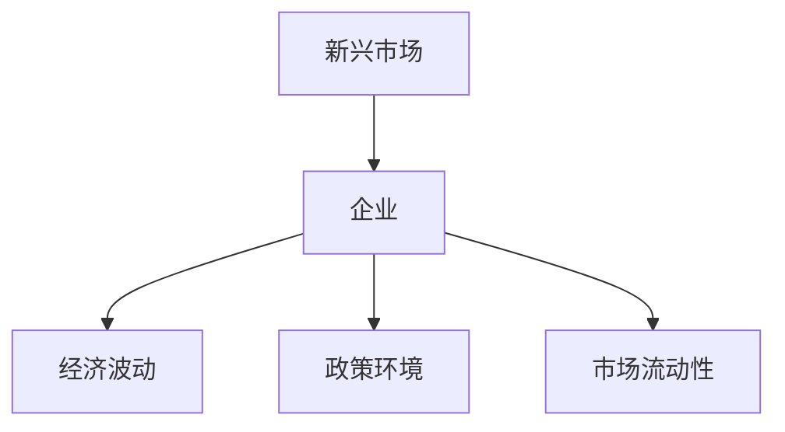
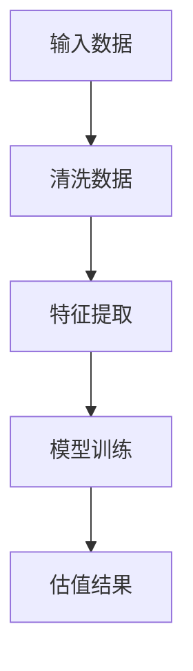
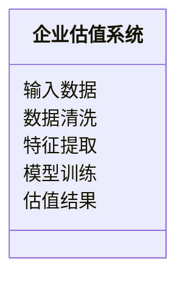
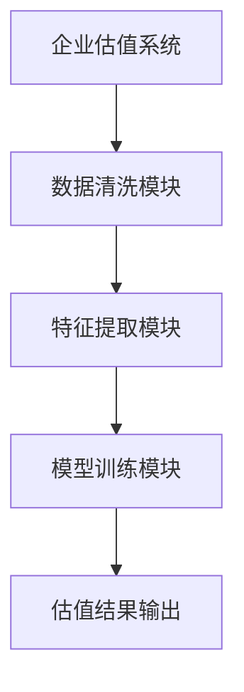
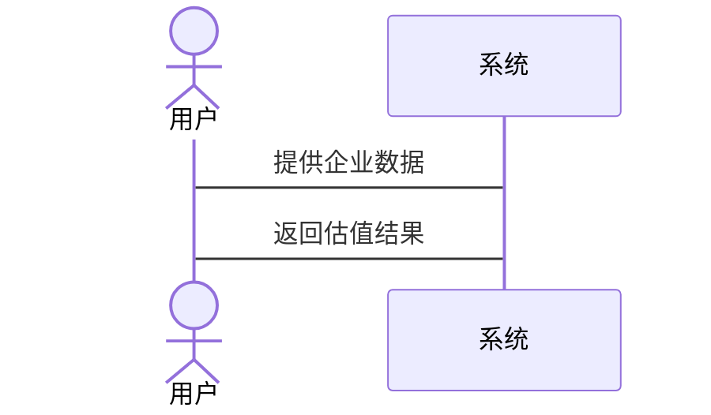

                 


# 新兴市场企业估值的特殊考虑

> 关键词：新兴市场，企业估值，特殊考虑，经济波动，政策环境，市场流动性

> 摘要：新兴市场由于其独特的经济环境、政策变化和市场特性，企业在估值过程中面临许多特殊考虑因素。本文从新兴市场的定义与特点入手，结合企业估值的基本概念，深入分析新兴市场在经济波动、政策环境和市场流动性等方面的特殊性，并通过具体的案例分析，探讨如何在新兴市场中进行有效的企业估值。

---

# 第一部分：新兴市场企业估值的背景与挑战

## 第1章：新兴市场的定义与特点

### 1.1 新兴市场的定义
- 新兴市场的定义
- 新兴市场的核心特点
- 新兴市场与成熟市场的区别

### 1.2 企业估值的基本概念
- 企业估值的定义
- 企业估值的核心要素
- 企业估值的方法与流程

### 1.3 新兴市场企业估值的特殊性
- 新兴市场的经济波动性
- 新兴市场的政策环境
- 新兴市场的信息不对称问题

## 第2章：新兴市场企业估值的核心概念与联系

### 2.1 核心概念原理
- 经济波动对估值的影响
- 政策环境对估值的影响
- 市场流动性对估值的影响

### 2.2 核心概念属性对比表格
- 经济波动 vs 政策环境
- 市场流动性 vs 企业盈利

### 2.3 ER实体关系图架构


---

# 第二部分：新兴市场企业估值的算法原理

## 第3章：新兴市场企业估值的算法原理

### 3.1 算法原理概述
- 基于DCF模型的调整方法
- 基于机器学习的估值模型

### 3.2 算法流程图


### 3.3 算法数学模型
- DCF模型的数学表达式
$$DCF = \sum_{t=1}^{n} \frac{CF_t}{(1 + r)^t}$$

### 3.4 机器学习模型的实现
- 简单的线性回归模型
  ```python
  import numpy as np
  from sklearn.linear_model import LinearRegression

  X = np.array([x1, x2, x3]).reshape(-1, 1)
  y = np.array([y1, y2, y3])
  model = LinearRegression()
  model.fit(X, y)
  ```

### 3.5 算法实现的注意事项
- 数据预处理的重要性
- 模型的可解释性问题

---

# 第三部分：新兴市场企业估值的系统分析与架构设计

## 第4章：系统分析与架构设计方案

### 4.1 问题场景介绍
- 新兴市场企业估值的复杂性
- 系统需求分析

### 4.2 系统功能设计


### 4.3 系统架构设计


### 4.4 系统接口设计
- 输入接口：数据输入格式
- 输出接口：估值结果格式

### 4.5 系统交互流程


---

# 第四部分：新兴市场企业估值的项目实战

## 第5章：项目实战

### 5.1 环境安装
- 数据分析工具（如Python、Pandas、NumPy）
- 可视化工具（如Matplotlib、Seaborn）

### 5.2 核心代码实现
```python
import pandas as pd
import numpy as np
from sklearn.linear_model import LinearRegression

# 示例数据
data = {
    '收入': [100, 200, 300, 400],
    '利润': [20, 30, 40, 50]
}
df = pd.DataFrame(data)

# 特征提取
X = df[['收入']].values
y = df['利润'].values

# 模型训练
model = LinearRegression()
model.fit(X, y)

# 预测估值
new_income = 500
predicted_profit = model.predict([[new_income]])[0]
print(f"收入为{new_income}时，预测利润为{predicted_profit}")
```

### 5.3 代码实现的详细解读
- 数据的清洗与预处理
- 特征的选择与工程
- 模型的训练与优化

### 5.4 实际案例分析
- 某新兴市场企业的估值案例
- 案例分析的详细步骤
- 分析结果的解读

---

# 第五部分：新兴市场企业估值的最佳实践

## 第6章：最佳实践

### 6.1 小结与总结
- 本章内容的总结
- 新兴市场企业估值的关键点

### 6.2 注意事项
- 数据的准确性和完整性
- 模型的适用性和可解释性
- 政策和经济环境的动态变化

### 6.3 未来趋势
- 新兴市场企业估值的未来发展方向
- 新技术（如AI、大数据）的应用前景

---

# 作者

作者：AI天才研究院/AI Genius Institute & 禅与计算机程序设计艺术/Zen And The Art of Computer Programming

