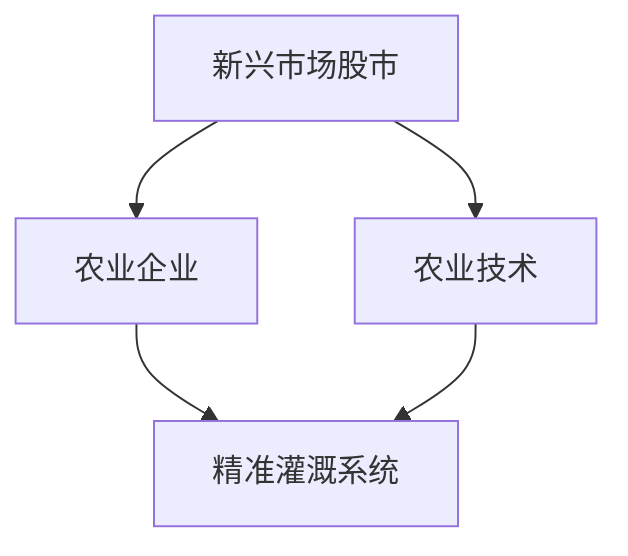
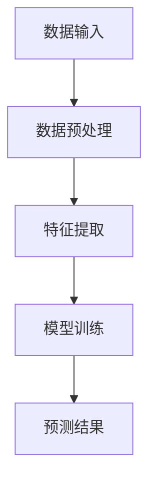
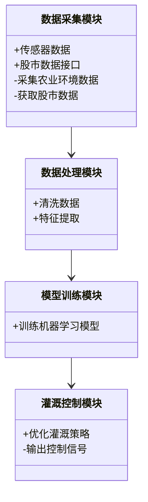
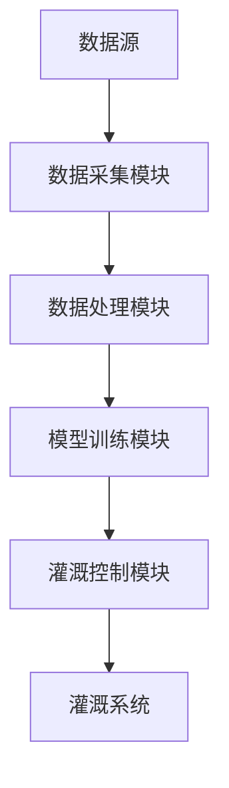

                 


# 新兴市场股市估值与智慧农业精准灌溉系统的互动

> 关键词：新兴市场，股市估值，智慧农业，精准灌溉，机器学习，系统架构

> 摘要：本文探讨新兴市场股市估值与智慧农业精准灌溉系统的互动关系，分析两者如何通过数据驱动和技术创新相互影响，构建数学模型和系统架构，并通过项目实战验证理论。

---

## 第一部分：背景与核心概念

### 第1章：新兴市场股市估值概述

#### 1.1 新兴市场的定义与特点
- **1.1.1 新兴市场的经济特征**：经济快速增长，产业结构转型，金融市场发展不完善。
- **1.1.2 新兴市场股市的独特性**：波动性高，投资者结构多元化，市场流动性不足。
- **1.1.3 新兴市场与发达市场的对比**：新兴市场公司治理和监管机制存在差异。

#### 1.2 股市估值的基本概念
- **1.2.1 股市估值的定义**：评估企业内在价值，确定股票合理价格。
- **1.2.2 股市估值的主要指标**：市盈率、市净率、股息率。
- **1.2.3 股市估值的计算方法**：DCF模型、相对估值法。

#### 1.3 智慧农业与精准灌溉系统
- **1.3.1 智慧农业的定义与发展**：利用物联网、大数据优化农业生产。
- **1.3.2 精准灌溉系统的原理与应用**：传感器和AI优化水资源利用。
- **1.3.3 智慧农业与传统农业的对比**：精准性、数据驱动是核心差异。

### 第2章：新兴市场股市估值与智慧农业的互动关系

#### 2.1 股市估值对智慧农业的影响
- **2.1.1 股市资金流动与农业投资的关系**：股市资金影响农业技术创新。
- **2.1.2 股市波动对农业技术的影响**：股市波动影响农业企业的投资决策。
- **2.1.3 股市估值对农业企业的融资作用**：高估值吸引资金，促进技术发展。

#### 2.2 智慧农业对股市估值的反向影响
- **2.2.1 农业技术进步对股市的影响**：技术提升企业利润，增加股市估值。
- **2.2.2 农业数据对股市预测的潜在价值**：农业数据可作为股市预测的补充指标。
- **2.2.3 农业企业绩效与股市表现的关联**：企业绩效直接影响股市表现。

#### 2.3 互动关系的实体关系图


---

## 第二部分：算法原理与数学模型

### 第3章：股市估值预测的算法模型

#### 3.1 机器学习在股市预测中的应用
- **3.1.1 线性回归模型**：用于趋势分析，但忽视非线性关系。
- **3.1.2 支持向量机（SVM）**：处理小样本数据，适合高维特征。
- **3.1.3 随机森林算法**：适用于特征重要性分析和高维数据。

#### 3.2 算法流程图


#### 3.3 数学模型与公式
- **线性回归模型**：$$ y = \beta_0 + \beta_1x + \epsilon $$
- **随机森林**

---

## 第三部分：系统架构与实现

### 第4章：系统架构设计

#### 4.1 问题场景介绍
- 新兴市场股市波动对农业企业的影响，精准灌溉系统需要实时数据驱动。

#### 4.2 项目介绍
- 开发结合股市数据和农业数据的系统，优化灌溉策略。

#### 4.3 系统功能设计


#### 4.4 系统架构设计


---

## 第四部分：项目实战与案例分析

### 第5章：项目实战

#### 5.1 环境配置
- Python 3.8+
- 数据库：MySQL或MongoDB
- 工具：Jupyter Notebook，scikit-learn，TensorFlow

#### 5.2 系统核心实现源代码
```python
import pandas as pd
from sklearn.ensemble import RandomForestRegressor
from sklearn.metrics import mean_squared_error

# 数据加载
data = pd.read_csv('agriculture_stock.csv')

# 特征选择
features = ['PE', 'PB', 'DIV']
target = 'stock_price'

# 训练集与测试集划分
train = data[:80]
test = data[80:]

# 模型训练
model = RandomForestRegressor(n_estimators=100)
model.fit(train[features], train[target])

# 预测与评估
predictions = model.predict(test[features])
mse = mean_squared_error(test[target], predictions)
print(f'MSE: {mse}')
```

---

## 第五部分：最佳实践与总结

### 第6章：最佳实践

#### 6.1 小结
- 机器学习在新兴市场股市估值和精准灌溉系统中的应用潜力巨大。
- 结合两者数据可以优化农业生产，提升企业价值。

#### 6.2 注意事项
- 数据质量和实时性至关重要。
- 模型需要定期更新以适应市场变化。

#### 6.3 拓展阅读
- 推荐阅读《机器学习实战》和《智慧农业的发展与应用》。

---

## 结语

新兴市场股市估值与智慧农业精准灌溉系统的互动关系为技术创新提供了新思路。通过数据驱动和算法优化，农业和金融领域可以实现协同发展，推动社会进步。

作者：AI天才研究院 & 禅与计算机程序设计艺术

