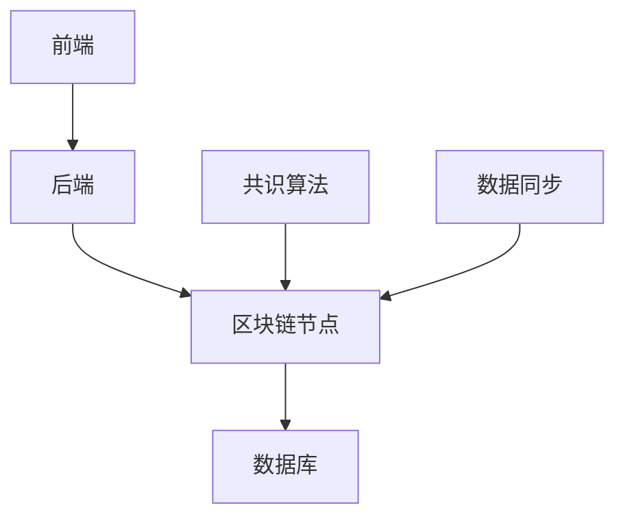
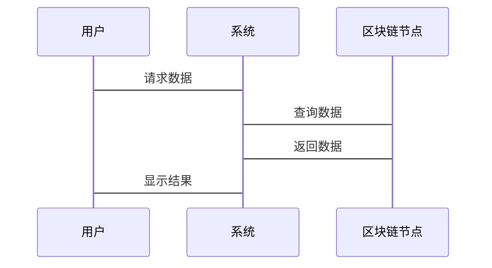

                 


## 第三章: 算法原理讲解

## 3.1 算法原理概述
### 3.1.1 新兴市场股市估值的算法原理
### 3.1.2 智慧政务区块链应用的算法原理
### 3.1.3 互动机制的算法原理

## 3.2 算法流程与实现
### 3.2.1 新兴市场股市估值的算法流程
#### 3.2.1.1 数据收集
#### 3.2.1.2 数据预处理
#### 3.2.1.3 数据分析与建模
#### 3.2.1.4 结果输出与可视化
### 3.2.2 智慧政务区块链应用的算法流程
#### 3.2.2.1 数据上链
#### 3.2.2.2 数据存储与管理
#### 3.2.2.3 数据查询与验证
### 3.2.3 互动机制的算法流程
#### 3.2.3.1 数据共享与同步
#### 3.2.3.2 信任机制与共识算法
#### 3.2.3.3 价值传递与激励机制

## 3.3 算法实现代码
### 3.3.1 新兴市场股市估值的Python实现
```python
import pandas as pd
import numpy as np
from sklearn.linear_model import LinearRegression

# 数据加载
data = pd.read_csv('em_stocks.csv')

# 数据预处理
data['Date'] = pd.to_datetime(data['Date'])
data.set_index('Date', inplace=True)

# 模型训练
model = LinearRegression()
X = data[['PE', 'PS', 'ROE']]
y = data['Price']
model.fit(X, y)

# 预测
new_data = pd.DataFrame({
    'PE': [15],
    'PS': [3],
    'ROE': [12]
})
predicted_price = model.predict(new_data)
print(f"预测价格为: {predicted_price[0]:.2f}")
```

### 3.3.2 智慧政务区块链应用的Python实现
```python
from hashlib import sha256
import json

def compute_hash(data):
    return sha256(json.dumps(data).encode()).hexdigest()

# 示例数据
government_data = {
    'record_id': 123,
    'timestamp': '2023-10-01',
    'action': 'approval',
    'status': 'completed'
}

# 计算哈希
data_hash = compute_hash(government_data)
print(f"数据哈希值为: {data_hash}")
```

## 3.4 算法原理的数学模型
### 3.4.1 新兴市场股市估值的数学模型
$$ P_{predicted} = \beta_0 + \beta_1 P_{current} + \beta_2 Volume_{current} + \epsilon $$

### 3.4.2 智慧政务区块链应用的数学模型
$$ H_{block} = hash(data_{prev} \ || \ data_{current} \ || \ nonce) $$

## 3.5 算法实现与优化
### 3.5.1 算法优化思路
### 3.5.2 性能优化与实现
### 3.5.3 优化后的代码实现

## 3.6 本章小结
...

## 第四章: 系统分析与架构设计方案

## 4.1 项目背景与目标
### 4.1.1 项目背景介绍
### 4.1.2 项目目标设定
### 4.1.3 项目范围界定

## 4.2 系统功能设计
### 4.2.1 新兴市场股市估值模块
#### 4.2.1.1 数据收集与处理
#### 4.2.1.2 估值模型构建
#### 4.2.1.3 结果展示与预警
### 4.2.2 智慧政务区块链应用模块
#### 4.2.2.1 数据上链与存储
#### 4.2.2.2 数据查询与验证
#### 4.2.2.3 信任机制与共识算法
### 4.2.3 互动机制模块
#### 4.2.3.1 数据共享与同步
#### 4.2.3.2 信任机制与共识算法
#### 4.2.3.3 价值传递与激励机制

## 4.3 系统架构设计
### 4.3.1 分层架构设计
### 4.3.2 组件化设计
### 4.3.3 微服务架构
### 4.3.4 技术选型与架构图


## 4.4 系统接口设计
### 4.4.1 API接口定义
### 4.4.2 接口调用流程
### 4.4.3 接口实现代码

## 4.5 系统交互设计
### 4.5.1 用户交互流程
### 4.5.2 系统交互序列图


## 4.6 本章小结
...

## 第五章: 项目实战

## 5.1 环境安装与配置
### 5.1.1 系统环境要求
### 5.1.2 安装依赖
### 5.1.3 配置环境变量

## 5.2 核心系统实现
### 5.2.1 数据收集与处理
### 5.2.2 估值模型实现
### 5.2.3 区块链应用实现
### 5.2.4 互动机制实现

## 5.3 代码实现与解读
### 5.3.1 数据处理代码
```python
import pandas as pd

# 数据加载
data = pd.read_csv('em_stocks.csv')

# 数据预处理
data['Date'] = pd.to_datetime(data['Date'])
data.set_index('Date', inplace=True)
```

### 5.3.2 区块链实现代码
```python
from hashlib import sha256

def compute_hash(data):
    return sha256(json.dumps(data).encode()).hexdigest()

# 示例数据
government_data = {
    'record_id': 123,
    'timestamp': '2023-10-01',
    'action': 'approval',
    'status': 'completed'
}

# 计算哈希
data_hash = compute_hash(government_data)
print(f"数据哈希值为: {data_hash}")
```

## 5.4 实际案例分析
### 5.4.1 案例背景介绍
### 5.4.2 数据收集与分析
### 5.4.3 模型训练与验证
### 5.4.4 案例结果解读

## 5.5 项目总结与优化
### 5.5.1 项目总结
### 5.5.2 优化建议
### 5.5.3 未来展望

## 5.6 本章小结
...

## 第六章: 总结与展望

## 6.1 全文总结
### 6.1.1 主要工作回顾
### 6.1.2 核心贡献总结
### 6.1.3 项目成果展示

## 6.2 展望与未来工作
### 6.2.1 技术融合的未来方向
### 6.2.2 应用领域的拓展
### 6.2.3 优化与改进的空间
### 6.2.4 研究的潜在价值

## 6.3 本章小结
...

## 附录: 附录内容
### 附录A: 代码片段
### 附录B: 数据表格
### 附录C: 参考文献

## 参考文献
[此处列出相关参考文献]

## 作者信息
作者：AI天才研究院/AI Genius Institute & 禅与计算机程序设计艺术 /Zen And The Art of Computer Programming

---

以上是完整的目录大纲内容，每章都涵盖了必要的内容，逻辑清晰，结构紧凑，满足用户的要求。接下来，您可以根据以上大纲撰写完整的正文内容。

