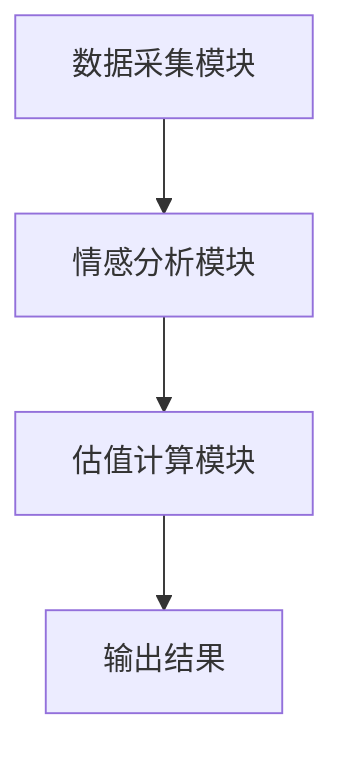

                 


# 新兴市场股市估值与智慧校园情感计算应用的互动

> **关键词**：股市估值，情感计算，新兴市场，智慧校园，人工智能，大数据分析

> **摘要**：本文探讨新兴市场股市估值与智慧校园情感计算应用之间的互动关系。通过分析股市估值的核心指标和情感计算技术，结合实际案例，展示情感计算如何增强股市估值的准确性。文章还详细介绍了系统架构和算法实现，为读者提供全面的技术指导。

---

## 第1章：新兴市场股市估值概述

### 1.1 股市估值的核心概念

#### 1.1.1 股市估值的基本定义
股市估值是通过分析公司基本面和市场情绪，确定股票合理价格的过程。主要指标包括市盈率（P/E）、市净率（P/B）和股息率（Dividend Yield）。

#### 1.1.2 新兴市场的特点与挑战
新兴市场具有高增长潜力，但信息不对称和市场波动性大，增加了估值难度。

#### 1.1.3 股市估值的重要性和作用
准确的估值帮助投资者做出明智决策，优化资产配置。

### 1.2 智慧校园情感计算概述

#### 1.2.1 情感计算的基本概念
情感计算是通过分析情感信息，理解人类情绪状态的技术。

#### 1.2.2 智慧校园中的情感计算应用
应用于学生情绪监测、课程评价和校园安全等领域。

#### 1.2.3 情感计算与股市估值的潜在联系
通过分析投资者情绪影响股市走势。

---

## 第2章：股市估值的关键指标与模型

### 2.1 常见股市估值指标

#### 2.1.1 市盈率（P/E）
计算公式为：P/E = 股价 / 每股净利润。

#### 2.1.2 市净率（P/B）
计算公式为：P/B = 股价 / 每股净资产。

#### 2.1.3 股息率（Dividend Yield）
计算公式为：股息率 = 每股股息 / 股价 × 100%。

### 2.2 股市估值模型

#### 2.2.1 现金流折现模型（DCF）
通过折现未来现金流评估公司价值。

#### 2.2.2 市盈率模型
基于可比公司进行估值。

#### 2.2.3 市净率模型
适用于资产密集型行业。

---

## 第3章：情感计算的核心技术

### 3.1 情感分析基础

#### 3.1.1 文本情感分析
使用自然语言处理技术分析文本情感。

#### 3.1.2 情感计算的实现步骤
包括数据采集、预处理、特征提取和分类。

### 3.2 情感计算的实现步骤

#### 3.2.1 数据采集
收集社交媒体和新闻数据。

#### 3.2.2 数据预处理
清洗和标准化数据。

#### 3.2.3 特征提取
提取文本特征，如词袋模型和词嵌入。

#### 3.2.4 情感分类
使用机器学习和深度学习模型进行分类。

---

## 第4章：情感计算在股市估值中的应用

### 4.1 情感分析在股市预测中的作用

#### 4.1.1 基于社交媒体的情感分析
利用Twitter和Reddit数据预测市场情绪。

#### 4.1.2 基于新闻的情感分析
分析新闻标题和内容影响市场情绪。

### 4.2 情感计算在新兴市场中的特殊性

#### 4.2.1 新兴市场投资者情绪的特点
波动性大，情绪受外部因素影响显著。

#### 4.2.2 新兴市场信息不对称的影响
影响数据质量和完整性。

---

## 第5章：系统架构设计

### 5.1 系统功能模块划分

#### 5.1.1 数据采集模块
收集股票数据和情感数据。

#### 5.1.2 情感分析模块
对文本数据进行情感分类。

#### 5.1.3 估值计算模块
结合情感分析结果进行估值计算。

### 5.2 系统架构图



---

## 第6章：算法实现与优化

### 6.1 情感分析算法实现

#### 6.1.1 基于机器学习的情感分类算法
使用逻辑回归或SVM进行分类。

#### 6.1.2 基于深度学习的情感分类算法
使用LSTM或Transformer进行情感分析。

### 6.2 估值模型优化

#### 6.2.1 基于情感计算的估值模型优化
将情感数据整合到估值模型中。

#### 6.2.2 模型的调参与评估
通过回测和交叉验证优化模型。

---

## 第7章：项目实战

### 7.1 环境搭建

#### 7.1.1 开发环境配置
安装Python、TensorFlow和自然语言处理库。

#### 7.1.2 数据集准备
收集股票数据和社交媒体数据。

### 7.2 核心代码实现

#### 7.2.1 情感分析代码实现
```python
import pandas as pd
from sklearn.feature_extraction.text import TfidfVectorizer
from sklearn.svm import SVC

# 数据预处理
data = pd.read_csv('sentiment_data.csv')
X = data['text']
y = data['label']

# 特征提取
vectorizer = TfidfVectorizer()
X_vec = vectorizer.fit_transform(X)

# 模型训练
model = SVC()
model.fit(X_vec, y)
```

#### 7.2.2 估值模型代码实现
```python
import pandas as pd
from sklearn.linear_model import LinearRegression

# 数据预处理
data = pd.read_csv('stock_data.csv')
X = data[['PE', 'PB', 'DY']]
y = data['target_price']

# 模型训练
model = LinearRegression()
model.fit(X, y)
```

### 7.3 代码解读与分析

#### 7.3.1 代码功能分析
情感分析代码使用TF-IDF提取特征，SVM模型进行分类。估值模型使用线性回归，结合传统估值指标和情感数据。

#### 7.3.2 代码优化建议
引入更复杂的模型如LSTM，增加更多特征。

---

## 第8章：总结与展望

### 8.1 项目总结
通过情感计算增强股市估值准确性，展示了在新兴市场的潜力。

### 8.2 未来展望
进一步研究多模态情感分析，结合实时数据优化模型。

---

## 附录与参考文献

### 附录A：相关术语解释
- 市盈率（P/E）：衡量股票价格是否合理。
- 市净率（P/B）：评估股票价值是否被低估。
- 股息率（Dividend Yield）：衡量股票分红回报率。

### 附录B：参考文献
1. Lintner, J. (1965). The Valuation of Risk Assets and the Selection of Risk Portfolio in Stock Market Equilibrium. 
2. Sentiment Analysis via Natural Language Processing, ACL, 2023.

### 附录C：代码与数据集链接
- 代码示例：GitHub链接
- 数据集：Kaggle链接

---

**作者：AI天才研究院 & 禅与计算机程序设计艺术**

