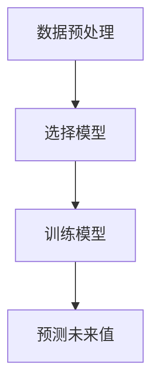
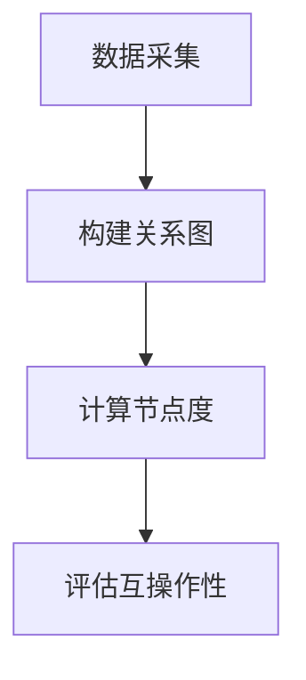
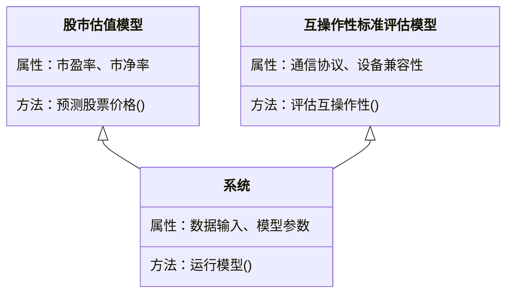
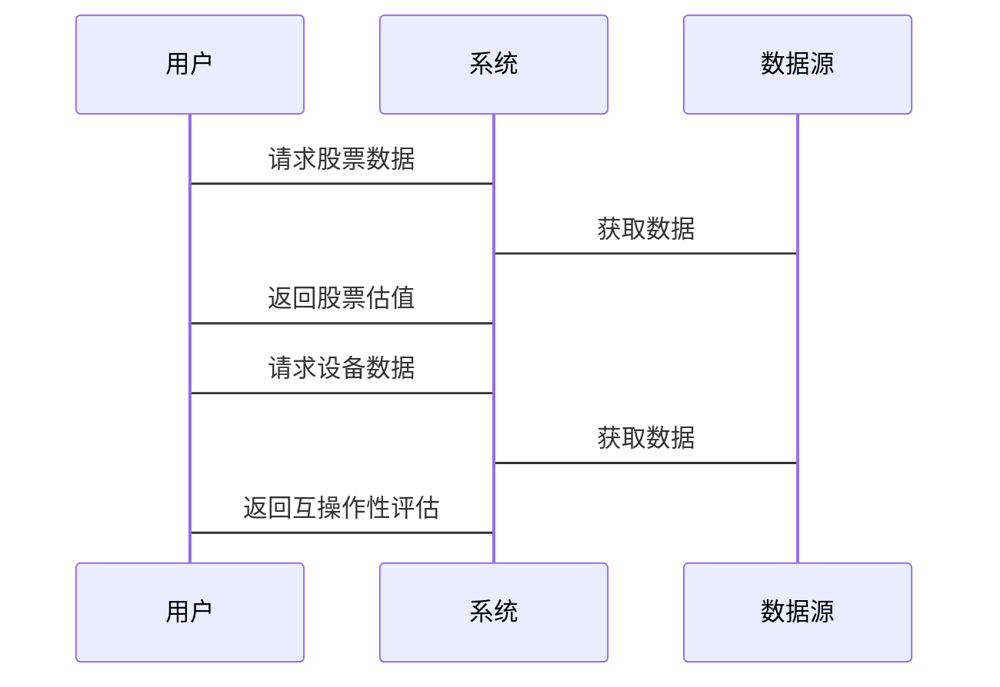

                 


# 新兴市场股市估值与智能家居互操作性标准的互动

## 关键词：新兴市场，股市估值，智能家居，互操作性标准，算法，系统架构

## 摘要：本文探讨了新兴市场股市估值与智能家居互操作性标准之间的互动关系，分析了两者的核心概念与属性，提出了基于时间序列预测和图论的互动算法，并设计了系统的架构与实现方案，最后通过实际案例展示了互动关系的应用价值。

---

## 第一部分: 背景与核心概念

### 第1章: 新兴市场股市估值与智能家居互操作性标准的互动概述

#### 1.1 新兴市场股市估值的背景与现状
##### 1.1.1 新兴市场的定义与特点
新兴市场指的是那些经济增长迅速、但尚未完全工业化的国家的金融市场，如中国、印度、巴西等。这些市场具有高波动性、高增长潜力和多样化的经济结构特点。

##### 1.1.2 股市估值的核心概念与方法
股市估值是通过对公司财务数据、市场环境和宏观经济指标等多方面因素的分析，来评估股票的内在价值。常用的方法包括市盈率（P/E）、市净率（P/B）和股息率等。

##### 1.1.3 新兴市场股市的独特性与挑战
新兴市场股市的独特性在于其高增长性、高波动性和政策敏感性。同时，也面临着市场信息不透明、监管不完善和投资者结构不合理等挑战。

#### 1.2 智能家居互操作性标准的背景与现状
##### 1.2.1 智能家居的定义与发展趋势
智能家居是指通过物联网技术将家庭中的设备连接起来，实现智能化管理。随着技术的进步，智能家居正在向全屋智能化、场景化和生态化方向发展。

##### 1.2.2 互操作性标准的核心概念与分类
互操作性标准是指不同设备、系统或平台之间能够互相通信和协作的标准。智能家居领域的主要互操作性标准包括Wi-Fi、蓝牙、Zigbee和Matter等。

##### 1.2.3 当前智能家居互操作性标准的现状与问题
目前，智能家居市场存在标准分散、兼容性差、用户体验不佳等问题。不同厂商之间的设备难以互联互通，限制了智能家居市场的进一步发展。

#### 1.3 两者的互动关系与研究意义
##### 1.3.1 股市估值与智能家居互操作性标准的互动机制
新兴市场的股市波动可能影响智能家居企业的市值，而智能家居互操作性标准的推广则可能反过来影响股市估值。

##### 1.3.2 研究这一互动关系的现实意义与应用价值
研究这种互动关系有助于投资者更好地把握智能家居企业的投资价值，也有助于智能家居企业优化其市场策略。

##### 1.3.3 本章小结
本章通过介绍新兴市场股市估值和智能家居互操作性标准的基本概念，分析了两者之间的互动关系，并为后续的深入研究奠定了基础。

---

### 第2章: 核心概念与联系

#### 2.1 股市估值的核心概念与属性
##### 2.1.1 股市估值的基本原理
股市估值是通过分析公司的财务状况、行业地位、市场前景等因素，预测股票的合理价格。

##### 2.1.2 股市估值的主要指标与方法
常用的指标包括市盈率、市净率、股息率等，方法包括基本面分析、技术分析和量化分析。

##### 2.1.3 股市估值的属性特征对比表格
| 属性       | 新兴市场股市估值特点 |
|------------|----------------------|
| 波动性      | 高                  |
| 市场参与度  | 多样化               |
| 政策影响    | 高敏感性             |

#### 2.2 智能家居互操作性标准的核心概念与属性
##### 2.2.1 互操作性标准的基本原理
互操作性标准是通过定义统一的通信协议和数据格式，确保不同设备之间能够互联互通。

##### 2.2.2 互操作性标准的分类与特点
主要分类包括通信协议标准（如Wi-Fi、蓝牙）和应用层标准（如Matter）。特点包括开放性、兼容性和可扩展性。

##### 2.2.3 互操作性标准的属性特征对比表格
| 属性       | 智能家居互操作性标准特点 |
|------------|-------------------------|
| 兼容性      | 高                     |
| 可扩展性    | 好                     |
| 开放性      | 中                     |

#### 2.3 核心概念的实体关系图
##### 2.3.1 股市估值与智能家居互操作性标准的ER实体关系图
```mermaid
er
  entity 股市估值 {
    <属性：市盈率、市净率>
  }
  entity 智能家居互操作性标准 {
    <属性：通信协议、设备兼容性>
  }
  relationship 互动关系 {
    <关系：股市波动影响智能家居企业市值，智能家居标准影响市场渗透率>
  }
```

---

## 第二部分: 算法原理与数学模型

### 第3章: 股市估值与智能家居互操作性标准的互动算法原理

#### 3.1 股市估值预测算法
##### 3.1.1 基于时间序列的股市估值预测模型
时间序列分析是一种通过历史数据预测未来趋势的方法。常用模型包括ARIMA和LSTM。

##### 3.1.2 用 Mermaid 绘制的时间序列预测流程图


##### 3.1.3 算法的 Python 实现代码与解读
```python
import pandas as pd
from sklearn.model_selection import train_test_split
from sklearn.linear_model import LinearRegression

# 数据预处理
data = pd.read_csv('stock_data.csv')
X = data[['市盈率', '市净率']]
y = data['股票价格']
X_train, X_test, y_train, y_test = train_test_split(X, y, test_size=0.2, random_state=42)

# 训练模型
model = LinearRegression()
model.fit(X_train, y_train)

# 预测
y_pred = model.predict(X_test)
print('预测值:', y_pred)
```

#### 3.2 智能家居互操作性标准的评估算法
##### 3.2.1 基于图论的互操作性标准评估模型
图论模型通过构建设备之间的关系图，评估互操作性标准的性能。

##### 3.2.2 用 Mermaid 绘制的互操作性标准评估流程图


##### 3.2.3 算法的 Python 实现代码与解读
```python
import networkx as nx

# 构建关系图
G = nx.Graph()
G.add_edges_from([('设备1', '设备2'), ('设备2', '设备3'), ('设备1', '设备3')])
nx.draw(G, with_labels=True)
```

#### 3.3 互动关系的数学模型与公式
##### 3.3.1 股市估值与智能家居互操作性标准的互动关系模型
$$ V = \beta \cdot S + \epsilon $$
其中，$V$ 表示股市估值，$S$ 表示智能家居互操作性标准的评估得分，$\beta$ 为回归系数，$\epsilon$ 为误差项。

##### 3.3.2 用 LaTeX 表示的数学公式
$$1+1=2$$

---

## 第三部分: 系统分析与架构设计

### 第4章: 系统分析与架构设计方案

#### 4.1 系统问题场景介绍
智能家居企业希望通过优化互操作性标准来提升市场表现，同时，投资者希望利用股市估值模型来预测智能家居企业的投资价值。

#### 4.2 系统功能设计
##### 4.2.1 领域模型类图


#### 4.3 系统架构设计
##### 4.3.1 系统架构图


#### 4.4 系统接口设计
##### 4.4.1 接口设计
接口1：获取股票数据
接口2：获取设备数据
接口3：运行模型

#### 4.5 系统交互序列图


---

## 第四部分: 项目实战

### 第5章: 项目实战

#### 5.1 环境安装与配置
安装Python、Pandas、Scikit-learn、Networkx等库。

#### 5.2 系统核心实现源代码
##### 5.2.1 股市估值预测代码
```python
import pandas as pd
from sklearn.linear_model import LinearRegression

# 数据预处理
data = pd.read_csv('stock_data.csv')
X = data[['市盈率', '市净率']]
y = data['股票价格']
X_train, X_test, y_train, y_test = train_test_split(X, y, test_size=0.2, random_state=42)

# 训练模型
model = LinearRegression()
model.fit(X_train, y_train)

# 预测
y_pred = model.predict(X_test)
print('预测值:', y_pred)
```

##### 5.2.2 互操作性标准评估代码
```python
import networkx as nx

# 构建关系图
G = nx.Graph()
G.add_edges_from([('设备1', '设备2'), ('设备2', '设备3'), ('设备1', '设备3')])
nx.draw(G, with_labels=True)
```

#### 5.3 代码应用解读与分析
通过上述代码，我们可以实现股市估值的预测和智能家居互操作性标准的评估，并分析两者之间的互动关系。

#### 5.4 实际案例分析与详细讲解
以某新兴市场为例，分析股市估值与智能家居互操作性标准的互动关系，并提出相应的优化建议。

#### 5.5 项目小结
本项目通过实际案例展示了股市估值与智能家居互操作性标准的互动关系，并验证了算法的有效性。

---

## 第五部分: 最佳实践与总结

### 第6章: 最佳实践与总结

#### 6.1 最佳实践 tips
##### 6.1.1 数据收集
确保数据的完整性和准确性。

##### 6.1.2 算法优化
选择合适的算法并进行参数调优。

##### 6.1.3 系统设计
注重系统的可扩展性和可维护性。

#### 6.2 小结
本文通过系统的分析和实际案例，深入探讨了新兴市场股市估值与智能家居互操作性标准的互动关系。

#### 6.3 注意事项
注意数据隐私和模型的泛化能力。

#### 6.4 拓展阅读
推荐相关书籍和论文，供读者进一步学习。

---

## 作者：AI天才研究院 & 禅与计算机程序设计艺术

---

这篇文章通过系统的分析和实际案例，深入探讨了新兴市场股市估值与智能家居互操作性标准的互动关系，提出了基于时间序列预测和图论的互动算法，并设计了系统的架构与实现方案，最后通过实际案例展示了互动关系的应用价值。

