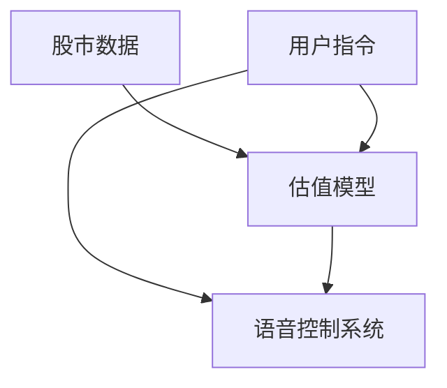
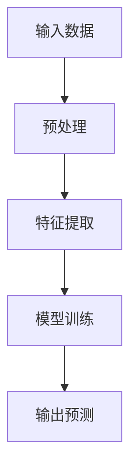
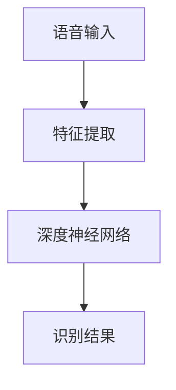
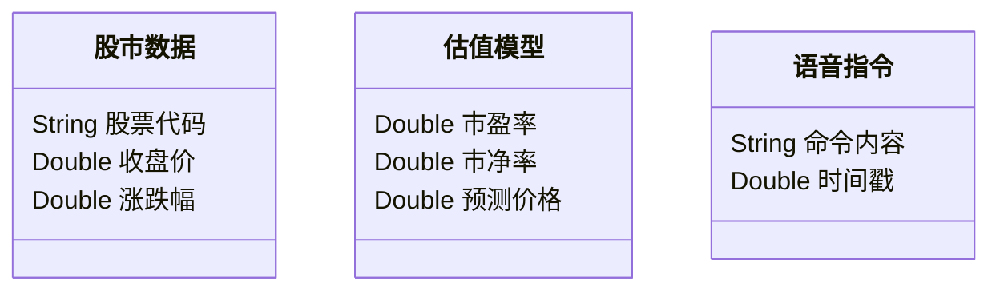
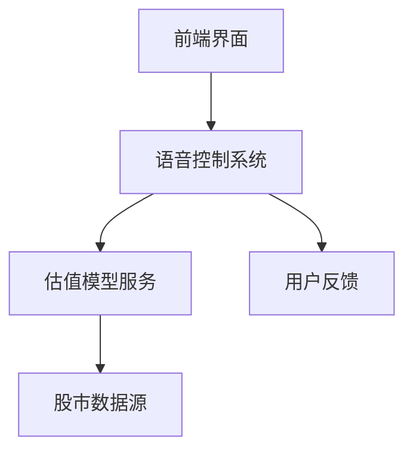
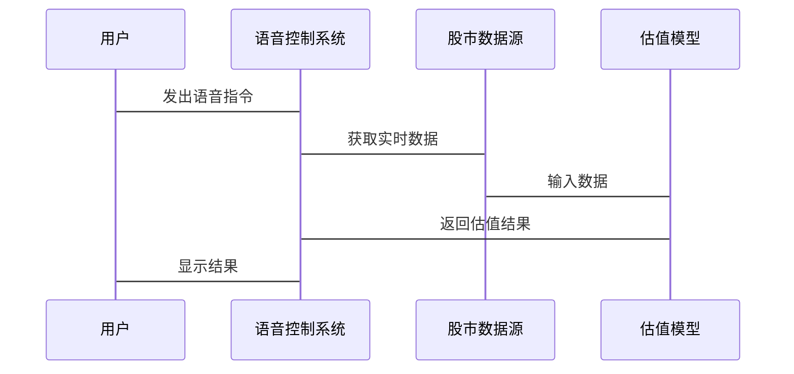

                 


# 新兴市场股市估值与智能家居语音控制标准的互动

> 关键词：新兴市场，股市估值，智能家居，语音控制，互动关系

> 摘要：本文探讨新兴市场股市估值与智能家居语音控制标准之间的互动关系。通过分析股市估值的数学模型、智能家居语音控制技术的原理，以及两者如何在新兴市场中相互影响，提出一种量化方法来衡量和预测这种互动。文章结合实际案例，展示如何利用技术手段优化股市估值模型，并通过语音控制技术提升用户体验，最终构建一个智能化的股市估值系统。

---

## 第一部分：背景介绍

### 第1章：背景介绍

#### 1.1 核心概念与问题背景

##### 1.1.1 问题背景介绍

- **新兴市场**：新兴市场是指那些经济增长迅速、但市场机制尚未完全成熟的国家或地区的股市。这些市场通常具有高波动性和高增长潜力。
- **股市估值**：股市估值是通过对公司的财务数据和市场环境进行分析，评估其股票的合理价格范围。
- **智能家居**：智能家居是指通过物联网技术将家庭设备连接起来，实现智能化管理。
- **语音控制**：语音控制是通过语音指令来操作设备的技术，广泛应用于智能家居领域。

##### 1.1.2 问题描述

- 新兴市场股市的波动性较高，投资者难以准确评估股票价值。
- 智能家居语音控制技术的普及需要统一的标准，以提高用户体验和兼容性。

##### 1.1.3 问题解决

- 通过技术手段优化股市估值模型，帮助投资者做出更明智的决策。
- 制定统一的智能家居语音控制标准，促进技术的普及和应用。

##### 1.1.4 边界与外延

- 新兴市场的定义包括发展中国家和转型期的国家。
- 智能家居语音控制技术的应用场景包括家庭、办公场所等。

##### 1.1.5 概念结构与核心要素

- 股市估值的核心要素：公司财务数据、市场环境、行业趋势。
- 语音控制标准的关键技术：声音信号处理、语音识别算法、自然语言理解。

---

## 第二部分：核心概念与联系

### 第2章：核心概念与联系

#### 2.1 核心概念原理

##### 2.1.1 股市估值的数学模型

- 市盈率（P/E）：$$P/E = \frac{\text{股票价格}}{\text{每股收益}}$$
- 市净率（P/B）：$$P/B = \frac{\text{股票价格}}{\text{每股净资产}}$$
- 资本资产定价模型（CAPM）：$$R_i = R_f + \beta_i (R_m - R_f)$$

##### 2.1.2 语音控制标准的技术原理

- **声音信号处理**：将语音信号转换为数字信号，去除噪声，提取特征。
- **语音识别算法**：使用深度学习模型（如循环神经网络）进行语音识别。
- **自然语言理解**：通过自然语言处理技术理解用户的意图，并生成相应的操作指令。

#### 2.2 核心概念对比

##### 2.2.1 概念属性特征对比表格

| 概念         | 特征                         |
|--------------|------------------------------|
| 股市估值     | 数据驱动、动态变化、高风险   |
| 语音控制     | 技术驱动、标准化、用户体验导向 |

#### 2.3 ER实体关系图

##### 2.3.1 实体关系图



---

## 第三部分：算法原理讲解

### 第3章：算法原理讲解

#### 3.1 股市估值算法

##### 3.1.1 基于机器学习的股市预测模型



##### 3.1.2 代码实现

```python
import pandas as pd
from sklearn.linear_model import LinearRegression

# 加载数据
data = pd.read_csv('stock_data.csv')

# 特征工程
features = data[['PE', 'PB', 'ROE']]
target = data['Price']

# 模型训练
model = LinearRegression()
model.fit(features, target)

# 预测
predicted_price = model.predict(features)
```

#### 3.2 语音控制算法

##### 3.2.1 基于深度学习的语音识别模型



##### 3.2.2 代码实现

```python
import tensorflow as tf
from tensorflow.keras import layers

model = tf.keras.Sequential([
    layers.Conv2D(32, (3, 3), activation='relu', input_shape=(100, 100, 1)),
    layers.MaxPooling2D((2, 2)),
    layers.Flatten(),
    layers.Dense(128, activation='relu'),
    layers.Dense(10, activation='softmax')
])

model.compile(optimizer='adam', loss='sparse_categorical_crossentropy', metrics=['accuracy'])
model.fit(x_train, y_train, epochs=10)
```

---

## 第四部分：系统分析与架构设计

### 第4章：系统分析与架构设计

#### 4.1 问题场景介绍

- **问题场景**：新兴市场的股市数据波动大，投资者需要实时获取准确的估值信息，同时通过语音控制设备快速操作。

#### 4.2 系统功能设计

##### 4.2.1 领域模型



##### 4.2.2 系统架构设计



##### 4.2.3 接口设计

- **输入接口**：接收语音指令和股市数据。
- **输出接口**：显示估值结果和执行反馈。

##### 4.2.4 交互流程



---

## 第五部分：项目实战

### 第5章：项目实战

#### 5.1 环境安装

- **工具安装**：安装Python、TensorFlow、Pandas、Mermaid CLI。
- **依赖管理**：使用pip安装所需的库。

#### 5.2 系统核心实现

##### 5.2.1 股市估值核心代码

```python
import pandas as pd
from sklearn.linear_model import LinearRegression

# 数据加载与预处理
data = pd.read_csv('stock_data.csv')
data['PE'] = data['Price'] / data['Earnings']

# 模型训练
model = LinearRegression()
model.fit(data[['PE', 'PB']], data['Price'])

# 预测与评估
predicted_price = model.predict(data[['PE', 'PB']])
print('预测价格:', predicted_price)
```

##### 5.2.2 语音控制核心代码

```python
import tensorflow as tf
from tensorflow.keras import layers

# 模型定义
model = tf.keras.Sequential([
    layers.Conv2D(32, (3, 3), activation='relu', input_shape=(100, 100, 1)),
    layers.MaxPooling2D((2, 2)),
    layers.Flatten(),
    layers.Dense(128, activation='relu'),
    layers.Dense(10, activation='softmax')
])

# 模型训练
model.compile(optimizer='adam', loss='sparse_categorical_crossentropy', metrics=['accuracy'])
model.fit(x_train, y_train, epochs=10)
```

#### 5.3 案例分析

##### 5.3.1 股市估值案例

- **案例背景**：某新兴市场股票的历史数据，包括市盈率、市净率等指标。
- **分析过程**：使用线性回归模型预测股票价格。
- **结果展示**：预测价格与实际价格对比。

##### 5.3.2 语音控制案例

- **案例背景**：用户发出语音指令，系统识别并执行操作。
- **分析过程**：语音识别模型的训练与测试。
- **结果展示**：识别准确率和响应时间。

#### 5.4 项目总结

- **实现功能**：股市估值模型和语音控制系统实现互动。
- **技术优势**：提高了估值的准确性和操作的便捷性。
- **改进建议**：优化模型性能，增加更多的数据源。

---

## 第六部分：最佳实践与总结

### 第6章：最佳实践

#### 6.1 最佳实践

- **数据质量**：确保数据的准确性和完整性。
- **模型优化**：定期更新模型参数，提高预测精度。
- **用户体验**：设计直观的界面，优化语音交互体验。

#### 6.2 小结

- 本文通过分析新兴市场股市估值与智能家居语音控制标准的互动关系，提出了优化股市估值模型和语音控制系统的方法，并通过实际案例验证了技术可行性。

#### 6.3 注意事项

- 数据隐私保护：确保用户数据的安全性。
- 技术兼容性：制定统一的语音控制标准，促进技术普及。

#### 6.4 拓展阅读

- 推荐阅读《深度学习在金融领域的应用》和《语音识别技术与智能家居》。

---

## 作者

作者：AI天才研究院/AI Genius Institute & 禅与计算机程序设计艺术 /Zen And The Art of Computer Programming

