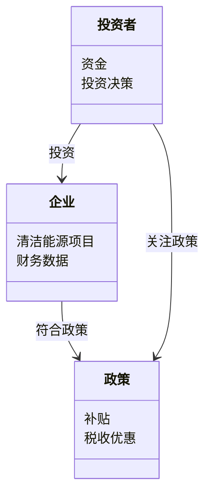

                 


# 新兴市场股市估值与清洁能源转型的互动

## 关键词：新兴市场，股市估值，清洁能源转型，互动机制，系统分析，案例分析

## 摘要：本文探讨新兴市场股市估值与清洁能源转型之间的互动关系。通过分析股市估值的核心原理、清洁能源转型的驱动因素，以及两者互动的机制，结合实际案例和数学模型，揭示其对经济和社会的影响。文章旨在为投资者和政策制定者提供参考，促进可持续发展。

---

## 第一部分：背景介绍

### 第1章：新兴市场股市估值概述

#### 1.1 新兴市场的定义与特点

- **1.1.1 新兴市场的定义**
  新兴市场是指经济快速发展但尚未达到发达国家水平的国家，如中国、印度、巴西等。这些市场具有较大的增长潜力和较高的风险。

- **1.1.2 新兴市场的特点与发展趋势**
  新兴市场通常具有人口多、经济增长快、基础设施逐步完善等特点。随着全球化的推进，这些市场在国际贸易和投资中扮演越来越重要的角色。

#### 1.2 股市估值的基本概念

- **1.2.1 股市估值的定义**
  股市估值是通过对公司财务数据的分析，评估其股票的内在价值。常用指标包括市盈率（P/E）、市净率（P/B）等。

- **1.2.2 股市估值的主要方法**
  - 市盈率法：通过比较股票的市盈率与行业平均水平，评估其估值是否合理。
  - 股息率法：通过股息与股票价格的比率，评估投资回报。

#### 1.3 清洁能源转型的背景与目标

- **1.3.1 清洁能源转型的定义**
  清洁能源转型是指从传统化石能源转向可再生能源的过程，旨在减少碳排放，应对气候变化。

- **1.3.2 清洁能源转型的驱动因素**
  - 环境因素：减少温室气体排放，应对气候变化。
  - 经济因素：可再生能源成本下降，提高能源效率。
  - 政策因素：各国政府通过政策支持推动清洁能源发展。

- **1.3.3 清洁能源转型的目标与挑战**
  目标是实现可持续能源供应，减少对化石燃料的依赖。挑战包括技术瓶颈、资金不足和政策不确定性。

#### 1.4 股市估值与清洁能源转型的互动背景

- **1.4.1 互动的背景分析**
  随着全球能源结构的变化，清洁能源企业在股市中的表现备受关注。投资者 increasingly 将清洁能源转型作为投资决策的重要因素。

- **1.4.2 互动的经济与社会影响**
  清洁能源转型可能影响股市估值，反过来，股市估值的变化也会影响企业的融资能力和投资决策。

---

## 第二部分：核心概念与联系

### 第2章：核心概念原理

#### 2.1 股市估值的核心原理

- **2.1.1 市盈率与市净率的计算**
  - 市盈率 = 股票价格 / 每股收益
  - 市净率 = 股票价格 / 每股净资产

- **2.1.2 股东权益与企业价值评估**
  企业价值评估考虑的因素包括收入、利润、资产和负债等。

#### 2.2 清洁能源转型的核心原理

- **2.2.1 清洁能源技术的经济性分析**
  - 技术成熟度：技术是否成熟，成本是否可控。
  - 经济性：清洁能源项目的投资回报率。

- **2.2.2 政策支持与市场驱动**
  政府政策（如补贴、税收优惠）和市场需求（如环保意识）共同推动清洁能源转型。

#### 2.3 互动机制的数学模型

- **2.3.1 模型的构建与假设**
  假设：清洁能源转型会影响企业的盈利能力和成长性，进而影响股市估值。

- **2.3.2 模型的变量与方程**
  $$ 股票价值 = \alpha \times \text{净利润} + \beta \times \text{清洁能源投资比例} $$

### 第3章：概念属性对比与ER关系图

#### 3.1 概念属性对比表格

| 概念       | 属性1：经济性 | 属性2：政策支持 | 属性3：技术成熟度 |
|------------|--------------|----------------|-------------------|
| 股市估值   | 高            | 低              | 中                |
| 清洁能源转型 | 中            | 高              | 高                |

#### 3.2 ER实体关系图

```mermaid
erd
actor 投资者 {
  <资产> -[拥有]-> <股票>
  <股票> <关联> <企业>
}
actor 企业 {
  <清洁能源项目> -[实施]-> <转型>
}
```

---

## 第三部分：系统分析与架构设计方案

### 第3章：系统分析

#### 3.1 问题场景介绍

- 清洁能源转型对股市估值的影响需要通过系统分析来评估。
- 投资者需要了解清洁能源项目的经济性和市场前景。

#### 3.2 系统功能设计

- 领域模型：清洁能源项目、企业、投资者、政策。



#### 3.3 系统架构设计


---

## 第四部分：互动机制与案例分析

### 第4章：互动机制

#### 4.1 互动机制分析

- 清洁能源转型通过影响企业盈利能力和成长性，进而影响股市估值。
- 股市估值的变化会影响企业的融资能力和投资者信心。

#### 4.2 案例分析

- **案例1：中国新能源汽车行业的崛起**
  - 政策支持：中国政府对新能源汽车的补贴和税收优惠。
  - 市场表现：新能源汽车企业的股价显著上涨，带动整体股市估值上升。

---

## 第五部分：算法与数学模型

### 第5章：算法原理

#### 5.1 时间序列分析

- 使用ARIMA模型预测股市走势。

```python
from statsmodels.tsa.arima.model import ARIMA

data = [收盘价数据]
model = ARIMA(data, order=(5,1,0))
model_fit = model.fit()
```

#### 5.2 机器学习模型

- 使用随机森林回归模型评估清洁能源转型对股价的影响。

```python
from sklearn.ensemble import RandomForestRegressor

features = [净利润, 清洁能源投资比例, ...]
target = [股价]
model = RandomForestRegressor(n_estimators=100)
model.fit(features, target)
```

---

## 第六部分：最佳实践与小结

### 第6章：最佳实践

#### 6.1 投资策略

- 优先投资符合清洁能源转型趋势的企业。
- 关注政策变化和市场趋势。

#### 6.2 政策建议

- 提供更多政策支持，促进清洁能源技术发展。
- 加强国际合作，推动全球能源转型。

#### 6.3 注意事项

- 风险评估：清洁能源转型存在技术和市场风险。
- 数据依赖：模型依赖高质量的数据，数据不足可能影响结果。

#### 6.4 拓展阅读

- 推荐阅读《可再生能源投资指南》和《股市分析入门》。

---

## 作者：AI天才研究院 & 禅与计算机程序设计艺术

---

通过以上结构，文章详细探讨了新兴市场股市估值与清洁能源转型的互动关系，结合理论分析和实际案例，为投资者和政策制定者提供了有价值的参考。

