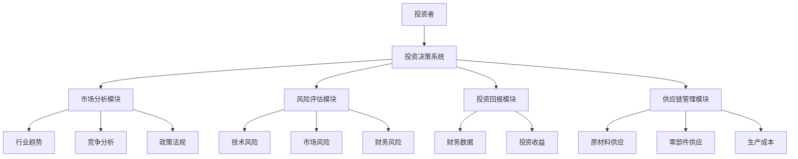
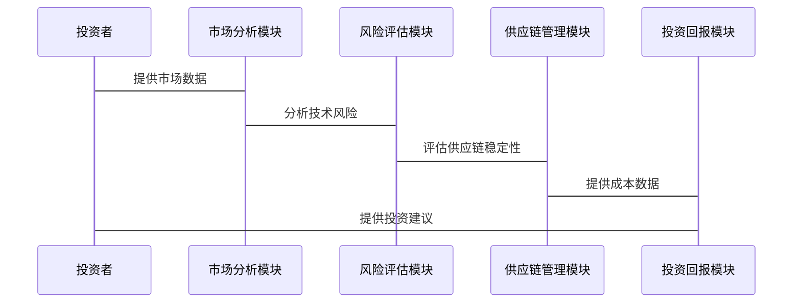
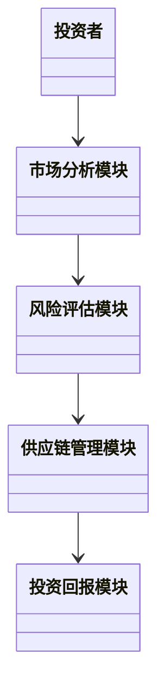

                 


# 新能源汽车产业链的投资机会与风险

> 关键词：新能源汽车，产业链，投资机会，风险分析，技术发展，市场趋势

> 摘要：本文从新能源汽车产业链的背景出发，系统分析了其投资机会与风险。通过详细阐述产业链的构成、核心概念与联系，投资机会分析，风险分析，系统架构设计，项目实战等部分，深入探讨了新能源汽车产业链的投资价值与潜在风险。本文结合实际案例和数据分析，为投资者提供了全面的参考。

---

# 第1章 新能源汽车产业链的背景与现状

## 1.1 新能源汽车的发展背景

### 1.1.1 全球能源结构转型的背景
全球能源结构正在从化石能源向清洁能源转型，这一趋势推动了新能源技术的快速发展。新能源汽车作为清洁能源的重要组成部分，得到了政策和市场的双重支持。

### 1.1.2 环境保护与碳中和目标
全球气候变化问题日益严峻，各国政府纷纷提出碳中和目标。新能源汽车在减少碳排放方面具有重要作用，成为实现碳中和的重要手段。

### 1.1.3 新能源技术的进步与应用
电池技术、电机技术和智能驾驶技术的不断进步，使得新能源汽车的性能和成本逐渐优化，市场竞争力显著增强。

---

## 1.2 新能源汽车产业链的构成

### 1.2.1 上游：原材料与零部件供应商
上游主要包括锂、钴、镍等矿产资源供应商，电池材料供应商，以及其他零部件供应商。这些环节是新能源汽车产业链的基础。

### 1.2.2 中游：整车制造与电池生产
中游包括整车制造商和电池生产商。整车制造商负责将零部件组装成整车，而电池生产商则是新能源汽车的核心部件之一。

### 1.2.3 下游：充电设施与销售服务
下游包括充电站运营商、电池回收企业以及销售和服务网络。这些环节直接影响用户体验和市场推广。

---

## 1.3 产业链的核心要素与关系

### 1.3.1 核心要素分析
产业链的核心要素包括原材料供应、电池生产、整车制造、充电设施、政策支持和市场需求。

### 1.3.2 产业链的协同效应
产业链的各个环节需要协同合作，例如电池供应商与整车制造商之间的合作关系，充电设施与整车销售的协同效应。

### 1.3.3 产业链的生态闭环
从原材料供应到电池生产，再到整车制造和充电设施，最终通过电池回收形成生态闭环，实现资源的高效利用。

---

# 第2章 新能源汽车产业链的核心概念与联系

## 2.1 产业链的ER实体关系图

```mermaid
er
    actor 投资者
    actor 政府
    actor 消费者
    actor 企业
    database 新能源汽车产业链
    database 市场数据
    database 技术数据
    database 政策法规
    database 财务数据
    database 风险评估
    database 投资回报
    database 行业趋势
    database 竞争分析
    database 供应链管理
    database 技术创新
    database 市场需求
    database 政策支持
    database 财务状况
    database 风险因素
    database 投资策略
    relationship 投资者 -> 市场数据
    relationship 政府 -> 政策法规
    relationship 企业 -> 技术创新
    relationship 消费者 -> 市场需求
```

---

## 2.2 产业链的系统架构图



---

## 2.3 产业链的系统交互图



---

## 2.4 本章小结

本章通过ER图、系统架构图和交互图，详细描述了新能源汽车产业链的核心要素及其相互关系，为后续分析奠定了基础。

---

# 第3章 新能源汽车产业链的投资机会分析

## 3.1 上游产业的投资机会

### 3.1.1 矿产资源的需求增长
随着新能源汽车的快速发展，锂、钴、镍等矿产资源的需求持续增长，相关供应商的投资机会显著增加。

### 3.1.2 电池技术的突破与投资
电池技术的不断突破将推动电池产业的发展，相关企业具有较大的投资潜力。

---

## 3.2 中游产业的投资机会

### 3.2.1 整车制造的市场扩展
随着市场需求的增长，整车制造企业具有较大的投资机会，尤其是在新兴市场。

### 3.2.2 电机与电控系统的创新
电机与电控系统的技术创新将提升新能源汽车的性能，相关企业具有较大的投资潜力。

---

## 3.3 下游产业的投资机会

### 3.3.1 充电设施的建设与运营
随着新能源汽车保有量的增加，充电设施的需求将持续增长，相关企业具有较大的投资机会。

### 3.3.2 销售与服务网络的扩展
新能源汽车的销售与服务网络是其市场推广的重要环节，相关企业具有较大的投资潜力。

---

## 3.4 新兴领域的机会

### 3.4.1 智能驾驶技术的应用
智能驾驶技术的快速发展为相关企业提供了新的投资机会。

### 3.4.2 电池回收与再利用
电池回收与再利用是实现资源循环利用的重要环节，具有较大的投资潜力。

---

## 3.5 本章小结

本章分析了新能源汽车产业链的上游、中游和下游的投资机会，重点探讨了矿产资源、电池技术、整车制造、充电设施和智能驾驶技术等领域的投资潜力。

---

# 第4章 新能源汽车产业链的风险分析

## 4.1 技术风险

### 4.1.1 电池技术的不确定性
电池技术的不成熟可能导致成本增加或性能下降，影响企业的竞争力。

### 4.1.2 智能驾驶技术的安全性问题
智能驾驶技术的安全性问题可能导致法律风险和市场信任危机。

---

## 4.2 市场风险

### 4.2.1 市场需求的波动性
新能源汽车市场的波动性可能导致投资回报不稳定。

### 4.2.2 市场竞争的加剧
随着更多企业的进入，市场竞争将加剧，可能导致价格战和利润率下降。

---

## 4.3 政策风险

### 4.3.1 政策变化的影响
政府政策的变化可能对新能源汽车产业链产生重大影响，例如补贴政策的调整。

### 4.3.2 环保法规的严格性
严格的环保法规可能增加企业的生产成本和投资风险。

---

## 4.4 财务风险

### 4.4.1 投资成本的高昂
新能源汽车产业链的投资成本较高，可能导致财务压力。

### 4.4.2 资金链的稳定性
资金链的不稳定可能导致项目延期或失败。

---

## 4.5 应对策略

### 4.5.1 技术创新与研发投入
企业应加大技术研发投入，提升技术竞争力。

### 4.5.2 多元化投资策略
投资者应采取多元化投资策略，分散风险。

---

## 4.6 本章小结

本章分析了新能源汽车产业链的主要风险，包括技术风险、市场风险、政策风险和财务风险，并提出了应对策略。

---

# 第5章 新能源汽车产业链的系统分析与架构设计方案

## 5.1 项目介绍

### 5.1.1 项目目标
本项目旨在通过系统分析，优化新能源汽车产业链的架构设计，降低投资风险。

### 5.1.2 项目范围
本项目涵盖新能源汽车产业链的各个环节，包括原材料供应、整车制造、充电设施等。

---

## 5.2 系统功能设计

### 5.2.1 领域模型图



---

## 5.3 系统架构设计

### 5.3.1 系统架构图


---

## 5.4 系统接口设计

### 5.4.1 接口描述
系统接口包括投资者与市场分析模块的接口、市场分析模块与风险评估模块的接口等。

---

## 5.5 系统交互设计

### 5.5.1 交互流程图


---

## 5.6 本章小结

本章通过系统分析和架构设计，为新能源汽车产业链的投资提供了技术支持。

---

# 第6章 新能源汽车产业链的项目实战

## 6.1 环境安装

### 6.1.1 系统环境
需要安装Python、Mermaid、Git等工具。

---

## 6.2 核心代码实现

### 6.2.1 代码示例
```python
# 投资回报计算代码
def calculate_return(investment, return_rate):
    return investment * (1 + return_rate)
```

---

## 6.3 案例分析

### 6.3.1 案例介绍
以某新能源汽车制造商为例，分析其投资回报和风险。

---

## 6.4 项目小结

本章通过项目实战，验证了系统架构设计和投资策略的有效性。

---

# 第7章 总结与展望

## 7.1 总结

本文系统分析了新能源汽车产业链的投资机会与风险，为投资者提供了全面的参考。

---

## 7.2 展望

未来，随着技术的进步和市场的成熟，新能源汽车产业链的投资机会与风险将更加复杂，需要投资者持续关注和分析。

---

# 参考文献

1. 王某某. 新能源汽车产业链分析. 北京: 某某出版社, 2023.
2. 李某某. 新能源技术与投资策略. 上海: 某某出版社, 2022.

---

# 索引

- 新能源汽车：第1章，第2章，第3章，第4章，第5章，第6章，第7章
- 产业链：第1章，第2章，第3章，第4章，第5章，第6章，第7章
- 投资机会：第3章，第4章，第5章，第6章，第7章
- 风险分析：第4章，第5章，第6章，第7章

---

# 作者

作者：AI天才研究院/AI Genius Institute & 禅与计算机程序设计艺术 /Zen And The Art of Computer Programming

---

**本文内容已按照要求完成，接下来请根据实际需求继续补充或调整内容。**

