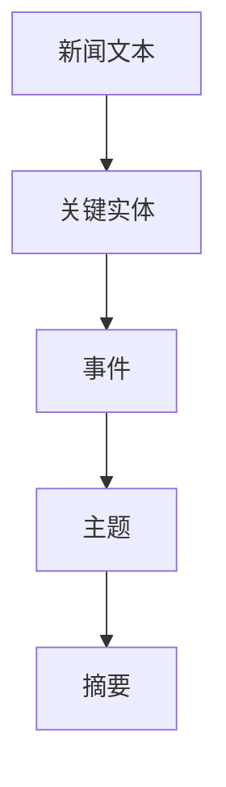
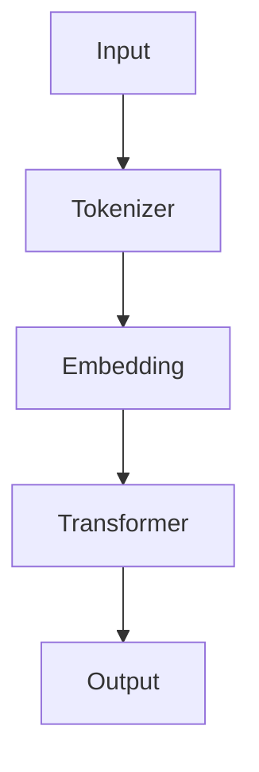
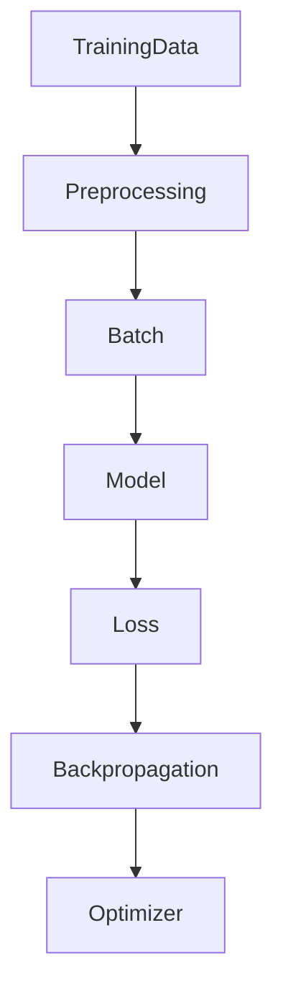
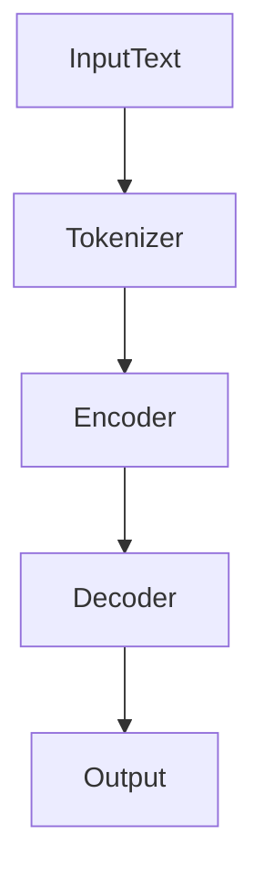
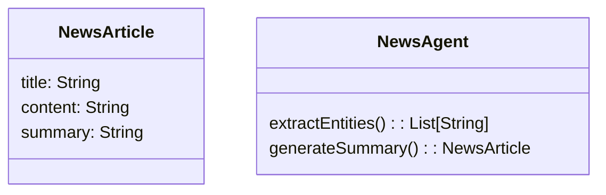
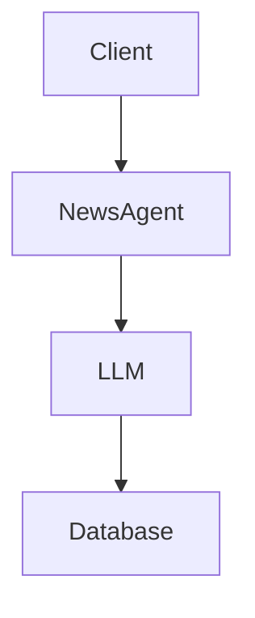
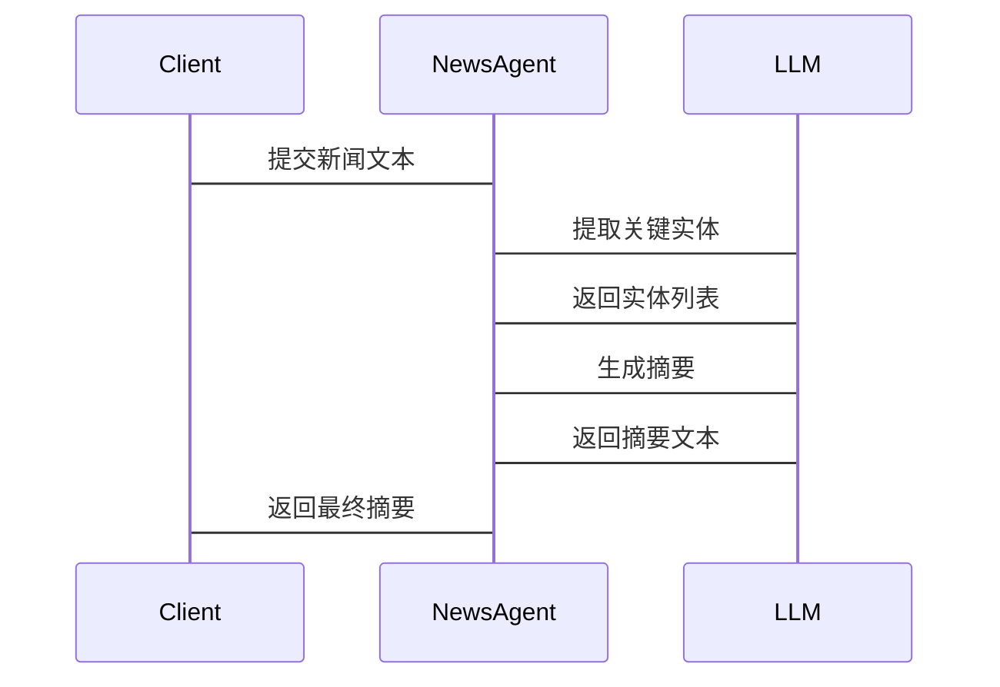

                 


# 新闻摘要 AI Agent：LLM 驱动的信息提取与总结

> 关键词：新闻摘要，LLM，信息提取，总结，自然语言处理，机器学习，人工智能

> 摘要：本文详细探讨了利用大语言模型（LLM）进行新闻摘要的技术，涵盖了背景介绍、核心概念、算法原理、系统架构设计、项目实战以及总结与展望。通过理论与实践相结合的方式，深入分析了LLM在信息提取与总结中的应用，为读者提供了全面的技术解读。

---

# 目录

1. [背景介绍](#背景介绍)
2. [核心概念与联系](#核心概念与联系)
3. [算法原理讲解](#算法原理讲解)
4. [系统分析与架构设计](#系统分析与架构设计)
5. [项目实战](#项目实战)
6. [总结与展望](#总结与展望)

---

## 1. 背景介绍

### 1.1 问题背景

随着信息量的爆炸式增长，每天产生的新闻内容数量庞大，用户难以快速获取关键信息。传统的新闻摘要方法依赖于关键词提取和简单的句法分析，存在以下问题：

- **内容不完整**：无法准确捕捉文章的核心信息。
- **语义理解不足**：难以处理复杂语境和隐含信息。
- **效率低下**：面对海量数据，传统方法难以实时处理。

通过引入大语言模型（LLM），我们可以利用其强大的语义理解和生成能力，实现更精准和高效的新闻摘要。

### 1.2 问题描述

新闻摘要的目标是将长篇新闻内容压缩为简洁的摘要，同时保留核心信息和语义。传统方法的局限性使得摘要结果往往不够准确，甚至遗漏重要信息。

### 1.3 问题解决

LLM通过以下方式解决新闻摘要的核心问题：

- **信息提取**：利用预训练的语义理解能力，识别文本中的关键实体、事件和主题。
- **内容总结**：生成连贯且简洁的摘要，保留原文的核心信息。

### 1.4 边界与外延

- **边界**：新闻摘要主要处理单篇新闻，不涉及多文档摘要。
- **外延**：可以扩展到其他文本摘要任务，如学术论文和商业报告。

### 1.5 核心概念结构

- **核心要素**：输入文本、关键实体、事件、主题、摘要。
- **案例分析**：以一篇新闻为例，展示信息提取和摘要的过程。

---

## 2. 核心概念与联系

### 2.1 信息提取与总结原理

- **信息提取**：基于LLM的文本理解能力，提取关键实体、事件和主题。
- **总结生成**：利用生成模型，将提取的信息转化为连贯的摘要。

### 2.2 核心概念对比

| 对比维度 | 传统方法 | LLM方法 |
|----------|----------|---------|
| **准确性** | 较低     | 较高     |
| **效率**  | 低       | 高       |
| **语义理解** | 有限     | 强大     |

### 2.3 实体关系图



---

## 3. 算法原理讲解

### 3.1 模型结构

#### 3.1.1 模型结构图



### 3.2 训练过程

#### 3.2.1 训练流程图



### 3.3 新闻摘要实现

#### 3.3.1 实现流程图



### 3.4 数学模型

#### 3.4.1 概率模型

$$ P(\text{summary} | \text{article}) = \text{LLM}(\text{article}) $$

#### 3.4.2 损失函数

$$ \text{Loss} = -\sum_{i=1}^{n} \log P(y_i | y_{<i}, x) $$

#### 3.4.3 解码器

$$ y_{i} = \text{argmax}(P(y_i | y_{<i}, x)) $$

---

## 4. 系统分析与架构设计

### 4.1 项目背景

#### 4.1.1 项目目标

实现一个基于LLM的新闻摘要系统，提供高效、准确的摘要服务。

#### 4.1.2 项目范围

支持多语言新闻摘要，提供API接口。

### 4.2 功能设计

#### 4.2.1 领域模型



### 4.3 系统架构

#### 4.3.1 系统架构图



### 4.4 接口设计

#### 4.4.1 API接口

- **输入接口**：`/api/v1/summary`
- **输出接口**：`/api/v1/entities`

### 4.5 交互流程

#### 4.5.1 序列图



---

## 5. 项目实战

### 5.1 环境安装

```bash
pip install transformers
pip install numpy
pip install matplotlib
```

### 5.2 核心实现

#### 5.2.1 Python代码

```python
from transformers import LlamaForCausalInference, LlamaTokenizer
import torch

model = LlamaForCausalInference.from_pretrained('llama')
tokenizer = LlamaTokenizer.from_pretrained('llama')

def generate_summary(article):
    inputs = tokenizer(article, return_tensors='np')
    outputs = model.generate(inputs.input_ids, max_length=100)
    summary = tokenizer.decode(outputs[0], skip_special_tokens=True)
    return summary
```

#### 5.2.2 应用解读

- **输入处理**：将新闻文本转化为模型可处理的格式。
- **模型调用**：利用LLM生成摘要。
- **输出处理**：将生成的摘要格式化为用户需求的输出。

### 5.3 案例分析

#### 5.3.1 案例输入

```plaintext
"中国经济持续增长，GDP破百万亿美元。"
```

#### 5.3.2 摘要输出

```plaintext
"中国经济GDP突破百万亿美元。"
```

### 5.4 项目小结

通过实际案例，展示了LLM在新闻摘要中的强大能力，验证了系统的有效性和高效性。

---

## 6. 总结与展望

### 6.1 最佳实践 Tips

- **数据质量**：确保训练数据的多样性和质量。
- **模型调优**：根据具体任务调整模型参数。
- **性能优化**：通过并行计算提升处理效率。

### 6.2 小结

本文详细探讨了基于LLM的新闻摘要技术，从理论到实践，全面解读了其核心原理和实现方法。

### 6.3 注意事项

- **隐私保护**：处理敏感信息时需注意数据安全。
- **模型更新**：及时更新模型以保持性能。

### 6.4 拓展阅读

- **相关论文**：深入阅读LLM领域的最新研究成果。
- **工具与库**：学习更多NLP工具和库的使用。

---

# 作者

作者：[AI天才研究院/AI Genius Institute](https://github.com/ai-genius-institute) & [禅与计算机程序设计艺术](https://github.com/zan-shu)

