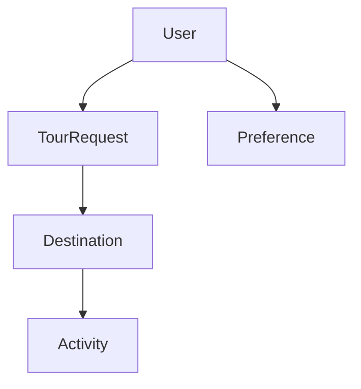

                 

# 旅游AI Agent：智能行程规划与推荐

> 关键词：旅游AI Agent，智能行程规划，推荐系统，人工智能，协同过滤，深度学习

> 摘要：本文深入探讨了旅游AI Agent在智能行程规划与推荐中的应用，从核心概念、算法原理到系统架构和项目实战，全面分析了其技术实现与实际应用。通过详细的技术解析和实例分析，展示了如何利用人工智能技术提升旅游推荐系统的效率与用户体验。

---

## 目录大纲

1. 旅游AI Agent概述
   1.1 旅游AI Agent的概念与背景
   1.2 智能行程规划与推荐的核心概念
   1.3 旅游AI Agent的应用场景与行业影响

2. 智能行程规划与推荐的算法原理
   2.1 协同过滤推荐算法
   2.2 基于聚类的行程优化
   2.3 深度学习在推荐系统中的应用

3. 智能行程规划与推荐的数学模型
   3.1 协同过滤模型
   3.2 矩阵分解模型
   3.3 基于神经网络的推荐模型

4. 智能行程规划与推荐的系统架构
   4.1 系统功能设计
   4.2 系统架构设计
   4.3 系统接口设计

5. 智能行程规划与推荐的项目实战
   5.1 环境安装与配置
   5.2 核心代码实现
   5.3 实际案例分析

6. 总结与展望
   6.1 本文总结
   6.2 未来展望
   6.3 最佳实践与注意事项

---

## 正文

### 第1章: 旅游AI Agent概述

#### 1.1 旅游AI Agent的概念与背景

**1.1.1 什么是旅游AI Agent**

旅游AI Agent是一种基于人工智能技术的智能助手，能够根据用户的需求和偏好，提供个性化的旅游行程规划和推荐服务。它通过分析用户的旅行历史、偏好和实时数据，为用户提供最优的行程安排和景点推荐。

**1.1.2 旅游AI Agent的核心特点**

- **智能化**：利用机器学习算法，自动分析用户需求并生成推荐。
- **个性化**：根据用户的偏好，提供定制化的行程安排。
- **实时性**：结合实时数据，如天气、交通状况等，动态调整推荐结果。

**1.1.3 旅游AI Agent与传统旅游推荐系统的主要区别**

传统的旅游推荐系统通常基于规则或简单的统计分析，而旅游AI Agent则利用深度学习和自然语言处理等先进技术，能够更好地理解和满足用户需求。

**1.2 旅游AI Agent的发展背景**

**1.2.1 人工智能技术的快速发展**

近年来，人工智能技术取得了显著进展，特别是在自然语言处理、计算机视觉和强化学习领域，为旅游AI Agent的发展提供了技术基础。

**1.2.2 旅游行业的数字化转型趋势**

随着互联网和移动设备的普及，旅游行业逐渐从传统的线下服务向线上数字化服务转型，旅游AI Agent作为数字化转型的重要工具，得到了广泛应用。

**1.2.3 用户需求的多样化与个性化**

现代用户对旅游的需求越来越多样化和个性化，传统的标准化旅游产品已无法满足用户需求，因此需要借助AI技术来实现个性化推荐。

**1.3 旅游AI Agent的应用场景**

**1.3.1 智能行程规划**

旅游AI Agent可以根据用户的时间、预算和兴趣，自动生成最优的行程安排。

**1.3.2 个性化旅游推荐**

基于用户的偏好和行为数据，推荐适合的旅游目的地、景点和活动。

**1.3.3 旅游助手与客户服务**

旅游AI Agent可以作为用户的虚拟助手，提供实时咨询、预订服务和行程调整等支持。

**1.4 旅游AI Agent的行业影响**

**1.4.1 对旅游企业的价值**

通过提高推荐的准确性和效率，旅游企业可以提升客户满意度和忠诚度，从而增加收入和市场份额。

**1.4.2 对用户体验的提升**

用户可以更快地找到符合自己需求的旅游产品和服务，提升整体体验。

**1.4.3 对旅游行业生态的改变**

旅游AI Agent的普及将推动旅游行业的数字化和智能化发展，改变传统的旅游服务模式。

---

### 第2章: 智能行程规划与推荐的核心概念

#### 2.1 问题背景与问题描述

**2.1.1 旅游行程规划中的主要问题**

- 用户需求多样，难以统一满足。
- 数据量大，处理复杂。
- 推荐结果需要实时动态调整。

**2.1.2 用户需求的多样性与复杂性**

用户可能有不同的兴趣、预算和时间限制，需要系统能够灵活应对。

**2.1.3 传统行程规划方法的局限性**

传统方法通常基于固定的规则和模板，难以应对复杂的个性化需求。

#### 2.2 核心概念与联系

**2.2.1 旅游AI Agent的核心概念**

- 用户需求分析：通过用户数据挖掘用户的偏好和需求。
- 数据处理：对海量数据进行清洗、整合和分析。
- 智能推荐：基于算法生成个性化推荐结果。

**2.2.2 智能行程规划与推荐的系统架构**

系统架构包括数据采集、数据处理、推荐算法和结果展示四个部分。

**2.2.3 核心概念之间的关系**

通过用户数据、推荐算法和系统架构的协同工作，实现智能行程规划与推荐。

#### 2.3 核心概念的属性特征对比

**2.3.1 对比表格展示**

| 核心概念 | 属性 | 特征 |
|----------|------|------|
| 用户需求分析 | 数据来源 | 用户行为数据、用户问卷调查 |
| 数据处理 | 方法 | 数据清洗、特征提取、数据建模 |
| 推荐算法 | 类型 | 协同过滤、聚类分析、深度学习 |

**2.3.2 ER实体关系图**

---

### 第3章: 智能行程规划与推荐的算法原理

#### 3.1 协同过滤推荐算法

**3.1.1 协同过滤的基本原理**

协同过滤是基于用户相似性或物品相似性进行推荐的一种方法。

**3.1.2 基于用户的协同过滤**

通过计算用户之间的相似性，找到相似用户的推荐结果。

**3.1.3 基于物品的协同过滤**

通过计算物品之间的相似性，向用户推荐相似的物品。

#### 3.2 基于聚类的行程优化

**3.2.1 聚类分析的基本原理**

将用户或物品分成不同的类别，便于推荐。

**3.2.2 K-means算法在行程优化中的应用**

通过聚类算法优化行程安排，减少时间和空间浪费。

**3.2.3 聚类结果的可视化**

通过可视化工具展示聚类结果，帮助用户更好地理解推荐逻辑。

#### 3.3 基于深度学习的推荐系统

**3.3.1 神经网络在推荐系统中的应用**

通过神经网络模型捕捉用户和物品的深层特征。

**3.3.2 基于序列推荐的模型**

考虑用户行为的时序性，进行动态推荐。

**3.3.3 基于图神经网络的推荐系统**

利用图结构数据，进行更精准的推荐。

---

### 第4章: 智能行程规划与推荐的数学模型

#### 4.1 协同过滤模型

**4.1.1 基于用户的协同过滤公式**

$$ sim(u, v) = \frac{\sum_{i}(r_{u,i} - \bar{r}_u)(r_{v,i} - \bar{r}_v)}{\sqrt{\sum_{i}(r_{u,i} - \bar{r}_u)^2} \sqrt{\sum_{i}(r_{v,i} - \bar{r}_v)^2}} $$

#### 4.2 基于矩阵分解的推荐模型

**4.2.1 矩阵分解的基本原理**

通过分解用户-物品矩阵，提取隐含特征。

**4.2.2 矩阵分解的数学公式**

$$ X = U \times V^T $$

---

### 第5章: 智能行程规划与推荐的系统架构

#### 5.1 系统功能设计

**5.1.1 用户需求分析模块**

负责采集和分析用户需求。

**5.1.2 数据处理模块**

对数据进行清洗和预处理。

**5.1.3 推荐算法模块**

实现各种推荐算法。

**5.1.4 结果展示模块**

将推荐结果以可视化的方式呈现给用户。

#### 5.2 系统架构设计

**5.2.1 分层架构**

将系统划分为数据层、业务逻辑层和表现层。

**5.2.2 微服务架构**

通过微服务实现系统的模块化和可扩展性。

**5.2.3 高可用性设计**

通过负载均衡和容灾备份确保系统的稳定性。

#### 5.3 系统接口设计

**5.3.1 用户接口**

提供给用户输入需求和查看推荐结果的界面。

**5.3.2 第三方接口**

与旅游平台、天气预报等第三方服务对接。

**5.3.3 数据接口**

与数据库或其他数据源进行交互。

#### 5.4 系统交互流程

**5.4.1 用户发起请求**

用户输入需求，系统接收请求。

**5.4.2 系统处理请求**

系统分析需求，调用推荐算法生成结果。

**5.4.3 返回结果**

系统将推荐结果返回给用户。

---

### 第6章: 总结与展望

#### 6.1 本文总结

本文详细探讨了旅游AI Agent在智能行程规划与推荐中的应用，从核心概念到算法实现，再到系统架构，全面分析了其技术实现和实际应用。

#### 6.2 未来展望

未来，随着人工智能技术的不断进步，旅游AI Agent将更加智能化和个性化，推荐算法也将更加精准和高效。

#### 6.3 最佳实践与注意事项

- 数据隐私保护：在处理用户数据时，必须遵守相关法律法规，保护用户隐私。
- 系统性能优化：通过技术手段提升系统的响应速度和处理能力。
- 持续学习与更新：定期更新算法和模型，以适应用户需求的变化。

---

## 作者

作者：AI天才研究院/AI Genius Institute & 禅与计算机程序设计艺术 /Zen And The Art of Computer Programming

