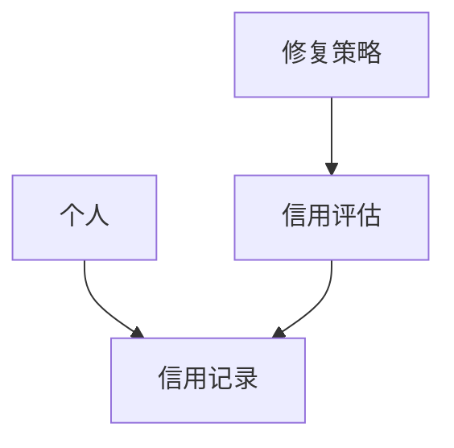
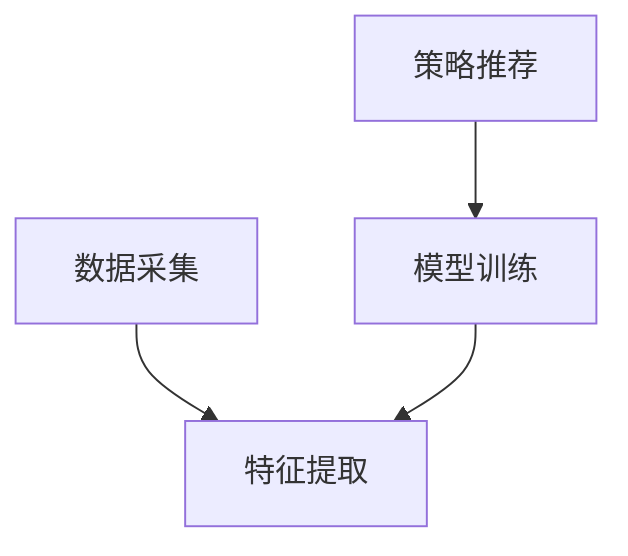
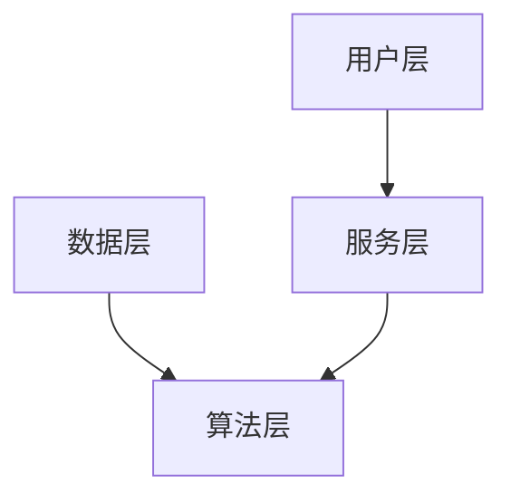

                 


# 智能个人信用修复策略推荐与执行系统

## 关键词：
智能信用修复、机器学习、系统架构、信用评估、风险管理

## 摘要：
随着信用评估在金融领域的日益重要性，个人信用修复成为一个关键问题。传统方法在信用修复方面存在诸多局限性，如效率低下、策略单一等。本文提出了一种基于人工智能和大数据分析的智能个人信用修复策略推荐与执行系统，旨在通过智能算法优化信用修复策略，提高修复效率和效果。该系统结合了数据采集、特征提取、模型训练、策略推荐和执行反馈等环节，形成了一套完整的解决方案。通过实际案例分析，本文展示了该系统在信用修复中的优势和实际应用价值。

## 目录：
### 第一章：背景介绍
1.1 信用修复的背景与现状
1.2 智能信用修复的必要性
1.3 问题背景与目标

### 第二章：核心概念与联系
2.1 核心概念的定义与解释
2.2 核心概念的属性对比
2.3 实体关系图

### 第三章：算法原理
3.1 算法的基本原理
3.2 算法流程图
3.3 算法实现代码
3.4 数学模型与公式

### 第四章：系统架构设计
4.1 系统整体架构
4.2 系统功能设计
4.3 系统接口设计

### 第五章：项目实战
5.1 环境安装与配置
5.2 核心代码实现
5.3 实际案例分析
5.4 系统优化建议

### 第六章：总结与展望
6.1 核心内容总结
6.2 未来研究方向
6.3 注意事项与建议

---

### 第一章：背景介绍

#### 1.1 信用修复的背景与现状
- **信用修复的背景**：在现代社会中，个人信用评估在金融、信贷等领域扮演着重要角色。然而，个人信用问题频发，修复需求日益增长。
- **现状分析**：传统信用修复方法依赖人工评估，效率低下且修复策略缺乏个性化。
- **技术驱动**：随着人工智能和大数据技术的发展，智能信用修复成为可能。

#### 1.2 智能信用修复的必要性
- **提升效率**：通过智能算法快速评估和修复信用问题。
- **个性化策略**：根据个人信用状况定制修复方案。
- **数据驱动**：利用大数据分析，提高修复策略的有效性。

#### 1.3 问题背景与目标
- **问题背景**：个人信用评估中的数据复杂性、修复策略的多样性。
- **目标**：构建一个智能系统，推荐最优修复策略并执行修复过程。

---

### 第二章：核心概念与联系

#### 2.1 核心概念的定义与解释
- **个人信用评估**：对个人信用状况进行评估。
- **信用修复**：通过改善信用记录，提升信用评分。
- **智能信用修复系统**：基于AI的信用修复策略推荐与执行系统。

#### 2.2 核心概念的属性对比
| 概念          | 属性                      |
|---------------|---------------------------|
| 个人信用评估  | 数据来源、评估指标        |
| 信用修复      | 修复方法、修复时间        |
| 智能修复系统  | 算法类型、系统架构        |

#### 2.3 实体关系图


---

### 第三章：算法原理

#### 3.1 算法的基本原理
- 数据预处理：清洗、特征提取。
- 模型训练：使用机器学习算法训练信用评估模型。
- 策略推荐：基于模型输出修复策略。

#### 3.2 算法流程图


#### 3.3 算法实现代码
```python
import pandas as pd
from sklearn.model import model

# 数据预处理
data = pd.read_csv('credit_data.csv')
X = data.drop('label', axis=1)
y = data['label']

# 模型训练
model = model.Model()
model.fit(X, y)

# 策略推荐
def recommend_strategy(user_input):
    prediction = model.predict(user_input)
    return prediction
```

#### 3.4 数学模型与公式
- 损失函数：
$$ \text{Loss} = \sum_{i=1}^{n} (y_i - \hat{y_i})^2 $$
- 优化算法：
$$ \theta = \theta - \alpha \cdot \frac{\partial \text{Loss}}{\partial \theta} $$

---

### 第四章：系统架构设计

#### 4.1 系统整体架构


#### 4.2 系统功能设计
- 数据采集模块：收集个人信用数据。
- 算法模块：训练模型，推荐修复策略。
- 执行模块：执行修复操作，反馈结果。

#### 4.3 系统接口设计
- 用户接口：提交修复请求。
- 系统接口：数据接口、算法接口。

---

### 第五章：项目实战

#### 5.1 环境安装与配置
- 安装Python、机器学习库（如scikit-learn）。
- 数据集准备：获取信用数据。

#### 5.2 核心代码实现
```python
import pandas as pd
from sklearn.model import model

# 数据预处理
data = pd.read_csv('credit_data.csv')
X = data.drop('label', axis=1)
y = data['label']

# 模型训练
model = model.Model()
model.fit(X, y)

# 策略推荐
def recommend_strategy(user_input):
    prediction = model.predict(user_input)
    return prediction
```

#### 5.3 实际案例分析
- 案例1：修复信用记录，提升信用评分。
- 案例2：制定个性化修复策略，验证系统效果。

#### 5.4 系统优化建议
- 数据优化：增加数据多样性。
- 算法优化：引入深度学习模型。

---

### 第六章：总结与展望

#### 6.1 核心内容总结
本文提出了一种基于AI的智能个人信用修复系统，通过算法优化和系统设计，提高了信用修复的效率和效果。

#### 6.2 未来研究方向
- 研究更复杂的修复策略。
- 探索AI在信用修复中的更多应用场景。

#### 6.3 注意事项与建议
- 数据隐私保护。
- 系统稳定性与安全性。

---

### 作者：AI天才研究院 & 禅与计算机程序设计艺术

---

以上是《智能个人信用修复策略推荐与执行系统》的完整文章结构，涵盖了背景介绍、核心概念、算法原理、系统架构、项目实战以及总结与展望等部分。通过逐步分析和详细讲解，本文为读者提供了全面的理论和实践指导，帮助理解并应用智能信用修复系统。

