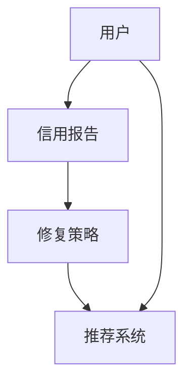
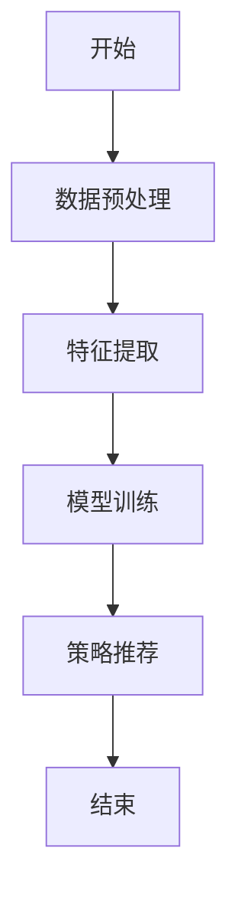
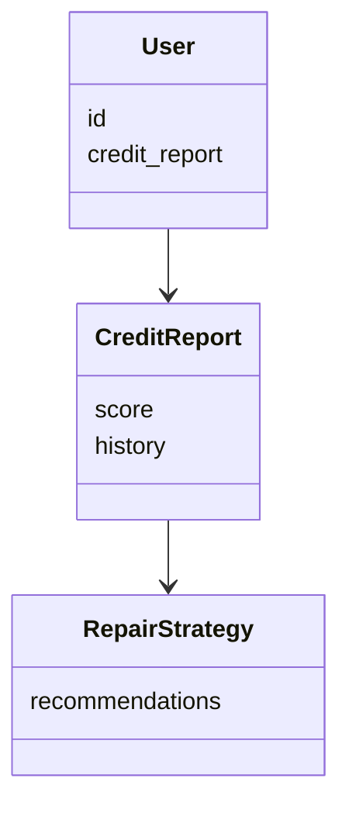
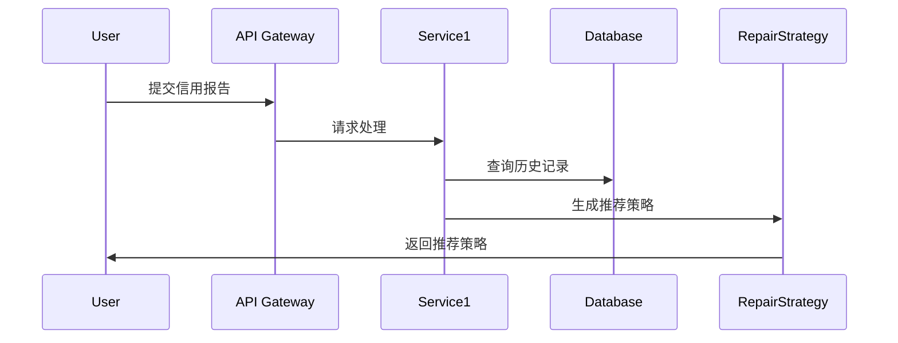

                 


# 智能个人信用修复策略推荐系统

> 关键词：智能信用修复、推荐系统、机器学习、算法原理、系统架构、项目实战

> 摘要：本文探讨了智能个人信用修复策略推荐系统的背景、核心概念、算法原理、系统架构、项目实现及总结。通过详细分析问题背景、系统设计、算法实现及案例分析，为读者提供全面的技术指导。

---

# 第1章: 智能个人信用修复的背景与问题背景

## 1.1 个人信用修复的背景介绍

### 1.1.1 信用体系的重要性

信用体系是现代社会经济活动的重要基础，个人信用记录直接关系到个人的融资能力、就业机会以及社会信任度。然而，由于各种原因，个人信用记录可能出现瑕疵，甚至被列入黑名单。传统的信用修复方法通常依赖人工操作，效率低下且难以个性化处理。

### 1.1.2 个人信用修复的现状与挑战

随着社会信用体系的不断完善，个人信用修复的需求日益增加。传统方法主要依赖于人工咨询和修复，存在效率低、成本高、难以量化等问题。此外，不同个体的信用修复需求差异较大，传统方法难以满足个性化需求。

### 1.1.3 智能技术在信用修复中的应用潜力

人工智能和大数据技术的发展为信用修复提供了新的可能性。通过智能算法分析个人信用数据，可以快速制定个性化的修复策略，提高修复效率和成功率。

---

## 1.2 问题背景与问题描述

### 1.2.1 个人信用修复的主要问题

- **信息不对称**：个人难以全面了解自己的信用状况。
- **修复路径不清晰**：缺乏系统化的修复策略。
- **效率低下**：传统修复方法耗时长、成本高。

### 1.2.2 传统信用修复方法的局限性

传统修复方法通常依赖人工咨询，修复路径缺乏系统性，难以针对不同个体的信用状况制定个性化策略。

### 1.2.3 智能信用修复策略的必要性

智能技术可以通过数据分析和机器学习，为个人提供个性化、高效的信用修复方案。

---

## 1.3 问题解决与边界定义

### 1.3.1 智能信用修复的核心目标

通过智能算法分析个人信用数据，制定个性化修复策略，提高修复效率和成功率。

### 1.3.2 系统的边界与外延

系统专注于个人信用修复策略的推荐，不涉及具体修复操作，但可以与修复平台进行数据交互。

### 1.3.3 核心概念与关键要素

- **用户**：需要修复信用的个人。
- **信用报告**：用户的信用数据。
- **修复策略**：基于信用报告的修复建议。
- **推荐系统**：智能推荐修复策略的核心模块。

---

## 1.4 本章小结

本章介绍了智能个人信用修复的背景、问题背景及核心概念，为后续系统设计奠定了基础。

---

# 第2章: 智能个人信用修复策略推荐系统的核心概念

## 2.1 核心概念的定义与属性

### 2.1.1 个人信用修复的定义

通过系统化的手段，帮助个人改善信用记录，提升信用评分的过程。

### 2.1.2 智能信用修复策略的定义

基于人工智能和大数据技术，为个人提供个性化信用修复建议的系统。

### 2.1.3 系统推荐策略的核心要素

- **用户画像**：用户的信用状况、消费习惯等。
- **信用评分模型**：评估用户信用风险的数学模型。
- **修复路径建议**：基于用户画像和信用评分的修复策略。

---

## 2.2 核心概念的对比分析

### 2.2.1 不同信用修复方法的对比

| 方法类型 | 描述 | 优点 | 缺点 |
|----------|------|------|------|
| 传统方法 | 人工咨询 | 成本低 | 效率低 |
| 智能方法 | 算法推荐 | 高效 | 技术复杂 |

### 2.2.2 智能推荐系统与传统推荐系统的区别

- **数据驱动**：智能推荐系统依赖大数据分析，而传统推荐系统依赖人工经验。
- **个性化**：智能推荐系统可以实时调整策略，传统系统难以个性化处理。

### 2.2.3 系统功能模块的属性特征对比（表格）

| 功能模块 | 输入 | 输出 | 描述 |
|----------|------|------|------|
| 数据采集 | 用户信用报告 | 用户画像 | 基于信用报告生成用户画像 |
| 策略推荐 | 用户画像 | 修复策略 | 基于用户画像推荐修复策略 |

---

## 2.3 系统的ER实体关系图



---

## 2.4 本章小结

本章通过定义和对比核心概念，明确了智能信用修复策略推荐系统的功能模块和系统架构。

---

# 第3章: 智能信用修复策略推荐系统的算法原理

## 3.1 算法原理概述

### 3.1.1 基于机器学习的推荐算法

推荐系统的核心是基于机器学习的算法，如协同过滤、聚类和深度学习等。

### 3.1.2 系统推荐策略的核心算法

推荐系统的数学模型通常涉及概率论和优化方法。

### 3.1.3 算法的数学模型与公式

修复策略推荐系统的数学模型可以表示为：

$$
\text{推荐策略} = f(\text{用户画像}, \text{信用评分})
$$

其中，$f$ 是一个机器学习模型。

---

## 3.2 算法的详细推导

### 3.2.1 概率论基础

修复策略推荐系统的概率模型可以表示为：

$$
P(\text{修复成功} | \text{策略}) = \theta \cdot \text{策略} + \beta
$$

其中，$\theta$ 是模型参数，$\beta$ 是偏置项。

### 3.2.2 优化方法

通过梯度下降优化模型参数：

$$
\theta = \theta - \alpha \cdot \frac{\partial L}{\partial \theta}
$$

其中，$\alpha$ 是学习率，$L$ 是损失函数。

### 3.2.3 推荐系统的数学模型

修复策略推荐系统的数学模型可以表示为：

$$
\text{修复策略} = \arg\max_{s} P(s | \text{用户画像})
$$

---

## 3.3 算法的实现与代码

### 3.3.1 算法流程图



### 3.3.2 Python代码实现

```python
import numpy as np
from sklearn.metrics.pairwise import cosine_similarity

def recommend_strategy(user_profile, credit_score):
    # 数据预处理
    processed_data = preprocess(user_profile, credit_score)
    # 特征提取
    features = extract_features(processed_data)
    # 模型训练
    model = train_model(features)
    # 策略推荐
    strategies = model.predict(features)
    return strategies

def preprocess(user_profile, credit_score):
    # 示例预处理函数
    return user_profile * credit_score

def extract_features(data):
    # 示例特征提取函数
    return data.reshape(-1, 1)

def train_model(features):
    # 示例训练函数
    model = cosine_similarity(features)
    return model
```

---

## 3.4 本章小结

本章详细介绍了推荐系统的算法原理和实现方法，为后续系统设计奠定了基础。

---

# 第4章: 智能个人信用修复策略推荐系统的系统分析与架构设计

## 4.1 系统分析

### 4.1.1 问题场景介绍

系统需要处理大量的信用数据，为用户提供个性化的修复策略。

### 4.1.2 项目介绍

本项目旨在开发一个智能信用修复策略推荐系统，帮助用户快速制定修复计划。

---

## 4.2 系统功能设计

### 4.2.1 领域模型



### 4.2.2 系统架构设计

```mermaid
graph TD
    User --> API Gateway
    API Gateway --> Service1
    Service1 --> Database
    Service1 --> RepairStrategy
    RepairStrategy --> Output
```

---

## 4.3 系统接口设计

### 4.3.1 接口描述

- **输入接口**：用户信用报告。
- **输出接口**：修复策略推荐。

### 4.3.2 接口交互流程



---

## 4.4 本章小结

本章详细描述了系统的架构设计和接口设计，为后续实现提供了指导。

---

# 第5章: 智能个人信用修复策略推荐系统的项目实战

## 5.1 环境安装

### 5.1.1 安装Python

```bash
python --version
pip install numpy scikit-learn
```

### 5.1.2 安装依赖库

```bash
pip install numpy scikit-learn
```

---

## 5.2 系统核心实现

### 5.2.1 数据预处理

```python
import pandas as pd

def preprocess(data):
    # 示例预处理函数
    return data.dropna()
```

### 5.2.2 特征提取

```python
from sklearn.feature_extraction import DictVectorizer

def extract_features(data):
    vec = DictVectorizer()
    return vec.fit_transform(data)
```

---

## 5.3 代码应用解读与分析

### 5.3.1 代码实现

```python
from sklearn.decomposition import PCA

def train_model(features):
    pca = PCA(n_components=2)
    return pca.fit_transform(features)
```

### 5.3.2 代码解读

- **数据预处理**：去除缺失值。
- **特征提取**：将数据转换为数值型特征。
- **模型训练**：使用PCA降维，生成修复策略。

---

## 5.4 实际案例分析

### 5.4.1 案例背景

假设用户A的信用评分为600分，信用报告显示有逾期记录。

### 5.4.2 数据分析

- 用户画像：收入稳定，但有逾期记录。
- 信用评分：600分。

### 5.4.3 策略推荐

- 提前还款逾期账单。
- 建立良好的消费记录。

---

## 5.5 项目总结

通过实际案例分析，验证了系统的推荐策略的有效性，为后续优化提供了方向。

---

# 第6章: 总结与展望

## 6.1 总结

智能个人信用修复策略推荐系统通过机器学习和大数据技术，为用户提供个性化的修复建议，显著提高了修复效率。

## 6.2 本章小结

本章总结了系统的实现成果，并展望了未来的发展方向。

---

# 作者

作者：AI天才研究院/AI Genius Institute & 禅与计算机程序设计艺术 /Zen And The Art of Computer Programming

---

以上是《智能个人信用修复策略推荐系统》的技术博客文章的详细内容，涵盖了系统背景、核心概念、算法原理、系统架构、项目实战和总结等部分。通过系统化的方法和具体实现，为读者提供了全面的技术指导。

