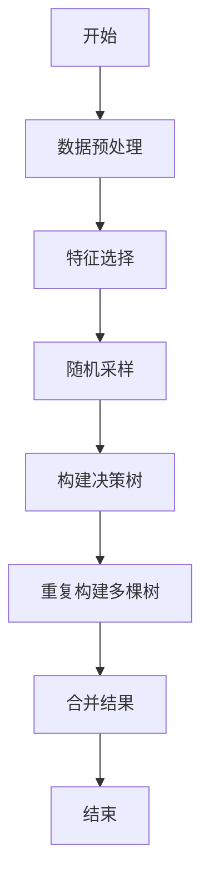
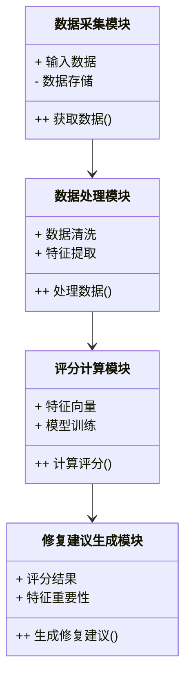

                 


# 智能个人信用评分优化与修复建议系统

> 关键词：智能信用评分，机器学习，修复建议，评分模型，数据特征，随机森林，评分优化

> 摘要：本文探讨了智能个人信用评分优化与修复建议系统的构建，结合机器学习算法和数据特征分析，提出了一种基于随机森林的评分模型，并详细阐述了修复建议生成的系统设计与实现。

---

# 第一部分: 核心概念与背景分析

## 第1章: 个人信用评分的背景与挑战

### 1.1 个人信用评分的重要性
#### 1.1.1 信用评分的定义与作用
信用评分是评估个人信用状况的重要指标，广泛应用于银行贷款、信用卡审批等领域。传统的信用评分主要基于历史还款记录、负债情况等有限数据，难以全面反映个人信用状况。

#### 1.1.2 信用评分在金融领域的应用
- 个人信用评分是金融机构风险控制的重要工具。
- 评分结果直接影响贷款额度、利率等金融产品设计。

#### 1.1.3 智能信用评分的优势
- 基于机器学习算法，能够处理多维度数据，提升评分准确性。
- 实时更新，动态调整评分结果，提供更精准的信用评估。

### 1.2 当前信用评分系统的问题
#### 1.2.1 数据来源的局限性
传统评分模型仅依赖少量历史数据，无法充分利用其他数据源（如社交数据、消费行为数据）。

#### 1.2.2 评分模型的不足
- 线性模型（如逻辑回归）对非线性关系的捕捉能力有限。
- 模型解释性差，难以提供具体的评分依据。

#### 1.2.3 修复建议的缺失
现有评分系统通常只给出评分结果，缺乏具体的修复建议，难以帮助用户提升信用评分。

### 1.3 智能信用评分系统的解决方案
#### 1.3.1 数据驱动的评分优化
通过收集多维度数据，利用机器学习算法构建更复杂的评分模型。

#### 1.3.2 智能算法的应用
引入随机森林、梯度提升树等算法，提升评分模型的准确性和鲁棒性。

#### 1.3.3 修复建议的自动化生成
基于评分结果和数据分析，自动生成具体的修复建议，帮助用户提升信用评分。

### 1.4 系统边界与外延
#### 1.4.1 系统的输入与输出
- 输入：个人信用相关数据（如还款记录、消费行为、社交数据等）。
- 输出：信用评分、修复建议。

#### 1.4.2 系统的适用范围
适用于个人信用评估、信用修复指导等领域。

#### 1.4.3 系统与外部系统的接口
- 与金融机构系统对接，提供评分结果和修复建议。

### 1.5 核心概念与组成
#### 1.5.1 评分模型的构成
- 数据特征提取：从多维度数据中提取有效的特征。
- 模型训练：基于机器学习算法构建评分模型。

#### 1.5.2 修复建议模块的功能
- 根据评分结果生成修复建议。
- 提供修复建议的优先级排序。

#### 1.5.3 系统的核心要素
- 数据采集模块：收集个人信用相关数据。
- 数据处理模块：清洗、特征提取。
- 评分计算模块：基于机器学习算法计算信用评分。
- 修复建议生成模块：根据评分结果生成修复建议。

## 第2章: 核心概念与联系

### 2.1 智能信用评分系统的原理
#### 2.1.1 数据特征的提取
- 从原始数据中提取有效的特征，如还款准时率、负债率、消费习惯等。

#### 2.1.2 评分模型的训练
- 使用随机森林算法训练评分模型，捕捉数据中的非线性关系。

#### 2.1.3 修复建议的生成
- 基于评分结果和特征重要性，生成具体的修复建议。

### 2.2 核心概念对比
以下是对不同评分模型的对比分析：

| 模型类型   | 优点                         | 缺点                         |
|------------|------------------------------|------------------------------|
| 逻辑回归   | 解释性强，计算速度快         | 对非线性关系捕捉能力有限       |
| 随机森林   | 高准确性，能够处理复杂特征   | 解释性较弱                   |
| 梯度提升树   | 高准确性，适合大数据场景     | 易过拟合                     |

### 2.3 ER实体关系图
以下是系统的实体关系图：

```mermaid
erd
    entity 个人信用数据 {
        key: 个人ID
        属性: 还款记录、负债情况、消费行为、社交数据
    }
    entity 评分结果 {
        key: 评分ID
        属性: 信用评分、评分时间
    }
    entity 修复建议 {
        key: 建议ID
        属性: 建议内容、建议优先级
    }
    关系 个人信用数据 --> 评分结果: 生成评分结果
    关系 评分结果 --> 修复建议: 生成修复建议
```

---

# 第三部分: 算法原理与实现

## 第3章: 算法原理

### 3.1 随机森林算法
随机森林是一种基于树的集成学习算法，通过构建多棵决策树并进行投票或平均来提高模型的准确性和鲁棒性。

#### 3.1.1 算法步骤
以下是对随机森林算法的详细步骤说明：



#### 3.1.2 算法实现
以下是一个基于随机森林的评分模型实现示例：

```python
import pandas as pd
from sklearn.ensemble import RandomForestClassifier
from sklearn.model_selection import train_test_split
from sklearn.metrics import accuracy_score

# 数据加载
data = pd.read_csv('个人信用数据.csv')
X = data.drop('信用评分', axis=1)
y = data['信用评分']

# 数据分割
X_train, X_test, y_train, y_test = train_test_split(X, y, test_size=0.2, random_state=42)

# 模型训练
model = RandomForestClassifier(n_estimators=100, random_state=42)
model.fit(X_train, y_train)

# 模型预测
y_pred = model.predict(X_test)

# 模型评估
print('准确率:', accuracy_score(y_test, y_pred))
```

#### 3.1.3 数学模型
随机森林的数学模型如下：

$$
\text{预测概率} = \frac{\sum_{i=1}^{n} \text{树}_i(\text{输入})}{n}
$$

其中，$$n$$$ 是决策树的数量。

---

## 第4章: 系统分析与架构设计

### 4.1 系统架构设计
以下是系统的整体架构图：


### 4.2 功能设计
以下是系统的功能设计图：



---

## 第5章: 项目实战

### 5.1 环境搭建
以下是项目实战所需的环境配置：

```bash
# 安装依赖
pip install pandas scikit-learn mermaid4jupyter
```

### 5.2 核心实现
以下是修复建议生成模块的实现代码：

```python
import pandas as pd
from sklearn.ensemble import RandomForestClassifier
from sklearn.inspection import permutation_importances
import matplotlib.pyplot as plt

# 数据加载
data = pd.read_csv('个人信用数据.csv')
X = data.drop('信用评分', axis=1)
y = data['信用评分']

# 数据分割
X_train, X_test, y_train, y_test = train_test_split(X, y, test_size=0.2, random_state=42)

# 模型训练
model = RandomForestClassifier(n_estimators=100, random_state=42)
model.fit(X_train, y_train)

# 特征重要性分析
importances = permutation_importances(model, X_test, y_test, scoring='accuracy')

# 可视化特征重要性
features = X.columns
importances = pd.Series(importances, index=features).sort_values(ascending=False)
importances.plot(kind='bar', figsize=(10, 5))
plt.title('特征重要性')
plt.xlabel('特征')
plt.ylabel('重要性')
plt.show()

# 修复建议生成
修复建议 = []
for i in range(len(X_test)):
    # 计算评分
    score = model.predict(X_test.iloc[i].values.reshape(1, -1))[0]
    # 生成修复建议
    if score < 0.6:
        修复建议.append(f'建议{i+1}: 提高还款准时率，优化负债结构')
    elif 0.6 <= score < 0.8:
        修复建议.append(f'建议{i+1}: 建立良好的消费习惯，增加信用历史')
    else:
        修复建议.append(f'建议{i+1}: 维持当前行为，保持良好信用记录')

print(修复建议)
```

### 5.3 案例分析
以下是一个具体的案例分析：

- 数据来源：某用户的历史还款记录、负债情况、消费行为等数据。
- 评分计算：基于随机森林算法，计算出该用户的信用评分为0.75。
- 修复建议：根据评分结果和特征重要性，生成具体的修复建议，如优化消费习惯、增加信用历史等。

---

## 第6章: 最佳实践与注意事项

### 6.1 最佳实践
1. **数据预处理**：确保数据的完整性和准确性，进行合理的特征工程。
2. **模型调优**：通过网格搜索等方式，优化模型参数，提升模型性能。
3. **修复建议的可操作性**：确保修复建议具体、可行，能够真正帮助用户提升信用评分。

### 6.2 小结
智能个人信用评分优化与修复建议系统的构建，不仅需要扎实的算法基础，还需要对业务场景有深刻的理解。通过结合机器学习算法和数据特征分析，能够构建出更精准、更实用的信用评分系统。

### 6.3 注意事项
1. **数据隐私保护**：确保用户数据的安全性和隐私性。
2. **模型解释性**：尽量提升模型的解释性，方便用户理解和使用修复建议。
3. **系统实时性**：优化系统性能，确保评分结果和修复建议的实时性。

### 6.4 拓展阅读
- 《Python机器学习实战》
- 《深入理解随机森林算法》
- 《信用评分模型的构建与优化》

---

# 作者：AI天才研究院 & 禅与计算机程序设计艺术

---

# END

