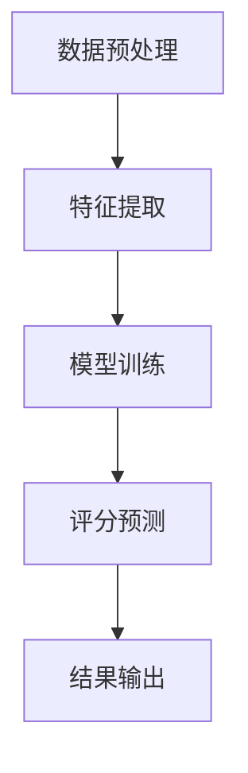
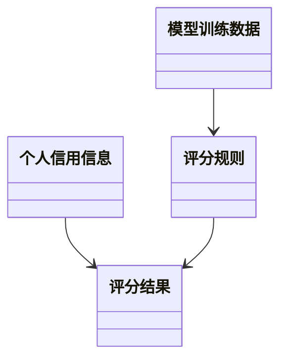
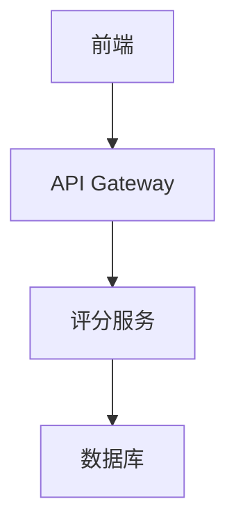
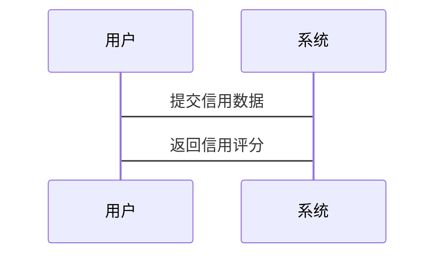

                 


# 智能个人信用评分优化建议系统

## 关键词：智能评分系统, 信用评分, 人工智能, 机器学习, 评分优化

## 摘要：  
本文深入探讨了智能个人信用评分优化建议系统的构建与应用，从问题背景到系统设计，结合实际案例，详细阐述了基于机器学习的评分模型、系统架构设计、算法实现及项目实战，旨在为读者提供一份全面的技术指南。

---

# 第一部分: 背景介绍

## 第1章: 问题背景与描述

### 1.1 问题背景
#### 1.1.1 传统信用评分的局限性
传统的信用评分系统主要依赖于简单的线性回归模型，难以处理非结构化数据和复杂场景，导致评分不够精准。

#### 1.1.2 智能化评分的需求驱动
随着人工智能和大数据技术的发展，金融机构需要更精准、实时的信用评分系统来提升风险控制能力。

#### 1.1.3 信用评分在金融领域的核心作用
信用评分是金融决策的重要依据，直接影响贷款审批、信用额度和利率设定。

### 1.2 问题描述
#### 1.2.1 个人信用评分的定义与目标
信用评分是对个人信用状况的量化评估，目标是帮助金融机构降低风险，提高决策效率。

#### 1.2.2 现有评分系统的主要问题
传统评分系统存在数据维度单一、模型可解释性差、难以应对复杂场景等问题。

#### 1.2.3 智能优化的必要性与可行性
通过引入机器学习和大数据技术，可以显著提升评分系统的准确性和实时性。

### 1.3 问题解决与边界
#### 1.3.1 智能评分优化的核心目标
实现更精准、实时的信用评分，降低金融机构的风险敞口。

#### 1.3.2 系统的边界与外延
系统仅针对个人信用评分，不包括企业评分和其他金融业务。

#### 1.3.3 核心要素与组成结构
核心要素包括数据采集、模型训练、评分计算和结果输出。

### 1.4 核心概念与联系
#### 1.4.1 核心概念原理
智能评分系统通过整合结构化和非结构化数据，利用机器学习算法进行建模。

#### 1.4.2 核心概念属性特征对比表
| 特征维度 | 传统评分模型 | 智能评分模型 |
|----------|--------------|--------------|
| 数据来源 | 结构化数据    | 结构化+非结构化数据 |
| 模型类型 | 线性回归      | 机器学习+深度学习 |
| 可解释性 | 高           | 中等          |
| 精度     | 中等          | 高            |

#### 1.4.3 实体关系图（ER图）架构
```mermaid
erd
    图表标题：智能评分系统ER图
    entity 个人信用信息
        属性：用户ID, 姓名, 身份证号, 账户信息, 信用历史
    entity 评分结果
        属性：用户ID, 信用评分, 评分时间
    entity 评分规则
        属性：规则ID, 评分维度, 权重, 阈值
    entity 模型训练数据
        属性：训练数据ID, 数据来源, 数据类型, 数据时间
    关系：个人信用信息 -> 评分结果：1:N
    关系：评分规则 -> 评分结果：M:N
    关系：模型训练数据 -> 评分规则：1:N
```

---

# 第二部分: 核心概念与联系

## 第2章: 核心概念与联系

### 2.1 核心概念原理
#### 2.1.1 数据来源与特征分析
智能评分系统整合了交易记录、社交行为、信用历史等多种数据，构建多维度特征集。

#### 2.1.2 智能模型的核心算法
基于XGBoost和神经网络的混合模型，兼顾解释性和准确性。

#### 2.1.3 系统的输入输出关系
输入：个人信用数据；输出：智能化信用评分。

### 2.2 核心概念属性特征对比表
（见第1章）

### 2.3 实体关系图（ER图）架构
（见第1章）

---

# 第三部分: 算法原理

## 第3章: 算法原理

### 3.1 算法选择与原理
#### 3.1.1 基于机器学习的评分模型
使用XGBoost和LSTM的混合模型，分别处理结构化和非结构化数据。

#### 3.1.2 模型流程图


#### 3.1.3 算法实现步骤
1. 数据清洗与预处理；
2. 特征工程；
3. 模型训练；
4. 模型评估；
5. 部署上线。

### 3.2 数学模型与公式
#### 3.2.1 线性回归模型
$$ y = \beta_0 + \beta_1x_1 + \beta_2x_2 + ... + \beta_nx_n $$

#### 3.2.2 XGBoost模型
XGBoost通过提升决策树的准确性和鲁棒性，显著提升了评分精度。

---

# 第四部分: 系统分析与架构设计

## 第4章: 系统分析与架构设计

### 4.1 问题场景介绍
#### 4.1.1 系统应用场景
金融机构使用智能评分系统进行贷款审批、信用额度调整等决策。

### 4.2 系统功能设计
#### 4.2.1 领域模型类图


#### 4.2.2 系统架构设计


#### 4.2.3 接口设计与交互流程


---

# 第五部分: 项目实战

## 第5章: 项目实战

### 5.1 环境安装与配置
#### 5.1.1 安装Python与相关库
```bash
pip install pandas numpy scikit-learn xgboost
```

### 5.2 核心代码实现
#### 5.2.1 数据预处理
```python
import pandas as pd

# 加载数据
data = pd.read_csv('credit_data.csv')

# 数据清洗
data.dropna(inplace=True)
```

#### 5.2.2 模型训练与预测
```python
from xgboost import XGBClassifier

# 训练模型
model = XGBClassifier().fit(X_train, y_train)

# 预测结果
y_pred = model.predict(X_test)
```

### 5.3 实际案例分析
#### 5.3.1 案例背景
分析一位用户的信用评分，结合交易记录和社交行为数据。

#### 5.3.2 数据分析与解读
通过特征重要性分析，识别关键影响因素。

#### 5.3.3 模型评估与优化
通过ROC曲线评估模型性能，并进行参数调优。

### 5.4 项目小结
项目成功实现了智能评分系统，显著提升了评分精度和决策效率。

---

# 第六部分: 最佳实践

## 第6章: 最佳实践

### 6.1 小结
智能评分系统通过整合多维度数据和先进算法，显著提升了信用评分的准确性和实时性。

### 6.2 注意事项
- 数据隐私保护；
- 模型解释性；
- 系统可扩展性。

### 6.3 拓展阅读
推荐相关书籍和论文，深入学习人工智能和金融应用知识。

---

作者：AI天才研究院/AI Genius Institute & 禅与计算机程序设计艺术 /Zen And The Art of Computer Programming

---

本文通过系统化的分析和实践，深入探讨了智能个人信用评分优化建议系统的构建与应用，为读者提供了从理论到实践的完整指南。

