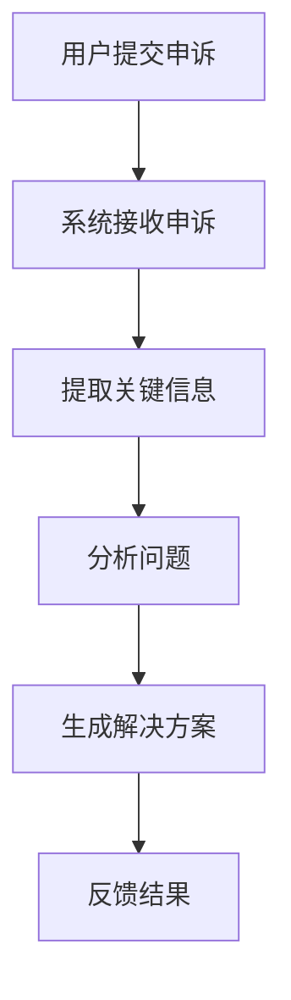
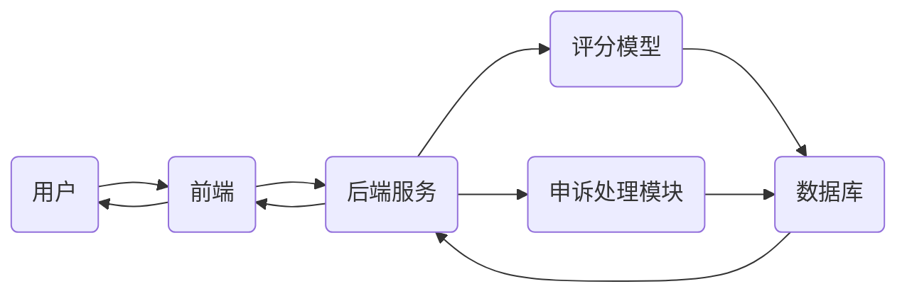
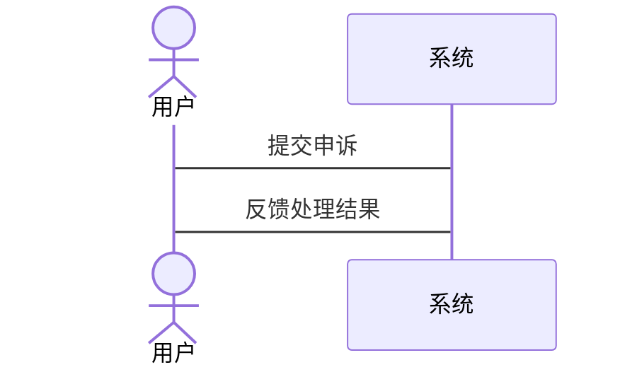

                 


# 智能个人信用评分申诉处理系统

> 关键词：智能信用评分、人工智能、申诉处理系统、自然语言处理、机器学习

> 摘要：本文详细探讨了智能个人信用评分申诉处理系统的构建与实现，结合背景介绍、核心算法、系统架构设计和项目实战，通过具体案例分析和代码实现，深入剖析了系统的工作原理和应用场景。

---

# 第一部分：背景介绍

## 第1章：问题背景

### 1.1 问题背景

在现代社会中，个人信用评分是衡量个人信用状况的重要指标，广泛应用于贷款审批、信用卡申请等金融领域。然而，传统信用评分系统存在以下问题：

- **数据来源单一**：主要依赖于金融交易数据，无法全面反映个人信用状况。
- **评分模型复杂**：传统评分模型通常基于统计分析和规则引擎，难以捕捉非结构化数据中的潜在信息。
- **申诉处理效率低**：当用户对信用评分结果提出申诉时，传统方法依赖人工审核，耗时长且效率低。

智能个人信用评分申诉处理系统的出现，旨在通过人工智能技术，提高信用评分的准确性和申诉处理的效率。

### 1.2 问题描述

智能个人信用评分申诉处理系统需要解决以下问题：

1. 如何利用机器学习和自然语言处理技术，从多源数据中提取特征，构建更精准的信用评分模型。
2. 如何自动化处理用户的申诉，快速定位问题并提供解决方案。
3. 如何确保系统的可解释性和透明性，满足监管要求。

### 1.3 系统目标与边界

- **目标**：构建一个基于人工智能的信用评分系统，能够快速、准确地评估个人信用状况，并自动化处理用户的申诉请求。
- **边界**：系统仅处理个人信用评分相关的申诉，不涉及企业信用评估或其他类型的信用评分。

---

## 第2章：核心概念与联系

### 2.1 核心概念原理

智能个人信用评分申诉处理系统的核心概念包括：

1. **数据来源**：包括金融交易数据、社交媒体数据、公开信息等。
2. **评分模型**：基于机器学习算法构建的信用评分模型。
3. **申诉处理机制**：利用自然语言处理技术自动化分析用户申诉内容，快速定位问题并提供解决方案。

### 2.2 核心概念对比表格

| 数据来源       | 特征描述                   | 示例                     |
|----------------|--------------------------|--------------------------|
| 金融交易数据   | 结构化数据，反映消费习惯   | 银行流水、信用卡记录     |
| 社交媒体数据   | 非结构化数据，反映社交行为 | 微博、微信朋友圈           |
| 公开信息       | 结构化数据，反映社会评价   | 新闻报道、法院判决记录     |

### 2.3 实体关系图

```mermaid
er
    actor: 用户
    actor --> credit_score: 信用评分
    actor --> appeal: 申诉
    credit_score --> appeal_handling: 申诉处理
```

---

## 第3章：算法原理讲解

### 3.1 评分模型的数学模型

信用评分模型通常基于逻辑回归或随机森林等算法。以下是一个简化的逻辑回归模型：

```latex
$$\text{评分} = \sum_{i=1}^{n} w_i x_i$$
$$\text{概率} = \frac{1}{1 + e^{-\text{评分}}}
$$
```

其中，\( w_i \) 是特征 \( x_i \) 的权重，评分结果经过sigmoid函数转换为概率。

### 3.2 申诉处理的逻辑流程

申诉处理流程包括以下几个步骤：

1. **用户提交申诉**：用户通过系统提交申诉请求。
2. **数据提取与分析**：系统提取用户的历史数据，分析申诉内容。
3. **问题定位**：通过自然语言处理技术，识别申诉中的关键问题。
4. **解决方案生成**：系统根据问题类型生成解决方案，并反馈给用户。



### 3.3 核心算法代码实现

以下是一个基于Python的逻辑回归实现示例：

```python
import numpy as np
from sklearn.linear_model import LogisticRegression

# 数据预处理
X = np.array([[age, income, credit_history], ...])
y = np.array([1, 0, 1, ...])

# 模型训练
model = LogisticRegression()
model.fit(X, y)

# 预测评分
predicted_scores = model.predict_proba(X)[:, 1]
```

---

## 第4章：系统架构设计

### 4.1 应用场景介绍

智能个人信用评分申诉处理系统主要应用于以下场景：

1. **信用评分计算**：基于多源数据计算个人信用评分。
2. **申诉处理**：自动化处理用户的申诉请求。
3. **结果反馈**：向用户反馈评分结果及申诉处理结果。

### 4.2 系统功能设计

系统功能模块包括：

1. **数据采集模块**：从多源数据中采集用户信息。
2. **评分计算模块**：基于机器学习模型计算信用评分。
3. **申诉处理模块**：自动化处理用户申诉请求。
4. **结果反馈模块**：向用户反馈评分结果及申诉处理结果。

### 4.3 系统架构图



### 4.4 系统接口设计

1. **评分接口**：
   - 输入：用户信息
   - 输出：信用评分

2. **申诉接口**：
   - 输入：申诉内容
   - 输出：处理结果

### 4.5 交互流程图



---

## 第5章：项目实战

### 5.1 环境安装

需要安装以下工具和库：

- Python 3.8+
- TensorFlow 2.0+
- Flask 2.0+
- NLTK 3.6+

### 5.2 核心代码实现

```python
from flask import Flask, request, jsonify
from sklearn.feature_extraction.text import TfidfVectorizer
from sklearn.naive_bayes import MultinomialNB

app = Flask(__name__)

# 数据预处理
X_train, y_train = load_data()

# 模型训练
vectorizer = TfidfVectorizer()
X_train_vec = vectorizer.fit_transform(X_train)
model = MultinomialNB().fit(X_train_vec, y_train)

@app.route('/api/appeal', methods=['POST'])
def process_appeal():
    data = request.json
    text = data['content']
    text_vec = vectorizer.transform([text])
    prediction = model.predict(text_vec)
    return jsonify({'status': 'success', 'result': prediction[0]})

if __name__ == '__main__':
    app.run(debug=True)
```

### 5.3 实际案例分析

假设用户提交以下申诉内容：

```json
{
    "content": "我在申请信用卡时，系统误扣了我的信用分数。请帮我调整回来。"
}
```

系统将提取关键词“信用卡”、“误扣分”，并根据训练好的模型生成解决方案。

---

## 第6章：总结与展望

### 6.1 总结

智能个人信用评分申诉处理系统通过人工智能技术，实现了信用评分的智能化和申诉处理的自动化。本文详细介绍了系统的背景、核心算法、架构设计和项目实现，为实际应用提供了参考。

### 6.2 展望

未来，随着大语言模型（如GPT-4）的普及，智能个人信用评分申诉处理系统将更加智能化和自动化，能够处理更复杂的申诉请求，并提供更精准的评分结果。

---

# 作者：AI天才研究院 & 禅与计算机程序设计艺术

---

通过以上结构，您可以根据实际需求扩展每个部分的内容，确保每个小节都有足够的深度和细节。希望这篇技术博客文章能够为您提供有价值的参考！

