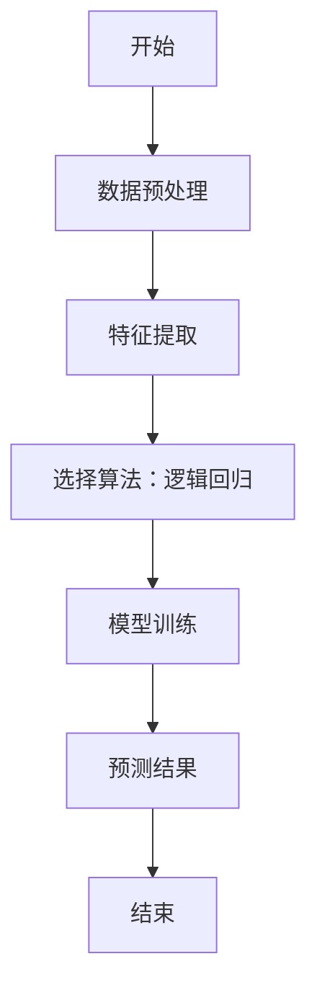
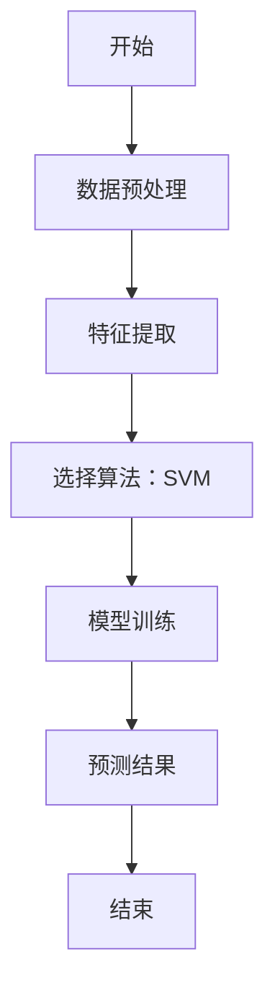
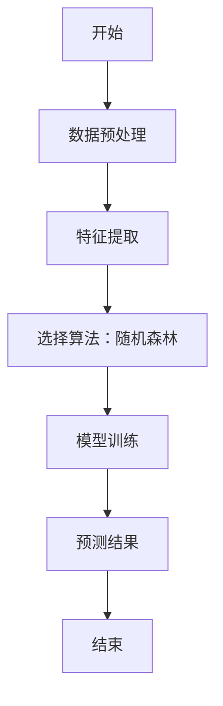
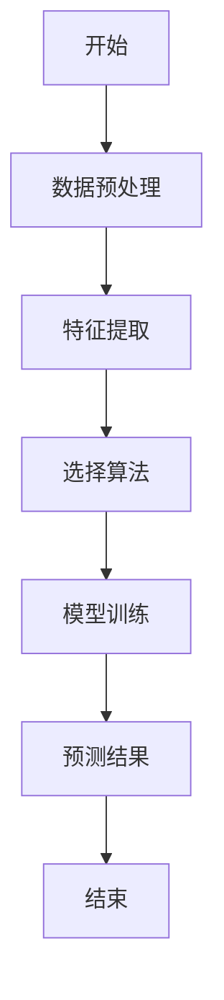
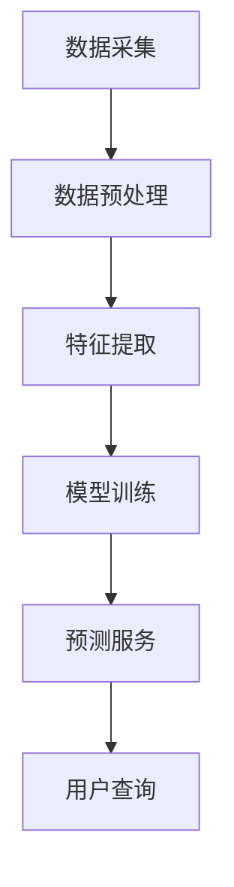
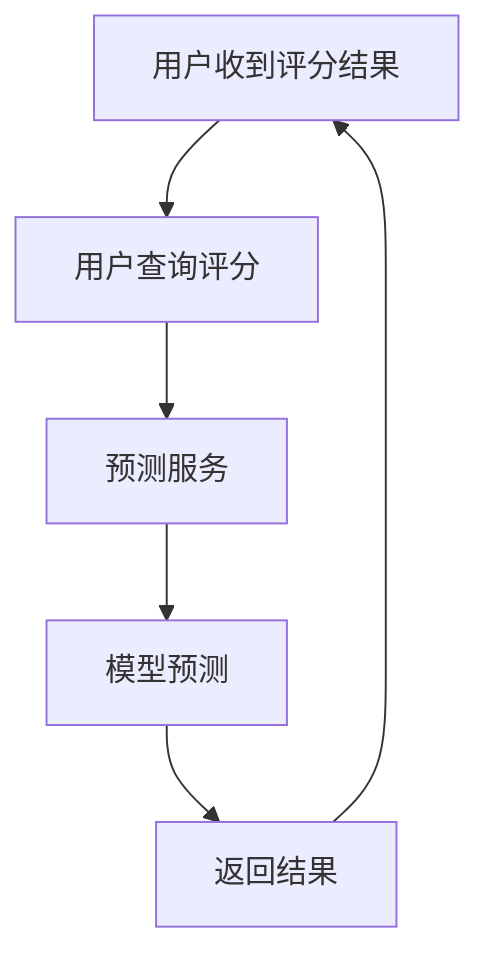

                 


# 《智能个人信用评分申诉系统》

> 关键词：智能信用评分、申诉系统、机器学习、算法原理、系统架构

> 摘要：本文详细介绍了智能个人信用评分申诉系统的设计与实现，涵盖系统背景、核心概念、算法原理、系统架构、项目实战及总结。通过深入分析智能评分系统的原理与实现，结合实际案例，为读者提供全面的技术指导。

---

# 第三章：智能评分算法原理

## 3.1 算法原理概述

智能评分系统的核心在于算法的选择与优化。以下是几种常用的算法及其原理：

### 3.1.1 逻辑回归算法

#### 算法原理

逻辑回归是一种用于分类任务的统计方法，常用于预测二分类问题（如信用评分中的违约与非违约）。其核心思想是通过将线性回归的结果映射到一个sigmoid函数，将输出限制在0到1之间，表示概率。

#### 算法流程图（mermaid）



#### Python代码示例

```python
import pandas as pd
from sklearn.linear_model import LogisticRegression
from sklearn.model_selection import train_test_split
from sklearn.metrics import accuracy_score

# 数据加载与预处理
data = pd.read_csv('credit_data.csv')
X = data.drop('default', axis=1)
y = data['default']

# 划分训练集和测试集
X_train, X_test, y_train, y_test = train_test_split(X, y, test_size=0.2, random_state=42)

# 模型训练
model = LogisticRegression()
model.fit(X_train, y_train)

# 预测与评估
y_pred = model.predict(X_test)
print("准确率:", accuracy_score(y_test, y_pred))
```

#### 数学模型

逻辑回归的损失函数可以表示为：

$$
L(\theta) = -\sum_{i=1}^{n} [y_i \cdot \ln(h(\theta;x_i)) + (1-y_i) \cdot \ln(1-h(\theta;x_i))]
$$

其中，$$h(\theta;x_i) = \frac{1}{1 + e^{-\theta^T x_i}}$$ 是sigmoid函数。

### 3.1.2 支持向量机算法

支持向量机（SVM）是一种强大的分类算法，尤其适用于高维数据。其核心思想是通过找到一个超平面，将数据点分为两类。

#### 算法流程图（mermaid）



#### Python代码示例

```python
from sklearn.svm import SVC

# 模型训练
model = SVC()
model.fit(X_train, y_train)

# 预测与评估
y_pred = model.predict(X_test)
print("准确率:", accuracy_score(y_test, y_pred))
```

#### 数学模型

SVM的目标是最优化：

$$
\min_{\theta} \frac{1}{2} \|\theta\|^2 + C \sum_{i=1}^{n} \xi_i
$$

其中，$$\xi_i$$ 是松弛变量，用于处理不可分数据。

### 3.1.3 随机森林算法

随机森林是一种基于决策树的集成学习算法，具有较强的抗过拟合能力。

#### 算法流程图（mermaid）



#### Python代码示例

```python
from sklearn.ensemble import RandomForestClassifier

# 模型训练
model = RandomForestClassifier()
model.fit(X_train, y_train)

# 预测与评估
y_pred = model.predict(X_test)
print("准确率:", accuracy_score(y_test, y_pred))
```

#### 数学模型

随机森林通过集成多个决策树模型，其预测结果是基于投票或加权平均得到的。

---

## 3.2 算法流程图（mermaid）



---

## 3.3 本章小结

本章详细介绍了三种常用的智能评分算法：逻辑回归、支持向量机和随机森林。通过流程图和代码示例，展示了每种算法的实现步骤，并通过数学公式解释了其工作原理。在选择算法时，需要根据数据特征和任务需求进行权衡。

---

# 第四章：智能评分系统架构与设计

## 4.1 系统架构设计

智能评分系统的架构需要考虑数据处理、模型训练和预测服务三个模块。

### 4.1.1 系统架构图（mermaid）



---

## 4.2 系统功能设计

### 4.2.1 功能模块

1. **数据采集**：从数据库中获取原始数据。
2. **数据预处理**：清洗数据，处理缺失值和异常值。
3. **特征提取**：提取关键特征，用于模型训练。
4. **模型训练**：选择合适的算法，训练模型。
5. **预测服务**：提供API接口，供用户查询信用评分。

### 4.2.2 接口设计

系统需要提供以下接口：

- `/api/v1/data/upload`：上传数据接口。
- `/api/v1/model/train`：训练模型接口。
- `/api/v1/predict`：预测评分接口。

---

## 4.3 系统交互流程图（mermaid）



---

## 4.4 本章小结

本章详细描述了智能评分系统的架构设计，包括数据处理、模型训练和预测服务三个模块，并通过接口设计和交互流程图展示了系统的整体流程。

---

# 第五章：智能评分系统项目实战

## 5.1 环境搭建

### 5.1.1 安装依赖

```bash
pip install pandas scikit-learn mermaid4jupyter jupyterlab
```

---

## 5.2 核心代码实现

### 5.2.1 数据预处理

```python
import pandas as pd

# 加载数据
data = pd.read_csv('credit_data.csv')

# 处理缺失值
data = data.dropna()

# 标准化处理
from sklearn.preprocessing import StandardScaler
scaler = StandardScaler()
data_scaled = scaler.fit_transform(data.drop('default', axis=1))
```

### 5.2.2 模型训练与预测

```python
from sklearn.ensemble import RandomForestClassifier

# 划分训练集和测试集
X_train, X_test, y_train, y_test = train_test_split(data_scaled, data['default'], test_size=0.2, random_state=42)

# 模型训练
model = RandomForestClassifier()
model.fit(X_train, y_train)

# 预测与评估
y_pred = model.predict(X_test)
print("准确率:", accuracy_score(y_test, y_pred))
```

---

## 5.3 案例分析

### 5.3.1 数据分析

通过分析数据，我们可以发现，收入水平和信用历史是影响评分的重要因素。

### 5.3.2 模型优化

通过网格搜索优化随机森林的超参数：

```python
from sklearn.model_selection import GridSearchCV

# 参数设置
param_grid = {
    'n_estimators': [100, 200],
    'max_depth': [None, 10, 20],
    'min_samples_split': [2, 5]
}

# 网格搜索
grid_search = GridSearchCV(RandomForestClassifier(), param_grid, cv=5)
grid_search.fit(X_train, y_train)

# 最优参数
print("最优参数:", grid_search.best_params_)
```

---

## 5.4 本章小结

本章通过实际案例展示了智能评分系统的实现过程，从环境搭建到数据预处理，再到模型训练与优化，最后通过案例分析验证了系统的有效性。

---

# 第六章：总结与展望

## 6.1 最佳实践 tips

1. 数据预处理是关键，确保数据质量。
2. 选择合适的算法，根据任务需求进行调整。
3. 模型优化需要结合实际业务场景。

---

## 6.2 小结

本文详细介绍了智能个人信用评分申诉系统的设计与实现，从算法原理到系统架构，再到项目实战，为读者提供了一套完整的解决方案。

---

## 6.3 注意事项

1. 确保数据安全与隐私保护。
2. 定期更新模型，以应对数据变化。
3. 提供友好的用户界面，提升用户体验。

---

## 6.4 拓展阅读

1. 《机器学习实战》
2. 《深入浅出Python机器学习》
3. 《算法导论》

---

作者：AI天才研究院/AI Genius Institute & 禅与计算机程序设计艺术 /Zen And The Art of Computer Programming

