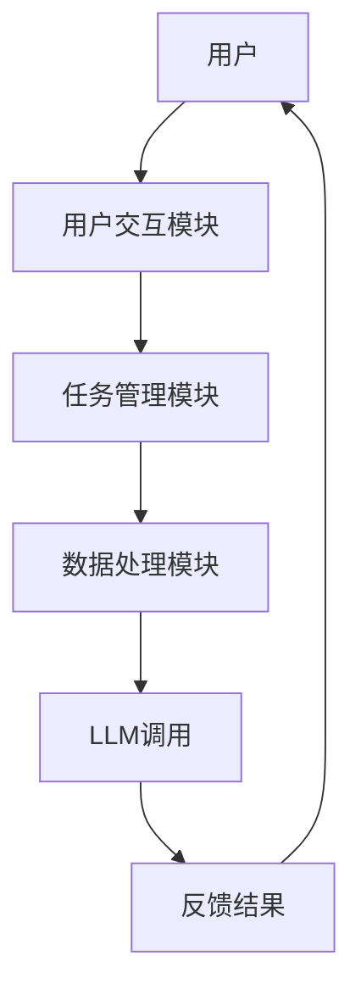

                 


# 智能个人助理AI Agent：LLM驱动的全方位生活助手

> 关键词：LLM，AI Agent，自然语言处理，智能助手，人工智能，大语言模型

> 摘要：随着大语言模型（LLM）的快速发展，智能个人助理AI Agent正在成为我们生活中不可或缺的工具。本文将深入探讨AI Agent的核心概念、技术原理、系统架构及实际应用，全面解析LLM驱动的AI Agent如何成为我们生活和工作的全方位助手。通过详细的技术分析和实际案例，我们将展示AI Agent在提升效率、优化决策和改善生活质量方面的巨大潜力。

---

## 引言

人工智能（AI）技术的快速发展，使得智能个人助理AI Agent逐渐成为我们生活中不可或缺的一部分。从智能手机上的语音助手到复杂的自动化系统，AI Agent通过大语言模型（LLM）的强大能力，为我们提供了一系列智能化的服务。本文将从技术原理、系统架构到实际应用，全面解析AI Agent的核心概念和实现细节，帮助读者深入了解这一前沿技术。

---

## 第一部分：AI Agent的核心概念与背景

### 第1章：AI Agent的基本概念与核心特征

#### 1.1 AI Agent的定义
AI Agent是一种能够感知环境、理解用户需求并执行任务的智能系统。它通过与用户交互，利用自然语言处理（NLP）技术，帮助用户完成信息查询、任务管理、决策支持等一系列操作。

#### 1.2 AI Agent的核心特征
- **智能化**：基于LLM的强大语言处理能力，AI Agent能够理解并生成自然语言文本。
- **自主性**：AI Agent能够自主决策并执行任务，无需人工干预。
- **适应性**：能够根据用户反馈和环境变化，动态调整行为策略。

### 第2章：AI Agent的发展背景

#### 2.1 人工智能技术的发展历程
人工智能技术自20世纪50年代以来经历了多次兴衰，但随着深度学习和大语言模型的突破，AI技术迎来了新的发展机遇。

#### 2.2 大语言模型（LLM）的崛起
大语言模型（如GPT-3、GPT-4）的出现，为AI Agent提供了强大的自然语言理解和生成能力。

#### 2.3 AI Agent的应用趋势
AI Agent正在从单一功能的工具向全方位的生活助手方向发展，涵盖工作、生活、健康等多个领域。

---

## 第二部分：AI Agent的核心概念与技术原理

### 第3章：LLM驱动的AI Agent技术基础

#### 3.1 大语言模型（LLM）的工作原理
LLM通过预训练和微调技术，能够理解上下文并生成自然语言文本。其核心是基于Transformer架构的深度神经网络。

#### 3.2 AI Agent与LLM的关系
AI Agent通过调用LLM API，将用户的输入转化为任务指令，并通过反馈机制优化交互体验。

### 第4章：AI Agent的系统架构设计

#### 4.1 系统功能模块
- **用户交互模块**：负责接收用户的输入并生成响应。
- **任务管理模块**：根据用户需求分解任务并执行。
- **数据处理模块**：处理和存储相关数据，支持后续任务。

#### 4.2 系统架构图


---

## 第三部分：AI Agent的算法原理与实现

### 第5章：LLM的训练与优化

#### 5.1 LLM的预训练过程
- **预训练目标**：通过无监督学习，模型在大规模文本数据上学习语言规律。
- **数学公式**：损失函数 $$ L = \sum_{i=1}^{n} \text{loss}(x_i, y_i) $$，其中$x_i$为输入，$y_i$为标签。

#### 5.2 微调与优化
- **微调目标**：针对特定任务，对LLM进行Fine-tuning。
- **优化算法**：常用Adam优化器，学习率调整策略为 $$ \eta_t = \eta_0 \times \frac{1}{1+\alpha t} $$。

### 第6章：RLHF与AI Agent的优化

#### 6.1 RLHF的原理
- **强化学习**：通过奖励机制，优化LLM的生成结果。
- **数学公式**：奖励函数 $$ R(y|x) = r(y, x) $$，其中$x$为输入，$y$为生成结果。

#### 6.2 AI Agent的优化策略
- **策略调整**：根据用户反馈，动态优化LLM的生成策略。

---

## 第四部分：AI Agent的系统实现与实战

### 第7章：系统实现

#### 7.1 开发环境与工具
- **编程语言**：Python
- **框架库**：Hugging Face、OpenAI API

#### 7.2 核心代码实现
```python
import openai

def ai_agent_handler(prompt):
    client = openai.Client()
    response = client.chat.completions.create(
        model="gpt-3.5-turbo",
        messages=[{"role": "user", "content": prompt}]
    )
    return response.choices[0].message.content
```

#### 7.3 应用场景分析
- **信息查询**：快速获取知识库中的信息。
- **任务执行**：自动化完成预约、提醒等任务。

---

## 第五部分：最佳实践与总结

### 第8章：最佳实践

#### 8.1 优化建议
- **数据质量**：确保训练数据的多样性和相关性。
- **模型选择**：根据任务需求选择合适的LLM模型。

#### 8.2 注意事项
- **隐私保护**：严格控制用户数据的使用和存储。
- **性能调优**：优化系统响应速度和资源利用率。

### 第9章：小结

AI Agent作为LLM驱动的智能助手，正在深刻改变我们的生活方式。通过本文的详细解析，读者可以全面了解AI Agent的核心技术、系统架构和实际应用。未来，随着AI技术的进一步发展，AI Agent将具备更多功能，为人类创造更大的价值。

---

## 作者

作者：AI天才研究院 & 禅与计算机程序设计艺术

--- 

这篇文章通过系统的分析和详细的讲解，全面介绍了智能个人助理AI Agent的技术原理和实现方法，帮助读者深入了解这一前沿领域的核心技术与应用。

