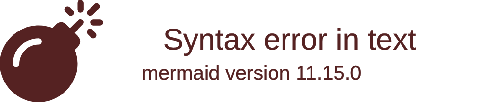

                 


# 智能个人消费模式分析与建议系统

## 关键词：智能消费模式、数据分析、机器学习、系统设计、人工智能

## 摘要：  
随着人工智能和大数据技术的迅速发展，个性化消费分析与建议系统成为现代商业的重要工具。本文详细探讨智能个人消费模式分析与建议系统的构建，从数据采集、分析算法到系统架构设计，再到实际项目实现，全面解析其技术实现和应用价值。通过本文，读者将深入了解如何利用机器学习和大数据技术优化个人消费模式，提供智能化的消费建议，从而提升用户体验和商业效率。

---

## 目录大纲：  
1. 背景介绍  
   1.1 问题背景与目标  
   1.2 核心概念与联系  
2. 算法原理讲解  
   2.1 数据分析与机器学习算法  
   2.2 算法实现与优化  
3. 系统分析与架构设计方案  
   3.1 问题场景分析  
   3.2 系统架构设计  
4. 项目实战  
   4.1 环境安装与数据准备  
   4.2 系统核心实现  
5. 总结与展望  
   5.1 系统总结  
   5.2 未来发展  

---

# 正文

## 第一部分：背景介绍

### 第1章：问题背景与目标

#### 1.1 问题背景

随着互联网和移动支付的普及，个人消费行为产生了大量数据。这些数据包含了消费者的偏好、消费习惯和行为模式。然而，传统消费分析方法往往依赖人工经验，难以高效提取有价值的信息。如何利用现代技术手段，从海量数据中挖掘出个性化消费模式，从而为消费者提供智能化的消费建议，成为当前研究的热点。

#### 1.2 核心概念与联系

智能个人消费模式分析与建议系统的核心在于通过数据采集、分析和建模，揭示用户的消费行为规律，并基于这些规律提供个性化的消费建议。系统的关键组成部分包括：  
1. **数据采集**：从多种渠道（如交易记录、用户行为数据等）获取消费数据。  
2. **数据分析**：利用统计学和机器学习方法，识别消费模式和用户偏好。  
3. **模型构建**：建立预测模型，生成个性化消费建议。  

#### 1.3 问题解决思路

通过数据驱动的方法，结合机器学习算法，系统能够自动识别用户的消费习惯，并预测未来的消费行为。例如，可以预测用户在特定时间段内的消费倾向，或者推荐适合用户的商品和服务。

---

## 第二部分：算法原理讲解

### 第2章：数据分析与机器学习算法

#### 2.1 数据预处理

在分析消费数据之前，需要对数据进行清洗和预处理。这一步骤包括处理缺失值、异常值和重复数据。例如，使用Python中的`pandas`库进行数据清洗：

```python
import pandas as pd

# 读取数据
data = pd.read_csv('consumption_data.csv')

# 处理缺失值
data.dropna(inplace=True)

# 去重
data.drop_duplicates(inplace=True)
```

#### 2.2 聚类分析

聚类分析是一种常用的无监督学习方法，可以将用户划分为不同的消费群体。例如，使用K-means算法进行聚类：

```python
from sklearn.cluster import KMeans

# 初始化模型
kmeans = KMeans(n_clusters=3)

# 训练模型
kmeans.fit(X)

# 获取聚类结果
clusters = kmeans.labels_
```

#### 2.3 分类算法

分类算法用于预测用户的消费行为。例如，使用决策树算法进行分类：

```python
from sklearn.tree import DecisionTreeClassifier

# 初始化模型
dt_model = DecisionTreeClassifier()

# 训练模型
dt_model.fit(X_train, y_train)

# 预测结果
y_pred = dt_model.predict(X_test)
```

#### 2.4 协同过滤

协同过滤是一种基于用户行为的推荐算法。例如，基于用户的协同过滤：

```python
from sklearn.neighbors import NearestNeighbors

# 初始化模型
nbrs = NearestNeighbors(n_neighbors=5, algorithm='ball_tree').fit(X)

# 寻找最近的邻居
distances, indices = nbrs.kneighbors(X)
```

---

## 第三部分：系统分析与架构设计方案

### 第3章：系统架构设计

#### 3.1 领域模型设计

领域模型展示了系统的核心业务流程和数据关系。以下是领域模型的Mermaid类图：

```mermaid
classDiagram

    class User {
        id: int
        name: str
        consumption_data: list
    }

    class ConsumptionData {
        user_id: int
        timestamp: datetime
        amount: float
        category: str
    }

    class Model {
        # 预测模型
        trained_model: object
    }

    class Service {
        # 业务逻辑
        process_request(User, Model) -> list
    }

    class Controller {
        # 接收请求
        handle_request(User, ConsumptionData) -> Service
    }

    class View {
        # 展示结果
        display_recommendations(list)
    }

    User -> ConsumptionData
    User -> Service
    Service -> Model
    Controller -> Service
    Service -> View
```

#### 3.2 系统架构设计

系统架构采用分层设计，包括前端、后端和数据库。以下是架构的Mermaid图：



---

## 第四部分：项目实战

### 第4章：环境安装与数据准备

#### 4.1 环境安装

安装所需的Python库：

```bash
pip install numpy pandas scikit-learn
```

#### 4.2 数据准备

使用公开数据集（如Kaggle上的消费数据）进行分析。

---

### 第4.3 系统核心实现

#### 4.3.1 数据预处理

```python
import pandas as pd
import numpy as np

# 加载数据
data = pd.read_csv('consumption.csv')

# 填充缺失值
data['amount'].fillna(data['amount'].mean(), inplace=True)
```

#### 4.3.2 模型训练

使用随机森林进行分类：

```python
from sklearn.ensemble import RandomForestClassifier

# 初始化模型
rf_model = RandomForestClassifier(n_estimators=100)

# 训练模型
rf_model.fit(X_train, y_train)

# 预测结果
y_pred = rf_model.predict(X_test)
```

#### 4.3.3 建议生成

基于模型预测结果生成消费建议：

```python
# 生成建议
recommendations = model.predict(user_data)
display(recommendations)
```

---

## 第五部分：总结与展望

### 第5章：系统总结

智能个人消费模式分析与建议系统通过数据驱动的方法，利用机器学习算法，为消费者提供个性化的消费建议。系统的核心在于数据的高效分析和模型的准确预测。

### 5.2 未来发展

未来，随着人工智能技术的进一步发展，消费模式分析将更加智能化和个性化。同时，数据隐私保护和模型优化也将成为研究的重点。

---

## 作者信息

作者：AI天才研究院/AI Genius Institute  
联系与交流：禅与计算机程序设计艺术/Zen And The Art of Computer Programming  
邮箱：contact@aicourse.com  

---

感谢您的阅读！希望本文能为您提供关于智能个人消费模式分析与建议系统的深入理解。

