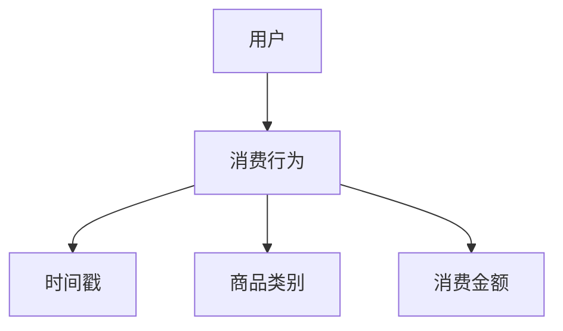
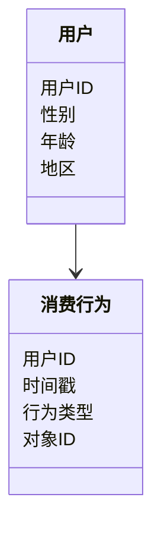
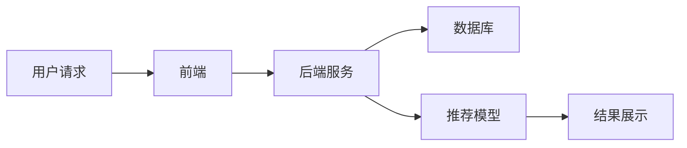
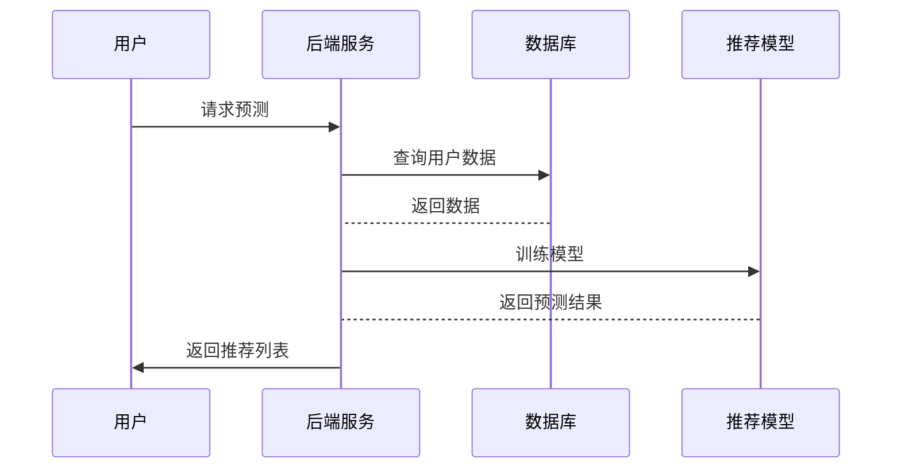

                 


# 智能个人消费行为分析与预测

> 关键词：智能消费行为，数据分析，机器学习，预测模型，用户画像

> 摘要：本文旨在探讨如何利用人工智能技术进行个人消费行为的智能分析与预测，涵盖从数据采集到模型构建的完整流程，深入分析算法原理与系统架构设计，并通过实际案例展示应用场景与实现细节。

---

# 第1章: 背景介绍

## 1.1 问题背景

### 1.1.1 个人消费行为分析的必要性
个人消费行为分析是商业智能领域的重要组成部分，通过对用户消费数据的分析，企业可以更好地理解用户需求，优化产品策略，提升用户体验。智能分析与预测能够帮助企业实现精准营销，降低运营成本，提高市场竞争力。

### 1.1.2 当前消费行为分析的技术挑战
随着数据量的激增和用户行为的复杂化，传统的统计分析方法已难以满足需求。如何从海量数据中提取有效特征，构建高效的预测模型，成为当前技术挑战的核心。

### 1.1.3 智能分析与预测的核心价值
智能分析与预测能够实时捕捉用户行为变化，提供动态的决策支持，帮助企业在市场竞争中占据优势地位。

## 1.2 问题描述

### 1.2.1 消费行为的多维度特征
消费行为不仅包括直接的购买记录，还包括用户的浏览、收藏、评价等行为数据，这些数据构成了用户行为的多维度特征。

### 1.2.2 数据驱动的分析需求
通过数据驱动的方法，可以提取用户行为的潜在规律，从而为预测模型提供可靠的基础。

### 1.2.3 个性化预测的实现路径
个性化预测需要结合用户的历史行为数据、兴趣偏好和实时行为数据，构建动态的用户画像。

## 1.3 问题解决

### 1.3.1 数据采集与处理方法
数据采集是分析的基础，需要通过日志系统、数据库等方式获取用户行为数据，并进行清洗和预处理。

### 1.3.2 特征提取与选择策略
特征提取是关键，需要从数据中提取有效的特征，并选择对预测目标影响较大的特征。

### 1.3.3 模型训练与优化方案
基于特征的数据，构建预测模型，并通过交叉验证和调参优化模型性能。

## 1.4 边界与外延

### 1.4.1 数据范围的界定
需要明确数据的时间范围、用户范围和行为类型。

### 1.4.2 消费场景的限制
消费行为分析需要结合具体的消费场景，如电商、社交网络等。

### 1.4.3 智能预测的边界条件
智能预测需要明确模型的有效性和适用范围。

## 1.5 核心要素组成

### 1.5.1 数据来源与类型
数据来源包括用户日志、交易记录、用户反馈等，数据类型包括结构化和非结构化数据。

### 1.5.2 分析模型与算法
常用的模型包括协同过滤、聚类分析、神经网络等。

### 1.5.3 预测结果的输出形式
预测结果可以是概率值、推荐列表或用户分组等。

---

# 第2章: 核心概念与联系

## 2.1 智能个人消费行为分析的核心概念

### 2.1.1 数据驱动的分析方法
数据驱动的方法依赖于大量数据的收集和分析，以发现用户行为的模式和规律。

### 2.1.2 个性化预测模型
个性化预测模型根据用户的历史行为和特征，预测用户的未来行为。

### 2.1.3 消费行为特征提取
特征提取是从原始数据中提取对预测有帮助的特征，例如用户的购买频率、购买时间等。

## 2.2 核心概念的属性特征对比

表2-1: 核心概念属性特征对比表

| 概念         | 属性               | 特征描述                                                                 |
|--------------|--------------------|--------------------------------------------------------------------------|
| 用户行为      | 时间戳             | 行为发生的时间点                                                       |
|              | 行为类型           | 浏览、点击、购买等行为类型                                             |
|              | 对象               | 行为作用的对象，如商品、网页等                                         |
| 用户画像      | 性别               | 用户的性别                                                             |
|              | 年龄               | 用户的年龄                                                             |
|              | 兴趣偏好           | 用户的兴趣爱好                                                         |

## 2.3 ER实体关系图架构



---

# 第3章: 算法原理讲解

## 3.1 协同过滤算法

### 3.1.1 基于用户的协同过滤
基于用户的协同过滤通过寻找与目标用户相似的用户群体，推荐这些用户喜欢的商品。

### 3.1.2 基于物品的协同过滤
基于物品的协同过滤通过分析商品之间的相似性，推荐与目标用户已购买商品相似的商品。

### 3.1.3 混合协同过滤的实现
混合协同过滤结合了基于用户和基于物品的协同过滤方法，通过加权的方式提高推荐的准确性和多样性。

## 3.2 聚类分析算法

### 3.2.1 K-means聚类
K-means聚类算法通过将用户分成不同的簇，每个簇内的用户具有相似的消费行为。

### 3.2.2 层次聚类
层次聚类通过构建树状结构，逐步合并相似的用户或商品，形成用户分组。

### 3.2.3 DBSCAN密度聚类
DBSCAN算法基于密度的概念，自动识别数据中的簇，适用于用户行为的复杂场景。

## 3.3 神经网络算法

### 3.3.1 卷积神经网络（CNN）
CNN常用于处理图像数据，但在文本序列数据中也具有广泛的应用。

### 3.3.2 循环神经网络（RNN）
RNN适合处理序列数据，能够捕捉用户行为的时间依赖性。

### 3.3.3 长短期记忆网络（LSTM）
LSTM通过记忆单元捕获长期依赖关系，适合处理复杂的时间序列数据。

---

# 第4章: 数学模型

## 4.1 协同过滤的数学模型

### 4.1.1 基于用户的协同过滤公式
$$ \hat{r}_{u,i} = \mu + \sum_{v \in N(u)} (w_{u,v})(r_{v,i} - \mu) $$

### 4.1.2 基于物品的协同过滤公式
$$ \hat{r}_{u,i} = \mu + \sum_{j \in N(i)} (w_{i,j})(r_{u,j} - \mu) $$

## 4.2 聚类分析的数学模型

### 4.2.1 K-means算法
目标函数：$$ \sum_{i=1}^{k} \sum_{j \in C_i} (x_j - \mu_i)^2 $$

### 4.2.2 层次聚类
相似性度量：$$ d(x, y) = \sqrt{(x_1 - y_1)^2 + (x_2 - y_2)^2} $$

## 4.3 神经网络的数学模型

### 4.3.1 RNN模型
递推公式：$$ s_t = \tanh(W_{hh} s_{t-1} + W_{xh} x_t) $$
输出：$$ y_t = W_{hy} s_t + b_y $$

---

# 第5章: 系统分析与架构设计

## 5.1 系统功能设计

### 5.1.1 领域模型设计


### 5.1.2 系统架构设计


### 5.1.3 系统接口设计
API接口：`POST /api/predict`

### 5.1.4 系统交互设计


---

# 第6章: 项目实战

## 6.1 环境安装

### 6.1.1 安装Python
```bash
python --version
```

### 6.1.2 安装依赖
```bash
pip install numpy pandas scikit-learn
```

## 6.2 核心实现

### 6.2.1 数据预处理
```python
import pandas as pd

data = pd.read_csv('user_behavior.csv')
```

### 6.2.2 特征提取
```python
from sklearn.preprocessing import StandardScaler

scaler = StandardScaler()
features = scaler.fit_transform(data[['age', 'region']])
```

### 6.2.3 模型训练
```python
from sklearn.cluster import KMeans

model = KMeans(n_clusters=3)
model.fit(features)
```

## 6.3 实际案例分析

### 6.3.1 电商用户购买行为预测
通过分析用户的浏览、收藏、加购行为，预测用户的购买概率。

---

# 第7章: 小结

## 7.1 最佳实践 tips

### 7.1.1 数据质量
数据清洗和预处理是模型训练的基础。

### 7.1.2 模型选择
根据数据特性和业务需求选择合适的算法。

### 7.1.3 交叉验证
通过交叉验证优化模型参数，提高模型的泛化能力。

## 7.2 小结
智能个人消费行为分析与预测是一个复杂但具有重要应用价值的领域，通过数据驱动的方法和机器学习技术，可以实现对用户行为的精准预测，为企业提供有力的决策支持。

## 7.3 注意事项

### 7.3.1 数据隐私
在数据采集和处理过程中，需要注意用户隐私保护。

### 7.3.2 模型解释性
复杂的模型可能缺乏解释性，需要结合业务场景选择合适的模型。

### 7.3.3 实时性
实时预测需要高效的系统架构设计和快速的响应能力。

## 7.4 拓展阅读
推荐阅读《集体智慧编程》和《机器学习实战》等书籍，深入理解智能分析与预测的核心技术。

---

作者：AI天才研究院/AI Genius Institute & 禅与计算机程序设计艺术 /Zen And The Art of Computer Programming

