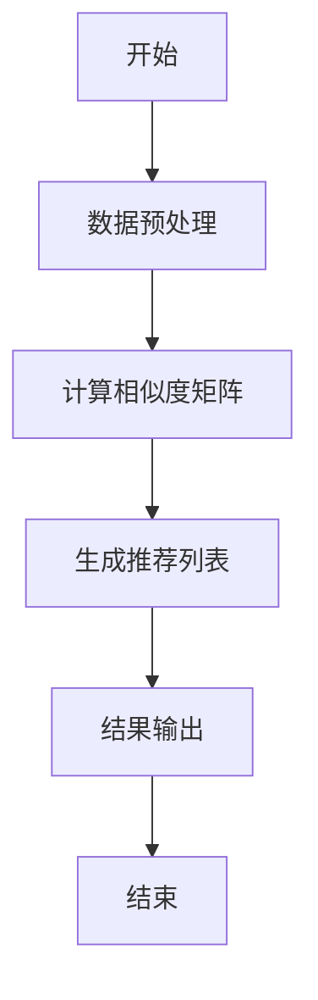
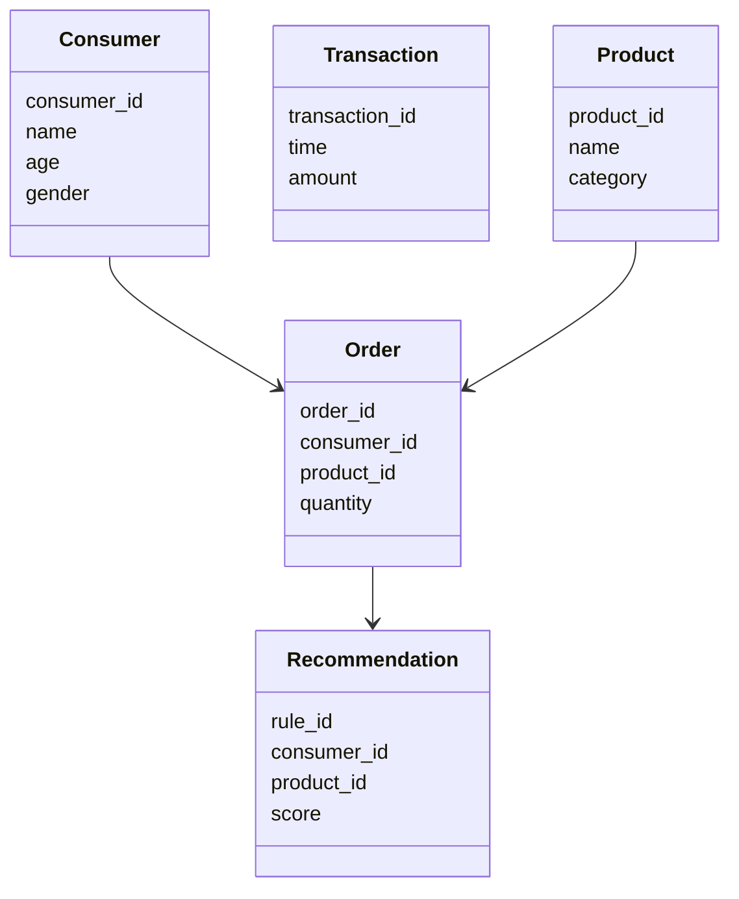
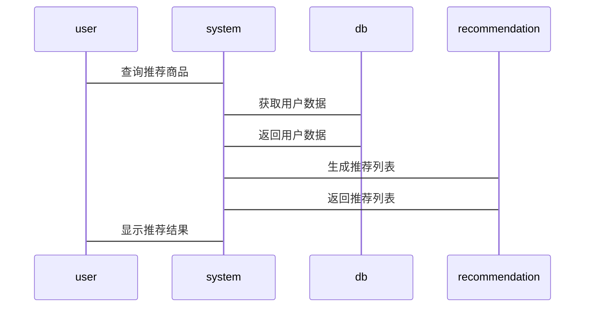

                 


# 智能个人消费行为分析系统

## 关键词：
智能消费分析，行为预测，数据挖掘，机器学习，推荐系统

## 摘要：
本文详细介绍了智能个人消费行为分析系统的构建与应用，从背景到核心概念，从算法原理到系统架构，再到项目实战，全面解析了如何利用人工智能技术进行个人消费行为分析，助力精准营销与决策优化。

---

## 目录大纲：

### 第一部分：背景介绍

#### 第1章：问题背景与系统概述

##### 1.1 问题背景
- **数据驱动决策的必要性**：在当今数据驱动的时代，企业需要通过分析消费者的行为数据来优化营销策略。
- **传统分析的局限性**：传统分析方法依赖人工经验，效率低且不够精准，难以应对海量数据的复杂性。

##### 1.2 问题描述
- **消费行为分析的目标**：预测消费者的购买倾向，优化产品推荐和营销策略。
- **数据多样性与复杂性**：消费数据来源多样，包括线上和线下数据，数据量大且维度复杂。

##### 1.3 系统解决思路
- **数据采集与处理**：通过API和爬虫技术获取消费数据，并进行清洗和预处理。
- **模型训练与分析**：利用机器学习算法训练模型，预测消费行为并提供个性化推荐。

##### 1.4 系统边界与外延
- **功能边界**：系统主要关注个人消费行为分析，不涉及企业级数据分析。
- **输入与输出**：输入是消费者的交易数据，输出是消费行为预测结果和推荐列表。
- **与其他系统交互**：系统需与前端展示层和后端数据存储层进行交互。

##### 1.5 概念结构与核心要素
- **核心要素**：消费者数据、交易数据、推荐模型、预测结果。
- **关系分析**：消费者数据通过特征提取形成模型输入，模型输出为推荐列表。

---

### 第二部分：核心概念与联系

#### 第2章：核心概念原理

##### 2.1 数据采集
- **数据来源**：线上电商平台、线下POS机交易数据。
- **采集方法**：使用API接口获取结构化数据，爬虫技术获取非结构化数据。
- **预处理步骤**：数据清洗、去重、标准化。

##### 2.2 特征提取
- **常用特征**：购买频率、客单价、偏好类别、时间序列特征。
- **降维技术**：主成分分析（PCA）和因子分析（FA）。

##### 2.3 模型训练
- **监督学习**：用于分类任务，如用户是否购买某商品。
- **无监督学习**：用于聚类分析，发现消费群体的隐含结构。

##### 2.4 结果分析
- **可视化工具**：使用Matplotlib和Seaborn进行数据可视化。
- **结果解读**：分析预测结果的准确性，并将其应用于实际业务场景。

---

#### 第3章：核心概念联系

##### 3.1 核心概念属性特征对比
| 概念       | 数据类型 | 处理方式 | 分析方法 |
|------------|----------|----------|----------|
| 消费者数据 | 结构化    | 清洗、归一化 | 分类、聚类 |
| 交易数据   | 结构化    | 突出时间特征 | 时间序列分析 |
| 推荐模型    | 混合型    | 融合特征工程 | 协同过滤、矩阵分解 |

##### 3.2 实体关系图
```mermaid
erd
  consumer(consumer_id: int, name: string, age: int, gender: string)
  transaction(transaction_id: int, transaction_time: datetime, amount: float)
  product(product_id: int, product_name: string, category: string)
  order(order_id: int, consumer_id: int, product_id: int, quantity: int)
  recommendation(rule_id: int, consumer_id: int, product_id: int, score: float)
```

---

### 第三部分：算法原理讲解

#### 第4章：协同过滤推荐算法

##### 4.1 算法流程


##### 4.2 核心代码实现
```python
import numpy as np
from sklearn.metrics.pairwise import cosine_similarity

# 示例数据：用户-物品评分矩阵
users = np.array([[4, 3, 0], [3, 2, 5], [0, 0, 2]])

# 计算余弦相似度
similarity = cosine_similarity(users)

# 定义推荐函数
def recommend(user_id, similarity_matrix, threshold=0.5):
    recommended_items = []
    for i in range(len(similarity_matrix[user_id])):
        if similarity_matrix[user_id][i] > threshold:
            recommended_items.append(i)
    return recommended_items

# 示例推荐
user_id = 0
print(recommend(user_id, similarity))
```

##### 4.3 数学模型与公式
推荐系统中的协同过滤算法通常基于相似度计算，公式如下：
$$
similarity(u, v) = \frac{\sum_{i=1}^{n}(u_i - \bar{u})(v_i - \bar{v})}{\sqrt{\sum_{i=1}^{n}(u_i - \bar{u})^2} \cdot \sqrt{\sum_{i=1}^{n}(v_i - \bar{v})^2}}
$$
其中，$\bar{u}$和$\bar{v}$分别表示用户u和v的平均评分。

---

### 第四部分：系统分析与架构设计方案

#### 第5章：系统架构设计

##### 5.1 问题场景介绍
- 零售行业中的消费行为分析，帮助商家优化库存管理和营销策略。

##### 5.2 系统功能设计


##### 5.3 系统架构设计


##### 5.4 系统接口与交互


---

### 第五部分：项目实战

#### 第6章：环境安装与代码实现

##### 6.1 环境安装
- 安装Python和必要的库：`pip install numpy pandas scikit-learn`

##### 6.2 核心代码实现
```python
from sklearn.model_selection import train_test_split
from sklearn.ensemble import RandomForestClassifier

# 示例数据集
data = {
    'age': [25, 35, 45],
    'income': [50, 60, 70],
    'purchase': [1, 0, 1]
}

X = data[['age', 'income']]
y = data['purchase']

X_train, X_test, y_train, y_test = train_test_split(X, y, test_size=0.2)

model = RandomForestClassifier()
model.fit(X_train, y_train)
print("Accuracy:", model.score(X_test, y_test))
```

##### 6.3 代码解读
- 数据预处理：将原始数据转换为适合模型训练的格式。
- 模型训练：使用随机森林算法进行分类模型训练。
- 结果预测：对测试数据进行预测并评估模型准确性。

##### 6.4 实际案例分析
- 案例背景：分析某用户的消费数据，预测其购买倾向。
- 数据分析：提取用户的历史购买记录、浏览行为和点击数据。
- 结果应用：根据预测结果制定个性化营销策略。

---

### 第六部分：总结与展望

#### 第7章：最佳实践与小结

##### 7.1 最佳实践
- 数据预处理是关键：确保数据质量，避免噪声干扰。
- 特征工程的重要性：选择合适的特征可以显著提高模型性能。
- 模型选择与调优：不同场景下选择合适的算法，并进行参数调优。

##### 7.2 注意事项
- 数据隐私保护：确保消费者数据的安全性，遵守相关法律法规。
- 模型泛化能力：避免过拟合，确保模型在新数据上的表现良好。
- 持续优化：定期更新模型，适应市场变化和用户行为的变化。

##### 7.3 拓展阅读
- 推荐系统中的深度学习方法（如神经网络协同过滤）。
- 时间序列分析在消费预测中的应用。
- 联合学习（Federated Learning）在保护隐私条件下的应用。

---

## 作者：AI天才研究院/AI Genius Institute & 禅与计算机程序设计艺术/Zen And The Art of Computer Programming

---

### 结束语
智能个人消费行为分析系统的构建是一个复杂但极具价值的过程。通过本文的详细讲解，读者可以系统地了解从数据采集到模型训练，再到系统实现的全过程。希望本文能为相关领域的从业者提供有价值的参考和启发。

