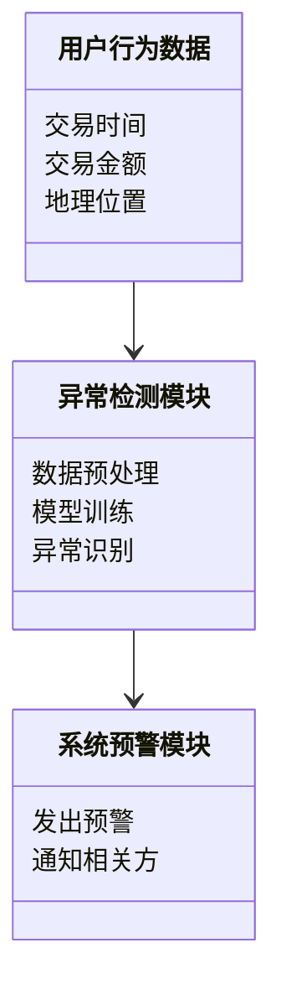
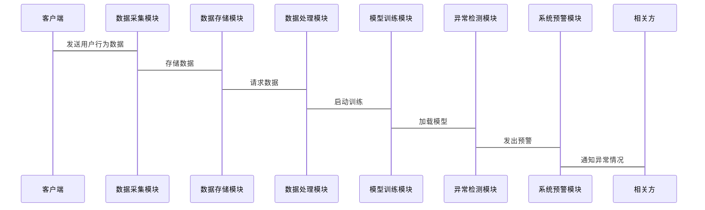

                 


# 智能个人消费行为异常检测

> 关键词：智能消费、异常检测、机器学习、深度学习、数据挖掘、行为分析

> 摘要：本文详细探讨了智能个人消费行为异常检测的核心概念、算法原理、系统设计和项目实战。通过分析消费行为的特征、数据预处理、异常检测算法的选择与实现，结合实际案例，展示了如何利用机器学习和深度学习技术实现智能检测。文章内容包括异常检测的基本原理、常用算法、系统架构设计以及实际项目中的代码实现与结果分析。

---

## 第1章: 个人消费行为异常检测的背景与挑战

### 1.1 问题背景介绍

#### 1.1.1 什么是个人消费行为异常检测

个人消费行为异常检测是指通过分析个人在消费过程中的行为数据，识别出与正常行为模式不符的异常行为。这些异常行为可能包括欺诈交易、恶意消费、账户盗用等，对个人和金融机构造成潜在风险。

#### 1.1.2 异常行为检测的必要性

随着电子商务的快速发展，个人消费行为的复杂性也在不断增加。异常行为检测能够帮助金融机构及时发现并阻止潜在的欺诈行为，保护用户的财产安全，同时维护金融系统的稳定性。

#### 1.1.3 智能化检测的核心价值

传统的异常检测方法依赖于人工审查或简单的规则匹配，效率低下且容易漏检。智能化检测利用机器学习和深度学习技术，能够自动学习数据特征，实时识别异常行为，显著提高了检测的准确性和效率。

### 1.2 问题描述与解决思路

#### 1.2.1 异常行为的定义与分类

异常行为可以分为交易异常、账户异常和行为模式异常。例如，短时间内多次小额交易可能属于交易异常，而账户登录时间与地点的突然变化则属于账户异常。

#### 1.2.2 数据特征分析

消费行为数据通常包括交易时间、金额、地点、商品类别、用户行为模式等特征。这些特征可以通过数据分析提取关键指标，用于异常检测。

#### 1.2.3 异常检测的常见场景

- 信用卡欺诈检测
- 账户盗用检测
- 恶意消费行为识别
- 交易风险评估

### 1.3 本章小结

本章介绍了个人消费行为异常检测的背景、必要性和智能化检测的核心价值，明确了异常行为的分类和常见场景，为后续内容奠定了基础。

---

## 第2章: 异常检测的核心概念与原理

### 2.1 异常检测的基本原理

#### 2.1.1 数据预处理方法

数据预处理包括数据清洗、特征提取和标准化。例如，去除噪声数据，提取交易金额、时间间隔等关键特征，并对数据进行标准化处理。

#### 2.1.2 特征提取与选择

特征提取是异常检测的关键步骤。常用的特征包括交易金额、时间间隔、地理位置等。特征选择可以通过主成分分析（PCA）或递归特征消除（RFE）方法进行。

#### 2.1.3 异常检测算法分类

异常检测算法可以分为基于统计的方法（如Z-score）、基于机器学习的方法（如随机森林）和基于深度学习的方法（如VAE）。

### 2.2 异常检测与机器学习的关系

#### 2.2.1 监督学习与无监督学习的区别

监督学习需要标注数据，而无监督学习适用于无标签数据的异常检测。半监督学习结合了两者的优势。

#### 2.2.2 半监督学习的应用场景

半监督学习适用于部分标注数据的情况，能够在有限标注数据下进行有效的异常检测。

### 2.3 异常检测的关键指标与评估方法

#### 2.3.1 精准率与召回率

- 精准率：异常样本中被正确识别的比例。
- 召回率：实际异常样本中被正确识别的比例。

#### 2.3.2 F1分数的计算

$$ F1 = \frac{2 \times 精准率 \times 召回率}{精准率 + 召回率} $$

#### 2.3.3 ROC曲线的绘制

ROC曲线用于评估分类器的性能，AUC值越接近1，分类效果越好。

### 2.4 本章小结

本章详细介绍了异常检测的核心概念，包括数据预处理、特征提取、算法分类以及评估指标，为后续的算法实现提供了理论基础。

---

## 第3章: 基于统计的异常检测算法

### 3.1 基于概率统计的异常检测方法

#### 3.1.1 马尔可夫链模型

马尔可夫链模型通过分析行为序列的状态转移概率，识别异常行为模式。例如，异常的登录行为可能在短时间内出现不寻常的状态转移。

#### 3.1.2 置信区间与异常判断

置信区间用于判断观测值是否在正常范围内。如果观测值落在置信区间之外，则认为是异常。

### 3.2 基于聚类的异常检测

#### 3.2.1 K-Means算法原理

K-Means算法通过将数据分成K个簇，识别异常簇或异常点。适用于处理数据分布相对均匀的情况。

#### 3.2.2 DBSCAN算法的实现

DBSCAN算法基于密度的聚类方法，能够识别任意形状的簇。适用于处理数据分布不均匀的情况。

### 3.3 基于深度学习的异常检测

#### 3.3.1 单样本VAE模型

单样本VAE通过生成模型重构输入数据，计算重构误差来判断异常。

#### 3.3.2 Autoencoder的原理与应用

Autoencoder通过自编码器结构，学习数据的低维表示，识别异常点。

### 3.4 本章小结

本章介绍了基于统计和深度学习的异常检测算法，分析了不同方法的优缺点及应用场景。

---

## 第4章: 系统分析与架构设计

### 4.1 系统分析

#### 4.1.1 问题场景介绍

系统需要实时监测用户的消费行为，识别异常行为并发出预警。

#### 4.1.2 项目介绍

构建一个智能消费行为异常检测系统，利用机器学习模型进行实时检测。

### 4.2 系统功能设计

#### 4.2.1 领域模型（Mermaid类图）



#### 4.2.2 系统架构设计（Mermaid架构图）


#### 4.2.3 接口设计

- 数据采集接口：负责采集用户行为数据。
- 模型调用接口：调用训练好的模型进行异常检测。
- 预警通知接口：通知相关部门异常情况。

#### 4.2.4 交互流程（Mermaid序列图）



### 4.3 本章小结

本章通过系统分析和架构设计，展示了智能消费行为异常检测系统的整体结构和各模块之间的交互关系。

---

## 第5章: 项目实战

### 5.1 环境安装

需要安装Python、机器学习库（如Scikit-learn、Keras）和可视化库（如Matplotlib）。

### 5.2 核心实现代码

#### 5.2.1 数据预处理

```python
import pandas as pd
import numpy as np

# 加载数据
data = pd.read_csv('consumption.csv')

# 删除缺失值
data = data.dropna()

# 标准化处理
from sklearn.preprocessing import StandardScaler

scaler = StandardScaler()
data_scaled = scaler.fit_transform(data)
```

#### 5.2.2 模型训练

```python
from sklearn.cluster import DBSCAN

model = DBSCAN(eps=0.5, min_samples=5)
model.fit(data_scaled)

# 预测异常点
outliers = model.labels_ == -1
```

#### 5.2.3 结果分析

```python
from sklearn.metrics import classification_report

print(classification_report(true_labels, predicted_labels))
```

### 5.3 代码解读与分析

详细解读每一步代码的功能，分析模型的性能指标。

### 5.4 实际案例分析

通过实际数据集，展示模型的训练过程和异常检测结果。

### 5.5 本章小结

本章通过实际项目，展示了智能消费行为异常检测系统的实现过程，包括数据预处理、模型训练和结果分析。

---

## 第6章: 总结与展望

### 6.1 最佳实践 tips

- 数据预处理是关键，需注意特征选择和标准化。
- 选择合适的算法，根据数据分布和场景选择合适的方法。
- 模型调优和评估指标的选择同样重要。

### 6.2 本章小结

本文详细探讨了智能个人消费行为异常检测的核心概念、算法原理、系统设计和项目实战，为实际应用提供了理论和实践指导。

### 6.3 注意事项

- 数据隐私保护需注意。
- 模型的实时性需要优化。
- 异常检测模型需要定期更新。

### 6.4 拓展阅读

推荐阅读相关领域的书籍和论文，深入学习异常检测的最新技术和应用。

---

## 作者：AI天才研究院 & 禅与计算机程序设计艺术

---

本文通过系统化的分析和实践，全面探讨了智能个人消费行为异常检测的关键技术，为读者提供了丰富的理论知识和实践指导。希望对相关领域的研究和应用有所帮助。

