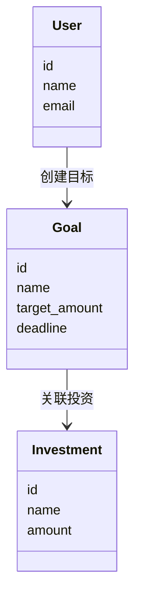

                 


# 智能个人理财目标规划器

## 关键词：智能理财，目标规划，优化算法，系统架构，项目实战

## 摘要：本文详细介绍了智能个人理财目标规划器的背景、核心概念、算法原理、系统架构、项目实战及最佳实践。通过结合人工智能和优化算法，我们探讨如何帮助个人实现财务目标，同时提供实际案例和代码实现，帮助读者更好地理解和应用智能理财工具。

---

# 第一部分：智能个人理财目标规划器背景与核心概念

## 第1章：智能个人理财目标规划器的背景与问题描述

### 1.1 个人理财的重要性

#### 1.1.1 现代社会的财务压力与理财需求

在现代社会，个人财务管理变得越来越重要。随着生活成本的上升和经济不确定性的增加，个人需要更高效的工具来管理财务。传统的理财方式往往依赖个人的直觉和经验，这在面对复杂的投资组合和多变的市场环境时显得力不从心。

#### 1.1.2 传统理财方式的局限性

传统的理财方式通常依赖于个人的经验和手动计算，这种方式不仅效率低下，而且容易受到个人情绪和偏见的影响。此外，传统方式难以应对复杂的财务目标，例如长期投资规划、风险管理等。

#### 1.1.3 智能化理财的优势与发展趋势

智能理财通过结合人工智能和大数据技术，能够提供更精准、更个性化的财务建议。它可以帮助个人更高效地制定和调整理财计划，优化投资组合，并实时监控财务状况。智能化理财正在成为未来个人财务管理的主要趋势。

### 1.2 问题背景与目标设定

#### 1.2.1 个人理财中的常见问题

个人在理财过程中常常面临以下问题：如何制定合理的财务目标？如何优化投资组合？如何应对市场波动？如何进行风险管理？

#### 1.2.2 智能理财目标规划器的核心目标

智能理财目标规划器的核心目标是帮助用户制定并优化财务目标，提供个性化的投资建议，并实时监控和调整理财计划。

#### 1.2.3 边界与外延

智能理财目标规划器的边界包括个人财务目标的设定、投资组合优化和风险管理。外延则涉及市场分析、税务规划和退休计划等更广泛的财务领域。

### 1.3 核心概念与组成要素

#### 1.3.1 智能理财目标规划器的定义

智能理财目标规划器是一种基于人工智能和大数据技术的工具，用于帮助个人制定和优化财务目标，提供个性化的投资建议，并实时监控和调整理财计划。

#### 1.3.2 核心概念的属性特征对比表

| 核心概念 | 属性 | 特征 |
|----------|------|------|
| 数据处理 | 数据源 | 财务数据、市场数据 |
| 目标设定 | 目标类型 | 短期目标、长期目标 |
| 策略优化 | 优化算法 | 线性规划、遗传算法 |

#### 1.3.3 实体关系图（ER图）

```mermaid
erDiagram
    user {
        User(
            id : int
            name : string
            email : string
        )
    }
    goal {
        Goal(
            id : int
            name : string
            target_amount : float
            deadline : date
            user_id : int
        )
    }
    investment {
        Investment(
            id : int
            name : string
            amount : float
            goal_id : int
        )
    }
    User --> Goal : 创建目标
    Goal --> Investment : 关联投资
```

---

## 第2章：智能理财目标规划器的核心原理

### 2.1 数据处理与分析

#### 2.1.1 数据采集与预处理

数据采集包括从多种来源获取财务数据和市场数据。预处理步骤包括数据清洗、标准化和特征提取。

#### 2.1.2 数据分析与特征提取

通过数据分析，提取关键的财务指标和市场趋势，为后续的目标设定和策略优化提供依据。

#### 2.1.3 数据建模与预测

利用机器学习模型进行财务预测，例如使用线性回归预测股票价格走势。

### 2.2 目标设定与优化

#### 2.2.1 理财目标的分类与优先级

将理财目标分为短期、中期和长期目标，并根据优先级进行排序。

#### 2.2.2 线性规划模型在理财目标优化中的应用

线性规划模型用于优化投资组合，最大化收益或最小化风险。

#### 2.2.3 动态调整机制

根据市场变化和用户财务状况的变化，动态调整理财目标和投资策略。

---

## 第3章：算法原理与数学模型

### 3.1 优化算法

#### 3.1.1 遗传算法在理财目标优化中的应用

遗传算法是一种模拟自然选择过程的优化算法，适用于复杂的投资组合优化问题。

#### 3.1.2 线性规划模型的数学表达式

$$
\text{最大化或最小化} \sum c_i x_i
$$
$$
\text{约束条件} \sum a_i x_i \leq b
$$

---

## 第4章：系统分析与架构设计

### 4.1 系统功能设计

#### 4.1.1 领域模型



### 4.2 系统架构设计


---

## 第5章：项目实战

### 5.1 环境安装

安装Python、Jupyter Notebook和相关库（如pandas、numpy、scikit-learn）。

### 5.2 核心代码实现

```python
import pandas as pd
from sklearn.linear_model import LinearRegression

# 数据加载
data = pd.read_csv('finance_data.csv')

# 模型训练
model = LinearRegression()
model.fit(data[['income', 'expenses']], data['balance'])

# 预测
predicted_balance = model.predict([[50000, 20000]])
```

### 5.3 案例分析

通过具体案例分析，展示如何使用智能理财目标规划器制定和优化财务目标。

---

## 第6章：最佳实践与小结

### 6.1 小结

智能理财目标规划器通过结合人工智能和优化算法，能够帮助个人更高效地制定和优化财务目标，提供个性化的投资建议。

### 6.2 注意事项

在使用智能理财工具时，需注意数据隐私和模型的适用性。

### 6.3 拓展阅读

建议读者进一步学习机器学习在金融领域的应用和优化算法的深入知识。

---

# 作者：AI天才研究院 & 禅与计算机程序设计艺术

