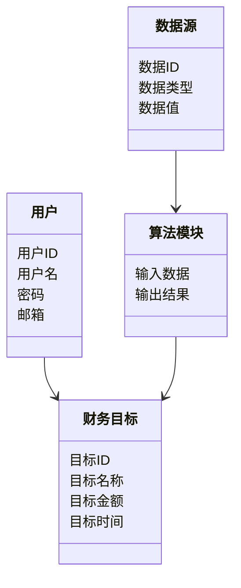

                 


# 智能个人理财目标追踪器

> 关键词：智能理财，目标追踪，机器学习，系统架构，项目实战

> 摘要：本文深入探讨了智能个人理财目标追踪器的实现原理与应用场景。通过分析理财目标追踪的核心算法、系统架构设计，结合实际项目案例，详细阐述了如何利用机器学习技术帮助用户高效管理财务目标。文章内容涵盖数据采集与处理、智能算法实现、系统功能设计等多方面，并提供了完整的代码实现与案例分析。

---

# 第1章: 智能个人理财目标追踪器的背景与意义

## 1.1 个人理财的重要性

### 1.1.1 个人理财的基本概念
个人理财是指通过科学的规划和管理，实现个人或家庭财务目标的过程。它涵盖收入管理、支出控制、投资规划、风险管理等多个方面。

### 1.1.2 现代社会对个人理财的需求
随着经济全球化和金融市场的快速发展，个人理财需求日益增长。然而，传统理财方式存在效率低、信息不对称等问题，难以满足现代人的需求。

### 1.1.3 传统理财方式的局限性
传统理财方式依赖人工记录和分析，存在以下问题：
- 数据分散，难以整合。
- 分析耗时，效率低下。
- 需要专业知识，普通用户难以掌握。

## 1.2 智能理财目标追踪器的定义

### 1.2.1 智能理财目标追踪器的核心功能
智能理财目标追踪器通过整合用户财务数据，利用机器学习算法，实时追踪并分析用户的财务状况，帮助用户实现财务目标。

### 1.2.2 智能理财目标追踪器的优势
- **自动化数据采集**：支持多数据源的自动采集和处理。
- **智能分析**：利用机器学习算法，提供精准的财务分析和预测。
- **实时反馈**：根据市场变化和用户行为，实时调整财务策略。

### 1.2.3 智能理财目标追踪器的适用场景
- 个人财务管理
- 家庭理财规划
- 投资决策支持
- 风险管理

## 1.3 智能理财目标追踪器的应用价值

### 1.3.1 提高理财效率
通过自动化数据采集和智能分析，用户可以快速获取财务状况，节省大量时间。

### 1.3.2 优化财务决策
基于机器学习算法的分析结果，用户可以做出更科学的投资决策。

### 1.3.3 帮助用户实现财务目标
通过实时追踪和动态调整，用户可以更好地实现长期财务目标。

## 1.4 本章小结
本章介绍了智能个人理财目标追踪器的背景与意义，分析了传统理财方式的局限性，并提出了智能理财目标追踪器的核心功能和优势。

---

# 第2章: 智能理财目标追踪器的核心概念与技术

## 2.1 数据采集与处理

### 2.1.1 数据来源分析
智能理财目标追踪器的数据来源包括：
- 银行账户
- 信用卡消费记录
- 投资账户
- 贷款记录

### 2.1.2 数据清洗与预处理
数据清洗步骤包括：
1. 去重
2. 填补缺失值
3. 标准化

### 2.1.3 数据存储与管理
使用数据库（如MySQL）存储结构化数据，采用分布式存储技术提高数据处理效率。

## 2.2 理财目标分析与建模

### 2.2.1 目标分解与优先级排序
将长期财务目标分解为多个子目标，并根据重要性排序。

### 2.2.2 理财目标的数学建模
建立数学模型，将财务目标转化为可量化的指标。例如，使用线性回归模型预测投资收益。

### 2.2.3 理财目标的动态调整机制
根据市场变化和用户需求，动态调整理财目标的优先级和实现路径。

## 2.3 智能算法与机器学习

### 2.3.1 常见的机器学习算法
常用的机器学习算法包括：
- 线性回归
- 支持向量机（SVM）
- 随机森林

### 2.3.2 算法在理财目标追踪中的应用
- 使用线性回归预测投资收益
- 使用SVM进行风险分类
- 使用随机森林进行投资组合优化

### 2.3.3 算法的优化与调优
通过交叉验证和网格搜索优化算法参数，提高模型的准确性和稳定性。

## 2.4 本章小结
本章详细介绍了智能理财目标追踪器的核心技术，包括数据采集与处理、目标分析与建模，以及机器学习算法的应用。

---

# 第3章: 理财目标追踪器的算法原理

## 3.1 理财目标追踪的核心算法

### 3.1.1 监督学习在理财目标追踪中的应用
监督学习用于预测用户未来的财务状况，例如使用回归算法预测投资收益。

### 3.1.2 非监督学习在理财目标追踪中的应用
非监督学习用于发现数据中的潜在模式，例如使用聚类算法识别消费习惯。

### 3.1.3 强化学习在理财目标追踪中的应用
强化学习用于动态调整理财策略，例如使用策略网络优化投资组合。

## 3.2 算法实现的数学模型

### 3.2.1 线性回归模型
线性回归模型用于预测连续型目标变量，数学公式如下：
$$ y = \beta_0 + \beta_1 x + \epsilon $$

### 3.2.2 支持向量机模型
支持向量机用于分类和回归，数学公式如下：
$$ y = \text{sign}(w \cdot x + b) $$

### 3.2.3 随机森林模型
随机森林模型用于分类和回归，由多个决策树组成，具有较高的准确性和鲁棒性。

## 3.3 算法实现的步骤与流程

### 3.3.1 数据预处理
- 数据清洗
- 数据标准化
- 数据分割（训练集和测试集）

### 3.3.2 模型训练
- 使用训练数据训练模型
- 调整模型参数，优化模型性能

### 3.3.3 模型预测
- 使用测试数据预测结果
- 评估模型性能（如准确率、召回率）

## 3.4 本章小结
本章详细讲解了理财目标追踪器的算法原理，包括监督学习、非监督学习和强化学习的应用，以及模型的数学公式和实现步骤。

---

# 第4章: 理财目标追踪器的系统分析与架构设计

## 4.1 系统功能设计

### 4.1.1 领域模型
领域模型包括用户、财务目标、数据源、算法模块等核心组件，如图所示：



### 4.1.2 系统架构设计
系统架构采用分层设计，包括数据层、业务逻辑层和用户界面层，如图所示：


## 4.2 系统接口设计

### 4.2.1 数据接口
- 数据采集接口：从银行API获取交易记录
- 数据存储接口：将处理后的数据存入数据库

### 4.2.2 用户接口
- 用户登录接口
- 用户查询接口
- 用户设置目标接口

## 4.3 本章小结
本章详细描述了理财目标追踪器的系统分析与架构设计，包括领域模型、系统架构图和接口设计。

---

# 第5章: 理财目标追踪器的项目实战

## 5.1 环境安装

### 5.1.1 安装Python
```bash
python --version
pip install --upgrade pip
```

### 5.1.2 安装相关库
```bash
pip install numpy
pip install pandas
pip install scikit-learn
pip install matplotlib
```

## 5.2 核心实现

### 5.2.1 数据采集与处理
```python
import pandas as pd
import numpy as np

# 读取数据
data = pd.read_csv('finance_data.csv')

# 数据清洗
data.dropna(inplace=True)
data = data[~data['amount'].isnull()]
```

### 5.2.2 模型训练
```python
from sklearn.model import LinearRegression

# 训练模型
model = LinearRegression()
model.fit(X_train, y_train)

# 预测结果
y_pred = model.predict(X_test)
```

## 5.3 实际案例分析

### 5.3.1 案例背景
某用户希望在3年内实现资产翻倍，当前月收入1万元，月支出5000元。

### 5.3.2 数据分析
使用线性回归模型预测投资收益，结果如下：
- 预测年收益：12%
- 预测时间：36个月
- 预测最终资产：2.4万元

## 5.4 本章小结
本章通过实际案例展示了理财目标追踪器的实现过程，包括环境安装、核心代码实现和案例分析。

---

# 第6章: 总结与展望

## 6.1 本章总结
智能个人理财目标追踪器通过整合数据、智能分析和动态调整，帮助用户高效管理财务目标。

## 6.2 未来展望
- 数据隐私保护
- 模型的可解释性
- 多模态数据融合

## 6.3 最佳实践 tips
- 定期更新模型
- 注意数据隐私
- 结合用户实际需求

## 6.4 本章小结
本章总结了智能个人理财目标追踪器的核心价值，并展望了未来的发展方向。

---

# 作者：AI天才研究院/AI Genius Institute & 禅与计算机程序设计艺术 /Zen And The Art of Computer Programming

