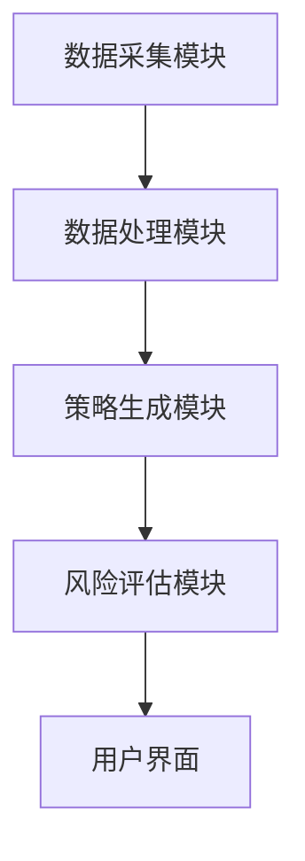

                 


# 智能个人税务筹划助手

## 关键词：智能税务，人工智能，税务筹划，自然语言处理，机器学习

## 摘要：本文介绍了一种基于人工智能技术的智能个人税务筹划助手，通过自然语言处理和机器学习算法，帮助个人优化税务规划。文章详细讲解了智能税务助手的核心算法、系统架构及实现案例，并探讨了其在实际应用中的优势和挑战。

---

## 第一部分：智能税务筹划助手的背景与基础

### 第1章：智能税务筹划助手概述

#### 1.1 税务筹划的基本概念
- **1.1.1 税务筹划的定义**
  税务筹划是通过合法手段优化税务负担的过程，旨在在遵守税法的前提下，最大化个人或企业的经济利益。

- **1.1.2 税务筹划的重要性**
  在个人财务管理和企业运营中，税务筹划可以帮助减少税负，提高资金使用效率，是财务规划的重要组成部分。

- **1.1.3 人工智能在税务筹划中的作用**
  AI技术能够处理大量税务数据，识别优化机会，提供个性化建议，显著提高税务筹划的效率和准确性。

#### 1.2 智能税务助手的核心功能
- **1.2.1 数据收集与处理**
  通过API接口获取涉税数据，包括收入、支出、资产等信息。

- **1.2.2 税务策略生成**
  基于历史数据和实时信息，生成最优税务策略，如收入确认时间、抵扣项选择等。

- **1.2.3 风险评估与优化**
  评估不同策略的法律风险，确保建议的合规性，并动态优化策略。

#### 1.3 税务筹划的法律与伦理考量
- **1.3.1 税法的基本原则**
  税务筹划必须遵守税法，避免偷税漏税行为。

- **1.3.2 税务筹划的合法性边界**
  需区分合法避税与非法逃税，确保所有建议均在法律允许范围内。

- **1.3.3 人工智能在税务中的伦理问题**
  AI决策的透明性、责任归属及数据隐私保护是需要重点关注的伦理问题。

---

## 第二部分：人工智能在税务筹划中的核心算法

### 第2章：自然语言处理在税务文档分析中的应用

#### 2.1 自然语言处理简介
- **2.1.1 NLP的基本原理**
  NLP通过计算机理解、处理和生成人类语言，常用于信息提取、文本分类等任务。

- **2.1.2 常见的NLP技术**
  包括分词、词性标注、句法分析和语义理解等。

#### 2.2 税务文档的特征提取
- **2.2.1 文档结构分析**
  分析税务文档的格式，如发票、账单的结构，提取关键信息。

- **2.2.2 关键词提取**
  使用TF-IDF或主题模型识别文档中的重要词汇。

- **2.2.3 实体识别**
  识别文档中的关键实体，如公司名称、金额等。

#### 2.3 基于NLP的税务信息抽取
- **2.3.1 文档预处理**
  去除停用词、分词处理，构建词袋模型或词嵌模型。

- **2.3.2 模型训练**
  使用预训练模型如BERT进行微调，提升信息抽取的准确率。

- **2.3.3 信息抽取流程**
  从税务文档中提取收入、支出、抵扣项等信息，形成结构化数据。

### 第3章：机器学习在税务策略生成中的应用

#### 3.1 机器学习的基本原理
- **3.1.1 监督学习与无监督学习**
  监督学习基于标记数据，无监督学习处理未标记数据，适用于不同场景。

- **3.1.2 常见的机器学习算法**
  如决策树、随机森林、支持向量机和神经网络等。

#### 3.2 税务数据的特征工程
- **3.2.1 数据清洗**
  去除无效数据，处理缺失值，标准化数据。

- **3.2.2 特征选择**
  选择影响税负的关键特征，如收入来源、支出类型等。

- **3.2.3 数据增强**
  使用合成数据或数据变换，增加训练数据多样性。

#### 3.3 基于机器学习的税务策略生成
- **3.3.1 数据预处理**
  将结构化税务数据转换为模型可接受的格式。

- **3.3.2 模型训练与调优**
  使用梯度下降等优化算法训练模型，调整超参数提升性能。

- **3.3.3 策略生成与解释**
  模型生成优化策略，并可视化关键决策点，帮助用户理解建议。

---

## 第三部分：智能税务助手的系统架构与实现

### 第4章：系统架构设计

#### 4.1 系统模块划分
- **4.1.1 数据采集模块**
  通过API接口获取税务数据，支持多种数据格式。

- **4.1.2 数据处理模块**
  对数据进行清洗、特征提取，形成结构化数据。

- **4.1.3 策略生成模块**
  基于机器学习模型生成优化策略。

- **4.1.4 风险评估模块**
  评估策略的法律风险，确保合规性。

#### 4.2 系统接口设计
- **4.2.1 数据接口**
  提供REST API，便于第三方系统集成。

- **4.2.2 用户接口**
  提供直观的Web或移动端界面，便于用户交互。

- **4.2.3 第三方服务接口**
  集成财税服务，如银行、税务机关的数据接口。

#### 4.3 系统架构图


### 第5章：系统实现与优化

#### 5.1 环境搭建
- **5.1.1 开发工具安装**
  安装Python、Jupyter Notebook、TensorFlow等开发工具。

- **5.1.2 数据库配置**
  选择合适的数据库，如MySQL或MongoDB，配置连接参数。

- **5.1.3 依赖库安装**
  使用pip安装NLP和机器学习库，如NLTK、spaCy、scikit-learn。

#### 5.2 核心代码实现
- **5.2.1 数据预处理代码**
  ```python
  import pandas as pd
  data = pd.read_csv('tax_data.csv')
  data.dropna(inplace=True)
  ```

- **5.2.2 模型训练代码**
  ```python
  from sklearn.ensemble import RandomForestClassifier
  model = RandomForestClassifier(n_estimators=100, random_state=42)
  model.fit(X_train, y_train)
  ```

- **5.2.3 策略生成代码**
  ```python
  import numpy as np
  def generate_strategy(data, model):
      predictions = model.predict(data)
      strategy = np.argmax(predictions, axis=1)
      return strategy
  ```

#### 5.3 系统优化
- **5.3.1 性能优化**
  使用分布式计算框架如Spark，提高数据处理效率。

- **5.3.2 模型优化**
  采用超参数调优和集成学习，提升模型预测精度。

- **5.3.3 代码优化**
  使用并行处理和缓存机制，减少计算时间。

---

## 第四部分：项目实战与案例分析

### 第6章：项目实战

#### 6.1 环境安装与配置
- **6.1.1 安装Python环境**
  使用Anaconda安装Python 3.8及以上版本。

- **6.1.2 安装依赖库**
  ```bash
  pip install numpy pandas scikit-learn spacy
  ```

#### 6.2 核心代码实现
- **6.2.1 数据预处理**
  ```python
  import spacy
  nlp = spacy.load('en_core_web_sm')
  doc = nlp("This is a sample text.")
  ```

- **6.2.2 模型训练**
  ```python
  from sklearn.model_selection import train_test_split
  X_train, X_test, y_train, y_test = train_test_split(X, y, test_size=0.2)
  ```

- **6.2.3 模型评估**
  ```python
  from sklearn.metrics import accuracy_score
  y_pred = model.predict(X_test)
  print(f'Accuracy: {accuracy_score(y_test, y_pred)}')
  ```

#### 6.3 实际案例分析
- **6.3.1 案例背景**
  某个体经营者希望优化个人所得税缴纳。

- **6.3.2 数据收集**
  收集过去三年的收入、支出、抵扣项等数据。

- **6.3.3 策略生成**
  模型分析后建议调整收入确认时间，利用抵扣项最大化节省税款。

- **6.3.4 模型优化**
  根据反馈调整模型参数，提高预测精度。

#### 6.4 小结
通过实际案例，验证了智能税务助手的有效性，展示了其在实际应用中的优势。

---

## 第五部分：最佳实践与未来展望

### 第7章：最佳实践

#### 7.1 数据隐私保护
- 加强数据加密和访问控制，确保用户数据安全。

#### 7.2 系统维护
- 定期更新模型和数据，保持系统性能和准确性。

#### 7.3 用户教育
- 提供用户培训和使用指南，帮助用户更好地利用系统。

### 第8章：未来展望

#### 8.1 技术发展趋势
- 更加智能化和自动化，深度学习技术的应用将更加广泛。

#### 8.2 应用场景扩展
- 智能税务助手将应用于更多领域，如跨国税务、企业税务等。

#### 8.3 挑战与机遇
- 技术进步带来新的机会，同时也面临数据安全和法律合规等挑战。

---

## 作者：AI天才研究院/AI Genius Institute & 禅与计算机程序设计艺术 /Zen And The Art of Computer Programming

---

以上是《智能个人税务筹划助手》的技术博客文章，系统地介绍了智能税务助手的背景、算法、系统架构及实际应用，提供了详细的代码示例和案例分析，帮助读者全面理解智能税务筹划的实现和应用。

