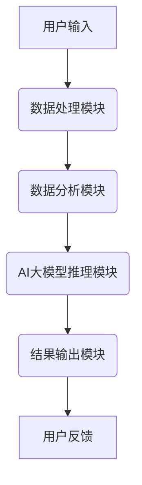
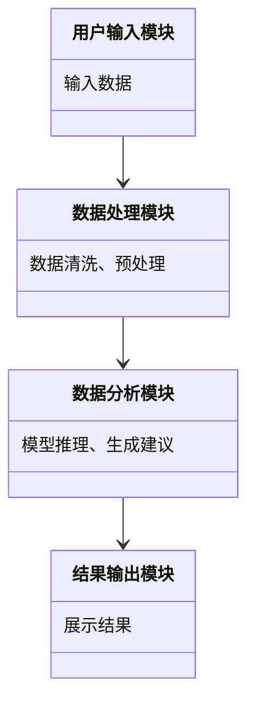

                 


# 智能个人税务筹划模拟器

## 关键词：AI大模型、智能税务、税务优化、财务规划、税收筹划

## 摘要：  
智能个人税务筹划模拟器是一种基于人工智能技术的工具，旨在帮助个人优化税务规划，提高财务效率。本文将详细介绍智能税务筹划模拟器的核心概念、算法原理、系统架构以及实际应用案例，探讨其在个人税务管理中的潜力和价值。

---

# 第一部分: 智能个人税务筹划模拟器的背景与概述

## 第1章: 背景介绍

### 1.1 智能个人税务筹划模拟器的概念与定义

#### 1.1.1 税务筹划的基本概念  
税务筹划是指通过合法的手段，优化个人或企业的税务负担，最大化经济利益的过程。常见的税务筹划方式包括合理分配收入、利用税收优惠政策、优化资产配置等。  

#### 1.1.2 智能模拟器的定义与核心功能  
智能个人税务筹划模拟器是一种基于人工智能技术的工具，能够根据用户的财务数据和税务政策，提供个性化的税务优化建议。其核心功能包括：  
- 数据采集与分析：收集用户的收入、支出、资产等信息，并结合税务政策进行分析。  
- 模型推理：利用AI大模型预测不同税务策略下的最优结果。  
- 可视化展示：以图表形式展示税务规划方案，帮助用户直观理解。  

#### 1.1.3 智能税务筹划模拟器的边界与外延  
智能税务筹划模拟器主要关注个人税务规划，不涉及企业税务或其他领域的税务问题。其边界包括但不限于：  
- 数据范围：仅限于个人财务数据，不涉及企业数据。  
- 政策适用性：适用于特定国家或地区的税务政策。  
- 使用场景：主要用于个人用户，不支持大规模企业应用。  

### 1.2 问题背景与需求分析

#### 1.2.1 个人税务筹划的复杂性与挑战  
随着收入来源的多样化和税收政策的复杂化，个人税务筹划变得越来越复杂。传统的手动计算方式效率低下，且容易出错。  

#### 1.2.2 智能化工具的需求与应用场景  
智能税务筹划模拟器的需求主要源于以下几点：  
- 提高效率：快速分析大量数据，生成最优税务方案。  
- 减少错误：通过AI模型避免人为计算错误。  
- 实时更新：根据最新税务政策调整建议。  

#### 1.2.3 当前市场上的解决方案与不足  
当前市场上的税务筹划工具多为手动或半自动化的，难以满足用户对智能化、个性化的需求。智能税务筹划模拟器的出现填补了这一空白，但其推广仍面临数据隐私、模型准确性等挑战。

## 第2章: 核心概念与联系

### 2.1 AI大模型在税务筹划中的应用原理

#### 2.1.1 大模型的基本原理与技术特点  
AI大模型（如GPT、BERT等）通过深度学习技术，从大量数据中提取特征，进行模式识别和预测。其核心优势在于：  
- 强大的语言理解能力：能够处理复杂的文本数据。  
- 自适应学习能力：能够根据新数据不断优化模型。  

#### 2.1.2 大模型在税务数据分析中的优势  
AI大模型可以对税务数据进行深度分析，发现潜在的优化机会。例如，模型可以通过分析用户的收入结构，推荐最优的税务抵扣策略。  

#### 2.1.3 大模型与税务规则引擎的结合  
税务规则引擎负责处理具体的税务政策，而大模型则负责数据的分析与预测。两者结合，实现了从数据到策略的完整闭环。

### 2.2 核心概念的ER实体关系图

```mermaid
er
    entity 税务数据 {
        key 属性: 收入、支出、资产、负债、税务优惠
    }
    entity 税务规则 {
        key 属性: 税率、扣除项、优惠政策
    }
    entity 用户信息 {
        key 属性: 用户ID、收入来源、支出用途
    }
    税务数据 --| 多对多 | 税务规则
    用户信息 --| 多对多 | 税务数据
```

### 2.3 税务数据流与系统架构



---

# 第二部分: 智能税务筹划模拟器的算法原理

## 第3章: 算法原理与数学模型

### 3.1 算法原理

#### 3.1.1 大模型的训练过程  
AI大模型的训练通常包括以下步骤：  
1. 数据预处理：清洗和标注数据。  
2. 模型构建：选择合适的模型架构。  
3. 模型训练：使用大规模数据进行训练。  
4. 模型优化：调整超参数，提升性能。  

#### 3.1.2 模型优化方法  
常用的优化方法包括：  
- 随机梯度下降（SGD）。  
- 动量优化（Momentum）。  
- Adam优化器。  

#### 3.1.3 模型推理机制  
在税务筹划中，模型通常采用概率推理，根据输入数据预测最优的税务方案。

### 3.2 数学模型

#### 3.2.1 损失函数  
常用的损失函数包括：  
$$ \text{交叉熵损失} = -\sum y \log p(y) $$  

#### 3.2.2 优化算法  
Adam优化器的更新公式为：  
$$ \theta_{t+1} = \theta_t - \eta \frac{\beta_1 g_t + (1-\beta_1)g_t}{1-\beta_2^t} $$  

---

## 第4章: 系统分析与架构设计

### 4.1 系统功能设计

#### 4.1.1 数据采集模块  
数据采集模块负责收集用户的财务数据，包括收入、支出等。  

#### 4.1.2 数据处理模块  
数据处理模块对采集到的数据进行清洗和预处理。  

#### 4.1.3 数据分析模块  
数据分析模块利用AI大模型对数据进行分析，生成优化建议。  

### 4.2 系统架构设计



---

## 第5章: 项目实战

### 5.1 环境配置

#### 5.1.1 工具安装  
安装Python、TensorFlow等工具。  

#### 5.1.2 数据准备  
准备税务相关数据集。  

### 5.2 核心代码实现

#### 5.2.1 数据处理代码  
```python
import pandas as pd

def preprocess_data(data):
    # 数据清洗
    data = data.dropna()
    data = data.drop_duplicates()
    return data
```

#### 5.2.2 模型训练代码  
```python
import tensorflow as tf

model = tf.keras.Sequential([
    tf.keras.layers.Dense(64, activation='relu'),
    tf.keras.layers.Dense(1, activation='sigmoid')
])

model.compile(optimizer='adam', loss='binary_crossentropy')
model.fit(x_train, y_train, epochs=10)
```

### 5.3 案例分析

#### 5.3.1 案例背景  
用户年收入为100万元，有房贷抵扣和子女教育支出。  

#### 5.3.2 模型分析结果  
模型建议用户将部分收入通过教育支出抵扣，减少应纳税所得额。  

---

## 第6章: 总结与展望

### 6.1 总结  
智能个人税务筹划模拟器通过AI技术，显著提高了税务规划的效率和准确性。  

### 6.2 展望  
未来，随着AI技术的不断进步，智能税务筹划模拟器将更加智能化，能够处理更多复杂场景。

---

# 附录  
附录包括工具安装指南、数据集介绍和参考文献。  

# 索引  
索引包括文章中出现的专业术语和主要概念。  

---

作者：AI天才研究院/AI Genius Institute & 禅与计算机程序设计艺术 /Zen And The Art of Computer Programming

