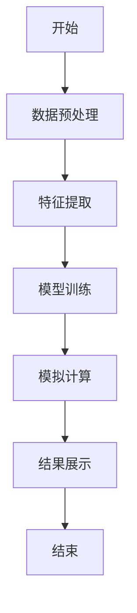
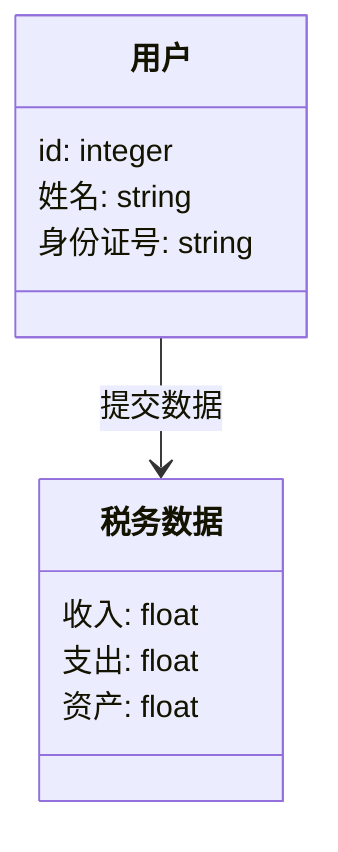
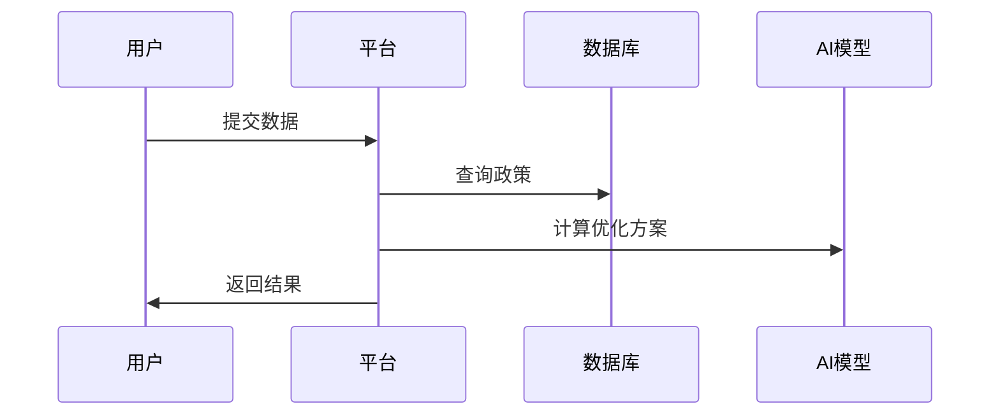

                 


# 《智能个人税务筹划模拟平台》

> **关键词**：智能税务筹划、人工智能、模拟平台、算法原理、系统架构、项目实战

> **摘要**：本文详细介绍了智能个人税务筹划模拟平台的背景、核心概念、算法原理、系统架构、项目实战以及最佳实践。通过结合人工智能和大数据分析技术，该平台能够帮助个人用户进行高效的税务规划和优化，实现智能化、个性化的税务管理。文章从理论到实践，系统地分析了平台的实现过程，为读者提供了全面的技术指导。

---

## 第1章：智能个人税务筹划模拟平台的背景与核心概念

### 1.1 问题背景

#### 1.1.1 传统税务筹划的局限性
传统的税务筹划主要依赖人工计算和经验判断，存在以下问题：
- 数据处理效率低，难以应对复杂多变的税务政策。
- 信息更新不及时，可能导致筹划结果不符合最新法规。
- 个性化需求难以满足，每个用户的财务状况不同，需要定制化解决方案。

#### 1.1.2 人工智能技术在税务领域的应用潜力
人工智能技术（AI）在税务领域的应用具有显著优势：
- **数据处理能力**：AI能够快速处理海量数据，提高计算效率。
- **实时更新**：AI可以实时跟踪税务政策变化，确保筹划结果的准确性。
- **个性化服务**：通过机器学习，AI能够为用户提供个性化的税务优化方案。

#### 1.1.3 智能税务筹划模拟平台的提出
智能税务筹划模拟平台通过结合AI和大数据技术，为用户提供高效、智能的税务管理工具，解决了传统方法的局限性。

---

### 1.2 问题描述

#### 1.2.1 个人税务筹划的核心问题
个人税务筹划的核心问题包括：
- 如何优化收入分配，减少税负。
- 如何合理配置资产，降低税务风险。
- 如何制定长期财务规划，实现财富最大化。

#### 1.2.2 智能模拟平台的目标与范围
智能税务筹划模拟平台的目标是：
- 提供个性化的税务优化方案。
- 实时更新税务政策，确保筹划结果的合法性。
- 提供模拟计算功能，帮助用户评估不同方案的效果。

平台的范围包括：
- 收入与支出数据的采集与分析。
- 资产配置建议。
- 税务风险评估与预警。

#### 1.2.3 平台的边界与外延
智能税务筹划模拟平台的边界在于：
- 不直接处理实际的税务申报，而是提供优化建议。
- 依赖于用户提供的数据，数据的真实性和完整性由用户负责。

---

### 1.3 问题解决

#### 1.3.1 人工智能如何解决税务筹划问题
人工智能技术在税务筹划中的应用主要体现在：
- **数据挖掘**：通过分析用户的财务数据，识别潜在的优化机会。
- **预测建模**：利用机器学习算法预测不同方案的税后收益。
- **自然语言处理**：自动解析税务政策文件，提取关键信息。

#### 1.3.2 智能模拟平台的技术实现路径
智能模拟平台的技术实现路径包括：
1. 数据采集与预处理。
2. 模型训练与优化。
3. 用户交互设计。
4. 结果展示与反馈。

#### 1.3.3 平台的预期效果与用户价值
平台的预期效果是：
- 提高税务筹划的效率和准确性。
- 降低用户的税务负担。
- 帮助用户实现长期财务目标。

用户的直接价值在于：
- 节省时间，减少手动计算的工作量。
- 获取专业化的税务优化建议。
- 提高财务决策的科学性。

---

## 第2章：智能个人税务筹划模拟平台的核心概念与联系

### 2.1 核心概念原理

#### 2.1.1 税务筹划的基本原理
税务筹划的基本原理包括：
- 合法性原则：筹划必须符合国家法律法规。
- 经济性原则：追求税后收益的最大化。
- 灵活性原则：根据政策变化调整方案。

#### 2.1.2 人工智能在税务模拟中的作用
人工智能在税务模拟中的作用体现在：
- 数据分析：通过机器学习算法，发现数据中的潜在规律。
- 模拟计算：利用AI模型，快速生成多种筹划方案。
- 决策支持：基于数据和模型，提供优化建议。

#### 2.1.3 智能模拟平台的系统架构
智能模拟平台的系统架构包括：
- 数据层：存储用户数据和税务政策。
- 业务逻辑层：实现数据处理和模型计算。
- 表现层：提供用户交互界面。

---

### 2.2 概念属性特征对比

| **特征**       | **传统税务筹划**          | **智能税务筹划模拟平台** |
|------------------|---------------------------|---------------------------|
| **数据来源**     | 纸质文件、手工录入         | 结构化数据、实时更新       |
| **计算方式**     | 手工计算、经验判断         | 自动计算、AI优化           |
| **实时性**       | 低，依赖人工更新           | 高，实时更新政策变化       |
| **个性化**       | 有限，难以定制化           | 强，基于用户数据个性化       |
| **效率**         | 低，耗时长                 | 高，快速生成方案           |
| **准确性**       | 受人为因素影响较大         | 高，基于模型和大数据分析     |

---

### 2.3 ER实体关系图

```mermaid
er
    actor 用户 {
        id: integer
        姓名: string
        身份证号: string
    }
    actor 税务专家 {
        id: integer
        姓名: string
        资格证号: string
    }
    actor 税务政策 {
        id: integer
        政策名称: string
        政策内容: string
    }
    
    用户 --> 税务专家: 咨询税务问题
    用户 --> 税务政策: 查询政策信息
    税务专家 --> 税务政策: 更新政策信息
```

---

## 第3章：算法原理

### 3.1 算法选择与流程

#### 3.1.1 算法选择
选择基于决策树的机器学习算法（如ID3或C4.5）进行税务优化方案的推荐。

#### 3.1.2 算法流程


#### 3.1.3 算法实现
```python
import pandas as pd
from sklearn.tree import DecisionTreeClassifier

# 数据预处理
data = pd.read_csv('tax_data.csv')
X = data.drop('label', axis=1)
y = data['label']

# 模型训练
model = DecisionTreeClassifier()
model.fit(X, y)

# 模拟计算
def predict_tax_optimization(income, expenses):
    # 数据转换为模型输入格式
    input_data = [[income, expenses]]
    prediction = model.predict(input_data)
    return prediction[0]

# 示例
print(predict_tax_optimization(100000, 30000))
```

---

### 3.2 数学模型与公式

#### 3.2.1 税后收入计算公式
$$\text{税后收入} = \text{收入} \times (1 - \text{税率})$$

#### 3.2.2 税务优化目标函数
$$\text{最大化} \quad \sum_{i=1}^{n} \text{收益}_i$$
$$\text{约束条件} \quad \sum_{i=1}^{n} \text{支出}_i \leq \text{总收入}$$

---

## 第4章：系统架构与设计

### 4.1 问题场景介绍

#### 4.1.1 平台的功能需求
- 用户注册与登录。
- 数据录入与管理。
- 模拟计算与优化。
- 结果展示与分析。

#### 4.1.2 平台的技术选型
- 前端：React或Vue.js。
- 后端：Python Flask或Django。
- 数据库：MySQL或MongoDB。
- AI模型：TensorFlow或Scikit-learn。

---

### 4.2 系统功能设计

#### 4.2.1 领域模型


#### 4.2.2 系统架构
```mermaid
container 税务模拟平台 {
    front-end {
        用户界面
    }
    back-end {
        业务逻辑
    }
    database {
        用户数据
        税务政策
    }
}
```

#### 4.2.3 接口设计


---

## 第5章：项目实战

### 5.1 环境搭建

#### 5.1.1 安装开发工具
- Python 3.8+
- Jupyter Notebook
- pip install numpy, pandas, scikit-learn

#### 5.1.2 数据准备
下载税务数据集，例如：
```bash
wget https://example.com/tax_data.csv
```

---

### 5.2 核心代码实现

#### 5.2.1 数据预处理
```python
import pandas as pd

# 读取数据
data = pd.read_csv('tax_data.csv')

# 删除缺失值
data.dropna(inplace=True)

# 标准化处理
from sklearn.preprocessing import StandardScaler

scaler = StandardScaler()
X_scaled = scaler.fit_transform(data.drop('label', axis=1))
```

#### 5.2.2 模型训练
```python
from sklearn.ensemble import RandomForestClassifier

model = RandomForestClassifier(n_estimators=100)
model.fit(X_scaled, data['label'])
```

#### 5.2.3 模拟计算
```python
def calculate_optimization(income, expenses):
    input_data = [[income, expenses]]
    input_scaled = scaler.transform(input_data)
    prediction = model.predict(input_scaled)
    return prediction[0]

# 示例
print(calculate_optimization(120000, 40000))
```

---

### 5.3 实际案例分析

#### 5.3.1 案例背景
用户年收入为15万元，支出为5万元，希望优化税务负担。

#### 5.3.2 模拟过程
```python
input_data = [150000, 50000]
input_scaled = scaler.transform([input_data])
prediction = model.predict(input_scaled)
print(prediction)  # 输出优化方案
```

#### 5.3.3 结果分析
- 预测结果为优化方案，如增加社保缴纳比例，减少个税负担。

---

## 第6章：最佳实践与注意事项

### 6.1 注意事项

#### 6.1.1 数据隐私保护
- 确保用户数据的安全性，避免数据泄露。
- 遵守相关法律法规，保护用户隐私。

#### 6.1.2 模型持续优化
- 定期更新模型，适应新的税务政策。
- 收集用户反馈，改进平台功能。

#### 6.1.3 平台稳定性
- 确保系统运行稳定，避免服务中断。
- 提供良好的用户体验，降低用户流失。

---

### 6.2 小结

智能个人税务筹划模拟平台通过结合人工智能和大数据技术，为用户提供高效、个性化的税务管理工具。本文从背景、核心概念、算法原理、系统架构到项目实战，全面介绍了平台的实现过程，为读者提供了详细的技术指导。

---

## 作者信息

作者：AI天才研究院/AI Genius Institute & 禅与计算机程序设计艺术/Zen And The Art of Computer Programming

---

**注意**：以上内容为示例性目录和内容概要，实际撰写时需要根据具体需求进一步扩展和细化每个部分的内容。

