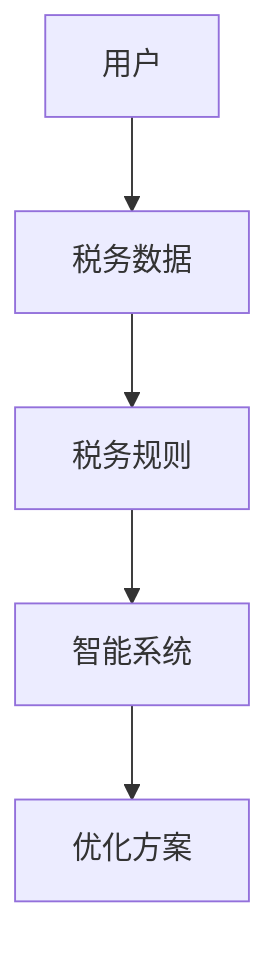

                 


# 智能个人税务筹划模拟系统

> 关键词：智能税务筹划、人工智能、系统设计、算法实现、税务优化

> 摘要：本文深入探讨智能个人税务筹划模拟系统的设计与实现，从背景、核心概念到系统架构，再到算法原理和项目实战，全面解析该系统如何利用人工智能技术优化个人税务筹划过程。

---

## 目录

### 第一部分: 智能个人税务筹划模拟系统概述

### 第二部分: 系统核心概念与架构设计

### 第三部分: 算法原理与数学模型

### 第四部分: 系统功能与项目实战

### 第五部分: 最佳实践与未来展望

---

## 第一部分: 智能个人税务筹划模拟系统概述

### 第1章: 背景与问题描述

#### 1.1 智能税务筹划的背景
- 1.1.1 税务筹划的定义与目标
  - 税务筹划是指通过合法手段，优化个人或企业的税务负担，最大化经济利益。
  - 目标：合规性、优化性、风险最小化。
- 1.1.2 传统税务筹划的局限性
  - 信息不全：传统方法依赖经验，难以覆盖所有可能的税务优化方案。
  - 人工效率低：需要大量手动计算和分析，耗时且容易出错。
  - 风险控制难：难以实时跟踪政策变化和税务规则的调整。
- 1.1.3 人工智能技术在税务筹划中的应用前景
  - 数据驱动：利用大数据分析，提高税务筹划的精准度。
  - 智能推理：通过机器学习和深度学习，实现复杂税务问题的自动化分析。
  - 实时优化：基于实时数据和动态调整，提供最优的税务规划方案。

#### 1.2 问题背景与目标
- 1.2.1 个人税务筹划的核心问题
  - 税务计算复杂性：不同收入来源、扣除项、税率的变化。
  - 税务规则的多样性：不同地区、行业、政策的差异。
  - 优化目标的多样性：如降低所得税、优化资产配置等。
- 1.2.2 智能税务筹划系统的目标
  - 提供个性化的税务优化方案。
  - 实现实时数据分析与模拟推演。
  - 支持用户进行多种假设情景的模拟，选择最优方案。
- 1.2.3 系统边界与外延
  - 系统仅处理合法合规的税务优化，不涉及非法避税。
  - 系统适用于个人用户，支持多平台接入（PC、移动端）。

#### 1.3 核心概念与联系
- 1.3.1 智能税务筹划系统的组成要素
  - 数据层：收入数据、扣除项、税率表、政策法规。
  - 计算层：算法模型、规则引擎。
  - 展示层：用户界面、结果展示、优化建议。
- 1.3.2 系统功能与税务筹划目标的关系
  - 数据采集与预处理：确保输入数据的准确性和完整性。
  - 税务规则提取与建模：建立税务规则的数学模型，支持智能推理。
  - 模拟推演：基于输入数据和规则模型，生成多种优化方案。
  - 结果展示与优化建议：以用户友好的方式展示结果，并提供个性化建议。
- 1.3.3 实体关系图（ER图）



### 第2章: 智能税务筹划系统的核心概念

#### 2.1 核心概念原理
- 2.1.1 人工智能在税务筹划中的应用原理
  - 数据驱动：基于大量历史数据，训练机器学习模型，识别税务优化的关键因素。
  - 智能推理：通过自然语言处理技术，分析政策法规，提取关键规则。
  - 动态优化：利用强化学习，动态调整优化策略，适应政策变化。
- 2.1.2 税务数据的特征与处理方法
  - 数据特征：多维性（收入来源、扣除项）、时变性（政策变化）、复杂性（税率变化）。
  - 数据处理方法：数据清洗、特征提取、数据增强。
- 2.1.3 税务规则的表示与推理
  - 规则表示：通过自然语言处理技术，将政策法规转换为结构化数据。
  - 规则推理：基于逻辑推理和机器学习模型，生成符合规则的优化方案。

#### 2.2 核心概念对比分析
- 2.2.1 不同税务筹划方法的对比
  | 方法 | 优点 | 缺点 |
  |------|------|------|
  | 传统方法 | 易操作，依赖人工经验 | 低效，容易出错，难以覆盖所有可能性 |
  | 智能方法 | 高效，精准，适应性强 | 技术复杂，依赖数据质量 |
- 2.2.2 传统方法与智能方法的优劣势对比
  - 传统方法：适合简单场景，依赖人工经验。
  - 智能方法：适合复杂场景，提供全局最优解，但需要大量数据和计算资源。

### 第3章: 系统功能与架构设计

#### 3.1 系统功能模块
- 3.1.1 数据采集与预处理
  - 数据来源：用户输入、第三方接口获取政策法规。
  - 数据清洗：去除无效数据，填补缺失值。
  - 特征提取：提取关键特征，如收入类型、扣除项种类。
- 3.1.2 税务规则提取与建模
  - 规则提取：通过NLP技术，从政策法规文本中提取关键规则。
  - 规则建模：将规则转换为数学模型，支持智能推理。
- 3.1.3 税务模拟推演
  - 模拟过程：基于输入数据和规则模型，生成多种优化方案。
  - 方案比较：计算不同方案的税务负担，选择最优解。
- 3.1.4 结果展示与优化建议
  - 结果展示：以图表形式展示不同方案的税务负担。
  - 优化建议：基于模拟结果，提供个性化优化建议。

#### 3.2 系统架构设计
- 3.2.1 分层架构设计
  - 数据层：存储税务数据、政策法规。
  - 计算层：包括算法模型、规则引擎。
  - 展示层：用户界面、结果展示。
- 3.2.2 模块化设计
  - 数据采集模块：负责数据输入和预处理。
  - 税务规则模块：负责规则提取和建模。
  - 模拟推演模块：负责生成优化方案。
  - 结果展示模块：负责结果输出和用户交互。
- 3.2.3 系统交互流程
  - 用户输入数据。
  - 系统进行数据处理和规则建模。
  - 系统生成优化方案并展示结果。

### 第4章: 算法原理与数学模型

#### 4.1 算法原理
- 4.1.1 机器学习算法
  - 监督学习：用于分类问题，如判断某种扣除项是否适用。
  - 非监督学习：用于聚类问题，如将相似的税务情况分组。
- 4.1.2 深度学习算法
  - 神经网络模型：用于复杂非线性关系的建模。
  - LSTM：用于时间序列数据的处理。

#### 4.2 数学模型
- 4.2.1 优化模型
  - 线性规划模型：用于处理线性关系的优化问题。
  - 非线性规划模型：用于处理非线性关系的优化问题。
- 4.2.2 分类模型
  - 决策树模型：用于分类和回归问题。
  - 支持向量机（SVM）：用于分类问题。

#### 4.3 算法实现
- 4.3.1 数据预处理
  ```python
  import pandas as pd
  data = pd.read_csv('tax_data.csv')
  data = data.dropna()
  data['income'] = data['income'].astype(float)
  ```
- 4.3.2 算法选择与实现
  ```python
  from sklearn.tree import DecisionTreeClassifier
  model = DecisionTreeClassifier()
  model.fit(X_train, y_train)
  ```
- 4.3.3 模型评估
  ```python
  from sklearn.metrics import accuracy_score
  y_pred = model.predict(X_test)
  print("Accuracy:", accuracy_score(y_test, y_pred))
  ```

#### 4.4 算法优化
- 4.4.1 参数调优
  - 使用网格搜索（Grid Search）进行参数优化。
- 4.4.2 模型融合
  - 使用集成学习方法，如投票分类器（Voting Classifier）。

### 第5章: 系统功能与项目实战

#### 5.1 项目实战
- 5.1.1 环境搭建
  ```bash
  pip install numpy pandas scikit-learn matplotlib
  ```
- 5.1.2 核心代码实现
  ```python
  import numpy as np
  import pandas as pd
  from sklearn.model_selection import train_test_split
  from sklearn.tree import DecisionTreeClassifier

  # 数据加载
  data = pd.read_csv('tax_data.csv')
  X = data.drop('tax', axis=1)
  y = data['tax']

  # 数据分割
  X_train, X_test, y_train, y_test = train_test_split(X, y, test_size=0.2)

  # 模型训练
  model = DecisionTreeClassifier()
  model.fit(X_train, y_train)

  # 模型预测
  y_pred = model.predict(X_test)

  # 模型评估
  print("Accuracy:", accuracy_score(y_test, y_pred))
  ```

#### 5.2 实际案例分析
- 5.2.1 案例背景
  - 用户：年收入100万，有房贷、子女教育等扣除项。
  - 目标：优化个人所得税负担。
- 5.2.2 系统模拟
  - 输入数据：年收入、扣除项、税率表。
  - 模拟结果：不同扣除项组合下的税后收入。
  - 优化建议：推荐最优扣除方案，降低税负。

### 第六部分: 最佳实践与未来展望

#### 6.1 最佳实践
- 数据质量：确保输入数据的准确性和完整性。
- 算法选择：根据具体问题选择合适的算法。
- 模型优化：定期更新模型，适应政策变化。

#### 6.2 小结
- 智能个人税务筹划模拟系统利用人工智能技术，显著提高了税务筹划的效率和准确性。
- 通过系统的优化，用户可以轻松实现个人税务的最优配置，降低税负，提高经济利益。

#### 6.3 注意事项
- 数据隐私：确保用户数据的安全性和隐私性。
- 政策变化：系统需要定期更新政策法规，以适应变化。
- 用户教育：用户需要了解系统的工作原理和使用方法。

#### 6.4 拓展阅读
- 《机器学习实战》
- 《Python机器学习》
- 《数据挖掘导论》

---

## 作者：AI天才研究院/AI Genius Institute & 禅与计算机程序设计艺术 /Zen And The Art of Computer Programming

---

以上是《智能个人税务筹划模拟系统》的完整目录大纲，涵盖了从背景到实现的各个方面，确保读者能够全面理解该系统的原理和应用。

