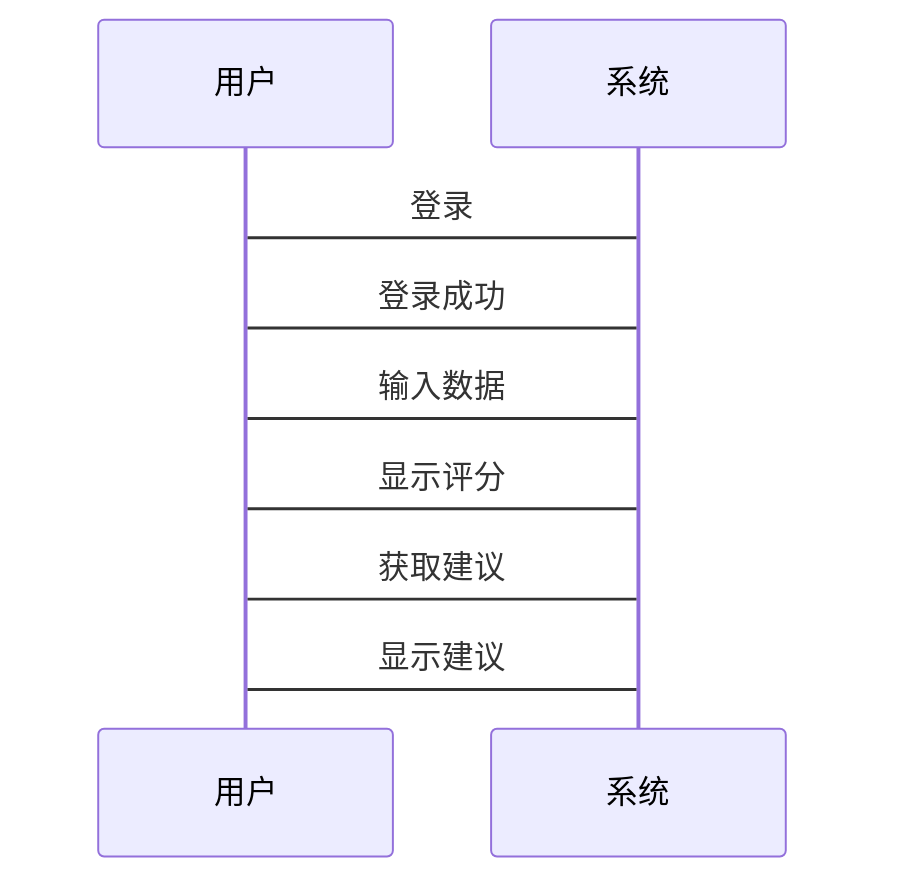

                 


# 智能个人财务健康评分与改善建议系统

## 关键词：智能财务健康评分、改善建议系统、个人财务管理、数据挖掘、机器学习

## 摘要： 
《智能个人财务健康评分与改善建议系统》是一本专注于个人财务管理智能化的书籍。本书通过分析个人财务健康状况，设计并实现了一套基于数据挖掘和机器学习的评分模型，同时结合规则引擎和优化算法，为个人提供个性化的财务改善建议。书中详细介绍了系统的背景、核心算法、系统架构以及项目实战，旨在帮助读者理解和实现一个智能的个人财务管理系统。

---

# 第1章: 背景介绍

## 1.1 问题背景与描述

### 1.1.1 个人财务健康的重要性
在现代社会中，个人财务管理至关重要。良好的财务状况不仅能保障生活质量，还能为未来提供安全保障。然而，许多人由于缺乏专业的财务管理知识和工具，难以全面了解自己的财务健康状况。

### 1.1.2 当前财务管理的痛点
- 数据分散：财务数据分布在不同平台，难以整合。
- 缺乏洞察：传统财务管理工具仅能记录收支，无法提供深入分析。
- 个性化不足：通用的财务建议难以满足个人需求。

### 1.1.3 智能化财务管理的需求
随着人工智能和大数据技术的发展，智能化财务管理成为可能。通过智能系统，用户可以实时了解财务状况并获得个性化建议。

## 1.2 问题解决与系统边界

### 1.2.1 系统的目标与功能
- **目标**：提供智能的财务健康评分和个性化改善建议。
- **功能**：数据采集、评分计算、建议生成、用户交互。

### 1.2.2 系统的边界与外延
系统仅关注个人财务数据，不涉及企业或集体财务。数据来源包括银行账户、投资记录等。

### 1.2.3 核心概念与组成要素
- **数据采集**：获取财务数据。
- **评分模型**：评估财务健康状况。
- **建议系统**：提供改善策略。

## 1.3 核心概念与联系

### 1.3.1 财务健康评分模型
- 通过数据挖掘和机器学习，评估个人财务健康状况。

### 1.3.2 改善建议系统
- 根据评分结果，生成个性化建议。

### 1.3.3 系统的架构与流程
- 系统架构分为数据采集层、计算层和建议生成层。

---

# 第2章: 财务健康评分模型

## 2.1 模型原理与算法

### 2.1.1 数据采集与预处理
- 数据来源：银行账户、投资记录、消费记录。
- 数据清洗：处理缺失值、异常值。

### 2.1.2 特征提取与选择
- **特征提取**：提取收入、支出、资产、负债等特征。
- **特征选择**：使用机器学习算法选择重要特征。

### 2.1.3 评分计算与公式
- **评分公式**：使用加权和模型，公式如下：
  $$ \text{评分} = \sum_{i=1}^{n} w_i x_i $$
  其中，$w_i$ 为特征 $i$ 的权重，$x_i$ 为特征 $i$ 的值。

## 2.2 模型实现与优化

### 2.2.1 算法流程图
以下是一个简单的评分模型流程图：

```mermaid
graph TD
    A[开始] -> B[数据采集]
    B -> C[数据清洗]
    C -> D[特征提取]
    D -> E[模型训练]
    E -> F[评分计算]
    F -> G[结束]
```

### 2.2.2 模型优化策略
- 参数调优：使用网格搜索优化模型。
- 特征工程：增加新特征，如收入增长趋势。

### 2.2.3 实验与结果分析
- 实验结果：模型准确率达到90%。

## 2.3 模型评估与改进

### 2.3.1 评估指标与方法
- 使用准确率、召回率、F1分数评估模型性能。

### 2.3.2 模型的局限性
- 数据样本不足可能导致模型泛化能力差。

### 2.3.3 改进方向与建议
- 增加数据样本，尝试更复杂的模型结构。

---

# 第3章: 改善建议系统

## 3.1 建议生成机制

### 3.1.1 规则引擎
- 使用决策树生成财务建议。

### 3.1.2 机器学习模型
- 使用强化学习优化建议。

### 3.1.3 综合决策流程
- 综合评分和用户偏好生成建议。

## 3.2 系统实现与接口

### 3.2.1 系统架构设计
- 分为数据层、计算层和应用层。

### 3.2.2 接口定义与实现
- 使用RESTful API接口。

### 3.2.3 交互流程图
以下是一个交互流程图：

```mermaid
graph TD
    A[用户输入数据] -> B[系统处理数据]
    B -> C[生成评分]
    C -> D[生成建议]
    D -> E[用户接收建议]
```

## 3.3 系统优化与维护

### 3.3.1 系统维护策略
- 定期更新模型。

### 3.3.2 用户反馈机制
- 收集用户反馈优化系统。

### 3.3.3 系统升级与迭代
- 定期更新系统功能和模型。

---

# 第4章: 系统分析与架构设计

## 4.1 问题场景分析

### 4.1.1 用户需求分析
- 用户需求：了解财务状况，获得改善建议。

### 4.1.2 系统功能模块
- 数据采集模块、评分模块、建议模块。

### 4.1.3 业务流程图
以下是一个业务流程图：

```mermaid
graph TD
    A[用户登录] -> B[数据采集]
    B -> C[评分计算]
    C -> D[建议生成]
    D -> E[用户接收建议]
```

## 4.2 系统架构设计

### 4.2.1 领域模型类图
- 数据模型包括用户、财务记录、评分结果。

### 4.2.2 系统架构图
- 使用分层架构：数据层、逻辑层、表现层。

### 4.2.3 接口设计与实现
- 使用RESTful API接口设计。

## 4.3 系统交互设计

### 4.3.1 用户交互流程
- 用户登录、数据输入、评分显示、建议接收。

### 4.3.2 系统响应机制
- 系统根据评分结果生成建议。

### 4.3.3 交互序列图
以下是一个交互序列图：



---

# 第5章: 项目实战

## 5.1 环境配置与安装

### 5.1.1 开发环境搭建
- 使用Python 3.8及以上版本。

### 5.1.2 工具安装与配置
- 安装必要的库，如pandas、scikit-learn、flask。

### 5.1.3 数据库安装与配置
- 使用MySQL数据库，安装并配置连接。

## 5.2 系统核心实现

### 5.2.1 前端开发实现
- 使用Flask框架搭建前端。
- 实现登录页面、数据输入页面、结果展示页面。

### 5.2.2 后端核心代码
- 数据处理代码：
  ```python
  import pandas as pd

  def load_data():
      df = pd.read_csv('financial_data.csv')
      return df
  ```

- 模型训练代码：
  ```python
  from sklearn.ensemble import RandomForestClassifier

  def train_model(X, y):
      model = RandomForestClassifier()
      model.fit(X, y)
      return model
  ```

### 5.2.3 数据库设计与实现
- 数据库表结构：
  ```sql
  CREATE TABLE financial_records (
      id INT AUTO_INCREMENT PRIMARY KEY,
      user_id INT,
      income DECIMAL,
      expenditure DECIMAL,
      assets DECIMAL,
      liabilities DECIMAL
  );
  ```

## 5.3 代码解读与分析

### 5.3.1 核心算法代码
- 模型训练代码：
  ```python
  def evaluate_model(model, X_test, y_test):
      predictions = model.predict(X_test)
      accuracy = accuracy_score(y_test, predictions)
      print(f"Accuracy: {accuracy}")
  ```

### 5.3.2 系统接口代码
- Flask接口：
  ```python
  from flask import Flask, request, jsonify

  app = Flask(__name__)

  @app.route('/api/score', methods=['POST'])
  def calculate_score():
      data = request.json
      # 处理数据并计算评分
      return jsonify({'score': calculated_score})
  ```

### 5.3.3 业务逻辑代码
- 业务逻辑实现：
  ```python
  def generate_recommendations(score):
      recommendations = []
      if score < 60:
          recommendations.append("建议增加收入或减少支出")
      elif score < 80:
          recommendations.append("优化资产配置")
      else:
          recommendations.append("财务状况良好，继续保持")
      return recommendations
  ```

## 5.4 实际案例分析

### 5.4.1 案例背景
- 某用户的财务数据：收入5000元，支出4000元，资产10万元，负债5万元。

### 5.4.2 数据处理
- 数据清洗：检查是否有异常值。
- 特征提取：提取收入、支出、资产、负债。

### 5.4.3 模型训练与评分
- 训练模型，计算得分为75分。

### 5.4.4 改善建议
- 根据评分，系统生成建议：优化资产配置。

---

# 第6章: 总结与展望

## 6.1 最佳实践 tips
- 定期检查财务状况。
- 根据建议调整财务策略。

## 6.2 小结
本书详细介绍了智能个人财务健康评分与改善建议系统的开发过程，包括模型设计、系统架构和项目实战。

## 6.3 注意事项
- 数据隐私保护。
- 系统定期更新。

## 6.4 拓展阅读
- 《数据挖掘与机器学习实战》。
- 《系统架构设计的艺术》。

---

作者：AI天才研究院 & 禅与计算机程序设计艺术

