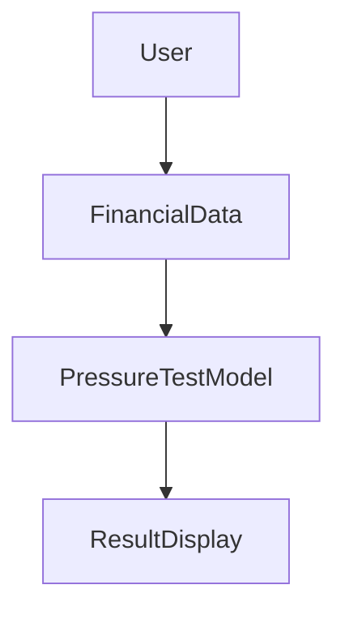
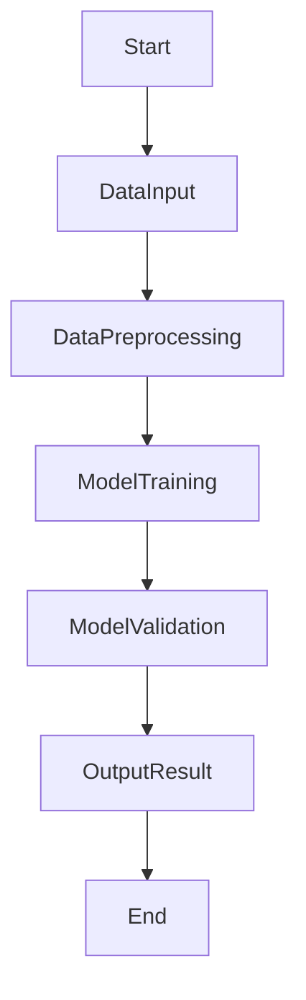
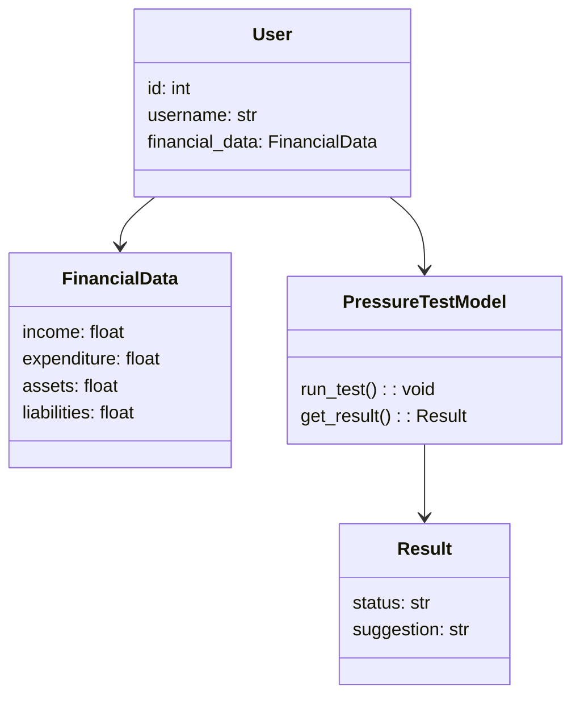
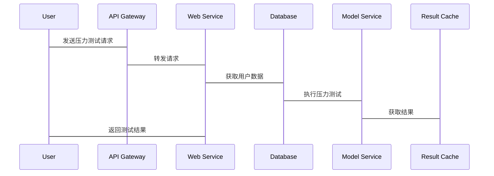

                 


# 智能个人财务压力测试工具

**关键词：**智能财务、压力测试、个人财务管理、算法模型、系统架构

**摘要：**  
随着经济的快速发展和个人财务管理需求的日益增长，智能个人财务压力测试工具成为帮助个人有效管理和优化财务状况的重要工具。本文从背景、核心概念、算法原理、系统架构到项目实战，全面剖析智能个人财务压力测试工具的设计与实现。通过详细的技术分析和实际案例，展示如何利用人工智能算法和系统设计构建高效、可靠的个人财务压力测试系统，为个人用户提供智能化的财务管理解决方案。

---

## 第1章: 智能个人财务压力测试工具的背景与核心概念

### 1.1 问题背景

#### 1.1.1 个人财务管理的痛点
在现代社会，个人财务管理变得越来越复杂。随着收入来源多样化、支出项目增多化，个人需要面对的风险也不断增加。传统的财务管理方式依赖于手动记录和简单的预算计算，难以应对复杂的财务压力测试需求。例如，如何在市场波动、收入变化、债务增加等情况下，评估个人财务状况的稳定性？

#### 1.1.2 财务压力测试的定义与目标
财务压力测试是一种通过模拟极端市场条件或个人财务变化，评估财务计划在压力下的表现和稳健性的方法。其目标是帮助个人识别潜在的财务风险，并制定应对策略。智能个人财务压力测试工具通过自动化数据处理、算法模拟和实时反馈，为用户提供更精准的压力测试结果。

#### 1.1.3 智能化工具在个人财务管理中的必要性
智能化工具能够快速处理大量数据，利用机器学习算法预测潜在风险，并提供个性化的优化建议。与传统方法相比，智能工具不仅提高了效率，还能帮助用户更好地理解和应对复杂的财务环境。

### 1.2 问题描述

#### 1.2.1 财务压力测试的核心问题
- 如何准确模拟不同压力情景下的财务状况？
- 如何量化财务风险并提供可操作的建议？

#### 1.2.2 智能工具如何解决这些问题
- 利用机器学习算法进行数据建模和预测。
- 提供可视化界面，方便用户理解和操作。
- 实现实时数据更新和动态压力测试。

#### 1.2.3 工具的边界与外延
- 边界：专注于个人财务压力测试，不涉及企业或机构的财务分析。
- 外延：结合税务规划、投资组合优化等功能，提供更全面的财务管理解决方案。

### 1.3 核心概念与联系

#### 1.3.1 财务压力测试的原理
压力测试通常基于历史数据和假设情景，通过模拟极端情况下的财务表现，评估用户的财务韧性。例如，假设失业情况下，用户能否维持基本生活开支？

#### 1.3.2 智能工具的核心要素
- 数据采集：获取用户的收入、支出、资产和负债等信息。
- 算法模型：构建压力测试模型，模拟不同情景下的财务状况。
- 可视化反馈：以图表形式展示测试结果和优化建议。

#### 1.3.3 财务数据与压力测试模型的关系
财务数据是压力测试的基础，模型通过分析这些数据，预测不同情景下的财务表现。例如，利用线性回归模型预测收入变化对支出的影响。

---

## 第2章: 核心概念与联系

### 2.1 核心概念原理

#### 2.1.1 财务压力测试的基本原理
压力测试的核心是通过模拟极端情景，评估财务计划的稳健性。例如，假设市场崩盘时，用户的投资组合会受到怎样的影响？

#### 2.1.2 智能工具的核心算法
常用的算法包括蒙特卡洛模拟、线性回归和决策树等。这些算法帮助模型预测不同情景下的财务结果。

#### 2.1.3 数据驱动的分析方法
通过分析历史数据，识别财务风险的潜在来源，并预测未来可能的财务变化。

### 2.2 概念属性特征对比

| **特征**       | **传统财务分析** | **智能压力测试工具** |
|----------------|------------------|-----------------------|
| 数据来源       | 手动输入或少量数据 | 大数据驱动，实时更新 |
| 分析速度       | 较慢             | 实时响应             |
| 情景模拟       | 有限             | 多情景模拟            |
| 精度           | 较低             | 高精度                |
| 用户友好度     | 低               | 高                   |

### 2.3 ER实体关系图


---

## 第3章: 算法原理讲解

### 3.1 压力测试模型的数学模型

#### 3.1.1 财务数据的预处理
数据预处理包括数据清洗、标准化和特征提取。例如，使用归一化方法处理不同单位的财务数据。

#### 3.1.2 模型的构建与训练
以线性回归模型为例，假设压力测试结果与收入、支出等因素相关。模型公式为：
$$ y = \beta_0 + \beta_1x_1 + \beta_2x_2 + \epsilon $$
其中，$y$ 是压力测试结果，$x_1$ 和 $x_2$ 是收入和支出，$\beta$ 是回归系数。

#### 3.1.3 模型的验证与优化
通过交叉验证评估模型性能，调整参数以优化预测精度。

### 3.2 算法流程图


### 3.3 Python实现代码

```python
import numpy as np
from sklearn.linear_model import LinearRegression

# 示例数据
X = np.array([[1, 2], [3, 4], [5, 6]]).astype(float)
y = np.array([7, 8, 9]).astype(float)

# 模型训练
model = LinearRegression()
model.fit(X, y)

# 预测
new_data = np.array([[2, 3]])
print(model.predict(new_data))  # 输出结果
```

---

## 第4章: 系统分析与架构设计

### 4.1 系统功能设计

#### 4.1.1 领域模型类图


#### 4.1.2 系统架构图
```mermaid
graph TD
    Client --> API Gateway
    API Gateway --> Web Service
    Web Service --> Database
    Database --> Model Service
    Model Service --> Result Cache
```

#### 4.1.3 系统交互序列图


---

## 第5章: 项目实战

### 5.1 环境安装

```bash
pip install numpy pandas scikit-learn matplotlib
```

### 5.2 核心功能实现

```python
import pandas as pd
from sklearn.ensemble import RandomForestRegressor

# 数据加载
data = pd.read_csv('financial_data.csv')

# 特征选择
features = ['income', 'expenditure']
target = 'pressure_score'

# 模型训练
model = RandomForestRegressor()
model.fit(data[features], data[target])

# 预测
new_data = pd.DataFrame({'income': [50000], 'expenditure': [30000]})
print(model.predict(new_data))  # 输出结果
```

### 5.3 案例分析

#### 5.3.1 数据分析
假设用户收入为50000元，支出为30000元，压力测试结果显示财务状况良好，但可以优化投资组合。

#### 5.3.2 模型解读
通过分析特征重要性，发现收入对压力测试结果影响最大。

---

## 第6章: 最佳实践与总结

### 6.1 最佳实践 Tips

1. **数据隐私**：确保用户数据加密存储和传输。
2. **定期更新**：根据市场变化和用户反馈，定期优化模型。
3. **用户体验**：提供友好的交互界面和清晰的反馈结果。

### 6.2 小结

智能个人财务压力测试工具通过结合人工智能算法和系统设计，为个人用户提供高效、精准的财务管理解决方案。未来，随着技术的不断发展，工具将更加智能化和个性化。

### 6.3 注意事项

- 数据来源必须合法合规。
- 模型需要定期验证和优化。
- 用户教育是工具成功的关键。

### 6.4 拓展阅读

- 《机器学习实战》
- 《Python数据处理与可视化》

---

**作者：AI天才研究院/AI Genius Institute & 禅与计算机程序设计艺术 /Zen And The Art of Computer Programming**

