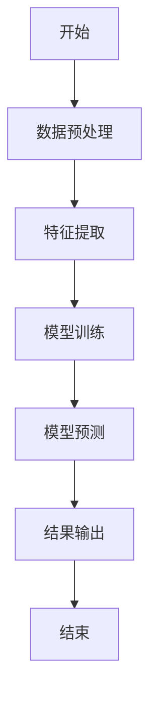
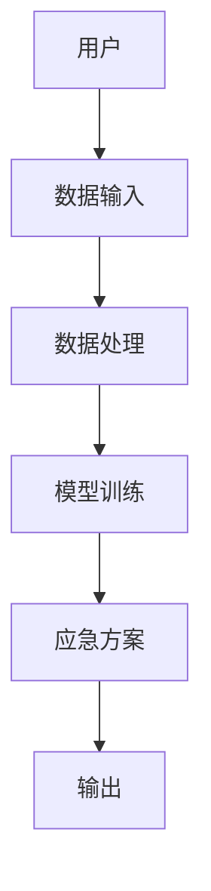
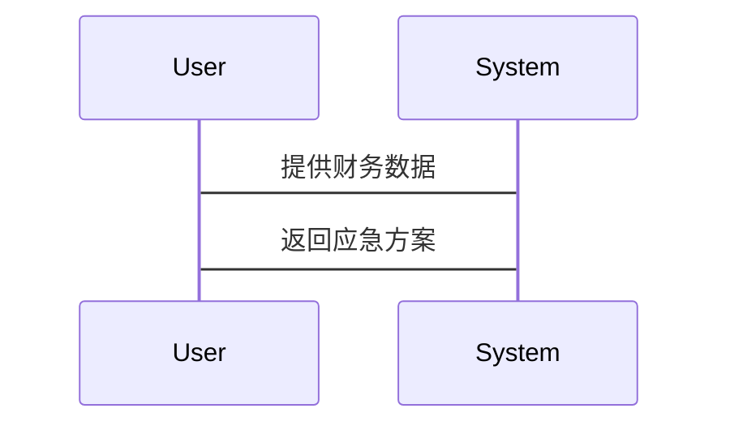

                 


# 《智能个人财务应急预案生成器》

## 关键词：智能财务、AI算法、应急方案、风险管理、个人理财、数据驱动

## 摘要：  
本文详细探讨了如何利用人工智能技术构建智能个人财务应急预案生成器。通过分析个人财务应急管理的核心问题，结合数据驱动的方法，提出了一种基于AI算法的解决方案。文章从背景介绍、核心概念、算法原理、系统架构到项目实战，全面阐述了智能财务应急管理的实现过程。通过实际案例分析和系统设计，展示了如何利用AI技术帮助个人快速生成最优财务应急预案，有效应对突发财务风险。

---

## 第一部分：背景介绍

## 第1章：个人财务应急管理概述

### 1.1 问题背景

#### 1.1.1 个人财务危机的常见原因  
在现代社会，个人财务危机的触发原因多种多样，主要包括：  
1. **突发性支出**：如重大疾病、意外事故、家庭紧急支出等。  
2. **收入中断**：如失业、创业失败、投资项目亏损等。  
3. **债务问题**：如信用卡欠款、网贷逾期、民间借贷违约等。  
4. **消费失控**：如超前消费、冲动消费导致资金链断裂。  
5. **经济环境变化**：如经济衰退、通货膨胀、政策调整等。  

#### 1.1.2 财务应急管理的重要性  
在面对突发财务危机时，快速制定有效的应急方案至关重要：  
- **减少损失**：及时调整财务结构，避免更大损失。  
- **快速恢复**：通过合理分配资金，尽快恢复正常财务状况。  
- **预防风险**：提前识别潜在风险，制定应对策略。  

#### 1.1.3 智能化应急管理的需求  
传统的财务应急管理方法依赖人工分析，效率低、覆盖面有限。随着AI技术的发展，智能化应急管理的需求日益迫切：  
- **自动化分析**：快速处理海量数据，生成最优应急方案。  
- **精准预测**：基于历史数据和AI模型，预测潜在风险。  
- **个性化建议**：根据用户具体情况，提供定制化解决方案。  

---

### 1.2 问题描述

#### 1.2.1 财务应急的核心问题  
财务应急管理的核心问题是：如何在有限的时间和资源内，快速找到最优的资金分配方案，以应对突发财务危机。  

#### 1.2.2 传统应急管理的局限性  
传统财务应急管理方法存在以下问题：  
- **效率低下**：人工分析耗时长，难以快速响应。  
- **覆盖面有限**：难以覆盖所有可能的财务场景。  
- **主观性较强**：依赖人工判断，结果可能不准确。  

#### 1.2.3 智能化应急管理的目标  
智能化财务应急管理的目标是：通过AI算法，快速分析用户财务状况，生成最优应急方案，帮助用户有效应对突发财务危机。  

---

### 1.3 问题解决

#### 1.3.1 AI技术在财务应急管理中的应用  
AI技术可以通过以下方式帮助解决财务应急管理问题：  
- **数据处理**：快速整理和分析用户的财务数据。  
- **模型预测**：基于历史数据，预测潜在风险。  
- **方案生成**：根据预测结果，生成最优应急方案。  

#### 1.3.2 数据驱动的应急管理方法  
数据驱动的应急管理方法包括：  
1. **数据收集**：收集用户的收入、支出、资产、负债等数据。  
2. **数据分析**：通过数据分析，识别潜在风险。  
3. **数据建模**：基于数据分析结果，建立预测模型。  

#### 1.3.3 智能化应急管理的实现路径  
智能化应急管理的实现路径包括：  
1. **数据输入**：用户输入财务数据。  
2. **模型分析**：AI算法分析数据，生成应急方案。  
3. **方案输出**：将应急方案反馈给用户。  

---

### 1.4 边界与外延

#### 1.4.1 智能财务应急管理的适用范围  
智能财务应急管理适用于以下场景：  
- **个人用户**：应对突发财务危机。  
- **小微企业**：处理突发财务问题。  
- **家庭用户**：制定长期财务计划。  

#### 1.4.2 相关概念的区分与联系  
相关概念包括：  
- **财务规划**：长期财务目标的制定与实施。  
- **风险管理**：识别和应对潜在财务风险。  
- **应急基金**：为应对突发情况储备的资金。  

#### 1.4.3 系统边界与功能范围  
系统的边界包括：  
- **输入范围**：用户的财务数据。  
- **输出范围**：应急方案和建议。  
- **功能范围**：数据处理、模型分析、方案生成。  

---

## 第2章：核心概念与联系

### 2.1 核心概念原理

#### 2.1.1 智能财务应急管理的原理  
智能财务应急管理的原理是：通过AI算法，分析用户的财务数据，识别潜在风险，生成最优应急方案。  

#### 2.1.2 数据驱动的应急管理模型  
数据驱动的应急管理模型包括：  
1. **数据收集**：收集用户的财务数据。  
2. **数据分析**：分析数据，识别潜在风险。  
3. **模型预测**：基于数据分析结果，预测潜在风险。  
4. **方案生成**：根据预测结果，生成应急方案。  

#### 2.1.3 AI算法在应急管理中的作用  
AI算法在应急管理中的作用包括：  
- **数据处理**：快速整理和分析数据。  
- **模型预测**：预测潜在风险。  
- **方案生成**：生成最优应急方案。  

---

### 2.2 概念属性特征对比

#### 2.2.1 传统与智能应急管理的对比  
| 特性 | 传统应急管理 | 智能应急管理 |
|------|--------------|--------------|
| 效率 | 低           | 高           |
| 覆盖面 | 有限        | 全面        |
| 精准度 | 低           | 高           |

#### 2.2.2 数据驱动与规则驱动的差异  
| 特性 | 数据驱动 | 规则驱动 |
|------|----------|----------|
| 分析依据 | 数据分析 | 人工规则 |
| 精准度 | 高       | 中等     |
| 灵活性 | 高       | 低       |

#### 2.2.3 不同AI算法的特征分析  
| 算法类型 | 适用场景 | 优势 |
|----------|-----------|------|
| 决策树   | 分类问题   | 易解释 |
| 支持向量机 | 分类问题 | 高精度 |
| 随机森林 | 分类问题 | 抗过拟合 |

---

### 2.3 ER实体关系图

```mermaid
er
  actor: 用户
  emergency_plan: 应急方案
  financial_data: 财务数据
  risk_assessment: 风险评估
  solution_recommendation: 方案推荐

  actor --> financial_data: 提供
  financial_data --> risk_assessment: 输入
  risk_assessment --> solution_recommendation: 分析
  solution_recommendation --> emergency_plan: 输出
```

---

## 第3章：算法原理

### 3.1 算法选择

#### 3.1.1 算法选择依据  
选择算法的依据包括：  
- **数据类型**：财务数据通常是结构化数据。  
- **任务目标**：分类任务，判断风险等级。  
- **计算效率**：需要快速生成应急方案。  

#### 3.1.2 算法介绍  
选择**随机森林**算法：  
- **优势**：高精度、抗过拟合、适合分类任务。  
- **原理**：通过构建多个决策树，进行投票或平均预测。  

---

### 3.2 算法实现

#### 3.2.1 算法流程图  



#### 3.2.2 算法代码  

```python
import pandas as pd
from sklearn.ensemble import RandomForestClassifier
from sklearn.model_selection import train_test_split
from sklearn.metrics import accuracy_score

# 数据加载
data = pd.read_csv('financial_data.csv')
X = data.drop('risk_level', axis=1)
y = data['risk_level']

# 数据分割
X_train, X_test, y_train, y_test = train_test_split(X, y, test_size=0.2)

# 模型训练
model = RandomForestClassifier()
model.fit(X_train, y_train)

# 模型预测
y_pred = model.predict(X_test)

# 模型评估
print(f'Accuracy: {accuracy_score(y_test, y_pred)}')
```

---

### 3.3 数学模型

#### 3.3.1 随机森林算法的数学模型  
随机森林算法的数学模型包括：  
1. **决策树构建**：基于训练数据，构建多棵决策树。  
2. **投票预测**：对测试数据，多棵决策树进行投票，得出最终预测结果。  

#### 3.3.2 模型评估指标  
模型评估指标包括：  
- **准确率**：模型预测正确的比例。  
- **召回率**：模型预测为正的实际为正的比例。  
- **F1分数**：准确率和召回率的调和平均数。  

---

## 第4章：系统分析与架构设计

### 4.1 问题场景

#### 4.1.1 场景描述  
用户输入财务数据，系统生成应急方案。  

#### 4.1.2 系统功能  
- **数据输入**：用户输入财务数据。  
- **模型分析**：系统分析数据，生成应急方案。  
- **方案输出**：系统输出应急方案。  

---

### 4.2 系统架构设计

#### 4.2.1 系统架构图  



---

### 4.3 接口设计

#### 4.3.1 API接口  
- **输入接口**：用户提供财务数据。  
- **输出接口**：系统返回应急方案。  

#### 4.3.2 交互流程  



---

## 第5章：项目实战

### 5.1 环境安装

#### 5.1.1 安装Python  
安装Python 3.8及以上版本。  

#### 5.1.2 安装库  
安装以下库：  
```bash
pip install pandas scikit-learn mermaid4jupyter
```

---

### 5.2 核心代码实现

#### 5.2.1 数据处理代码  

```python
import pandas as pd

# 加载数据
data = pd.read_csv('financial_data.csv')

# 数据预处理
data.dropna(inplace=True)
data = pd.get_dummies(data)
```

#### 5.2.2 模型训练代码  

```python
from sklearn.ensemble import RandomForestClassifier
from sklearn.model_selection import train_test_split

# 数据分割
X = data.drop('risk_level', axis=1)
y = data['risk_level']

X_train, X_test, y_train, y_test = train_test_split(X, y, test_size=0.2)

# 模型训练
model = RandomForestClassifier()
model.fit(X_train, y_train)
```

---

### 5.3 案例分析

#### 5.3.1 实际案例  
假设用户收入为每月1万元，目前负债5万元，突发医疗费用3万元。系统生成应急方案：  
1. **优先偿还高息贷款**。  
2. **调整月支出**。  

#### 5.3.2 方案分析  
通过模型分析，生成最优应急方案：  
- **优先偿还高息贷款**：减少利息支出。  
- **调整月支出**：降低非必要开支。  

---

## 第6章：最佳实践

### 6.1 小结  
智能个人财务应急预案生成器是一种基于AI技术的财务风险管理工具，能够帮助用户快速生成最优应急方案，有效应对突发财务危机。  

---

## 作者：AI天才研究院/AI Genius Institute & 禅与计算机程序设计艺术 /Zen And The Art of Computer Programming

