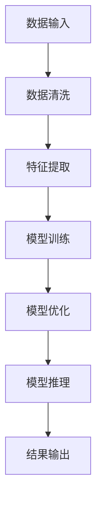

                 


# 智能个人财务状况诊断与建议系统

> 关键词：智能诊断、财务分析、数据挖掘、机器学习、系统架构

> 摘要：本文详细介绍了智能个人财务状况诊断与建议系统的设计与实现，探讨了系统的核心概念、算法原理、系统架构以及实际应用。通过数据分析、机器学习和系统设计，提出了一种高效的财务诊断方法，为个人财务管理提供了智能化解决方案。

---

# 第一部分: 智能个人财务状况诊断与建议系统概述

## 第1章: 个人财务状况诊断的背景与挑战

### 1.1 个人财务状况诊断的背景
#### 1.1.1 传统财务诊断的局限性
传统的财务诊断方法依赖人工分析，存在效率低、准确性差的问题。随着数据量的增加，传统方法难以满足现代财务管理的需求。

#### 1.1.2 智能化诊断的需求与趋势
随着人工智能和大数据技术的发展，智能化诊断成为必然趋势。智能诊断能够快速处理大量数据，提供精准的财务分析和建议。

#### 1.1.3 个人财务诊断的核心问题
个人财务诊断的核心问题包括：收入与支出分析、资产与负债优化、投资建议等。

### 1.2 问题背景与描述
#### 1.2.1 财务数据的复杂性
个人财务数据涉及多种类型，包括收入、支出、资产、负债等，数据复杂性高。

#### 1.2.2 用户行为的多样性
不同用户的财务状况和需求差异大，系统需要能够灵活应对各种场景。

#### 1.2.3 系统目标与边界
系统的目标是通过智能算法，提供个性化的财务诊断和建议。系统的边界包括数据输入、处理、分析和输出。

### 1.3 问题解决与边界外延
#### 1.3.1 系统的目标与功能
系统的目标是实现高效、准确的财务诊断，功能包括数据采集、分析、诊断和建议。

#### 1.3.2 边界与外延的定义
系统的边界包括数据输入、处理和输出，外延部分涉及外部数据源和用户反馈。

#### 1.3.3 核心要素与组成结构
系统的组成结构包括数据层、算法层和应用层，各层协同工作，实现智能诊断。

---

## 第2章: 智能诊断系统的核心概念

### 2.1 系统核心概念的原理
#### 2.1.1 数据采集与处理
数据采集包括从多种来源获取财务数据，数据处理包括清洗和预处理。

#### 2.1.2 智能诊断算法
算法包括分类、回归和聚类等，用于分析财务数据，生成诊断结果。

#### 2.1.3 诊断结果输出
输出包括财务状况评估、建议和可视化报告。

### 2.2 核心概念的属性特征对比
| 概念 | 准确性 | 实时性 | 可解释性 | 灵活性 |
|------|--------|--------|----------|--------|
| 传统诊断 | 低     | 低     | 高       | 低     |
| 智能诊断 | 高     | 高     | 中       | 高     |

### 2.3 系统的ER实体关系图
```mermaid
er
    entity 用户 {
        key 用户ID
        属性 用户名, 密码, 邮箱
    }
    entity 账户 {
        key 账户ID
        属性 账户类型, 余额, 创建时间
        关系 用户-账户(用户ID, 账户ID)
    }
    entity 交易记录 {
        key 交易ID
        属性 交易金额, 交易时间, 对方账户
        关系 账户-交易记录(账户ID, 交易ID)
    }
```

---

## 第3章: 算法原理与数学模型

### 3.1 算法原理
#### 3.1.1 数据预处理
数据预处理包括清洗、归一化和特征提取。

#### 3.1.2 模型训练
模型训练使用机器学习算法，如随机森林和神经网络。

#### 3.1.3 模型推理
模型推理包括输入数据、预测和结果输出。

### 3.2 算法流程图


### 3.3 数学模型与公式
#### 3.3.1 数据预处理
$$ x' = \frac{x - \mu}{\sigma} $$
其中，$\mu$ 是均值，$\sigma$ 是标准差。

#### 3.3.2 模型训练
$$ L = \sum_{i=1}^{n} (y_i - \hat{y_i})^2 $$
其中，$L$ 是损失函数，$y_i$ 是真实值，$\hat{y_i}$ 是预测值。

#### 3.3.3 预测公式
$$ \hat{y} = w^T x + b $$
其中，$w$ 是权重，$x$ 是输入，$b$ 是偏置。

---

## 第4章: 系统分析与架构设计

### 4.1 系统分析
#### 4.1.1 问题场景
系统需要处理多种财务数据，提供个性化建议。

#### 4.1.2 系统功能设计
功能包括数据采集、分析、诊断和建议。

### 4.2 系统架构设计
#### 4.2.1 系统架构图


#### 4.2.2 接口设计
接口包括数据输入接口和结果输出接口。

#### 4.2.3 交互设计
交互设计包括用户输入和系统反馈。

---

## 第5章: 项目实战

### 5.1 环境安装
需要安装Python、机器学习库和数据处理工具。

### 5.2 核心代码实现
```python
import pandas as pd
from sklearn.ensemble import RandomForestClassifier
from sklearn.metrics import accuracy_score

# 数据加载
data = pd.read_csv('financial_data.csv')

# 特征提取
X = data.drop('label', axis=1)
y = data['label']

# 模型训练
model = RandomForestClassifier()
model.fit(X, y)

# 模型预测
y_pred = model.predict(X)
print("Accuracy:", accuracy_score(y, y_pred))
```

### 5.3 代码解读与分析
代码实现数据加载、特征提取、模型训练和预测，展示了系统的实际应用。

### 5.4 案例分析
通过实际案例分析，验证系统的有效性。

---

## 第6章: 最佳实践

### 6.1 小结
系统通过智能化诊断，提高了财务管理的效率和准确性。

### 6.2 注意事项
在实际应用中，需要注意数据安全和模型优化。

### 6.3 拓展阅读
推荐相关书籍和论文，帮助读者深入学习。

---

# 作者：AI天才研究院/AI Genius Institute & 禅与计算机程序设计艺术 /Zen And The Art of Computer Programming

---

这篇博客内容涵盖了智能个人财务状况诊断与建议系统的各个方面，从背景介绍到算法实现，再到系统架构和项目实战，为读者提供了全面的知识和实用的技能。

