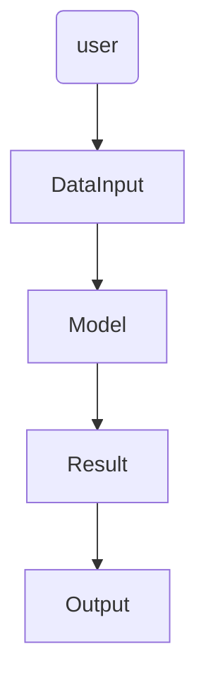
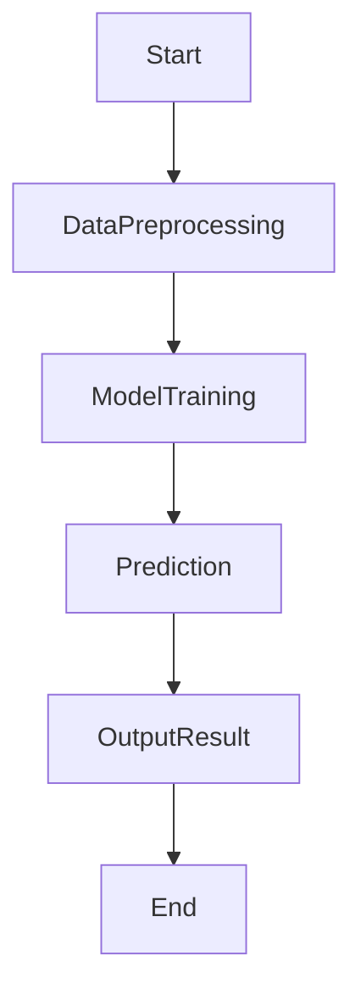
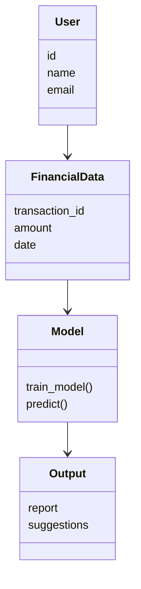
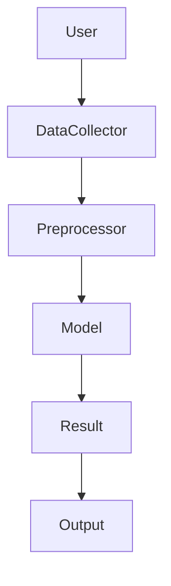
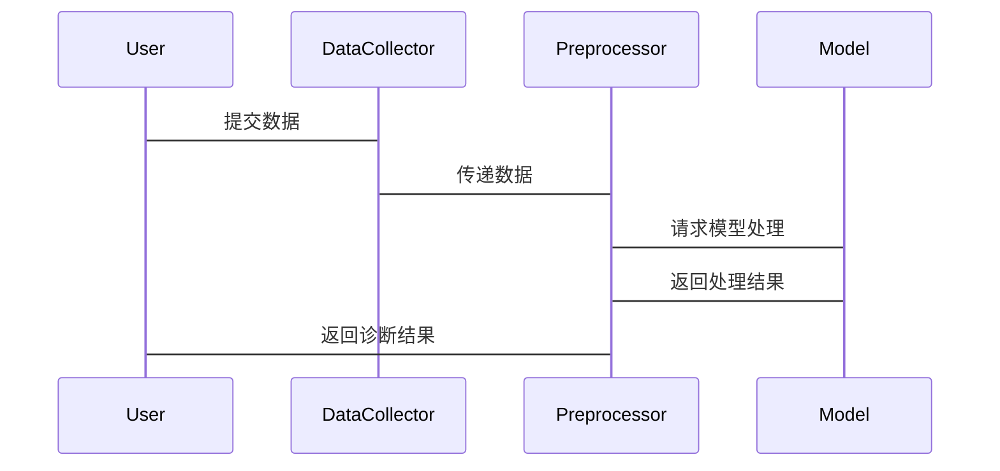

                 


# 智能个人财务状况诊断系统

> 关键词：智能诊断、个人财务管理、人工智能、机器学习、系统架构

> 摘要：本文深入探讨了智能个人财务状况诊断系统的构建与实现，结合背景分析、核心概念、算法原理、系统架构和项目实战，全面解析了该系统的原理与应用。

---

# 第一部分: 智能个人财务状况诊断系统概述

## 第1章: 个人财务状况诊断的背景与挑战

### 1.1 个人财务管理的现状与痛点

#### 1.1.1 传统个人财务管理的难点
传统财务管理主要依赖手动记录和简单的数据分析工具，存在以下问题：
- 数据分散：财务数据来源多样，难以统一管理。
- 分析复杂：需要手动整理数据并进行复杂分析。
- 易出错：人工操作容易出现疏漏和错误。

#### 1.1.2 数字化财务管理的机遇与挑战
随着技术的发展，数字化财务管理成为趋势，但也面临以下挑战：
- 数据隐私：如何确保财务数据的安全性？
- 系统集成：如何将多种数据源集成到一个系统中？
- 智能化需求：用户对智能化分析和诊断的需求日益增长。

#### 1.1.3 智能诊断系统的必要性
智能诊断系统能够通过人工智能技术，自动分析和诊断财务状况，帮助用户做出更明智的财务决策。

---

### 1.2 智能个人财务诊断系统的定义与目标

#### 1.2.1 系统的核心定义
智能个人财务诊断系统是一个基于人工智能的财务分析工具，能够自动采集、整理和分析个人财务数据，提供智能化的诊断和建议。

#### 1.2.2 系统的目标与功能
- 数据采集与整理：自动采集银行账户、投资记录等数据。
- 数据分析与诊断：通过机器学习算法分析财务状况，识别潜在问题。
- 智能建议：根据诊断结果，提供优化建议。

#### 1.2.3 系统的边界与外延
- 数据范围：仅限于个人财务数据，不涉及企业财务。
- 功能边界：不涉及实际的财务操作，仅提供诊断和建议。

---

### 1.3 本章小结
本章分析了传统财务管理的痛点，探讨了数字化财务管理的机遇与挑战，并提出了智能个人财务诊断系统的概念和目标。

---

# 第二部分: 智能个人财务诊断系统的核心概念与原理

## 第2章: 核心概念与联系

### 2.1 系统的核心概念解析

#### 2.1.1 数据驱动的诊断原理
系统通过采集和分析大量财务数据，利用数据驱动的方法进行诊断。

#### 2.1.2 人工智能在诊断中的作用
人工智能技术（如机器学习和深度学习）用于自动分析数据，识别模式和趋势。

#### 2.1.3 个性化诊断的实现机制
通过用户行为分析和偏好学习，系统能够提供个性化的诊断和建议。

---

### 2.2 核心概念对比分析

#### 2.2.1 传统诊断与智能诊断的对比
| 对比维度 | 传统诊断 | 智能诊断 |
|----------|-----------|-----------|
| 数据来源 | 手动输入 | 自动采集 |
| 分析方式 | 简单统计 | 智能分析 |
| 结果呈现 | 简单报告 | 个性化建议 |

#### 2.2.2 数据特征与诊断结果的关系
数据特征（如收入波动、支出结构）直接影响诊断结果的准确性。

#### 2.2.3 诊断系统的属性特征对比表
| 属性 | 传统诊断 | 智能诊断 |
|------|-----------|-----------|
| 数据处理 | 手工处理 | 自动化处理 |
| 分析深度 | 浅层分析 | 深度挖掘 |

---

### 2.3 系统的ER实体关系图



---

# 第三部分: 系统的算法原理与数学模型

## 第3章: 算法原理与流程

### 3.1 诊断算法的选择与实现

#### 3.1.1 机器学习算法的适用性分析
选择合适的算法是系统的核心，常用的算法包括：
- 决策树：适合分类问题。
- 随机森林：适合特征工程和分类。
- 神经网络：适合复杂模式识别。

#### 3.1.2 基于决策树的分类算法
```python
from sklearn.tree import DecisionTreeClassifier
model = DecisionTreeClassifier()
model.fit(X_train, y_train)
```

#### 3.1.3 深度学习模型的应用
```python
import tensorflow as tf
model = tf.keras.Sequential([
    tf.keras.layers.Dense(64, activation='relu'),
    tf.keras.layers.Dense(1, activation='sigmoid')
])
model.compile(optimizer='adam', loss='binary_crossentropy')
model.fit(X_train, y_train, epochs=10)
```

---

### 3.2 算法流程图



---

### 3.3 数学模型与公式

#### 3.3.1 线性回归模型
$$
y = \beta_0 + \beta_1x + \epsilon
$$

#### 3.3.2 逻辑回归模型
$$
P(y=1|x) = \frac{e^{\beta_0 + \beta_1x}}{1 + e^{\beta_0 + \beta_1x}}
$$

---

# 第四部分: 系统分析与架构设计

## 第4章: 系统分析与架构设计

### 4.1 系统分析

#### 4.1.1 问题场景介绍
系统需要解决的主要问题包括：
- 数据采集困难。
- 算法选择与优化。
- 系统安全性与隐私保护。

#### 4.1.2 项目介绍
本项目旨在开发一个基于人工智能的个人财务诊断系统，帮助用户更好地管理财务。

---

### 4.2 系统功能设计

#### 4.2.1 领域模型设计


---

### 4.3 系统架构设计

#### 4.3.1 系统架构图


---

### 4.4 系统接口设计

#### 4.4.1 接口描述
- 数据采集接口：用于采集财务数据。
- 数据处理接口：用于数据清洗和预处理。
- 模型接口：用于训练和预测。

---

### 4.5 系统交互设计

#### 4.5.1 交互流程图


---

# 第五部分: 项目实战

## 第5章: 项目实战

### 5.1 环境安装

#### 5.1.1 安装Python
```bash
python --version
pip install --upgrade pip
```

#### 5.1.2 安装机器学习库
```bash
pip install scikit-learn
pip install tensorflow
```

---

### 5.2 系统核心实现

#### 5.2.1 数据采集代码
```python
import pandas as pd
def collect_data():
    # 示例代码，实际实现需要根据具体数据源调整
    data = pd.read_csv('financial_data.csv')
    return data
```

#### 5.2.2 数据处理代码
```python
def preprocess_data(data):
    # 数据清洗和预处理
    data.dropna(inplace=True)
    data['date'] = pd.to_datetime(data['date'])
    return data
```

---

### 5.3 案例分析与解读

#### 5.3.1 案例分析
假设用户提供的数据如下：
| 交易日期 | 金额 | 类别 |
|----------|------|------|
| 2023-01-01 | 5000 | 收入 |
| 2023-01-02 | 2000 | 支出 |
| ... | ... | ... |

系统将对数据进行分析，生成诊断报告。

---

### 5.4 项目小结

通过本项目的实现，我们验证了智能个人财务诊断系统的可行性和有效性。系统能够自动采集和分析数据，提供智能化的诊断和建议。

---

# 第六部分: 最佳实践

## 第6章: 最佳实践与总结

### 6.1 系统优势与潜在风险

#### 6.1.1 系统优势
- 高效性：自动化处理数据，节省时间。
- 准确性：基于机器学习算法，提高诊断准确率。

#### 6.1.2 潜在风险
- 数据隐私：需要确保用户数据的安全。
- 算法依赖：依赖于算法的准确性和可解释性。

---

### 6.2 小结

智能个人财务诊断系统通过结合人工智能技术，显著提升了财务管理的效率和准确性。未来，随着技术的发展，系统将更加智能化和个性化。

---

### 6.3 注意事项

- 数据隐私保护：系统必须确保用户数据的安全。
- 算法优化：需要不断优化算法，提高诊断准确率。
- 系统维护：定期更新系统，修复潜在漏洞。

---

### 6.4 拓展阅读

建议读者进一步阅读以下内容：
- 《机器学习实战》
- 《深度学习入门：基于Python和TensorFlow》
- 《数据挖掘导论》

---

# 结语

智能个人财务诊断系统是一个结合人工智能和财务管理的创新工具，通过本文的深入分析，我们相信该系统将在未来的财务管理中发挥重要作用。

---

**作者：AI天才研究院/AI Genius Institute & 禅与计算机程序设计艺术 /Zen And The Art of Computer Programming**

