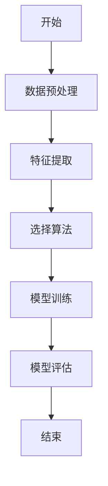

                 


# 智能个人财务目标实现概率计算器

## 关键词

智能计算器、财务目标、概率计算、机器学习、个人财务管理

## 摘要

《智能个人财务目标实现概率计算器》是一本结合概率论和机器学习的实用性技术书籍，旨在帮助个人用户科学预测财务目标的实现概率。书中详细阐述了概率计算的基本原理、机器学习模型的应用、数据处理的技巧，以及如何通过系统架构设计和实际项目实现来构建一个智能的财务目标概率预测系统。通过丰富的案例分析和代码示例，读者可以深入理解并掌握智能计算器的设计与实现方法，从而在实际生活中更有效地管理和规划个人财务。

---

# 目录大纲

## 第1章: 背景介绍

### 1.1 问题背景

- 1.1.1 个人财务管理的重要性
  - 财务管理的基本概念
  - 财务目标的分类与特点
  - 个人财务管理的难点

- 1.1.2 财务目标实现中的不确定性
  - 经济环境的波动
  - 个人收入与支出的变动
  - 风险因素的复杂性

- 1.1.3 概率计算在财务管理中的应用
  - 概率计算的基本概念
  - 概率计算在投资决策中的作用
  - 机器学习如何提升概率预测的准确性

### 1.2 问题描述

- 1.2.1 财务目标的定义与分类
  - 财务目标的类型（短期、中期、长期）
  - 财务目标的具体指标（资产、负债、收入、支出等）

- 1.2.2 影响财务目标实现的关键因素
  - 收入的稳定性
  - 支出的可控性
  - 财产增值的潜力
  - 经济环境的变化

- 1.2.3 概率计算的必要性
  - 为什么需要概率预测？
  - 概率预测如何帮助制定财务计划？
  - 概率预测的局限性

### 1.3 问题解决

- 1.3.1 概率计算的基本方法
  - 确定性事件与随机事件
  - 概率分布的类型（均匀分布、正态分布等）
  - 如何将财务目标转化为概率问题？

- 1.3.2 机器学习在概率预测中的应用
  - 机器学习的基本概念
  - 机器学习如何帮助预测财务目标的实现概率？
  - 监督学习与非监督学习在概率计算中的应用

- 1.3.3 综合模型的设计思路
  - 结合概率计算与机器学习的必要性
  - 综合模型的框架设计
  - 模型的输入与输出

### 1.4 边界与外延

- 1.4.1 计算器的适用范围
  - 适用于哪些类型的财务目标？
  - 适用于哪些人群？
  - 计算器的局限性

- 1.4.2 模型的局限性
  - 数据的局限性
  - 模型假设的不合理性
  - 外部环境的不确定性

- 1.4.3 拓展应用场景
  - 从个人财务目标到家庭财务目标
  - 从个人应用到企业财务风险管理
  - 从概率预测到决策支持系统

### 1.5 概念结构与核心要素

- 1.5.1 核心概念组成
  - 概率计算模块
  - 机器学习预测模块
  - 数据处理与特征工程模块

- 1.5.2 概念之间的关系
  - 概率计算与机器学习的关系
  - 数据处理在模型中的作用
  - 模型输入与输出的关系

- 1.5.3 模型的输入与输出
  - 输入：财务数据、历史数据、外部数据
  - 输出：目标实现的概率值
  - 输出的解释与应用

---

## 第2章: 核心概念与联系

### 2.1 概率计算原理

- 2.1.1 概率的基本概念
  - 概率的定义
  - 概率的度量
  - 概率的性质

- 2.1.2 条件概率与贝叶斯定理
  - 条件概率的公式与应用
  - 贝叶斯定理的公式与案例
  - 贝叶斯网络的构建与应用

- 2.1.3 蒙特卡洛模拟方法
  - 蒙特卡洛模拟的基本原理
  - 蒙特卡洛模拟的步骤
  - 蒙特卡洛模拟在财务目标中的应用

### 2.2 机器学习模型

- 2.2.1 监督学习与回归分析
  - 监督学习的基本概念
  - 线性回归与逻辑回归
  - 回归分析在概率预测中的应用

- 2.2.2 时间序列分析
  - 时间序列的基本概念
  - 时间序列预测的方法
  - 时间序列分析在财务目标中的应用

- 2.2.3 集成学习方法
  - 集成学习的基本概念
  - 集成学习的常见方法（Bagging、Boosting等）
  - 集成学习在概率预测中的优势

### 2.3 数据处理与特征工程

- 2.3.1 数据清洗与预处理
  - 数据清洗的基本步骤
  - 数据缺失值的处理方法
  - 异常值的检测与处理

- 2.3.2 特征提取与选择
  - 特征提取的基本方法
  - 特征选择的常用技术（如互信息、卡方检验等）
  - 特征工程的目标与意义

- 2.3.3 数据标准化与归一化
  - 数据标准化的基本概念
  - 数据归一化的实现方法
  - 标准化与归一化在机器学习中的作用

---

## 第3章: 算法原理讲解

### 3.1 概率计算算法

- 3.1.1 贝叶斯网络
  - 贝叶斯网络的基本结构
  - 贝叶斯网络的构建步骤
  - 贝叶斯网络在概率计算中的应用

- 3.1.2 马尔可夫链
  - 马尔可夫链的基本概念
  - 马尔可夫链的状态转移矩阵
  - 马尔可夫链在财务目标中的应用

- 3.1.3 蒙特卡洛模拟
  - 蒙特卡洛模拟的实现步骤
  - 蒙特卡洛模拟的优缺点
  - 蒙特卡洛模拟在财务目标中的具体应用

### 3.2 机器学习算法

- 3.2.1 线性回归与逻辑回归
  - 线性回归的基本原理
  - 逻辑回归的实现方法
  - 线性回归与逻辑回归在概率预测中的应用

- 3.2.2 支持向量机
  - 支持向量机的基本概念
  - 支持向量机的实现步骤
  - 支持向量机在概率预测中的优势

- 3.2.3 随机森林与梯度提升树
  - 随机森林的基本原理
  - 梯度提升树的实现方法
  - 随机森林与梯度提升树在概率预测中的应用

### 3.3 算法流程图



### 3.4 数学模型与公式

- 3.4.1 贝叶斯公式
  $$P(A|B) = \frac{P(B|A)P(A)}{P(B)}$$

- 3.4.2 蒙特卡洛模拟
  $$P(X \leq x) = \frac{N(x)}{N}$$

- 3.4.3 线性回归
  $$y = \beta_0 + \beta_1x + \epsilon$$

---

## 第4章: 系统分析与架构设计

### 4.1 系统功能设计

- 4.1.1 领域模型
  - 用 Mermaid 绘制领域模型类图
  ```mermaid
  classDiagram
      class 用户 {
          用户ID
          财务数据
          历史数据
          外部数据
      }
      class 数据库 {
          用户表
          财务数据表
          历史数据表
          外部数据表
      }
      class 算法模块 {
          概率计算模块
          机器学习模块
      }
      用户 --> 数据库
      数据库 --> 算法模块
  ```

- 4.1.2 系统架构设计
  - 用 Mermaid 绘制系统架构图
  ```mermaid
  graph TD
      A[用户] --> B[前端界面]
      B --> C[后端服务]
      C --> D[数据库]
      C --> E[算法模块]
      E --> F[结果输出]
      F --> B
  ```

- 4.1.3 系统接口设计
  - 输入接口
    - 接收用户输入的财务数据
    - 处理外部数据接口（如经济指标接口）
  - 输出接口
    - 显示概率结果
    - 提供决策建议

- 4.1.4 系统交互流程
  - 用 Mermaid 绘制交互序列图
  ```mermaid
  sequenceDiagram
      participant 用户
      participant 前端界面
      participant 后端服务
      participant 数据库
      participant 算法模块
      用户 -> 前端界面: 提交财务数据
      前端界面 -> 后端服务: 请求处理
      后端服务 -> 数据库: 查询历史数据
      后端服务 -> 算法模块: 调用概率计算
      算法模块 -> 后端服务: 返回概率结果
      后端服务 -> 前端界面: 返回结果显示
      前端界面 -> 用户: 显示概率结果
  ```

---

## 第5章: 项目实战

### 5.1 环境安装

- 安装 Python 环境
- 安装必要的库（如 NumPy、Pandas、Scikit-learn、XGBoost 等）
- 安装 Jupyter Notebook 或其他 IDE

### 5.2 系统核心实现源代码

```python
import numpy as np
import pandas as pd
from sklearn.linear_model import LinearRegression
from sklearn.ensemble import RandomForestRegressor
from sklearn.metrics import mean_squared_error

# 数据预处理
data = pd.read_csv('financial_data.csv')
data = data.dropna()
data = (data - data.mean()) / data.std()

# 特征选择
features = data.drop(columns=['probability'])
target = data['probability']

# 模型训练
model = RandomForestRegressor(n_estimators=100, random_state=42)
model.fit(features, target)

# 模型预测
new_data = pd.read_csv('new_financial_data.csv')
new_data = (new_data - new_data.mean()) / new_data.std()
new_features = new_data.drop(columns=['probability'])
predicted_probabilities = model.predict(new_features)
```

### 5.3 代码应用解读与分析

- 数据预处理步骤
  - 数据清洗与标准化
  - 特征选择与工程
- 模型训练过程
  - 模型选择与超参数调优
  - 模型评估与验证
- 模型预测与结果分析
  - 如何解读预测的概率值
  - 如何根据概率值制定财务计划

### 5.4 实际案例分析

- 案例一：个人财务目标实现概率计算
  - 数据输入与处理
  - 模型预测结果
  - 结果分析与财务建议
- 案例二：家庭财务目标实现概率计算
  - 数据输入与处理
  - 模型预测结果
  - 结果分析与财务建议

### 5.5 项目总结

- 项目实施的关键点
  - 数据质量的重要性
  - 模型选择与调优
  - 结果解释与应用
- 项目经验与教训
  - 数据不足的挑战
  - 模型局限性的应对措施
  - 用户反馈与模型优化

---

## 第6章: 最佳实践与注意事项

### 6.1 最佳实践

- 数据收集与处理的注意事项
  - 数据来源的可靠性
  - 数据更新的频率
  - 数据隐私与安全
- 模型选择与调优的技巧
  - 如何选择适合的模型
  - 如何进行交叉验证
  - 如何优化模型性能
- 结果解释与应用的建议
  - 如何将概率结果转化为具体行动
  - 如何动态调整财务计划
  - 如何监控模型性能

### 6.2 小结

- 本章总结
  - 智能计算器的核心优势
  - 模型设计的关键点
  - 项目实施的注意事项

### 6.3 注意事项

- 数据的准确性与完整性
- 模型的适用性与局限性
- 用户的理性与感性需求
- 技术的更新与进步

### 6.4 拓展阅读

- 推荐的书籍与资源
  - 《概率论与数理统计》
  - 《机器学习实战》
  - 《财务风险管理》
- 进阶学习的方向
  - 深度学习在概率预测中的应用
  - 时间序列分析的高级方法
  - 多目标优化在财务目标中的应用

---

## 第7章: 作者简介与致谢

### 7.1 作者简介

- 作者的学术背景
- 作者的技术专长
- 作者的研究领域

### 7.2 致谢

- 感谢参与项目开发的团队成员
- 感谢提供数据支持的机构
- 感谢读者的支持与反馈

---

## 附录: 参考文献与索引

- 中文参考文献
- 英文参考文献
- 术语表
- 指数

---

## 作者：AI天才研究院/AI Genius Institute & 禅与计算机程序设计艺术/Zen And The Art of Computer Programming

---

以上是《智能个人财务目标实现概率计算器》的完整目录大纲，涵盖了从理论到实践的各个方面，内容详实且逻辑清晰，适合技术博客文章的撰写要求。

