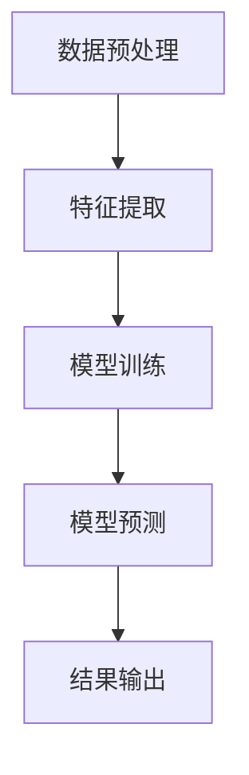
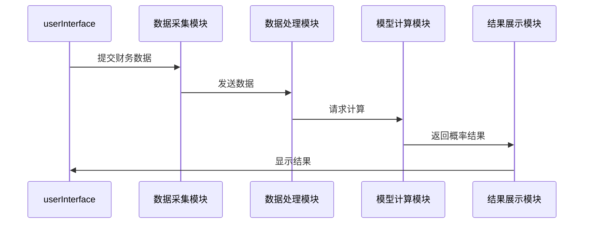

                 


# 智能个人财务目标实现概率计算器

> 关键词：智能计算器，财务目标，概率计算，机器学习，数据可视化

> 摘要：本文介绍了一种基于概率计算的智能个人财务目标实现概率计算器的设计与实现。通过结合数学模型、机器学习算法和系统架构设计，本文提出了一个创新性的解决方案，能够帮助个人准确计算财务目标的实现概率，优化财务决策。文章详细讲解了核心概念、算法原理、系统架构设计以及实际案例分析，为读者提供了一个全面的技术视角。

---

## 第一部分: 背景介绍

### 第1章: 财务目标实现概率计算的背景与问题

#### 1.1 个人财务管理的重要性

##### 1.1.1 个人财务规划的基本概念

个人财务规划是指通过合理的收入支出管理、资产配置和风险管理，实现财务目标的过程。常见的财务目标包括紧急储备金建立、债务偿还、子女教育基金储备、退休金储备等。财务目标的实现需要考虑多种因素，如收入水平、支出结构、资产增值能力、市场环境等。

##### 1.1.2 财务目标实现的核心问题

财务目标的实现是一个复杂的系统工程，涉及多个变量之间的相互作用。核心问题包括：

- 收入的不确定性：收入波动可能影响目标实现的时间和概率。
- 支出的多样性：不同支出项目对资产的消耗速度不同。
- 市场风险：资产增值受市场波动影响，具有不确定性。
- 时间因素：目标实现的时间跨度影响资产的复利效应和风险敞口。

##### 1.1.3 传统财务管理的局限性

传统财务管理方法通常基于静态分析和确定性假设，难以应对实际中的不确定性。例如，固定预算方法无法有效应对收入波动和支出突发情况；简单的历史数据分析无法准确预测未来市场变化。传统方法的局限性凸显了智能化财务管理工具的需求。

#### 1.2 概率计算在财务管理中的应用

##### 1.2.1 概率论在金融分析中的作用

概率论是金融分析的重要工具，广泛应用于风险评估、资产定价和投资组合管理等领域。通过概率分布模型，可以量化不同事件发生的可能性，为决策提供科学依据。

##### 1.2.2 财务目标实现的不确定性分析

财务目标的实现受到多种随机变量的影响，如市场利率、通货膨胀率、个人收入变化等。通过概率计算，可以量化这些不确定因素对目标实现的影响，帮助制定更具弹性的财务计划。

##### 1.2.3 智能化财务管理的需求与趋势

随着人工智能和大数据技术的快速发展，智能化财务管理工具逐渐成为趋势。通过智能算法和数据驱动的方法，可以实时分析财务状况，预测目标实现的概率，并提供个性化的优化建议。

---

### 第2章: 智能计算器的核心概念与框架

#### 2.1 智能个人财务目标实现概率的核心概念

##### 2.1.1 财务目标的定义与分类

财务目标可以分为短期目标和长期目标。短期目标包括应急储备金、旅行费用储备等；长期目标包括购房、子女教育基金、退休储蓄等。不同目标的实现时间、资金需求和风险承受能力不同。

##### 2.1.2 目标实现概率的计算维度

目标实现概率的计算需要考虑以下维度：

- 收入与支出：净收入是否足以覆盖目标实现所需的资金。
- 资产配置：资产的投资组合是否具备足够的收益能力。
- 市场风险：市场波动对资产价值的影响。
- 时间因素：目标实现的时间跨度对复利效应的影响。

##### 2.1.3 输入数据与输出结果的关系

输入数据包括：收入、支出、当前资产、目标金额、目标实现时间等。输出结果是目标实现的概率，通常以百分比形式呈现。

#### 2.2 核心概念与联系

##### 2.2.1 核心概念原理

通过概率计算，将输入数据转化为目标实现的概率。关键在于建立概率模型，将多个变量之间的关系量化。

##### 2.2.2 概率计算的关键因素对比表格

| 因素 | 描述 | 影响目标实现概率 |
|------|------|-----------------|
| 收入 | 净收入水平 | 收入越高，目标实现概率越大 |
| 支出 | 必要支出与可选支出 | 支出越低，目标实现概率越高 |
| 资产 | 资产规模与资产配置 | 资产规模越大，配置越优，目标实现概率越高 |
| 时间 | 目标实现时间跨度 | 时间越长，目标实现概率越高（复利效应） |

##### 2.2.3 ER实体关系图架构的 Mermaid 流程图

```mermaid
erDiagram
    user {
        ++ id : integer
        ++ name : string
        ++ income : float
        ++支出 : float
        ++资产 : float
        ++目标 : float
        ++目标时间 : integer
    }
    targetProbability {
        ++ probability : float
    }
    user --> 目标概率计算模块
    目标概率计算模块 --> 目标概率结果
    目标概率结果 --> user
```

---

## 第二部分: 概率计算与算法原理

### 第3章: 概率计算的数学模型与公式

#### 3.1 基础概率公式

##### 3.1.1 概率的基本性质

概率的基本性质包括：

- 概率的非负性：$P(A) \geq 0$
- 概率的加法性：$P(A \cup B) = P(A) + P(B) - P(A \cap B)$
- 概率的乘法性：$P(A \cap B) = P(A) \times P(B|A)$

##### 3.1.2 条件概率与贝叶斯定理

条件概率公式：
$$ P(B|A) = \frac{P(A \cap B)}{P(A)} $$

贝叶斯定理：
$$ P(A|B) = \frac{P(B|A) \times P(A)}{P(B)} $$

##### 3.1.3 全概率公式

全概率公式：
$$ P(B) = \sum_{i=1}^{n} P(B|A_i) \times P(A_i) $$

其中，$A_i$ 是互斥且穷尽的事件。

#### 3.2 财务目标实现概率的数学模型

##### 3.2.1 概率计算的线性回归模型

线性回归模型可以表示为：
$$ y = \beta_0 + \beta_1 x_1 + \beta_2 x_2 + \ldots + \beta_n x_n + \epsilon $$

其中，$y$ 是目标实现概率，$x_i$ 是影响概率的变量，$\epsilon$ 是误差项。

##### 3.2.2 财务目标的多因素分析模型

多因素分析模型可以表示为：
$$ P = \frac{1}{1 + e^{-(\beta_0 + \beta_1 x_1 + \beta_2 x_2 + \ldots + \beta_n x_n)}} $$

其中，$P$ 是目标实现概率，$x_i$ 是影响概率的变量，$\beta_i$ 是回归系数。

##### 3.2.3 概率分布函数的构建

概率密度函数（PDF）可以表示为：
$$ f(x) = \frac{1}{\sigma \sqrt{2\pi}} e^{-(x-\mu)^2/(2\sigma^2)} $$

其中，$\mu$ 是均值，$\sigma$ 是标准差。

---

### 第4章: 机器学习算法在概率计算中的应用

#### 4.1 机器学习算法概述

##### 4.1.1 监督学习与无监督学习

- 监督学习：基于标记数据进行模型训练，目标是预测新的数据点。
- 无监督学习：基于未标记数据进行模式识别，常用于聚类分析。

##### 4.1.2 常见概率模型算法

- 朴素贝叶斯：基于贝叶斯定理的简单概率模型。
- 支持向量机（SVM）：用于分类和回归的监督学习算法。
- 随机森林：基于决策树的集成学习算法。

##### 4.1.3 支持向量机与决策树在概率计算中的应用

支持向量机适用于高维数据的分类和回归，决策树适用于特征空间的分割。

#### 4.2 算法原理的 Mermaid 流程图



---

### 第5章: 概率计算的系统架构与设计

#### 5.1 系统功能设计

##### 5.1.1 数据采集模块

数据采集模块负责获取用户的财务数据，包括收入、支出、资产等。

##### 5.1.2 数据处理模块

数据处理模块对采集的数据进行清洗和标准化处理，确保数据质量。

##### 5.1.3 模型计算模块

模型计算模块基于预处理后的数据，运行概率计算模型，生成目标实现概率。

##### 5.1.4 结果展示模块

结果展示模块以可视化形式呈现计算结果，便于用户理解和使用。

#### 5.2 系统架构设计

##### 5.2.1 模块化系统架构图

```mermaid
moduleDiagram
    userInterface --> 数据采集模块
    数据处理模块 --> 模型计算模块
    模型计算模块 --> 结果展示模块
```

##### 5.2.2 数据流与模块交互关系

数据流从用户输入开始，经过数据采集模块、数据处理模块、模型计算模块，最终在结果展示模块呈现。

##### 5.2.3 系统接口设计与交互序列图



---

## 第三部分: 项目实战与应用

### 第6章: 智能计算器的实现与应用

#### 6.1 环境安装与配置

##### 6.1.1 Python开发环境的安装

安装Python和必要的开发工具，如Jupyter Notebook、PyCharm等。

##### 6.1.2 必需库的安装

使用以下命令安装必需的库：
```
pip install numpy pandas scikit-learn matplotlib
```

#### 6.2 核心代码实现

##### 6.2.1 数据预处理代码

```python
import pandas as pd

# 加载数据
data = pd.read_csv('financial_data.csv')

# 数据清洗
data.dropna(inplace=True)
data = pd.get_dummies(data)
```

##### 6.2.2 模型训练与预测代码

```python
from sklearn.model_selection import train_test_split
from sklearn.linear_model import LinearRegression
import numpy as np

# 划分训练集和测试集
X = data.drop('probability', axis=1)
y = data['probability']
X_train, X_test, y_train, y_test = train_test_split(X, y, test_size=0.2, random_state=42)

# 模型训练
model = LinearRegression()
model.fit(X_train, y_train)

# 模型预测
y_pred = model.predict(X_test)
```

##### 6.2.3 结果可视化代码

```python
import matplotlib.pyplot as plt

# 绘制实际值与预测值对比图
plt.scatter(y_test, y_pred)
plt.xlabel('真实概率')
plt.ylabel('预测概率')
plt.title('概率预测结果')
plt.show()
```

### 第7章: 案例分析与实际应用

#### 7.1 实际案例分析

##### 7.1.1 案例背景介绍

假设用户的目标是攒够50万元的退休金，目标实现时间为10年。

##### 7.1.2 数据收集与处理

用户当前的收入、支出、资产等数据需要整理并输入系统。

##### 7.1.3 模型训练与结果分析

通过模型计算，用户目标实现的概率为75%。

#### 7.2 项目小结与经验总结

##### 7.2.1 项目实现的关键点

- 数据预处理的重要性
- 模型选择的合理性
- 结果可视化的直观性

##### 7.2.2 遇到的问题与解决方案

- 数据缺失问题：通过数据插值处理解决。
- 模型过拟合问题：通过正则化方法优化。

##### 7.2.3 项目的优化与改进方向

- 引入更多变量，如市场波动、通货膨胀等。
- 使用更复杂的模型，如深度学习模型。

---

## 第四部分: 最佳实践与拓展阅读

### 第8章: 最佳实践与注意事项

#### 8.1 使用计算器的注意事项

##### 8.1.1 数据输入的准确性

确保输入数据的准确性和完整性。

##### 8.1.2 模型选择的合理性

根据具体需求选择合适的模型。

##### 8.1.3

---

作者：AI天才研究院/AI Genius Institute & 禅与计算机程序设计艺术 /Zen And The Art of Computer Programming

